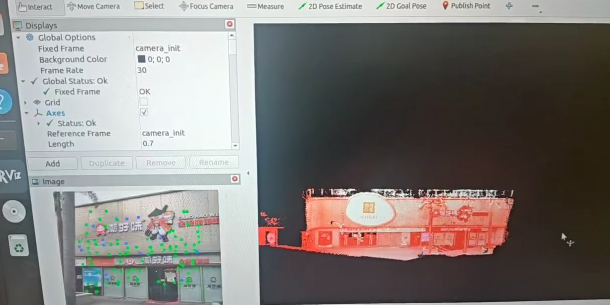

### 251010
李锍鑫:
1.撰写[[大车计划--开发日志]]、[[大车计划--开发进度]]、[[大车计划--硬件购置]]、[[大车计划--项目需求]]书
2.购置麦轮

### 251011
李锍鑫：
1.购置联轴器

### 251014
李锍鑫：
1.联轴器、麦轮到货，安装测试，可行。

### 251016
李锍鑫：
1.购置3030型铝材

郑国城：
1.购置STM32H7最小系统板
2.RK3588s安装ROS2

### 251019
郑国城：
1.购置JGB37-520(20R/MIN)编码电机* 4

### 251024
郑国城：
1.购置OV5640摄像头模块

### 251106
李锍鑫：
安装虚拟机Ubuntu2404 ，使用ROS2 jazzy版本  测试ROS navigation2 但导航例程异常

### 251109
李锍鑫：
1.重新安装虚拟机ROS2 rolling版本
2.安装亚克力板
3.更新方案研讨：[[大车计划--方案研讨]]

### 251110
李锍鑫：
1.连接英伟达板子

### 251111
李锍鑫：
1.为英伟达、鲁班猫安装nomachine
2.焊接电机线
3.学习SLAM [[SLAM学习]]

### 251112
李锍鑫：
1.给英伟达板子安装ROS2 foxy
2.通过英伟达板子驱动小车移动

### 251113
李锍鑫：
1.重新购置小扭矩JGB520电机

### 251116
李锍鑫：
1.使用虚拟机Ubuntu2204 ROS2 humble跑通Fastlivo2仿真(ROS2 bag)

链接：[Ubuntu22.04及ROS2复现Fast_livo2，包含ROS2的安装、cmake的版本选择等等_ubuntu22.04 livox-sdk2-CSDN博客](https://blog.csdn.net/LPKPLPK/article/details/153679798)

