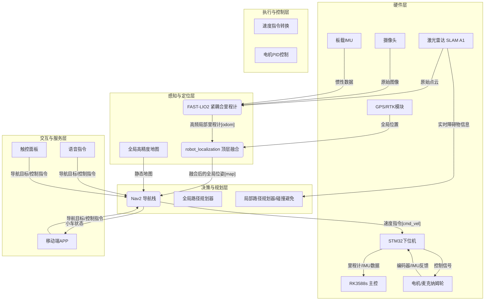

# 大车计划 - 最终技术解决方案

## 1. 项目概述

本文档旨在为“大车计划”项目提供一套完整、可行且具备前瞻性的技术解决方案。本项目目标是研发一台具备在校园复杂环境下自主导航、运输能力的智能小车，实现高精度定位、智能路径规划、动态避障及多样化人机交互等功能。

本方案基于对项目需求的深入理解，并结合业界前沿的多传感器融合技术，特别是以FAST-LIO2算法为核心，构建一套鲁棒、高效的自动驾驶系统。

---

## 2. 总体技术架构

系统整体采用“全局离线地图 + 多传感器融合实时定位”的核心思想。此架构兼顾了大范围场景的全局精度和动态复杂环境下的局部鲁棒性。

系统分为四个主要层次：**感知与定位层**、**决策与规划层**、**执行与控制层**以及**交互与服务层**。所有模块均在ROS2 (Robot Operating System 2) 框架下进行开发和通信。

---

## 3. 核心模块详解

### 3.1 感知与定位模块

这是整个系统的基石，负责精确回答“小车在哪里”的问题。

#### 3.1.1 顶层融合定位框架
*   **技术选型**: **`robot_localization` (ROS2)**
*   **职责**: 作为顶层融合中心，通过扩展卡尔曼滤波(EKF)，融合来自不同传感器的定位信息，输出一个平滑、准确、连续的全局位姿。
*   **输入源**:
    1.  **高频局部里程计**: 来自下述`FAST-LIO2`模块，提供`odom`坐标系下的连续、低漂移的位姿估计。
    2.  **绝对全局位置**: 来自`GPS/RTK`模块，提供`map`坐标系下的绝对经纬度坐标（需转换为UTM坐标），用于纠正长期累积漂移。
*   **输出**: 统一到`map`坐标系下的全局位姿，供`Nav2`导航栈使用。

#### 3.1.2 高频实时里程计 (Local Odometry)
*   **技术选型**: **FAST-LIO2**
*   **职责**: 作为系统的核心“航位推算”引擎。在任何环境下（尤其在GPS信号弱或丢失时），提供高精度、高鲁棒性的实时位姿变化。
*   **工作原理**:
    *   **紧耦合**: 通过误差状态迭代卡尔曼滤波(ESIKF)，紧密融合`激光雷达`、`相机`和`IMU`的原始数据。
    *   **直接法**: 不依赖特征提取，直接处理原始点云和图像块，对稀疏或无纹理环境具有极强的适应性。
    *   **多模态互补**:
        *   **LiDAR**: 提供精确的几何结构和深度信息。
        *   **Vision**: 在LiDAR退化场景（如长廊、白墙）提供约束；提供丰富的颜色纹理信息。
        *   **IMU**: 提供高频运动预测，为LiDAR和Vision的数据关联提供良好初值，并填充传感器数据间的空白。
*   **优势**: 完美解决校园中光照变化、场景开阔/狭窄交替、纹理/结构缺失等复杂问题。

#### 3.1.3 静态环境感知
*   **技术选型**: **离线生成的高精度地图**
*   **实施方案**:
    1.  **地图获取**: 利用校园现有的CAD图纸，或通过无人机航拍生成正射影像图(DOM)。
    2.  **地图处理**: 在QGIS等工具中，将原始地图处理成导航所需的`pgm`格式栅格地图，并制作对应的`yaml`配置文件。地图中应明确标注出**可通行区域**、**禁行区（草坪、水域）**等。
    3.  **地图加载**: 在ROS2中，通过`map_server`节点加载此静态地图，作为全局路径规划的依据。

### 3.2 决策与规划模块

*   **技术选型**: **Nav2 (ROS2 Navigation Stack)**
*   **职责**: 负责从A点到B点的路径寻找和安全行驶。

#### 3.2.1 全局路径规划
*   **组件**: Nav2 Global Planner (e.g., NavFn, Smac Planner)
*   **工作原理**: 在`map_server`加载的静态地图上，根据小车当前位置和用户指定的目标点，使用A*等算法规划出一条全局最优路径。

#### 3.2.2 局部路径规划与动态避障
*   **组件**: Nav2 Local Planner (e.g., DWA, TEB, MPC)
*   **工作原理**: 遵循全局路径的大方向，同时根据`激光雷达`实时扫描到的动态障碍物（如行人、自行车），在局部范围内计算出一条安全的、无碰撞的行驶轨迹，并生成实时的速度指令（`cmd_vel`）。

### 3.3 执行与控制模块
*   **上层主控**: **RK3588s** 运行ROS2，负责所有核心算法计算。
*   **下层驱动**: **STM32底板**
    *   **职责**: 作为一个ROS2节点，订阅上层`Nav2`发布的`cmd_vel`速度指令。
    *   将线速度和角速度指令，根据麦克纳姆轮运动学模型，解算成四个轮子的具体转速。
    *   通过PID控制器，精确控制电机达到目标转速。
    *   同时，读取电机编码器数据，计算并发布小车自身的里程计信息（可作为`robot_localization`的另一输入源以增强鲁棒性）；读取板载IMU数据并发布。

### 3.4 人机交互模块
*   **技术方案**: 通过`ros2-bridge`或自定义的API接口，将ROS2世界与外部应用连接。
*   **移动端APP**: 通过HTTP请求或WebSocket与ROS2服务节点通信，发送导航目标，获取小车实时状态。
*   **语音指令**: 离线或在线语音识别引擎将语音转换为文本指令，再通过一个ROS2节点解析并发布为导航目标。

---

## 4. 软件栈

*   **操作系统**: Ubuntu 20.04
*   **中间件**: ROS2 Foxy
*   **核心算法库**:
    *   **定位**: `FAST-LIO2` (C++), `robot_localization` (C++)
    *   **导航**: `Nav2` (C++)
    *   **驱动**: Custom ROS2 C++ Node for STM32 communication
*   **可视化与调试**: RViz2, PlotJuggler

---

## 5. 总结

本技术方案以经过验证的、先进的FAST-LIO2算法为核心，构建了一套多传感器紧耦合的实时里程计系统，并通过顶层框架融合GPS，实现了在各种挑战环境下的高精度、高鲁棒性定位。结合ROS2成熟的Nav2导航栈，形成了一套从感知到控制的完整闭环。该方案技术选型合理，架构清晰，可扩展性强，完全满足“大车计划”的各项功能与性能指标。

123