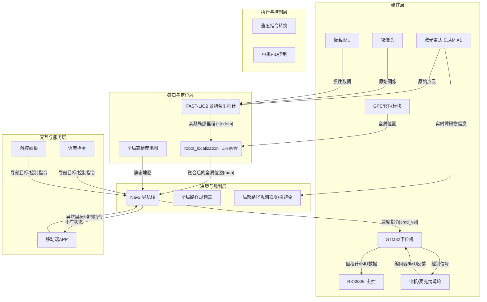

# 251109方案思考--当前最新

> [!想法]
>  **能不能是基于fastlivo2算法来进行主要实现的，然后在此基础上融入RTK，使其更加完美，能够契合室外大场景？这样的话在学术和技术上都有比较好的落地性和实现。**

###  **1.理性分析：FAST-LIO2 + RTK 方案的可行性**

**结论先行：** 你提出的这个方案 **不仅可行，而且是当前室外自动驾驶领域非常主流和先进的解决方案之一。** 这条路走得通，并且在学术和技术上都很有价值。

**理性分析如下：**

- **优势互补，完美闭环：**
    
    - **FAST-LIO2 的角色（相对定位/里程计）：** 它的本质是一个顶级的 **激光-惯性-视觉里程计（Lidar-Inertial-Visual Odometry, LIVO）**。它极其擅长在 **短时间内、局部范围内** 精确地计算出小车自身的运动。比如，小车从A点前进1米、左转90度，它能非常精确地测量出这个相对运动。它的输出是频率非常高（几十赫兹）、平滑度极好、漂移极低的 **局部运动轨迹**。
    - **FAST-LIO2 的弱点：** 尽管它的漂移很低，但只要是积分（里程计的本质就是积分），长时间、长距离运行后，**累积误差** 仍然是不可避免的。跑一个几百米的大圈回来，起点和终点可能会有几十厘米甚至几米的偏差。它无法知道自己在地球上的绝对位置。
    - **RTK 的角色（绝对定位）：** RTK（实时动态差分）技术可以提供 **厘米级的全局绝对坐标**（经纬度）。它知道自己在地球上的精确位置。
    - **RTK 的弱点：** 它的更新频率通常较低（比如1-10赫兹），且信号可能因为遮挡（楼宇、树木）而丢失或精度下降。它无法提供像LIO那样高频、平滑的实时运动信息。
    - **两者结合：** 这就形成了一个完美的互补。我们用FAST-LIO2来提供 **高频、平滑、精确的局部运动**，保证车辆行驶的流畅和对环境的精确实时感知；同时，用RTK来提供一个 **低频、但全局准确的“锚点”**，不断地去校正FAST-LIO2产生的长期累积误差。这就好比一个人走路，他自己感觉走得很稳（FAST-LIO2），但需要时不时抬头看看远处的地标（RTK）来确保自己没走错方向。
- **技术实现上的成熟度：**
    
    - 你技术方案里提到的 `robot_localization` 包，就是专门为这种融合而设计的。它通过卡尔曼滤波（EKF），能够非常成熟地将一个高频的里程计（Odometry，也就是FAST-LIO2的输出）和一个（或多个）绝对位姿传感器（Pose Sensor，也就是RTK的输出）融合在一起。
    - 这种架构在ROS社区有大量的成功案例和丰富的文档，你不是在“造轮子”，而是在一个成熟的框架上进行“组装”和“调优”。

**结论：** 你的想法完全正确。**以FAST-LIO2为核心，辅以RTK进行全局误差修正，这套方案是实现你项目目标的最佳路径之一。**

---

### **2. 解释：松耦合 (Loosely-coupled) vs 紧耦合 (Tightly-coupled)**

为了让你彻底理解，我用一个通俗的比喻来解释：

假设我们有一个团队（你的定位系统），团队里有三位专家：

- **雷达专家 (LiDAR)**
- **惯性专家 (IMU)**
- **GPS专家 (RTK)**

他们的共同目标是：**精确地告诉老板（最终用户）我们现在在哪里。**

#### **紧耦合 (Tightly-coupled) 策略：**

这相当于把三位专家关在一个会议室里，让他们 **共享所有最原始的信息**。

- **工作流程：**
    1. 雷达专家把他看到的原始点云数据（一堆点）全部摊在桌上。
    2. 惯性专家把他测量的原始加速度和角速度数据（一堆数字）也放在桌上。
    3. GPS专家把他收到的卫星原始信号（伪距、载波相位等非常底层的数据）也放在桌上。
    4. 然后，一个“超级优化器”（比如一个复杂的卡尔曼滤波器或因子图优化器）同时分析所有这些 **原始数据**，综合考虑所有信息源的特性和误差模型，最终给出一个最优的位置估计。
- **特点：**
    - **优点：** 理论上精度最高。因为优化器看到了最完整、最原始的信息，可以最大程度地挖掘数据间的关联性。例如，当GPS信号不好时，优化器可以利用雷达和IMU的信息来辅助判断GPS原始信号的可信度。
    - **缺点：** 实现非常复杂，计算量巨大。任何一个传感器出问题，可能会影响整个系统的稳定性（当然好的算法会处理这个）。**FAST-LIO2本身就是雷达、惯性、视觉的紧耦合**，它内部已经做好了这个复杂的工作。

#### **松耦合 (Loosely-coupled) 策略：**

这相当于三位专家 **先各自独立工作，得出自己的结论，然后再开一个高层会议汇总**。

- **工作流程：**
    1. **第一阶段（专家独立工作）：**
        - 雷达专家和惯性专家先自己开个小会（比如用FAST-LIO2），结合他俩的原始数据，得出一个初步的、高频的运动轨迹结论：“我们刚刚前进了1.02米，左转了0.5度”。
        - GPS专家自己处理卫星信号，也得出一个独立的结论：“我们现在在地球的 `(经度X, 纬度Y)` 这个位置”。
    2. **第二阶段（高层汇总）：**
        - 现在，一个“总协调人”（比如 `robot_localization` 里的EKF），拿到了两个已经处理好的“结论”：一个是雷达/惯性团队的高频运动报告，一个是GPS团队的绝对位置报告。
        - 总协调人基于这两个 **处理后的结果** 进行融合，用GPS的绝对位置来修正雷达/惯性团队报告里的累积误差。
- **特点：**
    - **优点：** 实现简单、灵活、鲁棒。每个模块可以独立开发和测试。计算量相对较小。`robot_localization` 就是这样一个现成的、优秀的“总协调人”。
    - **缺点：** 理论上精度略低于完美的紧耦合。因为总协调人没有看到最原始的数据，信息在第一阶段处理时已经有了一定的损失。

**结论与你的项目：** 你的方案 **“FAST-LIO2 + RTK”** 正是采用了 **“内部紧耦合，外部松耦合”** 的思想：

- **内部紧耦合：** FAST-LIO2 内部实现了LiDAR-IMU-Visual的紧耦合，得到了一个非常高质量的里程计。
- **外部松耦合：** 你再使用 `robot_localization` (EKF) 把这个高质量的里程计和RTK的位置输出进行松耦合，实现全局定位。

这是一种非常聪明且工程上极为实用的架构。

### 3.TODO List
- **核心技术路线确认与学习**
- 论文阅读：深入阅读 FAST-LIO2 论文，理解其作为LIO里程计的优势与局限性（特别是累积误差问题）。
- 论文阅读：搜索并阅读1-2篇关于“松耦合（Loosely-coupled）GNSS-INS”融合的论文，重点理解EKF在该场景下的应用。
- **专题一：SLAM建图与里程计**
- 技术调研：评估使用思岚A1运行2D-SLAM（如Gmapping, Cartographer）与使用3D雷达运行FAST-LIO2的优劣，为传感器升级提供决策依据。
- 动手实践：在ROS2中成功运行 FAST-LIO2（可先使用官方数据集），并熟悉其输入（点云、IMU）和输出（Odometry）的话题。
- **专题二：RTK融合与全局定位**
- 动手实践：将RTK模块接入ROS2，确保能正确发布`sensor_msgs/NavSatFix`消息，并学习如何将其转换为`robot_localization`可用的`geometry_msgs/PoseWithCovarianceStamped`消息。
- 动手实践：创建并配置`robot_localization`的`ekf_node`，融合来自FAST-LIO2的Odometry和来自RTK的Pose，输出全局位姿。
- **整体系统集成**
- 学习实践：将`robot_localization`输出的全局位姿作为Nav2的输入，跑通从定位到导航的整个流程。

# 大车计划 - 解决方案-2510

## 1. 项目概述

本文档旨在为“大车计划”项目提供一套完整、可行且具备前瞻性的技术解决方案。本项目目标是研发一台具备在校园复杂环境下自主导航、运输能力的智能小车，实现高精度定位、智能路径规划、动态避障及多样化人机交互等功能。

本方案基于对项目需求的深入理解，并结合业界前沿的多传感器融合技术，特别是以FAST-LIO2算法为核心，构建一套鲁棒、高效的自动驾驶系统。

---

## 2. 总体技术架构

系统整体采用“全局离线地图 + 多传感器融合实时定位”的核心思想。此架构兼顾了大范围场景的全局精度和动态复杂环境下的局部鲁棒性。

系统分为四个主要层次：**感知与定位层**、**决策与规划层**、**执行与控制层**以及**交互与服务层**。所有模块均在ROS2 (Robot Operating System 2) 框架下进行开发和通信。

```mermaid
graph TD
    subgraph 硬件层
        A1[激光雷达 SLAM A1];
        A2[摄像头];
        A3[板载IMU];
        A4[GPS/RTK模块];
        A5[RK3588s 主控];
        A6[STM32下位机];
        A7[电机/麦克纳姆轮];
    end

    subgraph 感知与定位层
        B1(FAST-LIO2 紧耦合里程计);
        B2(robot_localization 顶层融合);
        B3[全局高精度地图];
    end

    subgraph 决策与规划层
        C1(Nav2 导航栈);
        C2[全局路径规划器];
        C3[局部路径规划器/碰撞避免];
    end

    subgraph 执行与控制层
        D1[速度指令转换];
        D2[电机PID控制];
    end
    
    subgraph 交互与服务层
        E1[移动端APP];
        E2[语音指令];
        E3[触控面板];
    end

    %% 数据流
    A1 -- 原始点云 --> B1;
    A2 -- 原始图像 --> B1;
    A3 -- 惯性数据 --> B1;
    A4 -- 全局位置 --> B2;
    B1 -- 高频局部里程计[odom] --> B2;
    B2 -- 融合后的全局位姿[map] --> C1;
    B3 -- 静态地图 --> C1;
    A1 -- 实时障碍物信息 --> C3;

    C1 -- 速度指令[cmd_vel] --> A6;
    A6 -- 控制信号 --> A7;
    A7 -- 编码器/IMU反馈 --> A6;
    A6 -- 里程计/IMU数据 --> A5;

    E1 & E2 & E3 -- 导航目标/控制指令 --> C1;
    C1 -- 小车状态 --> E1;
```

---

## 3. 核心模块详解

### 3.1 感知与定位模块

这是整个系统的基石，负责精确回答“小车在哪里”的问题。

#### 3.1.1 顶层融合定位框架
*   **技术选型**: **`robot_localization` (ROS2)**
*   **职责**: 作为顶层融合中心，通过扩展卡尔曼滤波(EKF)，融合来自不同传感器的定位信息，输出一个平滑、准确、连续的全局位姿。
*   **输入源**:
    1.  **高频局部里程计**: 来自下述`FAST-LIO2`模块，提供`odom`坐标系下的连续、低漂移的位姿估计。
    2.  **绝对全局位置**: 来自`GPS/RTK`模块，提供`map`坐标系下的绝对经纬度坐标（需转换为UTM坐标），用于纠正长期累积漂移。
*   **输出**: 统一到`map`坐标系下的全局位姿，供`Nav2`导航栈使用。

#### 3.1.2 高频实时里程计 (Local Odometry)
*   **技术选型**: **FAST-LIO2**
*   **职责**: 作为系统的核心“航位推算”引擎。在任何环境下（尤其在GPS信号弱或丢失时），提供高精度、高鲁棒性的实时位姿变化。
*   **工作原理**:
    *   **紧耦合**: 通过误差状态迭代卡尔曼滤波(ESIKF)，紧密融合`激光雷达`、`相机`和`IMU`的原始数据。
    *   **直接法**: 不依赖特征提取，直接处理原始点云和图像块，对稀疏或无纹理环境具有极强的适应性。
    *   **多模态互补**:
        *   **LiDAR**: 提供精确的几何结构和深度信息。
        *   **Vision**: 在LiDAR退化场景（如长廊、白墙）提供约束；提供丰富的颜色纹理信息。
        *   **IMU**: 提供高频运动预测，为LiDAR和Vision的数据关联提供良好初值，并填充传感器数据间的空白。
*   **优势**: 完美解决校园中光照变化、场景开阔/狭窄交替、纹理/结构缺失等复杂问题。

#### 3.1.3 静态环境感知
*   **技术选型**: **离线生成的高精度地图**
*   **实施方案**:
    1.  **地图获取**: 利用校园现有的CAD图纸，或通过无人机航拍生成正射影像图(DOM)。
    2.  **地图处理**: 在QGIS等工具中，将原始地图处理成导航所需的`pgm`格式栅格地图，并制作对应的`yaml`配置文件。地图中应明确标注出**可通行区域**、**禁行区（草坪、水域）**等。
    3.  **地图加载**: 在ROS2中，通过`map_server`节点加载此静态地图，作为全局路径规划的依据。

### 3.2 决策与规划模块

*   **技术选型**: **Nav2 (ROS2 Navigation Stack)**
*   **职责**: 负责从A点到B点的路径寻找和安全行驶。

#### 3.2.1 全局路径规划
*   **组件**: Nav2 Global Planner (e.g., NavFn, Smac Planner)
*   **工作原理**: 在`map_server`加载的静态地图上，根据小车当前位置和用户指定的目标点，使用A*等算法规划出一条全局最优路径。

#### 3.2.2 局部路径规划与动态避障
*   **组件**: Nav2 Local Planner (e.g., DWA, TEB, MPC)
*   **工作原理**: 遵循全局路径的大方向，同时根据`激光雷达`实时扫描到的动态障碍物（如行人、自行车），在局部范围内计算出一条安全的、无碰撞的行驶轨迹，并生成实时的速度指令（`cmd_vel`）。

### 3.3 执行与控制模块
*   **上层主控**: **RK3588s** 运行ROS2，负责所有核心算法计算。
*   **下层驱动**: **STM32底板**
    *   **职责**: 作为一个ROS2节点，订阅上层`Nav2`发布的`cmd_vel`速度指令。
    *   将线速度和角速度指令，根据麦克纳姆轮运动学模型，解算成四个轮子的具体转速。
    *   通过PID控制器，精确控制电机达到目标转速。
    *   同时，读取电机编码器数据，计算并发布小车自身的里程计信息（可作为`robot_localization`的另一输入源以增强鲁棒性）；读取板载IMU数据并发布。

### 3.4 人机交互模块
*   **技术方案**: 通过`ros2-bridge`或自定义的API接口，将ROS2世界与外部应用连接。
*   **移动端APP**: 通过HTTP请求或WebSocket与ROS2服务节点通信，发送导航目标，获取小车实时状态。
*   **语音指令**: 离线或在线语音识别引擎将语音转换为文本指令，再通过一个ROS2节点解析并发布为导航目标。

---

## 4. 软件栈

*   **操作系统**: Ubuntu 20.04
*   **中间件**: ROS2 Foxy
*   **核心算法库**:
    *   **定位**: `FAST-LIO2` (C++), `robot_localization` (C++)
    *   **导航**: `Nav2` (C++)
    *   **驱动**: Custom ROS2 C++ Node for STM32 communication
*   **可视化与调试**: RViz2, PlotJuggler

---

## 5. 总结

本技术方案以经过验证的、先进的FAST-LIO2算法为核心，构建了一套多传感器紧耦合的实时里程计系统，并通过顶层框架融合GPS，实现了在各种挑战环境下的高精度、高鲁棒性定位。结合ROS2成熟的Nav2导航栈，形成了一套从感知到控制的完整闭环。该方案技术选型合理，架构清晰，可扩展性强，完全满足“大车计划”的各项功能与性能指标。

123