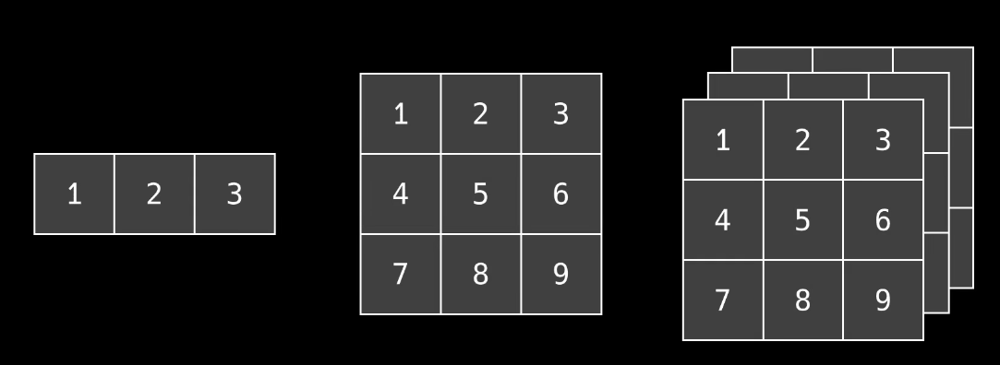

numpy.array()
可以用它表示普通的一维数组，或者二维矩阵，甚至任意维数据


```python
import numpy as np

#创建一个numpy数组对象
np.array([1,2,3,4,5])

#也可以用zeros创建全0数组
np.zeros((3,2)) #3行2列

#获取数组尺寸
np.shape


#创建一个全部是一的数组
np.ones((2,4))


#创建一个递增或递减的数列
np.arange(3,7) #左开右闭 3,4,5,6

#返回某个区间等间距分布的数 
np.linspace(0,1,5) # 前俩参数是区间范围，后面参数是输出样本总数
>>>array([0 , 0.25 , 0.5 , 0.75 , 1])

#生成一个随机的数组
np.random.rand(2,4) #2行4列


#在Numpy中，数组默认的数据类型是64位浮点数
#但在创建数组时，可以通过dtype指定其他数据类型
a = np.zeros((4,2) , dtype = np.int32)
"""
整形        np.int8/16/32/64
无符号整型   np.uint8/16/32/64
浮点数      np.float32/64
布尔值      bool
字符串      str
"""
#对于现有的数组可以通过astype来转换数据类型
a = np.zeros((2,4))
b = a.astype(int)


```


基本运算
```python

#两个相同尺寸的数组可以直接进行四则运算,它会将数组同位置的元素进行加减乘除
a = np.array([1,2,3])
b = np.array([4,5,6])
a + b


a / b

#在乘法运算中还有一个dot，它会将两个向量进行点乘运算
np.dot(a,b)
>>>


#另一个与乘法相关的是@符号,它会进行矩阵的乘法运算,等同于np.matmul()函数
a @ b
>>>


#np.sqrt对所有的数依次求平方根
np.sqrt(a)
>>>

#使用sin、cos进行三角函数运算
np.sin(a)

np.cos(a)


#或者log、power进行对数、指数运算等等
np.log(a)

np.power(a,2)


#也可以将一个numpy数组单独与一个数做运算，numpy会分别计算各个元素与这个数的乘积
#产生一个同尺寸的数组，这个操作在numpy中叫做广播
a * 5


#当不同尺寸的数组进行运算时，numpy会将数组"复制扩展成同一纬度，随后再来进行运算"


#还可以通过min()、max()来找最小值和最大值
a.array([1,2,3,4,5])
a.max()
a.min()


#argmin和argmax会返回最小或者最大元素所在的索引
a.argmin()

a.argmax()


#sum返回所有数据的总共
a.sum()


#mean()、median()会返回数据的平均值、中位数
a.mean()
a.median()


#var()、std()会返回数据的方差、标准差等
a.var()
a.std()


#获取矩阵中某个元素的数可以使用python中的列表索引方式：
a = np.array([[1,2,3][4,5,6]])
a[2,1]

#还可以按条件筛选出指定的元素
a[a < 3]
#还可以通过逻辑运算符组成不同的条件
a[(a > 3) & (a % 2 == 0)]

#选取数时也可以使用切片
a[0,0:2]

#当两个冒号时，第三个数表示跨度(range中的步长)
a[0:9:2]


```


图片处理

通常我们可以把一张灰度图看作是一个二维的数组，数组中的每个元素用来表示亮度值；对于彩色图片可以用三维数组来表示，数组的第三维分别存储了像素点的红绿蓝分量

```python
form PIL import Image
import numpy as np

#使用PIL库读取图片文件
im = Image.open('doge.jpg')
im.show()


#通过np.array将图片转换为一个np数组
im = np.array(im)

im.shape()

#可以通过下标访问某个像素点的颜色
im[100,100]
>>>array([23,24,10],dtype=uint8)

#单独提取出所有像素点的红色分量
im_r = im[:,:,0]
Image.fromarray(im_r).show()


```