## 1029
### Fastlivo2
论文链接：[[1029.fastlivo2-momo]]

#### **1. 摘要 (Abstract) - 解决了什么问题？**

- **核心问题**: 在机器人（尤其是无人机）的同步定位与建图（SLAM）任务中，如何融合激光雷达（LiDAR）、相机（Visual）和惯性测量单元（IMU）这三种传感器的信息，以实现**快速、精确、鲁棒**的状态估计。尤其是在计算资源有限的机载平台上，处理海量数据、应对单一传感器失效（如进入无纹理或无几何结构的区域）是巨大挑战。
    
- **解决方案**: 论文提出了 `FAST-LIVO2`，一个**快速且直接**的激光-惯性-视觉里程计框架。
    - **核心算法**: 它使用**误差状态迭代卡尔曼滤波器 (ESIKF)** 来高效地融合三种传感器的数据。
    - **直接法 (Direct Method)**: 为了提升效率和鲁棒性，它不提取特征点。激光雷达部分直接配准原始点云，视觉部分直接通过最小化图像块的光度误差来对齐图像。这让它在缺乏纹理或几何特征的环境中表现更好。
    - **统一的体素地图**: 激光雷达和视觉数据共享同一个地图。激光雷达点构建地图的几何结构，而相机的图像块则被“贴”在这些点上，为地图上色并提供视觉约束。
    - **关键创新**:
        1. **顺序更新**: 在卡尔曼滤波器中，先用激光雷达数据更新一次状态，再用视觉数据更新一次，解决了两种数据维度不匹配的问题。
        2. **平面先验**: 巧妙地利用激光雷达点云提供的平面信息来辅助和加速图像对齐，提高了精度。
        3. **在线曝光估计**: 能够实时估计相机的曝光时间，从而从容应对剧烈的光照变化（如从室内飞到室外）。
        4. **按需射线投射**: 当激光雷达因离物体太近而没有数据返回时，系统能主动“脑补”出视觉特征点，增强了鲁棒性。

#### **2. 实验部分 (Experiments) - 如何验证的？**

- **硬件平台**:
    - 主要测试平台是一台配备 **Intel i7-10700K CPU** 的台式电脑。
    - 为了验证其在嵌入式设备上的性能，还在 **高通 ARM 处理器 (RB5)** 上进行了测试。
- **测试环境与数据集**:
    - 在多个极具挑战性的**公开数据集**上进行了测试，包括 `NTU-VIRAL`（空中无人机）、`Hilti'22` 和 `Hilti'23`（手持设备在建筑工地）。
    - 制作了一个私有的 `FAST-LIVO2` 数据集，专门用于测试各种**极端场景**，如纯白墙、黑暗隧道、剧烈光照变化等激光雷达或视觉容易失效的环境。
- **对比方法**:
    - 将 `FAST-LIVO2` 与多个当前最先进的开源SLAM系统进行了全面对比，包括 `R3LIVE`、`LVI-SAM`、`FAST-LIO2` (一个非常流行的纯激光雷达方案) 和它自己的前一个版本 `FAST-LIVO`。
- **实验结果**:
    - **精度**: 在所有25个公开数据集序列上，`FAST-LIVO2` 的**平均绝对平移误差 (RMSE) 仅为 0.045 米**，远优于第二名 `FAST-LIVO` 的 0.137 米，精度提升了约3倍。
    - **鲁棒性**: 在各种退化场景（如长廊、纯色墙面、黑暗矿道）中，其他方法大多失效或产生巨大漂移，而 `FAST-LIVO2` 仍能生成高质量、高精度的地图。
    - **效率**: 在 i7 台式机上，平均处理一帧数据仅需 **30.03 毫秒**，远快于 `R3LIVE` 和 `LVI-SAM`。在 ARM 平台上也能达到约 78.44 毫秒，完全满足实时运行的要求。

#### **3. 结论 (Conclusion) - 效果怎么样？**

- **最终效果**: `FAST-LIVO2` 是一个极为成功的多传感器融合SLAM系统，在**精度、鲁棒性和计算效率**上都达到了顶尖水平，全面超越了当前其他主流的开源方案。
- **应用展示**: 论文展示了其强大的实际应用能力，包括：
    1. **完全机载的无人机自主导航**：在无人机上实时运行定位、规划和控制，实现了自主避障飞行。
    2. **高精度空中测绘**: 生成了细节丰富、色彩逼真的大规模三维地图。
    3. **三维模型渲染**: 重建的点云质量非常高，可以直接用于生成三角网格模型和新兴的**3D高斯泼溅 (3D Gaussian Splatting)** 渲染。
- **局限性与未来方向**:
    - **局限**: 作为一个“里程计”，它在超长距离运行时仍会不可避免地累积漂移。
    - **未来工作**: 计划引入**回环检测**和全局优化来消除长期漂移，并利用高质量的彩色点云进行**语义建图**（即识别出地图中的物体）。

### CarPlanner

论文链接：[[CarPlanner.pdf]]

#### **1. 摘要 (Abstract) - 解决了什么问题？**

- **核心问题**: 轨迹规划是自动驾驶的关键，但现有的[[#强化学习（RL）规划方法]]在处理大规模、真实的驾驶场景时，面临着**训练效率低**和**性能不佳**两大挑战。
- **解决方案**: 论文提出了一种名为 `CarPlanner` 的**一致性自回归规划器**。
    - 它采用**自回归结构**，可以高效地进行大规模强化学习训练。
    - 引入了**时间一致性**的概念，确保在规划轨迹的每一步都保持连贯，从而使策略学习更稳定。
    - 利用一个“生成-选择”框架，并设计了由专家经验引导的奖励函数，简化了强化学习的训练难度，提升了最终性能。
- **主要成就**: 论文宣称，这是**首次**证明基于强化学习的规划器，在极具挑战性的大规模真实世界数据集 `nuPlan` 上，其性能能够**超越**当前最先进的基于模仿学习（IL）和基于规则（Rule-based）的方法。

#### **2. 实验部分 (Experiments) - 如何验证的？**

- **硬件平台**: 实验在 **2 张 NVIDIA 3090 GPU** 上进行。
- **测试环境**:
    - **数据集与模拟器**: 使用了 `nuPlan` 数据集，这是一个为自动驾驶规划设计的大规模闭环仿真平台。它包含了在4个不同城市采集的1500小时真实驾驶数据。
    - **基准测试**: 在 `Test14-Random` 和 `Reduced-Val14` 这两个公开的基准上进行了测试。
- **评估指标**: 主要使用官方的**闭环分数 (Closed-loop Score, CLS)**，这个分数综合评估了规划器的**安全性**（如碰撞率）、**舒适性**、**行车效率**（进度）以及是否遵守交通规则等多个维度。
- **实验结果**:
    - `CarPlanner` 在 `Test14-Random` 基准测试中的综合分数（CLS-NR）达到了 **94.07**，显著高于当时最强的基于规则的方法 PDM-Closed (90.05) 和基于模仿学习的方法 PLUTO (91.92)。
    - 在保证高安全性的前提下，`CarPlanner` 在**行车效率 (S-PR)** 指标上提升尤为明显，这意味着它规划的路线更有效率，不会过于保守。

#### **3. 结论 (Conclusion) - 效果怎么样？**

- **最终效果**: 论文成功证明了 `CarPlanner` 作为一个一致性自回归框架的有效性。他们训练出的强化学习规划器，在性能上全面超越了现有的其他强化学习、模仿学习和基于规则的顶尖方法。
- **研究潜力**: 这项工作凸显了强化学习在解决复杂自动驾驶规划问题上的巨大潜力，能够有效应对模仿学习中常见的分布偏移和因果混淆等难题。
- **局限性与未来方向**:
    - **局限**: 论文也坦诚，强化学习方法的设计非常精细，容易受到输入数据的影响，并且可能对训练环境产生[[#过拟合]]。此外，目前依赖“专家引导”的奖励函数，可能会限制算法发现超越人类驾驶员更优策略的潜力。
    - **未来工作**: 未来的研究方向是开发更鲁棒的强化学习算法，使其能够在多变的环境中自主探索和泛化，摆脱对专家数据的强依赖。

#### 4.未知概念名词解释

##### 强化学习（RL）规划方法
强化学习（RL）规划方法就像是让智能体在一个环境中通过不断尝试不同动作，根据环境反馈的奖励来学习最优行动策略的过程。比如在自动驾驶中，智能体就是自动驾驶系统，环境是道路情况，动作是车辆的各种驾驶操作（如加速、转弯等），奖励就是根据驾驶表现（如是否安全、是否高效等）给予的反馈。强化学习规划的目标就是让自动驾驶系统学会在各种道路情况下，都能选择最优动作，实现安全高效驾驶。 

##### 过拟合
用 “教孩子做数学题” 的例子，就能把 “过拟合” 讲得特别明白 —— 核心就是 “学太死，只会做原题，换个花样就懵了”。

先从 “正常学习” 说起：  
如果孩子学 “加法” 时，既练了 “1+2”“3+5”，也理解了 “把两个数合起来” 的逻辑，那他遇到没见过的题（比如 “4+6”）也能做对。这就像好的 AI 模型：它学的是问题的 “通用规律”，能应对没见过的新情况。

而 “过拟合”，就是孩子走了歪路：  
假设老师只反复练 “1+2=3”“3+5=8” 这两道题，孩子没理解加法逻辑，只死记硬背 “看到 1 和 2 就写 3，看到 3 和 5 就写 8”。结果考试时，题目换成 “1+3”“2+5”，他立马不会了 —— 因为他学的不是 “加法规律”，而是 “原题的细节”，甚至连题目里数字的位置、字体都记下来了，一旦这些细节变了，就没用了。

放到 AI（比如 CarPlanner 这类强化学习模型）里，“过拟合” 就是这样：  
模型在 “训练环境” 里表现特别好 —— 比如训练时用的都是 “晴天、笔直公路、只有 3 辆车” 的场景，模型把这些场景的细节（比如车辆的固定间距、路灯的位置）都 “死记硬背” 下来了，规划轨迹又快又准。  
但一旦换到 “新环境”（比如雨天、弯道、突然窜出自行车），模型就 “懵了”—— 因为它没学到 “应对各种路况的通用规划逻辑”，只学了 “训练场景的专属细节”，换个场景就不管用了。

再结合你提到的 CarPlanner 的局限：  
它说 “可能对训练环境产生过拟合”，意思就是：  
现在模型在 “nuPlan 数据集”（训练用的真实驾驶数据）里表现很好，但如果真上路遇到 “数据里没出现过的情况”（比如极端天气、特殊路口），规划效果可能会变差 —— 因为模型把 “训练数据里的场景细节” 学太细了，反而没抓住 “自动驾驶规划的通用规律”。

总结一下：  
过拟合的本质是 ——**模型把 “训练时的特殊细节” 当成了 “通用规律”，导致在 “没见过的新情况” 下表现拉胯**。就像只会背原题的孩子，换题就翻车；只会 “适应训练场景” 的 AI，换个环境就失灵。

---
## 1030

### 多传感器融合室外移动机器人SLAM系统设计
[[多传感器融合室外移动机器人SLAM系统设计_邝禹聪.pdf]]

#### 1. 摘要 (解决了什么问题)

本文旨在解决室外移动机器人在复杂多变环境下自主移动的难题。传统的单一传感器方案难以应对光照变化、天气影响和复杂地形等挑战。

为此，该研究设计并实现了一个**多传感器融合的SLAM系统**，通过**松耦合**的方式结合了**多线激光雷达、IMU（惯性测量单元）和GPS**三种传感器。该系统的核心目标是：

*   **提高定位与建图的精度和稳定性**：通过传感器间的优势互补，克服单一传感器的局限性。
*   **实现高效的自主导航**：构建一个能够精确构建室外地图、进行高精度定位和可靠路径规划的机器人平台。

该技术可应用于环境检测、搜救、智能农业和无人配送等领域。

#### 2. 实验部分 (用了什么硬件、怎么做的测试)

##### 硬件平台

*   **机器人主体**：
    *   **车架**：金属方管焊接而成。
    *   **轮组**：步进电机驱动大尺寸车轮，以保证越障能力。
    *   **转向**：齿轮齿条式转向结构，节省空间。
*   **核心传感器**：
    *   **激光雷达**：VLP-16（一种16线激光雷达）。
    *   **惯性测量单元**：IMU。
    *   **全球定位系统**：GPS。
*   **控制系统**：
    *   **上位机**：负责处理传感器数据、运行SLAM算法并下发控制指令。
    *   **下位机**：接收上位机指令，将其解析为电机转速以控制底盘运动。

##### 测试流程

1.  **建图阶段 (离线)**：
    *   将机器人放置在起点，启动所有传感器。
    *   以 **1 m/s** 的速度遥控机器人移动，同时使用ROS的`bag`工具录制激光雷达的点云数据。
    *   使用 **NDT (Normal Distributions Transform) 算法** 对录制的点云数据进行离线处理，生成无扭曲、对齐良好的三维点云地图。

2.  **定位阶段**：
    *   加载预先构建好的点云地图。
    *   融合实时获取的 **激光雷达点云（经过降采样）、IMU数据和GPS数据**。
    *   利用 **NDT Matching 算法** 将实时传感器数据与地图进行匹配，从而实现机器人的高精度定位。当机器人偏离初始位置过远时，会利用GPS进行位置校准。

3.  **路径规划与避障阶段**：
    *   在定位成功的基础上，导入预设的路径点 (`waypoint`)。
    *   **A-star (A\*) 算法** (`astar_avoid`模块) 用于规划一条能够规避动态和静态障碍物的安全路径。
    *   **纯跟踪 (Pure Pursuit) 算法** 用于控制机器人精确地沿着规划好的路径行驶。
    *   系统通过速度滤波器处理速度和角速度的异常值，确保机器人行驶平顺。

##### 3. 结论 (效果怎么样)

*   **建图质量高**：实验生成的点云地图**无扭曲、无重影**，各方向上都能精确对齐。
*   **定位稳定精确**：融合了三种传感器的定位系统表现出很强的鲁棒性，即使在**上下坡、树木草丛密集**等复杂场景下，也能实现准确定位。
*   **导航有效**：机器人能够成功地根据A\*算法规划的路径进行自主移动，并利用纯跟踪算法实现稳定、高效的行驶。
*   **总体性能**：实验结果明确表明，采用**多传感器融合技术**能够**显著提高**室外移动机器人在自主移动过程中的**稳定性**和**可靠性**。

### 基于多传感器融合的自主移动机器人导航方法
[[基于多传感器融合的自主移动机器人导航方法_潘美君.pdf]]

#### 1. 摘要 (解决了什么问题)

本文旨在解决现有移动机器人导航技术中的两大核心痛点：

1.  **建图信息单一**：传统的二维激光雷达（LiDAR）地图缺乏三维环境信息，导致机器人对环境的理解不完整。
2.  **视觉SLAM的局限性**：纯视觉SLAM（同步定位与建图）方案容易受到光照变化、快速运动和纹理缺失等环境因素的干扰，影响定位和建图的鲁棒性。

为解决这些问题，该研究提出了一套**多传感器融合导航方案**，其核心贡献包括：

*   **融合建图**：结合 **RGB-D相机、二维激光雷达（LiDAR）和惯性测量单元（IMU）** 的数据，能够同时生成**高精度的二维栅格地图**和带有色彩信息的**三维点云地图**，极大地丰富了环境信息。
*   **改进的路径规划算法**：针对传统局部路径规划算法的缺陷，开发了 **Improved_TEB 算法**。该算法旨在改进 `TEB (Timed Elastic Band)` 算法容易陷入局部最优解以及 `DWA (Dynamic Window Approach)` 算法可能出现速度突变的问题。

最终目标是提升机器人在复杂环境下的建图质量、定位精度和导航效率。

#### 2. 实验部分 (用了什么硬件、怎么做的测试)

##### 硬件平台

*   **主控单元**：
    *   **上位机**：**NVIDIA Jetson Nano**，搭载 ARM Cortex-A57 CPU 和 Maxwell 架构的 GPU，负责运行ROS系统和核心算法。
    *   **下位机**：基于 **STM32** 的控制器。
*   **核心传感器**：
    *   **激光雷达 (LiDAR)**：**思岚科技 (Slamtec) RPLIDAR A1**，一款二维激光雷达，用于生成二维栅格地图。
    *   **深度相机 (RGB-D Camera)**：**奥比中光 (Orbbec) Astar Pro**，用于获取深度信息和彩色图像，以生成三维点云地图。
    *   **惯性测量单元 (IMU)**：**Hibot IMU**，用于提供机器人的姿态信息（角速度、加速度）。
*   **电源**：6V / 6000 mAh 锂电池。
*   **软件环境**：**Ubuntu 18.04** + **ROS Melodic**。

##### 测试流程

实验分为两个主要部分：建图算法对比和路径规划算法对比。

1.  **建图算法测试**：
    *   **对比方法**：
        *   **Karto SLAM**：一种经典的基于图优化的二维激光SLAM算法。
        *   **RTAB-Map (Real-Time Appearance-Based Mapping)**：本文采用的多传感器融合建图方案，同时利用激光雷达、RGB-D相机和IMU数据。
    *   **测试内容**：在同一室内环境下，分别使用两种算法进行建图。
    *   **评价指标**：
        *   **地图质量**：通过可视化工具 `RVIZ` 观察地图的还原度、清晰度和完整性。
        *   **定位精度**：通过比较机器人在地图中的估计位置与真实轨迹（或高精度参考）的误差，计算绝对轨迹误差（ATE）。

2.  **路径规划算法测试**：
    *   **对比方法**：
        *   **DWA (Dynamic Window Approach)**
        *   **TEB (Timed Elastic Band)**
        *   **Improved_TEB (本文提出的改进算法)**
    *   **测试场景**：在通过 RTAB-Map 构建的地图中设置6个导航目标点，并在路径上放置宽度为60cm的障碍物，模拟复杂导航任务。
    *   **测试过程**：每种算法在相同的场景下**重复执行30次**导航任务。
    *   **评价指标**：
        *   **导航成功率/碰撞次数**：记录每种算法在30次测试中发生碰撞的次数。
        *   **导航效率**：记录完成整个导航任务所需的平均时间。

##### 3. 结论 (效果怎么样)

*   **建图效果显著提升**：
    *   相比仅使用二维激光雷达的 **Karto SLAM**，本文提出的基于 **RTAB-Map** 的多传感器融合方案生成的地图在**环境还原度上提升了37.2%，清晰度提升了28.5%**。
    *   在定位精度方面，RTAB-Map方案的**绝对轨迹误差（ATE）均值仅为4.7 cm**，相比Karto SLAM的12.3 cm，**精度提高了62%**。这证明了融合RGB-D和IMU信息能有效校正里程计误差，提高定位建图精度。

*   **导航性能更优**：
    *   **安全性**：在30次导航测试中，**Improved_TEB 算法实现了0次碰撞**，成功率达到100%。相比之下，DWA 算法碰撞5次（成功率83.3%），TEB 算法碰撞3次（成功率90%）。
    *   **效率**：**Improved_TEB 算法的导航效率**相较于 **TEB 算法提升了4.2%**，相较于 **DWA 算法提升了11.5%**。

*   **总体评价**：该研究成功证明了多传感器融合（RGB-D + LiDAR + IMU）在建图方面的巨大优势，并且提出的 **Improved_TEB 算法**在保证安全性的前提下，有效提升了机器人的局部路径规划能力和导航效率。

### 面向矿井环境的激光雷达-惯性-视觉紧耦合SLAM算法
[[面向矿井环境的激光雷达-惯性-视觉紧耦合SLAM算法_卢艳军.pdf]]

#### 1. 摘要 (解决了什么问题)

本文旨在解决**矿井环境下移动机器人SLAM面临的严峻挑战**。矿井环境具有以下特点，导致单一传感器或传统多传感器融合方案性能不佳：

1.  **环境恶劣**：非结构化地形（如崎岖巷道、料堆）、狭窄空间、重复纹理（如相似的巷道壁）导致激光雷达和视觉传感器容易发生退化和误匹配。
2.  **光照条件差**：光照不足、光照突变、粉尘干扰等问题严重影响视觉传感器的特征提取和跟踪能力。
3.  **现有算法的局限性**：
    *   **单一传感器**：精度严重不足，如激光雷达在长廊中退化，视觉在弱光下失效，IMU存在累积漂移。
    *   **紧耦合算法**：虽然精度更高，但现有的一些LVI（激光-惯性-视觉）融合算法（如LIO-SAM, LVI-SAM）计算量大，不适合资源受限的矿用机器人。而一些快速算法（如FAST-LIVO）虽然计算量小，但其采用的**稀疏直接法**对光照变化敏感，在矿井光照突变场景下容易失效，导致位姿估计漂移。

为应对上述问题，该研究在 **FAST-LIVO** 算法的基础上提出了一种**改进的激光雷达-惯性-视觉紧耦合SLAM算法**。其核心创新点是：

*   **改进视觉前端以适应光照变化**：用**鲁棒的LK（Lucas-Kanade）光流法**替代了原有的、对光照敏感的稀疏直接法。光流法通过跟踪稳定特征点（如角点）来实现帧间匹配，对光照变化不敏感，更适合矿井环境。
*   **提高视觉约束质量**：在使用光流法跟踪特征点后，额外使用 **RANSAC（随机样本一致性）算法**来剔除外点（outliers），确保只有高质量的、匹配正确的视觉观测被用于后端优化。
*   **构建高质量彩色地图**：在实现高精度位姿估计的基础上，通过将激光雷达点云投影到对应的图像帧，为点云赋予RGB颜色信息，最终构建出能够清晰反映环境细节的**彩色三维点云地图**。

该算法旨在为矿井等恶劣环境下的移动机器人提供一个**高精度、高鲁棒性、高效率**的SLAM解决方案。

#### 2. 实验部分 (用了什么硬件、怎么做的测试)

##### 硬件平台

*   **传感器组合**：
    *   **激光雷达 (LiDAR)**：**Livox Mid-360**
    *   **惯性测量单元 (IMU)**：内置于Mid-360的6轴IMU
    *   **相机 (Camera)**：**Intel RealSense D435i**
*   **计算平台**：
    *   **仿真测试**：标准PC
    *   **实物测试**：**CODBOT-D100-P** 移动机器人 + **NUC11PAHi7** 机载主控计算机

##### 核心技术实现

1.  **多传感器数据紧耦合融合**：
    *   **IMU前端**：利用IMU的高频数据进行**前向传播**，为系统提供高频率的位姿**先验估计**，并用于补偿激光雷达点云的运动畸变。
    *   **视觉前端 (改进点)**：
        *   不再使用稀疏直接法，而是采用**LK光流法**在连续图像帧之间跟踪稳定特征点（通过Shi-Tomasi角点检测提取）。
        *   对光流法匹配得到的特征点对，使用**RANSAC算法**进行一次提纯，剔除因快速运动或场景变化导致的误匹配点（离群点）。
    *   **后端优化**：
        *   构建一个**迭代误差状态卡尔曼滤波器 (Iterated Error-State Kalman Filter)**。
        *   将三种传感器的观测残差共同纳入优化：
            1.  **IMU先验估计**
            2.  **激光雷达点到平面残差**
            3.  **视觉重投影误差** (来自光流法跟踪的内点)
        *   通过最小化一个包含上述三项的最大后验概率目标函数，迭代求解最优的机器人误差状态，并用其修正IMU预测的位姿，最终输出高精度的位姿估计。

2.  **地图构建**：
    *   **激光雷达局部地图**：使用**ikd-Tree**（一种增量式k-d树）来动态、高效地管理和更新激光雷达点云，支持快速的增、删、查操作。
    *   **视觉局部地图**：通过网格筛选和Shi-Tomasi得分计算，从投影到图像上的激光点中提取显著的视觉特征点，并用一个简单的数组进行管理。
    *   **全局彩色点云地图**：在每次卡尔曼滤波更新获得优化位姿后，将最新的激光雷达点云帧投影到对应的相机图像上，为每个激光点赋予其对应像素的RGB值，形成彩色点云帧。最后，将所有彩色点云帧依据优化后的位姿**拼接**起来，构建全局彩色点云地图。

##### 测试流程

1.  **Gazebo仿真测试**：
    *   搭建了一个长100m、宽5m、高3m的**模拟矿井巷道环境**，包含侧壁和料堆。
    *   让搭载传感器的机器人在仿真环境中以0.5 m/s的速度移动。
    *   对比本文算法与原始**FAST-LIVO**算法的**轨迹精度 (ATE, RPE)** 和**建图效果**。

2.  **公开数据集测试**：
    *   使用 **M2DGR 数据集**中的 `hall_04` 序列进行测试，该序列为室内长廊，特征与矿井环境相似（结构单一、特征稀疏）。
    *   对比本文算法与 **LeGO-LOAM, FAST-LIO, FAST-LIVO** 三种主流算法的**轨迹精度**。
    *   对比本文算法与FAST-LIVO的**计算效率**（单帧平均处理时间）。

3.  **真实模拟环境测试**：
    *   在一个与矿井巷道相似的**真实长走廊**中进行测试。
    *   使用搭载传感器的真实移动机器人平台采集数据。
    *   在测试前，使用**张正友标定法**对相机进行内参标定，并使用 `livox_camera_calib` 工具对激光雷达和相机进行外参标定。
    *   对比本文算法与FAST-LIVO的**建图质量**，观察对空间结构、线条、轮廓的还原清晰度以及噪点抑制效果。

#### 3. 结论 (效果怎么样)

*   **定位精度显著提升**：
    *   在Gazebo仿真矿井环境中，相比FAST-LIVO，本文算法的**ATE和RPE均降低了20%以上**。其中，ATE中值误差降低了**47.29%**，RPE中值误差降低了**36.56%**。
    *   在M2DGR公开数据集上，本文算法的ATE和RPE均方根误差均为最低，优于LeGO-LOAM, FAST-LIO和FAST-LIVO。尤其在**转弯处无明显漂移**，轨迹稳定性更优。

*   **计算效率更高**：
    *   在M2DGR数据集上，本文算法的**单帧平均处理时间为41.09 ms**，相比FAST-LIVO的49.46 ms，**耗时减少了约17%**。这表明改进视觉前端（光流法+RANSAC）比原有的稀疏直接法更高效。

*   **建图质量大幅改善**：
    *   在仿真和真实场景测试中，FAST-LIVO构建的地图存在特征模糊、细节缺失和噪点等问题。
    *   本文算法构建的地图则**特征清晰、结构规整**。无论是巷道侧壁、料堆轮廓，还是走廊的线条和细节，都能被**更清晰、更精准地还原**，且噪点抑制效果更佳。

*   **总体评价**：该研究提出的改进型LVI紧耦合SLAM算法，通过引入**鲁棒且高效的光流法**来替代对光照敏感的稀疏直接法，成功解决了FAST-LIVO算法在矿井等恶劣光照环境下的适应性问题。实验结果全面证明，该算法在**定位精度、轨迹稳定性、计算效率和建图质量**上均取得了显著提升，能够更准确地反映真实环境布局，为矿井机器人的高精度自主导航与环境感知提供了强有力的技术支持。

### 基于深度学习的动态场景视觉SLAM算法
[[基于深度学习的动态场景视觉SLAM算法_王晓栋.pdf]]

#### 1. 摘要 (解决了什么问题)

本文主要解决**视觉SLAM (同步定位与地图构建) 系统在动态环境下面临的精度和鲁棒性下降**的问题。

大多数传统的视觉SLAM算法（如经典的ORB-SLAM2）都基于一个核心假设：**场景是静态的**。然而，在现实应用中，环境中普遍存在动态物体（如行人、车辆），这些物体的运动会干扰SLAM系统后端优化所依赖的特征点，导致位姿估计出现严重偏差，甚至使系统崩溃。

为解决这一难题，该研究提出了一种**将深度学习与传统几何方法相结合**的动态SLAM算法。其核心思想是：

*   在成熟的 **ORB-SLAM2** 算法框架基础上，**引入一个基于YOLOv5的动态目标检测线程**。
*   该线程负责实时识别输入图像中的动态物体。
*   在进行位姿估计（里程计计算）之前，**主动剔除**这些被识别为动态物体的区域内的特征点。
*   通过这种方式，只利用场景中的静态背景特征点进行计算，从而**减少动态目标对系统定位精度的负面影响**。

最终目标是显著提升视觉SLAM算法在含有动态物体的真实场景下的**适用性、定位精度和稳定性**。

#### 2. 实验部分 (用了什么硬件、怎么做的测试)

##### 核心技术与硬件

*   **基础SLAM框架**：**ORB-SLAM2**，一个成熟的、基于特征点的视觉SLAM系统。
*   **动态目标检测网络**：**YOLOv5s**。选择`s`版本是因为其模型轻量，推理速度快，能够满足SLAM系统对实时性的高要求，并且便于未来在移动平台或嵌入式设备上部署。
*   **模型部署**：由于ORB-SLAM2使用C++编写，而YOLOv5基于Python和PyTorch，研究中通过将PyTorch模型转换为 **TorchScript** 格式，解决了跨语言部署问题，实现了在C++环境中的高效调用。
*   **实验平台**：
    *   **数据集**：**TUM数据集**。这是一个由慕尼黑工业大学发布的、广泛用于评估视觉SLAM性能的公开数据集。
    *   **测试序列**：重点使用了 `fr3/walking_xyz` 和 `fr3/walking_static` 两个序列。
        *   `walking_xyz`：包含一个在桌子旁来回行走的动态场景，用于测试算法在强动态干扰下的性能。
        *   `walking_static`：场景与前者类似，但人保持静止，用于对比算法在准静态环境下的表现。
    *   **评估工具**：**EVO (Evaluation of Odometry and SLAM)**，一个用于评估SLAM轨迹精度的常用Python工具。

##### 测试流程

1.  **系统构建**：
    *   在ORB-SLAM2的系统架构中，**新增一个独立的YOLO目标检测线程**。
    *   该线程接收每一帧输入图像，利用预训练好的 `yolov5s.torchscript.pt` 模型进行推理，识别出预定义的动态类别（如行人、车辆等），并输出这些动态物体的边界框（bounding box）。

2.  **动态特征点剔除**：
    *   在ORB-SLAM2原有的特征提取（Tracking）模块中，将提取到的所有ORB特征点与YOLO线程输出的动态物体边界框进行比较。
    *   **凡是落入动态物体边界框内的特征点，均被标记为“动态点”并从后续的计算中剔除**。
    *   只有未被标记的“静态点”才被用于位姿估计和地图构建。

3.  **运动一致性校验 (进一步优化)**：
    *   在剔除YOLO检测到的动态特征点后，研究还利用**对极几何约束**对剩余的静态特征点匹配对进行二次校验。
    *   通过计算特征点到其对应极线的距离，如果距离大于某个预设阈值，该点对也被视为由误匹配或未检测出的微小运动引起的“动态点”，并被剔除。这进一步保证了用于计算的特征点的可靠性。

4.  **对比实验**：
    *   **基线算法**：原始的 **ORB-SLAM2** 算法。
    *   **对比算法**：**DynaSLAM**，另一个当时主流的动态SLAM算法。
    *   在TUM数据集的动态和静态序列上，分别运行本文提出的算法、ORB-SLAM2和DynaSLAM。
    *   使用EVO工具比较三种算法输出的**估计轨迹**与数据集提供的**真实轨迹 (Ground Truth)**。

##### 评价指标

*   **绝对轨迹误差 (Absolute Trajectory Error, ATE)**：衡量估计轨迹与真实轨迹之间的全局差异。主要关注其**均方根误差 (RMSE)** 和**标准差 (STD)**。
    *   RMSE反映了轨迹的整体准确度，值越小越好。
    *   STD反映了轨迹的波动情况，即稳定性，值越小越好。

#### 3. 结论 (效果怎么样)

*   **在动态场景下性能大幅提升**：
    *   在 `fr3_walking_xyz` 动态序列上，本文算法的**ATE RMSE为0.0128米**，而原始ORB-SLAM2的误差高达0.2919米。**精度提升了约95.6%**。
    *   标准差（STD）也从0.1291米降至0.0068米，**稳定性提升了约94.7%**。
    *   轨迹对比图直观地显示，原始ORB-SLAM2的轨迹在动态物体出现时发生了严重漂移，而本文算法的轨迹则与真实轨迹高度吻合。

*   **优于其他动态SLAM算法**：
    *   在同一动态序列上，本文算法的ATE RMSE（0.0128米）也**优于DynaSLAM**（0.0150米），表明其在处理动态干扰方面具有更强的鲁棒性。

*   **在静态场景下保持高精度**：
    *   在 `fr3_walking_static` 静态序列上，本文算法的ATE RMSE为0.0098米，与原始ORB-SLAM2（0.0098米，修正后应为同一水平）和DynaSLAM（0.0060米）相比，虽然DynaSLAM略有优势，但本文算法依然保持在极低的误差范围内。
    *   这证明了该方法**没有因为引入动态检测模块而牺牲在静态场景下的性能**，具备良好的通用性。

*   **总体评价**：通过结合轻量级的YOLOv5目标检测和传统的对极几何约束，本文提出的方法成功地解决了视觉SLAM在动态环境下的关键痛点。它不仅**极大地提高了定位精度和鲁棒性**，而且保持了系统的高效运行，为视觉SLAM技术在真实复杂场景（如自动驾驶、服务机器人）中的应用提供了一个高效、可靠的解决方案。

### 基于YOLOv8实例分割和稠密建图的起重机视觉SLAM方法研究
[[基于YOLOv8实例分割和稠密建图的起重机视觉SLAM方法研究_谢孟杞.pdf]]

#### 1. 摘要 (解决了什么问题)

本文针对**起重机智能化、无人化升级**过程中，传统视觉SLAM系统在复杂工业场景下面临的核心挑战：

1.  **动态干扰问题**：起重机作业环境中频繁移动的载具、作业人员等动态物体会产生大量干扰特征点，导致传统SLAM系统**定位漂移、地图失真**。
2.  **实时性与精度矛盾**：一些用于处理动态物体的算法（如基于Mask R-CNN的Dyna-SLAM）计算量巨大，**实时性差**；而轻量化方案（如Detect-SLAM）虽然快，但检测精度不足，容易误删或漏删特征点。
3.  **地图稀疏性问题**：传统ORB-SLAM生成的稀疏地图无法满足工业场景中（如路径规划、避障）对环境细节的密集感知需求。

为解决上述问题，该研究提出了一种名为 **SLAM3-YOLOv8** 的新型视觉SLAM系统。其核心创新点在于：

*   **精准、高效的动态物体剔除**：将强大的 **ORB-SLAM3** 框架与最新的 **YOLOv8n-seg 实例分割**网络相结合。利用`n-seg`模型生成的**像素级掩膜 (mask)**，能够比传统边界框 (bounding box) 更精准地识别并剔除动态区域内的ORB特征点。
*   **实时性优化**：采用 **TensorRT** 对YOLOv8n-seg模型的推理过程进行加速，大幅缩短了目标检测的耗时，保证了整个系统在工业场景下的高实时性。
*   **构建高精度稠密地图**：在剔除动态特征点后，集成了一个**稠密建图模块**，利用筛选出的静态特征点和深度信息，构建**无重影、高精度的三维稠密点云地图**。

该系统的最终目标是为工业重载设备（如起重机）的智能化升级，提供一套在动态、复杂环境下**高精度、高实时性、高鲁棒性**的环境感知和建图技术方案。

#### 2. 实验部分 (用了什么硬件、怎么做的测试)

##### 硬件平台与软件环境

*   **CPU**：Intel i9-10900
*   **GPU**：NVIDIA RTX 2080Ti
*   **操作系统**：Ubuntu 18.04
*   **核心库**：CUDA 11.3, Cudnn 8.2.1, TensorRT
*   **传感器**：
    *   **公开数据集测试**：使用TUM数据集，该数据集由深度相机采集。
    *   **真实场景测试**：**Intel RealSense D435i** 深度相机，固定于桥式起重机的小车上。

##### 核心技术实现

1.  **动态特征点剔除**：
    *   在ORB-SLAM3原有的跟踪、建图、回环三个线程基础上，**新增一个独立的目标检测线程**。
    *   该线程接收RGB图像，利用 **YOLOv8n-seg** 模型进行实例分割，为每个识别出的物体（特别是动态物体）生成一个**像素级别的分割掩膜**。
    *   使用**非极大值抑制 (NMS)** 去除重叠的检测框，IoU阈值设为0.7。
    *   在跟踪线程中，将提取的ORB特征点坐标与动态物体的掩膜进行比对，**凡是落在掩膜内的特征点，一律被判定为动态点并予以剔除**。

2.  **网络加速**：
    *   为了在C++环境的ORB-SLAM3中高效运行Python开发的YOLOv8，模型被导出为 **ONNX** 格式。
    *   利用 **TensorRT 引擎** 加载ONNX模型并进行推理。通过模型压缩、内核自动调优等技术，极大地**加速了YOLOv8的推理速度**，解决了目标检测带来的额外耗时问题。

3.  **三维稠密地图重建**：
    *   在剔除了动态特征点、完成了位姿估计后，系统利用筛选出的**静态关键帧**进行建图。
    *   通过相机内参，将静态关键帧中每个像素的**二维坐标和深度值**，转换为**三维空间坐标**。
    *   将所有关键帧生成的三维点云进行**拼接**。
    *   最后，使用**统计滤波器**去除离群点，并用**体素滤波器**进行降采样，在保留场景结构的同时减少冗余，最终生成高精度的三维稠密点云地图。

##### 测试流程

1.  **公开数据集验证**：
    *   **数据集**：TUM动态数据集中的5个序列 (`walking_xyz`, `walking_halfsphere`, `walking_rpy`, `walking_static`, `sitting_static`)，覆盖了高动态和低动态场景。
    *   **对比算法**：原始ORB-SLAM3、Dyna-SLAM、SLAM3-YOLOv5。
    *   **评价指标**：
        *   **绝对轨迹误差 (ATE)**：衡量全局轨迹的准确度。
        *   **相对位姿误差 (RPE)**：衡量局部运动估计的准确度，包括平移和旋转误差。
        *   **实时性**：对比各系统单帧跟踪的平均处理时间。

2.  **真实起重机场景验证**：
    *   搭建了一个**桥式起重机运动实验平台**，让起重机大车和小车按预设的矩形轨迹运动。
    *   分别在**静态场景**和有人员走动的**动态场景**下，运行原始ORB-SLAM3和本文的SLAM3-YOLOv8系统。
    *   **定性比较**两种系统生成的**运动轨迹**与理想矩形轨迹的吻合度及闭合情况。
    *   **定性比较**两种系统构建的**三维稠密点云地图**是否存在重影和失真。

#### 3. 结论 (效果怎么样)

*   **定位精度显著提升**：
    *   在TUM高动态数据集上，相比原始ORB-SLAM3，SLAM3-YOLOv8的**绝对轨迹误差(ATE)最大降低了95.42%**，**相对位姿误差(RPE)最大降低了54.15%**。这证明了YOLOv8实例分割在精确剔除动态干扰方面的巨大优势。
    *   在大部分序列中，其精度也优于Dyna-SLAM和基于YOLOv5的系统。

*   **实时性表现优异**：
    *   尽管新增了目标检测线程，但得益于轻量化的YOLOv8n-seg模型和TensorRT的强力加速，系统的**单帧平均处理时间优化至18.08 ms**，甚至**优于**没有目标检测模块的原始ORB-SLAM3系统。这证明了该系统兼具高精度和高实时性。

*   **稠密建图效果出色**：
    *   在动态场景中，原始ORB-SLAM3构建的稠密地图出现了由运动物体（如行走的人）造成的明显**重影和拖尾**。
    *   SLAM3-YOLOv8由于有效剔除了动态特征点，成功构建了**清晰、无重影的静态三维稠密点云地图**，地图质量高，准确性好。

*   **真实起重机场景验证成功**：
    *   在起重机平台的真实测试中，无论是在静态还是动态场景下，SLAM3-YOLOv8生成的**运动轨迹都更接近理想的矩形**，闭合误差更小，鲁棒性更强。
    *   构建的场景地图同样有效避免了动态物体的干扰，地图一致性好。

*   **总体评价**：该研究提出的 **SLAM3-YOLOv8 系统**成功地将YOLOv8的强实例分割能力与ORB-SLAM3的高精度定位框架相结合，并通过TensorRT保证了实时性。实验充分证明，该系统能够有效克服起重机等工业场景中常见的动态干扰问题，**在高精度定位、高实时性和高质量建图方面均表现出色**，为工业重载设备的智能化升级提供了可靠且先进的技术方案。

---

## 1102
### 无人驾驶智能车面向校园场景的自主导航（李小涛）

[[无人驾驶智能车面向校园场景的自主导航_李小涛.pdf]]

==看起来像是最普通的ROS导航。11年的论文。==

#### 一、摘要（解决的问题）

无人驾驶智能车的自主导航是实现其自动驾驶的核心前提，而校园非结构化场景（环境复杂、存在静态与动态障碍物、GPS 数据可能失真等）给自主导航带来挑战。本文针对智能车不同行驶状态与 GPS 数据可信度，设计对应导航策略以解决校园场景自主导航问题，具体如下：

1. **停车 / GPS 数据失真场景**：提出基于激光扫描线的导航算法，通过激光数据判断安全距离内障碍物分布以确定可行方向；同时设计动态环境导航算法，预测动态障碍物与车的相遇情况，更新原算法实现提前避障。
2. **正常行驶场景**：提出基于局部栅格地图的导航算法，利用三个激光扫描获取地面高度信息，划分可行 / 不可行栅格与区域，通过导航评价函数求解最优行驶方向；针对道路环境特殊性，结合车道线检测，引导车辆按交通规则沿车道线行驶。

#### 二、结论（实现的效果）

1. **多状态导航有效性**：针对停车、GPS 数据丢失场景的激光扫描线导航策略，能有效保障智能车在此类情况下正常自主导航；正常行驶时的局部栅格地图导航算法，可让智能车在趋向目标的同时避开未知障碍物，具备良好实时性与鲁棒性。
2. **动态避障可靠性**：动态人体障碍物导航策略，通过跟踪动态障碍物运动趋势，能让智能车提前做出避让动作，配合鸣笛辅助，有效解决动态障碍物环境下的自主导航问题。
3. **道路场景适配性**：专用于道路环境的导航策略，借助车道线检测引导车辆沿车道线行驶，对动态障碍物鸣笛示警、对静态障碍物主动避让，可保证车辆在道路上稳定行驶。
4. **实验验证**：通过校园广场静态 / 动态环境实验、校园道路实验（如大连理工大学第二教学楼周边道路），验证了上述方法能有效实现智能车在校园场景的自主导航。同时也指出待优化方向，如 GPS 遮挡时的定位辅助、大坡度路面导航、方向选择摇摆、车道线检测精度提升等。

### 基于 GPS 定位模块制作高精细校园地图（张紫甜）
[[基于GPS定位模块制作高精细校园地图_张紫甜.pdf]]

==安卓APP，并非ROS高精地图==

#### 一、摘要（解决的问题）

高校校园内教学楼、宿舍楼、学院楼等设施地理位置复杂，不仅新生和外来人员难以快速找到目标地点（如新生入校找不到报名点易造成校园拥挤），甚至在校多年的师生也未必完全熟悉校园布局。为此，以大学空间信息为基础，采集校园地理信息，借助高德地图免费 API 接口，开发高精细校园地图导航 APP，实现自身定位、地图加载、校园内地点搜索和路线导航等功能，解决校园内人员找路难、校园拥挤等问题。

#### 二、结论（实现的效果）

1. **功能实用性**：该基于 Android 平台的校园高精细导航系统（以新疆农业大学为例），能为校园师生及外来人员提供精准帮助，可展示校园详细地图、实现实时定位与路线导航，助力用户快速熟悉校园、高效找到目的地，尤其为大一新生入校提供极大便利，节约时间、提升办事效率。
2. **技术适配性**：通过将校园详细地理信息存储在高德云图，解决了高德地图原有校园地点信息精度不足、未标注校内惯用别名地点的问题；同时采用火星坐标系转换技术，通过特定算法将手机 GPS 获取的经纬度转换为加密的火星坐标，保障位置信息安全，且系统响应时间控制在 5 秒内，用户体验良好。
3. **应用前景**：当前市场成熟地图虽多，但校园专用高精细地图较少，该系统填补了这一需求空白，具备较好的应用前景，后期可基于可维护性设计进一步优化升级，拓展更多校园专属功能。

### ==基于智慧校园的巡逻机器人导航定位技术研究（施鹏）==
[[基于智慧校园的巡逻机器人导航定位技术研究_施鹏.pdf]]

==STM32主控、融合GPS，有空可以细细阅读一下==

#### 一、摘要（解决的问题）

智慧校园背景下，传统校园安保方式效率低、成本高，而现有机器人导航方案存在不足（如图像识别循线易受环境影响、激光雷达因时间差 / 数据延迟导致运动畸变）。为此，设计基于 GPS 导航技术的校园自动巡逻机器人，以 STM32 为主控芯片，整合 GPS 模块、陀螺仪模块、数据存储模块及电机舵机控制电路，通过 GPS 获取经纬度数据并存储，陀螺仪提供实时航向角辅助 GPS，解决单一导航方式的缺陷，实现机器人运动轨迹精准计算与自动巡逻功能，满足智慧校园智能化安保需求。

#### 二、结论（实现的效果）

1. **功能实现性**：该校园巡逻机器人经实验验证，能有效完成指定目标路线的自动巡逻 —— 通过离散化目标路线（直道以 20m 间隔设中间点），将坐标存储于单片机 FLASH，结合 GPS 实时定位与陀螺仪辅助航向（经互补滤波处理，解决 GPS 更新慢、陀螺仪震动漂移问题），借助 PID 算法控制电机与舵机，实现方位修正与稳定行驶，成功达成智慧校园场景下的自动巡逻功能。
2. **应用价值**：机器人以 STM32 为核心的硬件架构（含电源、定位、存储、控制模块）与软件设计（分模块程序 + 主程序流程），保障了导航定位的稳定性与高效性，为校园安保提供了智能化、高效化、低成本的解决方案，符合未来校园安保发展方向，可有效提升智慧校园安保水平。

### 基于多传感器融合的校园无人接驳车自主导航系统研究（李一铎）
[[基于多传感器融合的校园无人接驳车自主导航系统研究_李一铎.pdf]]

==双SLAM雷达+IMU，融合算法改进，太高级了==

#### 一、摘要（解决的问题）

随着校园规模扩大，人流量与交通流量增加，传统交通管理效率低，而现有无人车自主导航技术在复杂校园环境中存在局限 —— 环境感知能力有限（如单一传感器易有盲区、受光照等干扰）、路况处理能力受限（缺乏高程信息易误判复杂路面）、应对人流影响不足。为此，采用多传感器融合方案设计校园无人接驳车自主导航系统，具体解决以下问题：

1. **传感器数据关联精度低**：通过改进 ICP 点云配准方法，对双 16 线激光雷达与 9 轴 IMU 进行外参标定，提升多传感器数据关联准确性。
2. **建图定位精度不足**：在因子图框架下融合双激光雷达与 IMU 实现 SLAM 建图，结合 NDT 点云配准与无迹卡尔曼滤波融合定位，解决单一传感器建图定位误差大、易漂移的问题。
3. **路径规划与控制适配性差**：制作含高程与道路语义信息的高精地图，基于 Open-planner 算法实现全局 / 局部路径规划，搭配纯跟踪控制算法，解决传统规划算法适配校园结构化场景不足、控制精度低的问题。

#### 二、结论（实现的效果）

1. **多传感器融合有效性**：
    - 外参标定方面，改进的 ICP 算法优于传统 NDT、ICP 算法，仿真实验中标定结果更接近真值，实车实验成功获取激光雷达间、激光雷达与 IMU 间外参，为数据关联奠定基础。
    - 建图定位方面，提出的 LLIO 系统（双激光雷达 + IMU 紧耦合）在建图精度上优于 LEGO-LOAM、LIO-SAM 等主流算法，仿真中 Z 轴位移最大误差仅 0.4 米，绝对位姿误差均值低至 0.105711；实车实验构建了覆盖整个校园的高精度点云地图，10 公里持续建图与真实环境差异小，定位稳定。
2. **规划控制实用性**：
    - 高精地图提供超视距感知，Open-planner 算法可实现校园结构化道路的全局路径规划（如缓上坡路段精准规划），局部路径规划结合欧式聚类能有效躲避低矮障碍物（如 2 米内锥桶）。
    - 纯跟踪控制算法通过动态调整前视距离，实现车辆稳定横向控制，实车实验中无人接驳车可在校园环境下自主导航，准确识别障碍并平稳行驶。
3. **应用价值**：系统有效提升校园交通管理效率，为自动驾驶技术在交通密集封闭场景（如校园）的应用提供实践经验，同时也为后续极端环境下导航技术优化（如结合大模型）提供基础。

### ==基于 ROS2 的稻麦轮作农田智能路径规划与自动导航系统（陈立邦）==
[[基于ROS2的稻麦轮作农田智能路径规划与自动导航系统_陈立邦.pdf]]

==RTK+ROS nav2 ，和预期的导航方案基本吻合，可以认真研究研究==

#### 一、摘要（解决的问题）

稻麦轮作农田中，传统农机自动导航系统存在稳定性差、智能化水平低的问题 —— 单一传感器定位易受农田复杂环境（如天气、信号遮挡）干扰，现有路径规划算法适配性不足（多为单一 S 型路径，难满足田间作业多样化需求），且缺乏高效的导航控制与可视化交互能力。为此，开发基于 ROS2 的智能农用导航系统，具体解决以下问题：

1. **定位精度与稳定性不足**：构建 RTK-GNSS 高精度定位系统，通过扩展卡尔曼滤波器（EKF）深度融合 GPS 信号、IMU 数据与里程计信息，实现 SLAM 功能，解决单一传感器定位误差大、易漂移的问题，为农机提供实时准确位置信息。
2. **路径规划适配性差**：研发适配 ROS2 的农田路径规划算法（FPP），可根据田块边界坐标、作业宽度生成定制化转弯点与作业路径，解决传统算法仅支持单一路径、无法适配稻麦轮作农田作业需求的问题。
3. **导航可视化与控制低效**：集成 Mapviz 实现导航过程可视化（接入天地地图），依托 ROS2 的 Navigation2 堆栈执行导航任务，解决农田导航过程难监控、控制模块协同性差的问题。

#### 二、结论（实现的效果）

1. **系统精度与稳定性优异**：以 3WPZ-500K 型喷雾机为试验平台，实车试验数据显示，系统平均横向偏移误差 7.68cm、作业导航点平均误差 2.25cm、速度平均误差 0.026m/s、航向角平均误差 0.036rad（约 2°），且能长时间稳定运行（采样时间 720s），内存占用合理（约 3.2GB，缓冲 / 缓存 4.3GB 左右），完全适配低成本 ARM 架构（如香橙派 5B），满足稻麦轮作农田农机调度与田间作业导航的精度和稳定性需求。
2. **功能适配性与实用性强**：
    - FPP 算法可灵活生成 A、B 两种类型作业路径，能根据田块边界坐标自动计算内嵌作业区域与转弯点，覆盖整个作业田块，解决传统单一路径规划的局限。
    - 基于 ROS2 的 Navigation2 堆栈具备高度模块化与可扩展性，可自动根据设定速度（如 1.0m/s）和最小转弯半径完成掉头、转弯动作；结合 Mapviz 可视化功能，能实时监控农机轨迹与环境障碍，提升田间作业的可控性。
3. **场景覆盖全面**：系统成功实现农机 “转场导航”（从仓库到田块入口）与 “田间作业导航”，转场过程中可利用激光雷达避障（如路边树木），田间作业能完成 4 次掉头等复杂动作，即使短暂出现 GPS 信号丢失，恢复器可重启相关节点恢复定位，进一步验证了系统在稻麦轮作农田复杂场景下的可靠性。

---

## 1103
### 自动驾驶高精度地图生成方法研究（郑玲）
[[自动驾驶高精度地图生成方法研究_郑玲.pdf]]
==论文重点在于公路地图生成，对于校园地图有些许偏差，参考性较弱==

#### 一、摘要（解决的问题）

自动驾驶技术对高精度地图需求迫切，但传统导航电子地图存在模型表达不足、数据精细化程度低、精度与现势性差等问题，现有高精度地图又面临地理元素复杂、几何抽象不一致、属性描述非定量化等挑战。为此，研究聚焦自动驾驶高精度地图生成关键问题，具体解决方向如下：

1. **地图模型适配性差**：传统导航电子地图以路段为最小单元，无法满足车道级定位与规划需求；现有高精度地图模型数据结构不完整、格式不统一、扩展性弱。提出 “面向自动驾驶的智能精细地图模型”，填补模型空白，支持道路级 / 车道级路网、动态地理信息与多类型驾驶导引信息的完整表达。
2. **车道级路网生成效率低**：传统多源数据生成路网方法成本高，单一轨迹数据计算量大。提出 “基于平行点对连接剪枝策略的车道级路网快速生成方法”，以无人车采集轨迹与现有路段级路网数据为数据源，通过相似性点对剪枝减少计算量，实现单一轨迹数据自动生成高精度车道级路网。
3. **路网拓扑关系构建难**：现有方法多依赖人工，难以自动建立路段层与车道层的关联关系及交叉口拓扑。提出 “基于多方向约束 PCA 的车道级路网拓扑自动构建方法”，通过 PCA 投影确定路段方向、分离车道网络、提取线性事件点，自动构建路段 - 车道关联及交叉口拓扑，满足自动化构建需求。

#### 二、结论（实现的效果）

1. **模型有效性验证**：提出的智能精细地图模型通过真实区域实验验证，可完整表达道路级 / 车道级路网、广义 POI（含辅助定位地理标签）及动态交通信息，数据结构灵活且支持扩展，能适配自动驾驶对地图 “精细度、动态性、机器可读性” 的核心需求，为高精度地图数据组织与管理提供统一框架。
2. **路网生成效率与精度双优**：
    - 平行点对剪枝策略显著提升效率：与未剪枝方法、基于网格的方法相比，在 11.6 公里实验路段（含 939 个 GPS 采集点、2665 个路段中心线点）中，计算耗时降低约 30%-50%，且数据规模越大，剪枝优势越明显；
    - 精度满足要求：生成的车道中心线与真值对比，平均误差 0.51m、最大误差 1.95m，无人车采集轨迹替代最右侧车道中心线的最大误差≤0.4m，符合自动驾驶车道级定位精度需求（相对精度 10-20cm）。
3. **拓扑构建准确性高**：基于多方向约束 PCA 的拓扑方法，在 24 公里实验区域（含 8046 个 GPS 采集点、68 个路段）中，路段提取精度 100%，物理连接未分段车道提取精度 97.4%，分段车道提取精度 95.2%，线性事件点提取精度 94%，成功建立路段 - 车道关联关系及交叉口拓扑，且拓扑关系与真实路网高度一致，有效支撑后续路径规划与导航。
4. **应用价值显著**：方法仅需单一无人车轨迹数据与现有专业测绘路网数据，无需多源复杂设备，降低高精度地图生成成本；同时为地图厂商提供快速生成车道级路网的技术手段，助力提升高精度地图现势性，为自动驾驶高精度地图产业化落地提供理论与技术支撑。

### 基于 LiDAR/IMU 紧耦合的封闭园区自动驾驶组合定位方法（王哲文）
[[基于LiDAR_IMU紧耦合的封闭园区自动驾驶组合定位方法_王哲文.pdf]]

==虽说和大车计划方向很贴切，但是感觉比较一般，可以仔细读读看看具体啥样==
==大车目前的预期：LiDAR+IMU+RTK+Camera+Odom==

#### 一、摘要（解决的问题）

封闭园区（如工厂、港口园区）自动驾驶定位面临多类技术瓶颈，现有方案难以兼顾精度、鲁棒性与场景适配性，具体问题及解决方案如下：

1. **单一传感器定位缺陷**：
    - **GNSS/INS 定位失效**：封闭园区建筑密集、植被遮挡多，GNSS 信号弱，定位精度无法保证；低成本 IMU 存在误差随时间发散的固有缺陷，无法长时间稳定定位。
    - **纯 LiDAR 定位不足**：仅基于 LiDAR 的 SLAM 技术（如 A-LOAM）存在初始值不准确、特征点提取不稳定、竖直方向误差大（坡度路段易漂移）、易陷入局部最优等问题，难以满足封闭园区复杂路况需求。
2. **多传感器融合痛点**：
    - **数据同步难**：LiDAR 与 IMU 数据采集原理不同，存在时变时间偏移（触发 / 传输延迟）与固定时间偏移（运算单元接收 / 处理延迟），导致数据时间戳错位，融合精度下降。
    - **融合约束不足**：传统多传感器融合未结合车辆运动特性，位姿优化空间大，易出现定位漂移，尤其在弯道、上下坡等场景鲁棒性差。

为此，研究提出**LiDAR/IMU 紧耦合 + 车辆运动学模型约束**的组合定位方案：

- 设计基于可变邻域与特征分类的 LiDAR 特征提取方法，提升激光里程计精度；
- 采用 IMU 预积分策略处理高频率数据，保证位姿估计准确性与系统实时性；
- 构建三维车辆运动学模型（基于阿克曼转向原理），对车辆位姿进行额外约束，改善竖直方向误差；
- 提出补偿优化 + GNSS 授时的多传感器时间同步方法，消除时间偏移影响。

#### 二、结论（实现的效果）

1. **定位精度显著提升**：
    - 与纯激光定位方法 A-LOAM、无车辆运动学模型的 LiDAR/IMU 紧耦合方法相比，本文方法（LiDAR-IMU-VM）在 4 个封闭园区场景（工厂、双创、工业园区）中表现最优：
        - **相对误差**：平移误差降至 0.34%-0.51%（A-LOAM 为 1.00%-1.17%），旋转误差降至 0.0021-0.0040 deg/m（A-LOAM 为 0.0053%-0.0090%）；
        - **绝对误差**：均值控制在 1.14-1.49 米（A-LOAM 为 2.44-3.18 米）；
        - **竖直方向误差**：均值仅 0.11-0.44 米（A-LOAM 为 1.84-3.67 米），有效解决坡度路段漂移问题。
2. **鲁棒性与场景适配性强**：
    - 在直道、弯道、上下坡及植被 / 建筑密集区域，均能稳定输出六自由度位姿，轨迹一致性优于对比方法；
    - 时间同步方法有效消除 LiDAR 与 IMU 时间偏移，避免因数据错位导致的定位误差，系统连续运行时误差无明显累积。
3. **实用性与经济性平衡**：
    - 无需额外传感器（仅用 LiDAR+IMU），降低硬件成本；采用预积分与紧耦合优化，算法实时性满足封闭园区自动驾驶需求（工控机可稳定运行）；
    - 定位精度虽未达厘米级，但完全满足封闭园区（车速≤40km/h）自动驾驶车辆路径规划、避障等功能对定位的要求。
4. **技术验证充分**：
    - 通过林肯 MKZ 自动驾驶试验车采集多场景数据，对比三种定位方法的轨迹、平移 / 旋转位姿、竖直方向误差，实验结果均验证了本文方法的有效性，为封闭园区自动驾驶定位提供可靠技术方案。

### 深度学习和移动边缘计算在自动驾驶的应用综述（黄磊）

[[深度学习和移动边缘计算在自动驾驶的应用综述_黄磊.pdf]]

==感觉不太行，还是得依靠Linux开发板自身算力为主==

#### 一、摘要（解决的问题）

自动驾驶在实际应用中面临计算资源受限、通信时延高、环境感知精度不足等关键瓶颈，传统技术难以兼顾实时性、安全性与智能化需求，具体问题及解决方案如下：

1. **计算与通信资源不足**：
    - **车载计算能力有限**：自动驾驶车辆需处理多传感器（激光雷达、高清相机等）产生的海量数据，传统车载计算单元难以承载目标检测、路径规划等计算密集型任务，易导致处理延迟过高，影响安全决策。
    - **云端传输时延高**：传统云端处理模式需将数据上传至远程云服务器，传输距离远、带宽消耗大，无法满足自动驾驶 “低时延” 需求（如碰撞避免需毫秒级响应）。
    - **移动性影响通信稳定性**：车辆高速移动导致无线链路不稳定，传统通信架构难以保证环境信息实时交互，易出现数据传输中断或延迟。
2. **环境感知与决策精度低**：
    - **传统检测方法局限**：依赖手工提取特征的浅层学习（如支持向量机），在复杂场景（如夜间、暴雨、遮挡）下目标检测（车道线、行人、障碍物）准确率低，易出现误判或漏判。
    - **路径规划动态适应性差**：传统算法（如 A*、快速探索随机树）未考虑实时交通流、突发障碍物等动态因素，仅能实现局部最优，无法适配复杂路况的全局路径优化。
    - **碰撞避免响应滞后**：缺乏对事故风险的实时预测能力，传统碰撞检测依赖硬件传感器（如碰撞传感器），响应速度慢，且难以提前预警潜在风险。

为此，研究提出**深度学习 + 移动边缘计算（MEC）融合方案**：

- 利用 MEC “终端 - 边缘 - 云端” 三级架构，将计算任务卸载至边缘服务器，降低车载计算负担与传输时延；
- 采用深度学习模型（深度玻尔兹曼机、深度强化学习、深度森林等）提升目标检测精度与路径规划、碰撞预测的智能化水平，解决传统方法的场景适配性与决策鲁棒性问题。

#### 二、结论（实现的效果）

1. **多场景应用效果显著**：
    - **目标检测精度大幅提升**：
        - 车道检测：基于深度神经网络的方法在复杂场景（阻塞、分叉路口）检测准确率超传统算法，夜间错误率低至 1.14%；端到端车道检测器通过加权最小二乘拟合，70 帧条件下性能较传统两步法明显优化。
        - 车辆与环境检测：卷积神经网络融合激光雷达与相机数据，可精准估计障碍物相对速度、三维位置，查准率与查全率显著高于硬件监测方法；尖峰神经网络通过时间编码，在降低能耗与延迟的同时，实现目标快速识别。
        - 行人检测：部分上下文网络结合身体语义与上下文信息，对遮挡行人的误码率降低，平均检测准确率超 90%，有效提升自动驾驶安全性。
    - **路径规划动态适配性增强**：
        - 基于深度强化学习的路径规划，综合交通流预测（多层感知器模型、多任务学习网络）与实时路况，车辆成功到达率提升至 90%，可适配动态道路网络（如突发拥堵、天气变化）；
        - 多尺度卷积神经网络在无车道标志场景下仍能可靠识别道路像素，为增强现实导航提供基础，鲁棒性优于传统依赖车道标志的方法。
    - **碰撞避免与风险预警能力提升**：
        - 深度学习碰撞检测模型（如 DeepCrash）准确率达 96%，可快速识别高速头部碰撞与单车事故；递归神经网络结合时空特征，能挖掘交通事故深层分布模式，实现风险提前预警。
        - 堆栈去噪自动编码器融合交通事故数据与 GPS 记录，可实时评估交通风险并优化安全路线，减少事故发生概率。
2. **技术融合价值凸显**：
    - MEC 的分布式计算架构有效降低时延：将目标检测、数据处理等任务卸载至边缘服务器，减少数据传输量，系统响应时间缩短，满足自动驾驶实时性需求（如边缘侧处理时延较云端降低 50% 以上）。
    - 深度学习与 MEC 协同提升资源利用率：边缘服务器承担深度学习模型训练与推理，缓解车载设备计算压力，同时通过模型优化（如减少卷积过滤器）降低边缘节点资源消耗，平衡精度与能耗。
3. **现存挑战明确**：
    - 实时性待突破：5G 虽降低传输时延，但海量传感器数据（图像、视频）的实时分析与结果反馈仍需进一步优化；
    - 隐私保护不足：分布式深度学习训练中易出现成员攻击，导致用户数据隐私泄露；
    - 车辆移动性适配难：车辆高速移动影响无线链路稳定性，给计算与通信资源动态分配带来挑战，需进一步探索移动规律以优化架构。

### 自动驾驶在无人配送领域的应用研究（潘霞）
[[自动驾驶在无人配送领域的应用研究_潘霞.pdf]]

==只是说了自动驾驶有这么一个应用方向，没有说技术上的细节==

#### 一、摘要（解决的问题）

城市末端配送（快递、外卖等）面临效率低、成本高、供需矛盾突出等行业痛点，传统人力配送模式难以适配业务增长与场景需求，具体问题及解决方案如下：

1. **末端配送效率与成本矛盾**：
    - **时空分散导致效率低**：配送需求在时间（如早晚高峰、重复配送）、空间（社区、写字楼、高校等分散点位）上高度分散，传统配送需大量站点与人员，易出现等待时间长（如高校菜鸟驿站排队取件）、人力成本高的问题。
    - **业务体量激增带来配送压力**：2019 年我国快递量达 635 亿件、实时配送业务 185 亿件，传统人力配送能力难以匹配暴增的需求，存在配送延迟、丢件漏件风险。
2. **自动驾驶技术落地难**：
    - **复杂场景适配性差**：高级别自动驾驶在城市开放道路面临安全冗余高、技术整合难（多传感器协同、决策算法鲁棒性）等问题，短期内难以量产落地。
    - **政策与法规不完善**：全无人化自动驾驶缺乏明确的监管标准与责任界定，制约技术商业化应用。
3. **传统配送模式安全性与适应性不足**：
    - **恶劣场景作业风险高**：人力配送在夜间、低温、暴雨等场景下效率下降，且存在交通安全隐患；
    - **交通拥堵加剧配送压力**：传统配送车辆（如电动三轮车）无序行驶易加重城市交通拥堵，进一步影响配送时效。

为此，研究提出**自动驾驶技术赋能无人配送**的解决方案：

- 以低速无人配送车为载体，结合自动驾驶核心技术（多传感器融合、路径规划、组合定位），适配高校、社区等封闭 / 半封闭场景，解决末端配送时空分散问题；
- 探索 “人机协同” 过渡模式，在技术与政策不完善阶段平衡自动化与人工干预，降低落地门槛；
- 构建 “上游零部件 - 中游车辆运营 - 下游服务落地” 的商业模式，推动无人配送规模化应用，同时为自动驾驶技术提供场景验证，加速技术迭代。

#### 二、结论（实现的效果）

1. **场景化应用成效显著**：
    - **高校场景效率提升**：通过无人配送车与快递柜结合，借助视觉识别算法实现货物分类与精准投递，减少取送时间消耗；实时监控功能降低地址失误与物品损坏率，改善师生取件体验，缓解驿站排队难题。
    - **封闭 / 半封闭区域常态化运行**：以北京顺义试点为例，无人配送车在 8 个社区实现 300 天持续运营，累计订单超 1 万单，无人车订单占比超 60%，验证了区域内无人配送的可行性与稳定性，为末端即时配送提供实践参考。
    - **恶劣场景适配性增强**：无人配送车可承担夜间、低温等人力作业风险高的任务，将配送人员转移至安全环境，同时通过精准调度避免无序行驶，缓解城市交通拥堵。
2. **自动驾驶技术落地加速**：
    - **技术验证与迭代**：低速无人配送场景（车速低、环境相对可控）为自动驾驶关键技术（传感器融合、定位、决策算法）提供低成本、高安全的测试环境，解决高级别自动驾驶在开放道路 “落地难” 问题，推动传感器性能提升（如激光雷达成本降低、线控底盘稳定性增强）与算法优化。
    - **商业化路径清晰**：形成两类成熟商业模式 ——①运营服务模式（如白犀牛、毫末智行），自主运营车辆提供配送服务并收取费用；②软硬件解决方案模式（如新石器、驭势科技），销售 / 租赁车辆或提供集成方案，上游国产零部件占比提升，为量产奠定基础。
3. **产业价值与社会效益凸显**：
    - **降本增效**：无人配送减少人力成本（重复劳动自动化）与时间成本（实时调度优化路径），某试点案例中物流效率提升显著，同时降低传统配送的交通违规与事故率。
    - **未来潜力大**：随着 5G、AI 技术发展，无人配送可拓展至安防巡逻、自动售卖、接驳等多场景；中汽数据自研多场景低速无人车已实现自动配送、人脸识别等功能，联合主机厂推进前装量产，为行业提供模块化技术服务，形成 “研发 - 服务 - 反馈” 的良性闭环。
4. **过渡模式适配当前阶段**：
    - “人机协同” 模式在短期内弥补技术与政策短板，通过人工调度与定期检查保障无人配送安全性，为全无人化配送积累数据与经验，是当前阶段平衡效率与风险的最优选择。

### 具身智能产业发展动向及创新能力研究（钟新龙）
[[具身智能产业发展动向及创新能力研究_钟新龙.pdf]]

==没啥用，大话==

#### 一、摘要（解决的问题）

具身智能作为新一代人工智能的核心方向，在技术落地、产业协同、国际竞争等方面面临多类挑战，传统人工智能 “离身化” 局限与产业发展需求存在差距，具体问题及解决方案如下：

1. **技术层面：跨学科整合难与场景适配性不足**
    - **多技术协同壁垒**：具身智能需融合机器人学、机器视觉、自然语言处理、认知科学等多学科技术，但现有研究多聚焦单一领域（如仅关注机器人本体或算法），缺乏智能系统与物理实体的深度交互设计，导致感知 - 理解 - 执行闭环难以形成（如机器人无法精准响应复杂人类指令）。
    - **复杂场景鲁棒性低**：现有具身智能体（如工业机器人、自动驾驶汽车）在非结构化环境（如恶劣天气、动态障碍物）中感知精度不足、决策滞后，难以适配医疗、家庭等高精度、高安全需求场景。
2. **产业层面：创新要素分散与商业化路径模糊**
    - **资源配置碎片化**：我国具身智能产业存在 “企业单打独斗、高校研究与产业脱节” 现象，关键技术（如具身芯片、高精度传感器）研发投入分散，缺乏跨区域、跨主体的协同创新平台，导致技术转化效率低。
    - **商业模式不成熟**：上游核心零部件（如高端电机、特种传感器）依赖进口，中游设备运营缺乏标准化服务体系，下游应用场景（如医疗康养、智能交通）落地成本高，尚未形成 “技术 - 产品 - 市场” 的完整闭环。
3. **政策与国际竞争层面：标准缺失与全球布局滞后**
    - **监管与评价体系空白**：具身智能涉及人机交互安全、伦理责任界定（如机器人操作失误责任划分），但我国尚未建立统一的技术标准、安全规范及产品评价体系，制约产业规范化发展。
    - **国际竞争压力大**：美国、日本、欧盟等已通过 “国家机器人计划”“机器人新战略” 等政策抢占技术制高点（如美国聚焦通用协作机器人、日本深耕工业机器人），我国在核心算法、高端产品等领域与国际领先水平仍有差距，面临技术 “卡脖子” 风险。

#### 二、结论（实现的效果）

1. **技术突破：多领域协同创新成效显著**
    - **关键技术迭代加速**：我国在自动驾驶、机器视觉、语音识别等领域取得领先成果 —— 自动驾驶方面，清华大学 “视觉中心自动驾驶方案” 广泛落地，过半主机厂推出 L3 级硬件车型，百度、华为等企业突破 V2X、数据闭环技术；机器视觉与语音识别领域专利数量超 10 万件，腾讯、华为掌握触觉传感器、柔性交互等核心专利，为具身智能感知 - 交互能力奠定基础。
    - **大模型赋能具身能力**：国内外企业推出多模态具身模型（如谷歌 PaLM-E、微软 ChatGPT for Robotics、阿里 “千问” 大模型），实现 “自然语言指令 - 物理动作执行” 的端到端响应（如通过对话指挥机器人开门、取物），正向迁移能力显著，多任务处理效率较单一模型提升 30% 以上。
2. **产业发展：创新格局成型与场景落地提速**
    - **创新主体协同发力**：形成 “企业主导、高校为辅” 的格局 —— 企业层面，小米（人形机器人 CyberOne）、优必选（WalkerX 双足机器人）、百度（自动驾驶）等龙头布局全产业链；高校层面，清华大学、浙江大学在具身感知、运动控制等基础研究领域提供技术支撑，2023 年北京市成立人形机器人产业开放联盟，推动 “产学研用” 融合。
    - **场景化应用成果突出**：在封闭 / 半封闭场景（如工业园区、高校），具身智能体已实现规模化应用 —— 工业机器人承担 30% 以上重复性生产任务，效率提升 20%-50%；自动驾驶在示范区（如北京顺义）实现 L4 级常态化运营，无人配送订单占比超 60%；医疗领域，日本 ASIMO 机器人、我国康复机器人已辅助完成手术操作与康复训练。
3. **政策与国际竞争力：顶层设计完善与全球地位提升**
    - **政策体系逐步健全**：国家层面出台《“十四五” 机器人产业发展规划》《“机器人 +” 应用行动方案》，明确具身智能技术攻关方向；地方层面，北京、上海、深圳等推出专项政策（如北京建设人形机器人通用大模型平台、深圳扶持通用型具身智能机器人研发），18 个省级单位发布 33 项自动驾驶政策，形成 “国家引导 + 地方实践” 的推进格局。
    - **国际竞争力稳步增强**：我国具身智能专利数量近五年持续增长，自动驾驶、语音识别等领域专利超 10 万件，国产零部件占比提升（如华为自研芯片、大疆传感器）；在国际市场，我国工业机器人产量占全球 50% 以上，自动驾驶企业（如百度 Apollo）在海外开展技术合作，逐步打破欧美日垄断格局。
4. **现存挑战与未来潜力**
    - **待优化方向**：智能机器人、自然语言处理等领域专利数量较少（不足 1 万件），大模型与物理实体的交互精度、医疗等高风险场景落地仍需突破；国际竞争中，核心算法、高端材料等领域仍需加强自主创新。
    - **长期潜力**：随着 L4 级自动驾驶落地、新能源汽车普及，自动驾驶将成为具身智能核心应用板块；医疗康养、智能家居等场景市场规模预计爆发式增长，未来有望形成 “千亿级” 产业集群，为我国抢占通用人工智能制高点提供支撑。

---
## 1104
### 基于 ROS 的自主跟随式医疗辅助机器人设计（张茜）核心内容提炼

[[基于ROS的自主跟随式医疗辅助机器人设计_张茜.pdf]]

==看的时候没搞懂是如何跟随的，查了一下，ROS中也有跟随这个应用，正好可以用在华北五省服务机器人当中==

#### 一、摘要（解决的问题）

医疗场景中无接触辅助需求迫切，但传统跟随式机器人在复杂环境下存在响应慢、鲁棒性差、适配性不足等问题，具体痛点及解决方案如下：

1. **医疗场景辅助资源短缺与接触风险**：
    - **人力护理不足**：医院医务人员有限，难以兼顾行动不便患者（如输液、携带引流袋患者）的全程辅助，且大量护理人员易造成医疗环境拥挤；
    - **医废处理风险**：医疗废物转运过程中，人工操作易导致病毒传播，需非接触式转运工具降低感染风险。
2. **传统跟随机器人性能局限**：
    - **复杂环境适应性差**：单一运动模型难以应对医院动态场景（如人员穿梭、障碍物多变），易出现跟随滞后或丢失目标；
    - **精度与响应不足**：缺乏实时模型更新机制，对目标运动状态（如突然转弯、变速）的预测准确性低，跟随误差大；
    - **硬件与软件协同弱**：传感器数据处理、运动控制模块分离，难以实现高效数据交互与闭环控制。

为此，研究提出**ROS + 交互式多模型（IMM）算法**的设计方案：

- 以 ROS 系统为框架，利用其硬件抽象层与节点化架构，实现视觉感知、运动控制、远程操作的模块化协同；
- 融合 IMM 算法，通过多并行运动模型（如匀速、转弯模型）预测目标状态，结合贝叶斯估计实时更新模型概率，提升复杂环境下跟随鲁棒性；
- 设计 “远程操作 - 嵌入式计算 - 底层控制” 三级硬件架构，搭配深度相机、IMU 惯性检测模块，保证感知精度与运动闭环控制。

#### 二、结论（实现的效果）

1. **功能适配性与场景价值显著**：
    - **多医疗场景覆盖**：机器人可完成两类核心任务 ——①辅助行动不便患者（如输液时跟随移动，携带医疗设备）；②医废转运（跟随处理人员收集废物，避免接触感染），同时可扩展至其他非接触式跟随场景，满足医疗场景多样化需求。
    - **人力与风险优化**：有效缓解医务人员短缺问题，减少医疗环境拥挤；医废转运环节实现 “无接触操作”，降低病毒传播风险，提升医疗安全水平。
2. **跟随性能与鲁棒性提升**：
    - **动态跟踪精度高**：MATLAB 仿真验证显示，IMM 算法可准确预测目标运动属性（位置、速度、转弯过程），滤波值与真实值偏差小，能精准捕捉目标机动状态（如突然转弯），避免跟随丢失；
    - **复杂环境响应快**：多模型交互与贝叶斯实时更新机制，使系统对医院人员穿梭、障碍物变化的适应性增强，响应时间较传统单一模型缩短 30% 以上，跟随效率显著提升。
3. **软硬件协同与控制可靠**：
    - **模块化协同高效**：ROS 系统的节点化设计（外部信息读取、目标跟踪、运动控制节点独立运行），实现传感器数据（深度相机、IMU）与运动控制的高效交互，硬件抽象层降低设备适配难度；
    - **运动控制精准**：底层 Arduino 控制板接收上层指令后，输出 PWM 信号精准控制电机转速，结合 IMU 惯性检测实现位姿、速度闭环控制，保证机器人转弯、直走等动作准确性，跟随误差控制在厘米级。
4. **现存优化方向**：
    - 目前机器人车轮适配平坦地面，医院场景中可能存在不平路面（如坡道、门槛），需进一步改进车轮结构（如采用全向轮或减震设计），提升地形适配性；
    - 未来可增加避障算法与多目标识别功能，应对医院更复杂的动态障碍物与多患者同时辅助需求。

#### 问：它是如何实现跟随效果的？

##### ROS 中 Follow（跟随）功能的实现方式

在机器人操作系统（ROS）中，Follow（跟随）功能的核心是通过**传感器感知目标、算法处理数据、控制器驱动运动**的闭环流程，让移动机器人实时跟踪目标（人、物体或其他机器人），具体实现路径可分为 “感知 - 决策 - 控制” 三大环节，结合不同软件包与技术方案适配多样化场景需求，以下是详细实现逻辑：

###### 一、目标感知：获取目标位置与状态信息

感知是跟随功能的基础，需通过传感器采集目标的空间位置、运动速度等关键信息，为后续决策提供数据支撑，常用感知方案与技术如下：

1. **基于激光雷达的人体 / 物体检测**利用激光雷达（如 Velodyne、RPLIDAR）获取环境点云数据，通过`people_following`类节点（如`people_msgs`功能包中的检测节点）分析点云轮廓特征：
    
    - 提取目标的几何形状（如人体的高度、宽度特征）或物体的轮廓尺寸，区分目标与背景障碍物；
    - 计算目标相对于机器人坐标系的距离、角度等实时位姿信息，输出为 ROS 话题（如`/people_pose`），供后续模块调用。
        
        该方案抗光照干扰能力强，适合室内外复杂环境，但对目标轮廓的辨识度依赖较高（如需避免与相似尺寸障碍物混淆）。
2. **基于视觉传感器的目标跟踪**结合 RGB 相机或深度相机（如 Kinect、Astra Pro），通过视觉算法（如 YOLO 目标检测、相关滤波跟踪）定位目标：
    
    - 先通过目标检测模型（如`darknet_ros`）识别目标类别（如 “person” 标签），确定目标在图像中的像素坐标；
    - 若使用深度相机，可进一步获取目标的三维空间坐标（通过相机内参将像素坐标转换为世界坐标），输出为`/target_3d_pose`话题；
    - 部分方案会融合多帧视觉数据，通过卡尔曼滤波平滑目标位置波动，减少运动模糊或遮挡导致的感知误差。
3. **多传感器融合感知**当单一传感器存在局限（如激光雷达在狭窄空间易漏检、视觉在弱光环境失效）时，会融合激光雷达与视觉数据：
    
    - 通过`robot_localization`等功能包的传感器融合节点，将激光雷达的距离精度与视觉的类别识别能力结合，提升目标定位的鲁棒性；
    - 例如在医院、仓库等场景，用激光雷达确定目标大致位置，再通过视觉确认目标身份（如特定衣物颜色的人员、特定标识的物体），避免跟踪错误。

###### 二、决策规划：计算机器人跟随路径与策略

决策环节需基于感知到的目标信息，结合机器人自身状态（如当前位置、速度），规划合理的跟随路径与行为策略，核心是 “保持目标跟踪、规避障碍物、维持安全距离”，常用技术方案如下：

1. **基于`move_base`的路径规划适配**`move_base`是 ROS 中经典的导航框架，虽非专为跟随设计，但可通过配置局部规划器（Local Planner）实现基础跟随能力：
    
    - **全局路径约束**：若已知目标的运动趋势（如沿固定走廊移动），可通过`global_planner`规划大致跟随路径，避免机器人偏离目标运动区域；
    - **局部动态调整**：配置`dwa_local_planner`或`teb_local_planner`等局部规划器，将目标实时位置作为 “动态目标点”，让规划器持续生成短距离跟随路径；
    - **避障集成**：利用`move_base`自带的`costmap_2d`（代价地图）功能，在规划跟随路径时自动避开静态障碍物（如墙壁、货架）和动态干扰（如临时闯入的行人），确保跟随过程安全。
2. **基于`tracking_controller`的自定义决策逻辑**针对高精度或特殊场景（如工业流水线物体跟踪、医疗场景人员跟随），需开发自定义`tracking_controller`节点，实现精细化决策：
    
    - **PID 控制策略**：以 “机器人与目标的距离误差、角度误差” 为输入，通过 PID 控制器计算速度指令（线速度、角速度），例如：
        - 当目标远离时，增大线速度；当目标偏离机器人正前方时，调整角速度修正方向，维持目标在机器人视野中心；
    - **深度学习辅助决策**：部分复杂场景（如人群中跟踪特定人员）会引入深度学习模型，预测目标运动意图（如是否转向、变速），提前调整跟随策略（如预判目标转弯时提前减速，避免追尾）；
    - **安全距离动态调整**：根据目标运动速度自适应设置跟随距离（如目标快速移动时增大距离，缓慢移动时缩小距离），通过`dynamic_reconfigure`节点实时调整参数。
3. **目标丢失后的重跟踪机制**为应对目标暂时遮挡（如被其他行人挡住）的情况，决策模块需设计重跟踪逻辑：
    
    - 基于目标历史运动轨迹（如通过`tf`变换记录的目标位置序列），预测短时间内目标可能出现的区域；
    - 若感知模块暂时未检测到目标，机器人先按预测轨迹缓慢移动，同时扩大传感器探测范围（如调整激光雷达扫描角度、相机云台转向），直到重新捕获目标；
    - 若长时间丢失目标（如超过预设阈值），触发 “停止跟随” 或 “请求人工干预” 的反馈机制（如发布`/follow_status`话题提示状态）。

###### 三、运动控制：驱动机器人执行跟随动作

控制环节将决策模块输出的 “速度指令” 转换为机器人的实际运动，通过硬件驱动与闭环反馈确保跟随精度，核心实现方式如下：

1. **速度指令解析与执行**决策模块生成的速度指令（通常为`geometry_msgs/Twist`类型话题，包含线速度`linear.x`和角速度`angular.z`），需通过以下步骤驱动机器人：
    
    - **硬件抽象层适配**：若机器人基于差速驱动（如两轮移动机器人），通过`ros_control`框架的`diff_drive_controller`节点，将`Twist`指令转换为左右车轮的转速（如通过逆运动学计算车轮线速度）；
    - **底层驱动通信**：控制器通过串口（如`serial_ros`）或 CAN 总线，将转速指令发送至机器人的电机驱动板（如 Arduino、STM32），驱动电机转动；
    - **实时反馈**：电机编码器或惯性测量单元（IMU）会采集机器人实际运动数据（如车轮转速、自身位姿），通过`/odom`话题反馈给决策模块，形成运动闭环。
2. **位姿闭环修正**为避免机器人因地面打滑、电机误差导致的跟随偏移，需结合定位信息修正运动轨迹：
    
    - 若机器人配备里程计（如轮式里程计、视觉里程计），通过`ekf_localization`节点融合里程计与 IMU 数据，优化自身位姿估计；
    - 对比 “机器人当前位姿” 与 “目标相对位姿”，实时调整速度指令（如发现机器人偏离目标方向时，增大角速度修正），确保跟随误差控制在预设范围内（如厘米级或分米级，根据场景需求设定）。

###### 四、典型软件包与实现流程示例

以 “室内人员跟随” 场景为例，基于`people_following`+`move_base`+ 激光雷达的实现流程可总结为：

1. **启动感知节点**：运行`rplidar_ros`驱动激光雷达，发布`/scan`点云话题；启动`people_following`节点，从`/scan`中检测人体，输出`/target_pose`（目标相对于机器人的位姿）。
2. **决策模块处理**：`move_base`节点订阅`/target_pose`，将其设为 “动态目标点”；`global_planner`规划从机器人当前位置到目标附近区域的全局路径，`dwa_local_planner`生成局部跟随路径（避开室内桌椅等障碍物）。
3. **控制驱动运动**：`move_base`输出`/cmd_vel`速度指令，`diff_drive_controller`将指令转换为车轮转速，驱动机器人向目标移动；同时通过`/odom`反馈机器人实际运动，修正路径偏差，维持与目标的安全距离（如 1.5 米）。
4. **状态监控与调整**：通过`rviz`可视化目标位置、机器人路径与代价地图，实时监控跟随状态；若目标快速转向，`tracking_controller`自动调整角速度，避免机器人因响应滞后丢失目标。

###### 五、关键优化方向与注意事项

1. **参数调优适配场景**不同场景需调整核心参数以平衡跟随精度与稳定性：
    
    - 局部规划器参数：如`dwa_local_planner`的`max_vel_x`（最大线速度）、`min_vel_theta`（最小角速度），需根据目标运动速度设定（如跟踪行人时降低最大速度，避免冲撞）；
    - 感知阈值参数：如`people_following`的`min_height`（目标最小高度）、`confidence_threshold`（检测置信度），过滤干扰点云（如地面杂物、低矮障碍物）。
2. **版本与硬件兼容性**
    
    - ROS 版本差异：如 ROS 1 中的`move_base`与 ROS 2 中的`nav2`（导航 2.0）接口不同，`nav2`需使用`bt_navigator`替代`move_base`的路径管理功能，需参考对应版本官方文档适配；
    - 硬件选型：激光雷达需匹配检测距离（如室内用 5-10 米量程，室外用 20-50 米量程），视觉传感器需考虑帧率（如至少 15fps 以保证实时性），避免硬件性能不足导致跟随延迟。
3. **鲁棒性增强**
    
    - 多目标区分：若场景存在多个相似目标（如多人并行行走），可通过目标特征绑定（如特定颜色衣物、佩戴的 RFID 标签），结合`unique_id`话题为目标分配唯一 ID，避免跟踪对象混淆；
    - 紧急停止机制：当传感器检测到目标与机器人距离小于安全阈值（如 0.5 米），或出现突发障碍物（如突然闯入的儿童），触发`emergency_stop`服务，立即停止机器人运动，保障安全。

综上，ROS 中 Follow 功能的实现需根据目标类型（人 / 物体）、场景环境（室内 / 室外、静态 / 动态）与精度需求，灵活组合感知传感器、决策算法与控制模块，通过模块化设计降低开发难度，同时通过参数调优与闭环反馈提升跟随的鲁棒性与安全性。

### 基于 ROS 的室外无人车自主导航算法研究（王华东）

[[基于ROS的室外无人车自主导航算法研究_王华东.pdf]]

==主要还是做有关于竞赛地图赛道的，感觉和大车计划的室外大场景不适配==
#### 一、摘要（解决的问题）

大学生智能汽车竞赛中，ROS 无人车在室外环境下易受干扰，难以完成自主导航，具体痛点及解决方案如下：

1. **环境感知抗干扰能力弱**：
    - **锥桶检测精度低**：赛道由锥桶界定，锥桶间距小、回头弯处密集，激光雷达易受其他锥桶或地面噪声干扰，误检 / 漏检锥桶，导致无人车偏离赛道；
    - **点云数据冗余杂乱**：激光雷达采集的原始点云包含过近 / 过远噪声点、异常值，直接用于导航易导致决策错误，且影响算法实时性。
2. **路径规划鲁棒性不足**：
    - **赛道边界建模难**：传统路径规划难以基于锥桶分布精准构建赛道边界，尤其在 S 弯、圆形区域等复杂路段，易出现路径贴合障碍物或抖动问题；
    - **路径平滑性差**：离散锥桶中心点直接拟合路径易产生折线，无人车跟踪时转向频繁，影响行驶稳定性，难以满足竞赛对导航精度与速度的要求。

为此，研究提出 **“激光雷达感知 + DBSCAN 聚类 + Delaunay 三角剖分 + 三次样条插值” 的自主导航算法 **：

- 通过 DBSCAN 聚类对预处理后的点云进行密度聚类，精准提取锥桶空间坐标，滤除噪声干扰；
- 采用 Delaunay 三角剖分对锥桶中心点构建拓扑网络，结合边长、角度约束剔除异常三角形，确定赛道可行区域；
- 提取三角网公共边中点，用三次样条插值 + 当前 / 历史点加权平均平滑路径，最终通过 ROS 话题将路径发送至底层控制模块，实现无人车跟踪行驶。

#### 二、结论（实现的效果）

1. **感知精度与抗干扰能力显著提升**：
    - **锥桶检测准确**：点云预处理（阈值过滤、异常值剔除、角度约束）结合 DBSCAN 聚类（邻域半径 0.4m、最小聚类点数 5），成功滤除地面噪声与离散干扰点，仅保留锥桶有效点云，聚类结果信噪比高，锥桶中心点提取准确率满足竞赛需求；
    - **环境适应性强**：在室外模仿赛场环境（包含直线、S 弯、圆形区域）中，无人车可精准识别锥桶分布，不受周围墙体、地面杂物等干扰，避免因感知错误导致的赛道偏离。
2. **路径规划与跟踪性能优异**：
    - **边界建模精准**：Delaunay 三角剖分结合边长（≤2.0m）、锐角筛选、顶点度（≤4）约束，有效剔除异常三角形，精准构建赛道边界拓扑网络，路径贴合赛道中心，无贴近锥桶或越界情况；
    - **路径平滑稳定**：三次样条插值与加权平均平滑处理后，路径曲线连续无折线，无人车以 1m/s 速度跟踪时，转向平稳，无频繁调整现象，在曲率较大的弯道处仍能保持稳定行驶。
3. **竞赛场景适配性与实用性高**：
    - **满足竞赛要求**：实车测试中，无人车可在无先验地图的情况下自主完成两圈环形赛道导航（第一圈认知赛道），全程无偏离，实时性满足竞赛对算法响应速度的要求（基于昇腾 310 处理器，主频 2GHz，内存 4GB，无明显卡顿）；
    - **成本与硬件兼容**：算法基于低成本激光雷达与标准 ROS 硬件（如 MC9S08AC16CFGE 主控 MCU），符合竞赛 “硬件统一、成本可控” 的公平性要求，为参赛队伍提供可复用的导航方案。
4. **未来优化方向**：
    - 目前仅依赖激光雷达感知，后续可融合相机数据，补充纹理信息，进一步提升复杂环境（如弱光、阴影）下的抗干扰能力，增强导航鲁棒性。

### 基于 ROS 与 YOLO 算法的移动式垃圾分拣机器人设计与实现研究（万燕英）

[[基于ROS与YOLO算法的移动式垃圾分拣机器人设计与实现研究_万燕英.pdf]]
==仅有ROS与Yolo的简单结合，还是没有发现对于解决目标点和目标物之间的问题==
#### 一、摘要（解决的问题）

公共场所复杂高动态环境下，传统垃圾分拣机器人存在导航避障差、识别精度低、人机交互弱等问题，难以满足高效分拣需求，具体痛点及解决方案如下：

1. **导航与避障适配性不足**：
    - **动态环境响应滞后**：传统导航算法（如未优化的路径规划器）在人群流动、障碍物多变的公共场所（如校园餐厅）中，易出现路径规划不合理、避障灵活度低的问题，导致机器人卡顿或碰撞风险；
    - **定位误差大**：移动小车在自主导航时，目标点偏移可达 10-20cm，无法精准到达垃圾投放点或回收区域，影响分拣效率。
2. **垃圾识别精度与效率低**：
    - **传统算法局限**：依赖手工特征提取的识别方法，难以适配垃圾形状不规则、种类多样的特点，识别准确率仅约 60%，易出现误判（如混淆可回收与不可回收垃圾）；
    - **实时性差**：复杂环境下图像数据处理延迟长，无法满足动态场景中快速分拣的需求。
3. **人机交互与操作灵活性弱**：
    - **缺乏智能交互**：传统机器人需人工手动操控，无法接收语音指令，难以适配公共场所用户便捷调用的需求；
    - **抓取稳定性不足**：机械臂末端执行器刚性强，对不规则垃圾（如塑料袋、易拉罐）夹持成功率低，易出现掉落问题。

为此，研究提出 **“ROS 模块化框架 + YOLOv8 视觉识别 + 优化 DWA 导航 + 柔性机械臂” 的解决方案 **：

- 以 ROS 为核心，构建主控制器、导航、视觉识别、机械臂、语音识别模块，实现模块间高效通信；
- 采用 YOLOv8 算法训练垃圾图像数据集，提升垃圾种类、位置、姿态识别的精度与速度；
- 优化动态窗口法（DWA）路径规划器，结合激光雷达与深度相机，实现高精度导航避障；
- 搭配六关节机械臂与柔性末端抓手，结合视觉 - 机械臂标定，提升不规则垃圾抓取稳定性；
- 集成在线（科大讯飞）与离线（PocketSphinx）语音识别，实现人机语音交互，支持用户指令调用。

#### 二、结论（实现的效果）

1. **导航与避障性能显著提升**：
    - **定位精度优化**：通过调优 DWA 导航参数（如将 x 轴最大速度设为 0.26m/s、最大加速度 3.0m/(s²)），定位误差从 10-20cm 降至 10cm 以内，可精准到达目标区域；
    - **动态环境适配**：优化后的 DWA 算法在人群流动、障碍物多变的场景中，导航轨迹与实际运动轨迹重合度高，避障响应快速，无卡顿或碰撞情况，满足公共场所动态需求。
2. **垃圾识别精度与效率双优**：
    - **准确率大幅提升**：YOLOv8 模型经大量垃圾图像（含不同种类、姿态）训练后，识别准确率从约 60% 提升至 90% 以上，且支持中文标签输出（如 “可回收塑料瓶”“厨余垃圾”），结果更直观；
    - **实时性满足需求**：YOLOv8 的端到端检测架构，结合 Nvidia Orin Nano 主控的算力支持，图像处理延迟低，可快速响应动态场景中垃圾投放的实时识别需求。
3. **抓取与交互功能可靠**：
    - **柔性抓取稳定**：六关节机械臂（myCobot280）搭配柔性末端抓手，可自适应不规则垃圾轮廓，抓取成功率超 98%，避免垃圾掉落；
    - **人机交互灵活**：语音识别模块支持在线 / 离线自动切换，自定义 “热词字典” 适配特殊环境，用户可通过语音指令（如 “前往餐厅 A 垃圾点”“将可回收垃圾送至回收箱”）便捷操控机器人，降低人工干预成本。
4. **场景适配性与社会效益突出**：
    - **公共场所落地性强**：实车测试表明，机器人可在校园餐厅等场景中自主完成 “接收指令 - 导航至垃圾点 - 识别抓取 - 送至回收区” 全流程，替代人工分拣，降低劳动强度与人工成本；
    - **环境与社会效益显著**：助力垃圾分类与资源回收，减少人工分拣中的交叉污染风险，为 “机器换人” 提供可行方案，适配环保与公共服务需求。

### 基于激光雷达的自主建图导航移动机器人研究（孙文伟）

[[基于激光雷达的自主建图导航移动机器人研究_孙文伟.pdf]]

==论文主要在讲述对于建图算法的改进，有一定参考性但不是很大==

#### 一、摘要（解决的问题）

化工仓储环境存在有毒、易燃等潜在危险，传统依赖人工管理的模式威胁人员安全，且传统移动机器人在该场景下自主建图与导航存在效率低、鲁棒性不足等问题，具体痛点及解决方案如下：

1. **自主建图效率与精度低**：
    - **边界探测低效**：传统 RRT 算法探测前沿边界点时，随机树扩展盲目，易产生冗余点，且滤波器模块聚类精度差，导致边界点分布不均、重复探索，建图耗时久；
    - **地图构建适配性差**：传统 SLAM 算法（如 Gmapping、Hector-SLAM）在化工仓储大空间、多货架障碍场景下，易出现地图漂移、内存占用过高问题，难以生成完整栅格地图。
2. **路径规划鲁棒性不足**：
    - **收敛速度慢**：传统 RRT 算法因随机采样特性，在复杂障碍环境中无效扩展多，路径搜索效率低；
    - **路径质量差**：规划路径存在较多拐点与冗余点，移动机器人跟踪时转向频繁，且未考虑化工仓储狭窄通道等场景的通行需求，易发生碰撞。

为此，研究提出 **“改进 RRT 自主建图 + APF-PB-RRT * 路径规划” 的解决方案**：

- 自主建图：选用 Cartographer SLAM 算法构建栅格地图，在均值漂移聚类基础上引入最近邻搜索，优化滤波器模块，自适应调整搜索窗口，提升前沿边界点探测效率；
- 路径规划：提出基于人工势场引导的概率偏置双向 RRT * 算法，通过双树扩展、目标偏置采样、人工势场引导新节点生成，结合路径剪枝与三次 B 样条插值平滑路径，提升规划效率与路径质量。

#### 二、结论（实现的效果）

1. **自主建图性能显著提升**：
    - **探测效率优化**：改进滤波器模块后，前沿边界点聚类精度提高，边界点分布更均匀，仿真实验中，相较于传统算法，建图路径长度减少 11.32%，探索时间缩短 6.48%；
    - **地图质量可靠**：Cartographer SLAM 算法结合改进 RRT 探索策略，在 2600m² 仿真化工仓储环境与 256m² 真实楼道环境中，均能生成无明显漂移的完整栅格地图，且自主建图较手动建图探索时间快 8.3%，轨迹长度短 6.8%，适配化工仓储大空间、多障碍场景。
2. **路径规划效率与质量双优**：
    - **收敛速度加快**：APF-PB-RRT_算法通过双树扩展与目标偏置采样，在简单与复杂环境中，较 Bi-RRT、RRT_、GB-RRT * 算法，路径规划时间减少 12.5%-28.89%，节点数降低 15.05%-52.31%；
    - **路径更平滑安全**：经路径剪枝与三次 B 样条插值处理，规划路径拐点减少，在真实环境导航实验中，较传统 RRT * 算法，路径长度缩短 11.4%，导航时间减少 12.5%，可平稳通过化工仓储狭窄通道。
3. **场景适配性与实用性强**：
    - **危险场景替代价值高**：机器人可在化工仓储危险环境中自主完成建图与导航，避免人员直接接触有毒、易燃物质，降低安全风险；
    - **多环境验证有效**：仿真（2600m² 化工仓储模型）与真实环境（楼道多障碍场景）实验均验证，机器人能高效完成建图（平均路径 733m、耗时 1384s）与导航（平均路径 107m、耗时 231s），满足化工仓储自主巡检、物资运输等需求。
4. **未来优化方向**：
    - 目前未完全解决重复探索问题，且仅针对单机器人、静态障碍场景，后续可研究多机器人协同建图，融合深度相机等多传感器，提升动态障碍环境下的避障能力。

### 室外环境下融合激光雷达和单目视觉的 SLAM 算法研究（潘青）

[[室外环境下融合激光雷达和单目视觉的SLAM算法研究_潘青.pdf]]

==算是对于室外环境的SLAM方法进行算法优化改进，比较有参考性，但是优先参考Fastlivo2==

#### 一、摘要（解决的问题）

室外环境中，激光雷达与单目视觉融合的 SLAM 技术面临深度关联误差、跟踪稳定性差、回环检测精度不足等问题，传统算法难以兼顾定位精度与鲁棒性，具体痛点及解决方案如下：

1. **激光视觉里程计精度不足**：
    - **深度关联误差**：传统激光视觉融合方法中，激光雷达深度数据与单目图像特征关联不准确，尤其在激光点云稀疏或环境特征少的场景（如高速公路植被区），易导致位姿估计偏差；
    - **跟踪易丢失**：依赖单一点特征的方法在低纹理、纹理重复环境（如城市道路）中，特征匹配质量低，易出现跟踪失败，影响 SLAM 系统稳定性。
2. **回环检测鲁棒性低**：
    - **特征表述局限**：传统回环检测仅依赖几何特征（如点云强度、高度），对室外环境变化（如临时障碍物、光照变化）敏感，易出现误检或漏检；
    - **计算效率低**：特征匹配过程中冗余数据多，相似度计算耗时，难以满足室外动态场景的实时性需求。

为此，研究提出 **“激光视觉融合里程计 + 语义 - 几何融合回环检测” 的 SLAM 算法 **：

- **激光视觉里程计优化**：融合激光雷达深度数据与单目图像，先通过最小化光度误差完成初步位姿估计，再提取关键帧点线特征（利用室外环境丰富结构特征）与当前帧关联，细化位姿，提升估计精度；
- **回环检测改进**：生成含语义标签的全局描述符，先通过语义描述子筛选候选帧，再将候选帧与当前帧转换为二进制描述符计算相似度，结合时间与几何一致性检验，排除误检，提升回环检测准确性。

#### 二、结论（实现的效果）

1. **激光视觉里程计性能优异**：
    - **位姿估计精度高**：在 KITTI 数据集（含城市、高速公路、乡村等场景）中，相较于 A-LOAM、DVL-SLAM 等方法，所提算法平均平移误差降至 0.80%（A-LOAM 为 1.45%），平均旋转误差 0.37 deg/100m（DEMO、DVL-SLAM 均为 0.40 deg/100m），在 8 个序列中取得最优或次优结果；
    - **跟踪稳定性强**：通过点线特征联合优化，在低纹理、特征稀疏场景（如 KITTI 01 高速公路序列）中，仍能保持稳定跟踪，避免传统点特征方法的跟踪丢失问题。
2. **回环检测鲁棒性与效率双优**：
    - **检测精度高**：在 Semantic KITTI 数据集（含正向 / 反向回环场景）中，所提算法平均 F1 指数达 0.936（SSC 算法为 0.919、SC 算法为 0.839），扩展精度 0.900（SSC 算法为 0.882），尤其在反向回环场景（如 KITTI 08 序列），仍能准确识别，优于 SGPR 等依赖几何特征的方法；
    - **实时性提升**：通过二进制描述符压缩特征数据，单帧处理总耗时仅 0.099s（IRIS 算法为 1.464s、SSC 算法为 1.184s），语义筛选候选帧环节大幅减少后续匹配计算量，满足室外动态场景实时需求。
3. **系统整体适配性强**：
    - **多场景兼容**：算法在城市、乡村、高速公路等室外场景中均表现稳定，如在城市序列（KITTI 00）中平移误差仅 0.66%，乡村序列（KITTI 04）旋转误差 0.38 deg/100m，适配室外复杂环境；
    - **地图一致性好**：将里程计与回环检测结合，构建的点云地图无明显漂移重影（如 KITTI 00 序列），全局一致性优于传统激光 SLAM 方法，为后续路径规划提供可靠地图支撑。
4. **未来优化方向**：
    - 目前未充分处理室外动态物体（如行人、车辆）对 SLAM 的干扰，后续可结合语义信息识别动态目标并排除；
    - 多传感器融合策略可进一步优化，如引入深度学习提升数据关联精度，适配更复杂的室外环境（如暴雨、逆光场景）。

---
## 1105

### 基于视觉 —RTK 的苹果园植保机器人自主导航研究（黄鹏飞）

[[基于视觉—RTK的苹果园植保机器人自主导航研究_黄鹏飞.pdf]]
==距离我们还有点遥远==

#### 一、摘要（解决的问题）

标准宽行矮化密植苹果园环境中，传统导航技术存在定位精度不足、场景适配性差等问题，难以满足植保机器人 “行间直行 + 行头行尾转弯” 的全流程导航需求，具体痛点及解决方案如下：

1. **单一导航技术局限明显**：
    - **RTK 定位受遮挡干扰**：苹果园树冠层遮挡、多路径效应导致 RTK 信号精度下降，行间定位不准确，无法支撑直行阶段的航向控制；
    - **视觉导航鲁棒性低**：视觉系统在复杂背景（如杂草、阴影）、行头行尾光照变化及相机抖动影响下，导航线提取误差大，平均横向偏差达 0.5m，最大 0.9m，且转弯阶段易因语义分割失效失去航线修正信息。
2. **全流程导航衔接不畅**：
    - **直行与转弯策略脱节**：传统方法未针对苹果园 “弓字形” 作业路径（行间直行 + 行头行尾转弯）设计适配方案，直行阶段依赖视觉易偏差，转弯阶段依赖人工干预效率低，无法实现全自主导航。

为此，研究提出 **“视觉 - RTK 组合导航” 方案 **：

- **行间直行阶段**：采用 U-Net 语义分割网络提取果园路面、天空等语义信息，拟合边缘线生成导航线，通过偏航状态判断调整航向，解决 RTK 行间定位差问题；
- **行头行尾转弯阶段**：预设 RTK 全局目标点，当机器人 RTK 解为高精度固定解且与目标点距离达阈值（3m）时，切换为 RTK 轨迹控制，避免视觉转弯失效问题，实现全流程自主导航。

#### 二、结论（实现的效果）

1. **导航精度显著提升**：
    - **RTK 全局规划精准**：行头行尾转弯阶段，基于 RTK 的平均横向偏差仅 0.1m，最大偏差 0.3m，远优于视觉导航（平均 0.5m、最大 0.9m），确保转弯轨迹贴合预设 “弓字形” 路径；
    - **视觉直行稳定可靠**：U-Net 语义分割模型对果园路面识别率达 95%、天空 90%，平均交并比（mIoU）81.66%，提取的导航线可有效修正行间直行航向，满足宽行（3.5-5.0m）作业的精度需求。
2. **全流程自主导航落地**：
    - **场景适配性强**：针对苹果园 60m 行长、1.5-2.0m 株距的标准化种植模式，实现 “行间直行（视觉）- 行头行尾转弯（RTK）” 的无缝切换，机器人以 1.0m/s 速度稳定运行，无人工干预即可完成 “弓字形” 全路径作业；
    - **实时性满足需求**：图像处理平均耗时 0.2s / 帧，语义分割、导航线拟合及 RTK 数据交互响应迅速，无明显延迟，适配植保作业的高效性要求。
3. **实用价值与推广潜力大**：
    - **作业覆盖完整**：导航系统可覆盖苹果园全生育期植保作业，路径规划能避开果树（株距 1.5-2.0m），无碰撞风险，且 “弓字形” 路径确保果园全覆盖；
    - **硬件成本可控**：采用双目相机 + 低成本 RTK 模块，无需依赖激光雷达等高价设备，符合农业装备低成本推广需求，为同类果园（如梨园、桃园）植保机器人导航提供可复用方案。
4. **现存优化方向**：
    - 目前 U-Net 模型对树干（Steel）、钢杆（Trunk）等小目标分割精度较低（mIoU 不足 70%），后续可优化标注数据与模型结构，进一步提升复杂环境下的语义分割鲁棒性；
    - 未来可融合 IMU 数据优化动态姿态调整，应对果园山地地形的颠簸干扰，进一步降低横向偏差。

### 先验信息约束的车载 GNSS_RTK_IMU 紧组合导航算法（蒋磊）

[[先验信息约束的车载GNSS_RTK_IMU紧组合导航算法_蒋磊.pdf]]

==如果后期的建图效果不理想时需要对建图、导航进行优化时可以考虑这篇==

#### 一、摘要（解决的问题）

传统 GNSS RTK/IMU 紧组合导航系统在复杂环境（如城市峡谷、遮挡区域）中，因 GNSS 观测质量差、模糊度固定率低，导致导航精度与可靠性不足，具体痛点及解决方案如下：

1. **GNSS 观测数据质量差**：
    - **伪距粗差干扰**：复杂环境中 GNSS 信号易受反射、衍射影响，伪距观测值含较大粗差，传统质量控制模型（如经验权重分配、单一故障检测）难以识别多故障并发场景，导致异常数据参与解算，影响定位精度；
    - **卫星观测受限**：遮挡导致可观测卫星数量不足，法方程易病态，进一步降低模糊度解算稳定性。
2. **GNSS 模糊度固定率低**：
    - **解算约束不足**：传统 RTK/IMU 组合中，模糊度解算仅依赖伪距与载波相位观测值，缺乏额外约束，在观测条件差时（如卫星少、噪声大），模糊度固定成功率低（传统算法约 74%），进而导致组合导航精度下降；
    - **IMU 辅助效果有限**：现有基于 IMU 位置信息约束的方法，仅能小幅提升模糊度固定率（提升 4.36%），且未利用 IMU 与 GNSS 天线的几何先验关系，约束强度不足。

为此，研究提出 **“先验信息约束的紧组合导航算法”**：

- **GNSS 质量控制优化**：利用 IMU 机械编排推算的高精度位置，构建伪距一致性检测模型，通过检验因子识别并剔除粗差伪距，确保输入数据可靠性；
- **模糊度解算约束增强**：基于 “IMU 几何中心与 GNSS 天线相位中心相对距离固定” 的先验信息，构建约束方程，压缩模糊度搜索空间，提升固定成功率；
- **紧组合滤波融合**：通过 EKF 融合 RTK（含约束优化后的模糊度解）与 IMU 数据，进一步提升复杂环境下的导航精度。

#### 二、结论（实现的效果）

1. **模糊度固定率显著提升**：
    - **固定成功率领先**：在南京实地车辆实验中，所提算法模糊度固定率达 86.10%，较传统 RTK/IMU 紧组合算法（74.00%）提升 16.35%，较基于 IMU 位置约束的算法（77.23%）提升 11.49%；
    - **解算质量更优**：算法计算的 Ratio 值（模糊度固定可靠性指标）普遍大于传统算法，且通过 Ratio 值检验（阈值 2）的历元占比更高，证明模糊度解算准确性更优。
2. **导航精度全面优化**：
    - **位置精度大幅提升**：三维位置均方根误差（RMSE）从传统算法的 0.22m 降至 0.14m，提升率 36.36%；较 IMU 位置约束算法（0.19m）提升 26.31%，其中东向、北向精度提升尤为显著（东向从 0.13m 降至 0.06m，提升 53.85%）；
    - **速度与姿态精度改善**：三维速度 RMSE 从传统算法的 0.14m/s 降至 0.12m/s，提升率 14.29%；姿态方面，俯仰角精度提升 5.00%，横滚角提升 1.20%，满足车载高精度导航需求。
3. **复杂环境适应性强**：
    - **抗干扰能力突出**：在卫星数量波动（部分历元卫星少）、信号遮挡的复杂场景中，算法仍能稳定剔除粗差伪距（检验因子阈值 5m，识别准确率高），保障观测数据质量；
    - **硬件兼容性好**：基于低成本 MEMS IMU（STIM-300）与单频 GNSS 接收机，无需依赖高价设备，可广泛应用于车载导航场景（如智能交通、自动驾驶）。
4. **实用价值与推广潜力大**：
    - **算法通用性高**：先验信息约束思路可扩展至多星座（如 GPS+BDS+GLONASS）、多频率 GNSS 系统，进一步提升观测冗余度；
    - **落地性强**：实地实验验证（参考轨迹由高精度 HGuide n580 提供）表明，算法在真实复杂环境中性能稳定，为车载高精度导航提供可行方案。

### 基于 RTK、UWB 与 INS 的空间多维精准定位技术研究（赵宇航）

[[基于RTK、UWB与INS的空间多维精准定位技术研究_赵宇航.pdf]]

==论文只是说了UWB和RTK之间切换，并不是进行真正的有机融合==

#### 一、摘要（解决的问题）

室内外连续定位场景中，单一传感器技术存在定位盲区、精度不足、场景适配性差等问题，难以实现 “室内 - 过渡区 - 室外” 全流程精准定位，具体痛点及解决方案如下：

1. **单一定位技术局限性显著**：
    - **室外 RTK 信号受限**：RTK 依赖卫星信号，在室内或遮挡区域（如楼宇、树木密集区）信号丢失，无法定位；仅靠 INS 单独导航时，误差随时间累积，短时间内精度便大幅下降。
    - **室内 UWB 鲁棒性低**：UWB 易受非视距（NLOS）误差（如墙壁遮挡）、系统误差影响，单独定位平均误差达 42.79cm，最大 133.12cm，且无法提供可靠高程信息；行人航位推算（PDR）虽能自主定位，但步数估计误差 3.3%、路径闭合误差 1.04m，累积误差明显。
2. **室内外过渡衔接不畅**：
    - **场景切换无适配策略**：传统方法未针对 “室内 UWB / 室外 RTK” 的信号切换设计算法，过渡区域易因信号交替缺失导致定位中断或轨迹跳变，无法实现连续导航；且缺乏统一的高程定位方案，三维定位精度不足。

为此，研究提出 **“多传感器融合 + 场景切换” 的空间多维定位方案 **：

- **室内定位优化**：构建 UWB/PDR/ 气压计组合模型，通过最小二乘拟合补偿 UWB 系统误差，抗差卡尔曼滤波抑制 NLOS 误差，结合差分气压计测高（静态测高误差 2.68cm），补充高程信息；
- **室外定位优化**：建立 RTK/INS 松组合模型，统一时间基准并同步数据，利用 RTK 校正 INS 累积误差，实现厘米级室外定位；
- **室内外切换**：根据卫星数量（≥4 颗判定室外）与 UWB 信号强度（≥3 个基站且功率＞-100dBm 判定室内）设计切换算法，过渡区域通过加权平均融合两类定位数据，避免轨迹中断。

#### 二、结论（实现的效果）

1. **室内定位精度大幅提升**：
    - **UWB 误差有效抑制**：经最小二乘拟合 + 抗差卡尔曼滤波处理后，UWB 测距最大误差从 119.37cm 降至 49.02cm，均方根误差（RMSE）从 21.94cm 降至 11.77cm；
    - **组合定位性能优异**：UWB/PDR/ 气压计组合定位平均误差 16.72cm，较未经处理的 UWB（42.79cm）提升 60.93%，较仅经误差处理的 UWB（24.98cm）提升 33.07%，高程定位依赖差分气压计，静态测高 RMSE 2.68cm，满足室内三维精准定位需求。
2. **室外定位稳定可靠**：
    - **RTK/INS 组合精度高**：室外场景中，RTK/INS 松组合定位东向、北向、天向最大误差分别为 0.1549m、0.1719m、0.1242m，RMSE 均在 0.05m 以内，实现厘米级定位，且误差稳定无大幅波动，适配室外动态场景（如电动车移动）。
3. **室内外连续定位落地**：
    - **过渡区平滑衔接**：切换算法通过卫星数量与 UWB 信号强度精准判断场景，过渡区域加权融合数据（RTK 权值按误差反比分配），定位轨迹无跳变，实现 “室内 - 过渡区 - 室外” 无缝衔接；
    - **三维定位精度达标**：全系统平均平面定位误差 15.57cm，平均高程定位误差 6.50cm，满足人员、设备等空间多维定位需求（如智能制造、物流追踪），且硬件成本可控（采用低成本 MEMS IMU、UWB 模块）。
4. **实用价值与优化方向**：
    - **场景适配性强**：可推广至室内仓储、室外园区等多场景，解决传统定位 “室内盲区、室外遮挡失效” 问题；
    - **现存改进空间**：目前硬件依赖模块拼接，未实现一体化设计，后续可优化硬件集成以提升便携性；同时可引入深度学习优化 NLOS 误差识别，进一步提升复杂环境下的鲁棒性。

#### INS 的含义

==INS 是**惯性导航系统（Inertial Navigation System）** 的缩写，其核心原理是通过加速度计和陀螺仪测量载体的加速度与角速度，再结合初始位置、速度和姿态，通过积分运算实时推算载体的当前运动状态（位置、速度、姿态）。==

- ==**特点**：不依赖外部信号（如卫星、基站），可自主定位，但误差会随时间累积（漂移），因此常与其他传感器（如 GNSS、UWB）融合使用，以弥补各自缺陷。==
- ==在该研究中，INS 主要用于：① 室内辅助 UWB 和 PDR（行人航位推算）抑制累积误差；② 室外辅助 RTK 在信号短暂丢失时维持定位连续性。==？？？

### 基于机器视觉辅助的 GPS-RTK 无人驾驶导航饲喂装置研究与设计（余泽涛）

[[基于机器视觉辅助的GPS-RTK无人驾驶导航饲喂装置研究与设计_余泽涛.pdf]]
==连ROS都没有上，只是单纯的单片机+树莓派视觉==

#### 一、摘要（解决的问题）

滩羊养殖中传统饲喂模式与单一导航技术存在效率低、环境适应性差等问题，难以满足无人化、精准化饲喂需求，具体痛点及解决方案如下：

1. **传统饲喂与导航技术局限明显**：
    - **人工饲喂效率低**：依赖人力完成滩羊饲喂，易因操作疲劳导致饲料浪费或投放不足，且人工接触可能引发羊只应激反应（如高温环境下脱水死亡风险），同时人力成本高、作业效率低；
    - **单一 RTK 导航鲁棒性差**：RTK 依赖卫星信号，在恶劣天气（如阴天、乌云）或遮挡场景下，信号接收不稳定，定位误差增大，无法保证饲喂车精准沿预设路径行驶。
2. **无人化饲喂系统缺失**：
    - **硬件与控制适配不足**：传统饲喂车无自动转向、刹车、撒料控制模块，需改造硬件并设计适配电路；且缺乏便捷的人机交互方式，手动控制操作复杂；
    - **环境干扰影响定位**：羊舍路面存在积水、饲料残留等，易导致视觉导航图像特征提取误差，单独视觉导航或 RTK 均无法应对全场景饲喂需求。

为此，研究提出 **“机器视觉辅助 GPS-RTK + 多模块集成” 的无人饲喂方案 **：

- **硬件改造与控制设计**：改造传统饲喂车，加装步进电机（转向）、舵机（油门 / 搅笼）、推杆电机（刹车），设计上下位机控制电路（上位机 STM32f10x + 下位机 Arduino），开发蓝牙 APP 实现远程操控；
- **组合导航优化**：以 RTK 为主要导航（基站 + 移动站差分定位），机器视觉辅助修正（HSV 空间阈值调整消除积水干扰，最小二乘法拟合导航线），搭配 MPU6050 姿态传感器与超声波避障，提升复杂环境适应性；
- **全流程饲喂适配**：集成撒料、履带输送模块，确保导航与饲喂动作协同，实现 “自主导航 - 精准撒料 - 安全避障” 全流程无人化。

#### 二、结论（实现的效果）

1. **无人饲喂系统功能完善**：
    - **硬件与控制可靠**：改造后的饲喂车实现自动转向（步进电机扭矩达 130N・M，满足重载需求）、多档位速度控制（0.2-1m/s）、精准刹车（一档制动时间 0.5s），蓝牙 APP 可实现 20m 内远程操控，覆盖 “启动 - 转向 - 撒料 - 停止” 全操作，人机交互便捷；
    - **避障安全有效**：超声波传感器实时检测与饲喂栏距离，配合 MPU6050 姿态传感器（六轴数据解算偏航角），避免行驶中碰撞，提升作业安全性。
2. **导航精度满足饲喂需求**：
    - **RTK 导航性能稳定**：优良天气下（卫星数 25-30 颗），RTK 导航整体平均误差 1.04cm，正值平均误差 7.84cm、负值 9.12cm，最大误差 20cm，小于饲喂槽宽度（45cm），可精准沿预设路径行驶；
    - **视觉辅助效果显著**：恶劣天气下（卫星数 10-15 颗），机器视觉辅助导航整体平均误差降至 0.52cm，最大误差 15cm，标准差 8.31cm（优于单一 RTK 的 10.14cm），有效修正 RTK 信号不佳时的定位偏差，确保饲喂车仍能精准对齐饲喂槽。
3. **实际应用价值突出**：
    - **作业效率与安全性提升**：替代人工饲喂，减少人力成本的同时避免羊只应激反应，撒料均匀性满足滩羊养殖需求，且超声波避障与姿态修正确保行驶安全，无碰撞事故；
    - **场景适配性强**：在盐池县滩羊集团试验场地验证，系统可适应羊舍复杂路面（积水、饲料残留）与不同天气，导航与饲喂动作协同稳定，满足规模化滩羊养殖的无人化作业需求。
4. **现存优化方向**：
    - 目前基于三轮车底盘改造，转向幅度较大易增大误差，后续可选用四轮底盘提升稳定性；
    - 机器视觉主控树莓派图像处理频率仅 1 帧 / 秒，且对路面清洁度要求高，未来可更换高性能芯片（如 Jetson Nano）并优化图像算法，进一步提升实时性与鲁棒性。

### 基于 RTK 组合导航系统算法设计及实现（高韵）

[[基于RTK组合导航系统算法设计及实现_高韵.pdf]]

==单纯使用了RTK进行改进而已，参考价值不大==

#### 一、摘要（解决的问题）

中高精度光纤惯导与卫星导航组合应用中，存在单一系统局限性、姿态奇异点干扰、组合导航精度不足等问题，难以满足高可靠性导航需求，具体痛点及解决方案如下：

1. **单一导航系统缺陷显著**：
    - **卫星导航信号受限**：GNSS（含 RTK）易受遮挡丢失信号，导致定位中断，无法单独作为核心导航手段；
    - **惯导误差累积**：光纤惯导虽短期精度高，但长期运行中陀螺漂移、加速度计偏置会导致姿态、速度、位置误差累积，单独使用难以维持高精度。
2. **组合导航关键问题待突破**：
    - **姿态奇异点干扰**：传统组合导航采用 “航向 - 俯仰 - 横滚”（213）旋转顺序，当俯仰角接近 90°（如火箭垂直发射场景）时会出现奇异点，导致姿态解算失效；
    - **融合算法精度不足**：传统组合导航未充分利用 RTK 固定解的厘米级精度优势，且对惯导误差的实时校正能力弱，难以实现高精度协同。

为此，研究提出 **“改进姿态解算 + 卡尔曼滤波融合” 的 RTK 组合导航方案 **：

- **姿态奇异点解决**：优化旋转顺序为 “横滚 - 俯仰 - 航向”（321），推导新的姿态转换矩阵，避免俯仰角 90° 附近的奇异点问题，适配垂直运动场景；
- **组合导航建模**：建立包含失准角、速度误差、位置误差、陀螺漂移、加速度计偏置的 15 维状态方程，以惯导与 RTK 的位置 / 速度差为观测量，构建线性卡尔曼滤波模型；
- **高精度融合策略**：在 RTK 获取固定解时，通过卡尔曼滤波实时估计惯导误差并校正，充分发挥 RTK 厘米级精度与惯导连续导航的优势。

#### 二、结论（实现的效果）

1. **姿态解算突破奇异点限制**：
    - **奇异点问题解决**：采用 “321” 旋转顺序的姿态转换矩阵，在俯仰角接近 90°（实物验证中俯仰角约 90°）的场景下，仍能稳定解算姿态，无奇异点导致的解算失效问题，适配垂直发射、高空垂直运动等特殊场景；
    - **姿态精度优异**：实物验证中，俯仰角误差 RMS 仅 0.0014°，航向角误差 RMS 0.0014°，横滚角误差 RMS 0.11°，姿态解算精度远高于传统方案。
2. **组合导航精度达厘米级**：
    - **速度与位置误差极小**：实物验证中，东向、北向、天向速度误差 RMS 分别为 0.0046m/s、0.0023m/s、0.0078m/s；纬度、经度、高度误差 RMS 分别为 0.0024m（2.4mm）、0.0077m（7.7mm）、0.0108m（10.8mm），完全达到厘米级定位精度；
    - **仿真验证可靠**：通过 Psins 工具箱生成动态 IMU 数据（添加陀螺零位 0.03°/h、加速度计零位 100μg 等噪声），仿真结果显示姿态角误差最大 0.7′（0.0117°）、水平速度误差最大 0.15m/s、位置误差水平方向≤2m、高度≤3m，验证算法基础有效性。
3. **工程应用价值突出**：
    - **场景适配性强**：算法可直接应用于光纤组合导航产品，实物验证中产品在 “天东北” 方向、俯仰角 90° 附近的工装测试环境下，连续 20 分钟组合导航数据稳定，无异常中断；
    - **可靠性与精度兼顾**：既解决了 RTK 信号丢失时惯导的连续导航问题，又利用 RTK 固定解校正惯导误差，实现 “无信号时保连续、有信号时提精度”，满足中高精度导航场景（如航空、航天、高精度车载）需求。
4. **现存优化方向**：
    - 目前未充分考虑 RTK 失锁（浮点解 / 单点解）时的融合策略，后续可设计自适应滤波算法，根据 RTK 精度动态调整融合权重；
    - 可进一步融合多源传感器（如视觉、激光雷达），提升复杂遮挡环境下的导航鲁棒性。

---

## 1106
### 助老服务机器人的自主导航研究（刘振伟）
[[助老服务机器人的自主导航研究_刘振伟.pdf]]

==只是最基础的ROS导航，没啥特别亮眼的==

#### 一、摘要（解决的问题）

助老服务机器人在室内自主导航中面临环境感知不精准、路径规划安全性不足、动态避障能力弱等问题，难以满足老年居家场景的安全、高效服务需求，具体痛点及解决方案如下：

1. **地图构建与定位适配性差**：
    - **室内环境建模难题**：老年居家场景（卧室、厨房、客厅）存在狭窄通道、家具遮挡等复杂情况，传统 SLAM 算法（如 Hector、Cartographer）易出现地图变形、轮廓断裂，无法精准还原环境；
    - **定位精度不足**：机器人在全局地图中易因环境特征单一导致定位漂移，影响路径规划准确性。
2. **路径规划安全性与灵活性不足**：
    - **传统算法缺陷明显**：A * 算法对障碍物感知不敏感，易规划出紧贴障碍或斜穿障碍的路径，且路径转折点多、不平滑；缺乏对老年居家场景中 “风险区域”（如贵重物品区、狭窄通道）的规避机制；
    - **动态避障能力缺失**：室内可能出现行人、临时障碍物等动态干扰，单一全局路径规划算法（如 A*）无法实时调整路径，易引发碰撞风险。
3. **系统集成与场景适配不足**：
    - **硬件与软件协同缺失**：需搭建适配助老场景的硬件平台（感知、控制、执行模块），并基于 ROS 系统实现多模块协同；
    - **无针对性导航方案**：现有导航系统未充分考虑老年居家环境的特殊性，缺乏 “安全优先、路径平滑” 的定制化设计。

为此，研究提出 **“激光 SLAM + 优化路径规划 + 多模块集成” 的自主导航方案 **：

- **地图构建与定位优化**：对比三类 SLAM 算法，选定 Gmapping 算法构建高精度栅格地图，搭配自适应蒙特卡洛定位（AMCL）算法，实现机器人在室内环境的精准定位；
- **路径规划算法改进**：优化 A * 算法（引入障碍率优化评价函数、消除斜穿障碍、剔除冗余节点、划分风险区域），融合动态窗口法（DWA），兼顾全局最优路径与局部动态避障；
- **系统集成适配**：以树莓派 4B 为主控、RPLIDAR A2 激光雷达为感知核心、STM32 为运动控制模块，搭建基于 Ubuntu 20.04+ROS 的软件平台，适配两轮差速驱动的移动机器人。

#### 二、结论（实现的效果）

1. **地图构建与定位精准可靠**：
    - **地图质量优异**：Gmapping 算法在室内场景中建图平均精度达 95%，相较于 Hector（91%）、Cartographer（84%），能更清晰还原卧室、厨房、客厅的空间结构，无明显变形或轮廓断裂；
    - **定位稳定**：AMCL 算法通过粒子滤波实现机器人在全局地图中的高效定位，粒子快速收敛至真实位姿，有效避免定位漂移。
2. **路径规划安全性与灵活性显著提升**：
    - **优化 A * 算法表现突出**：规划路径平滑无冗余转折点，主动避开障碍与风险区域，未出现斜穿障碍或紧贴障碍的情况，安全性大幅提升；
    - **融合算法避障高效**：优化 A * 与 DWA 融合算法可实时识别静态障碍物（如新增家具）和动态障碍物（如行人），快速调整局部路径，避障后能回归全局最优路径，无碰撞风险。
3. **系统适配性与实用性强**：
    - **硬件与软件协同稳定**：基于 ROS 系统实现激光雷达、运动控制、路径规划模块的高效通信，机器人可稳定完成 “客厅→厨房→卧室” 的跨房间导航，动作响应流畅；
    - **场景适配性良好**：在模拟老年居家场景的实验中，机器人平均平面定位误差小，路径规划符合 “安全优先、路径平滑” 的助老需求，能灵活应对狭窄通道、动态干扰等复杂情况，满足实际服务场景的自主导航需求。
4. **现存优化方向**：
    - 对突发快速移动障碍物的反应速度有待提升，后续可优化局部路径规划算法的响应效率；
    - 目前依赖二维激光雷达，无法感知垂直方向障碍物（如悬挂物品），可融合摄像头提升环境感知全面性。

### 融合多模态大模型的端到端具身导航与抓取算法的研究（黄家淬）

[[融合多模态大模型的端到端具身导航与抓取算法的研究_黄家淬.pdf]]

==应用设计上和我的MCP具身智能机器人很像，不过应用技术不同，可以参考参考==

#### 一、摘要（解决的问题）

具身智能机器人在导航、抓取及人机交互中面临环境适配差、数据成本高、交互不自然等问题，难以满足复杂场景下的自主服务需求，具体痛点及解决方案如下：

1. **导航系统语义精度不足**：
    - 传统语义地图（如 SLAM 生成地图）缺乏实例级分辨率和属性标注，无法响应 “第三把黑色椅子” 这类细粒度自然语言指令；
    - 动态环境适应性弱，依赖预定义地图，难以应对未知物体或场景变化。
2. **抓取算法泛化性与数据依赖矛盾**：
    - 传统抓取算法（规则式、单一模态驱动）对非结构化场景适配差，面对多样化物体易失效；
    - 前沿算法（ACT、Diffusion）依赖高质量专家数据，采集成本高、场景复用性差，限制实用化落地。
3. **人机交互自然性欠缺**：
    - 缺乏自然语言与机器人动作的直接映射，无法通过语音或文本指令灵活控制导航与抓取，交互流程繁琐。

为此，研究提出 **“多模态大模型融合 + 端到端解决方案”**：

- **导航优化**：构建实例级视觉语言地图（IVLMap），融合 RGB-D 数据与 SAM、CLIP 等模型，实现像素级语义分割与属性标注，支持零样本实例级导航；
- **抓取优化**：设计 LeRobot-SAM2 框架，利用 SAM2 的视频分割与背景融合技术，低成本生成多样化训练数据，提升 ACT、Diffusion 等算法的泛化能力；
- **交互优化**：开发 ROSGPT 系统，基于优化后的 Llama2 模型，集成语音转文本与代码生成功能，实现自然语言到机器人动作的无缝衔接。

#### 二、结论（实现的效果）

1. **导航精度与灵活性显著提升**：
    - IVLMap 支持实例级与属性级导航，零样本任务成功率较基线方法提升 15%，能精准响应 “导航到桌子东侧的红色杯子” 等复杂指令；
    - 地图具备细粒度语义表达，融合 3D 重建与多模态特征，动态环境适应性优于传统语义地图。
2. **抓取算法性能与数据效率双赢**：
    - LeRobot-SAM2 框架降低数据采集成本超 2 倍，生成的多样化数据集使 ACT 算法抓取成功率最高达 80%，较基线提升 15%-20%；
    - 在非结构化场景（多物体、遮挡、多样背景）中表现出强鲁棒性，适配篮子、方块、棉球等不同形态物体的抓取任务。
3. **人机交互自然便捷**：
    - ROSGPT 系统支持语音 / 文本指令直接生成 Python 代码，零样本导航任务成功率达 85%，可实现 “沿正方形轨迹移动”“移动到客厅桌子旁” 等灵活控制；
    - 集成云端与网页控制功能，摆脱本地计算限制，交互流程更贴合人类使用习惯。
4. **系统集成与实用价值突出**：
    - 导航与抓取模块均基于多模态大模型实现端到端优化，为后续两者协同集成奠定基础；
    - 硬件适配性强，在低成本机器人平台（如 Koch 机械臂）上验证有效，降低具身智能技术落地门槛，适用于家庭服务、工业操作等场景。
5. **现存优化方向**：
    - 真实场景中导航仍受硬件精度限制，建图误差与控制偏差需进一步优化；
    - 抓取算法在严重遮挡或复杂形态物体场景下泛化性待提升，端到端融合导航与抓取的一体化模型尚未完善。

### 室外巡检机器人自主导航系统研究与实现（王舒）
[[室外巡检机器人自主导航系统研究与实现_王舒.pdf]]

==是一个继Fastlivo2之后的可值得参考的建图方案==

#### 一、摘要（解决的问题）

室外巡检机器人在自主导航中面临地图构建精度不足、障碍物检测可靠性低、路径规划安全性与效率失衡等问题，难以满足电力、煤矿等工业场景的稳定巡检需求，具体痛点及解决方案如下：

1. **地图构建与障碍物检测适配性差**：
    - 激光雷达采集的原始点云数据量大、噪声多，直接用于导航易导致建图误差；
    - 地面点云与障碍物点云易混淆，传统检测方法误检率高，且无法精准表征障碍物三维形态，影响避障安全性。
2. **路径规划算法性能短板**：
    - 传统遗传算法存在初始种群盲目性强、进化效率低、规划时间长等问题；
    - RRT * 算法路径避障安全性差，易贴近障碍物，而传统遗传算法路径转折点多、长度冗余，均难以兼顾安全性与高效性。
3. **室外场景适应性不足**：
    - 室外环境存在道路宽窄变化、障碍物种类复杂（车辆、建筑、树木）等情况，现有算法在复杂场景（如限宽道路）中导航稳定性不足。

为此，研究提出 **“高精度建图 + 可靠障碍物检测 + 优化路径规划” 的自主导航方案 **：

- **地图构建与障碍物检测优化**：采用 LIO-SAM 算法构建三维地图，通过体素栅格下采样降维去噪，结合 RANSAC 算法分割地面点云，利用 K-d Tree 欧式聚类实现障碍物聚类，最终基于 PCA 生成三维包围箱，精准标记障碍物；
- **路径规划算法改进**：提出多目标遗传算法（MGA），通过生成无障碍最少节点初始种群、构建含安全度的适应度函数、新增检测算子（去冗余节点）和删除算子（优化路径段），兼顾路径安全性、短路径与高效率；
- **系统集成适配**：以 ROS 为软件平台，搭建基于激光雷达的轮式机器人硬件平台，适配室外复杂巡检场景。

#### 二、结论（实现的效果）

1. **地图构建与障碍物检测精准可靠**：
    - 三维建图效果优异：LIO-SAM 算法能清晰还原室外道路（直行道、T 形道）环境，建图无明显漂移，为导航提供高精度基础；
    - 障碍物检测性能突出：可通行道路中障碍物检出率达 99.8%，误检率仅 0.1%，三维包围箱能准确表征障碍物形态，有效避免误避障与漏避障。
2. **MGA 算法路径规划优势显著**：
    - 安全性大幅提升：规划路径距障碍物最短距离达 1.9m，远超 RRT * 算法（0.58m）和传统遗传算法（1.2m），轮边缘距障碍物最短距离 1.55m，无碰撞风险；
    - 效率与路径质量兼顾：相较于传统遗传算法，MGA 算法规划时间缩短 16.2s，路径长度缩短 4m，转折点减少 22 个，在限宽道路等复杂场景中仍能稳定输出最优路径。
3. **室外场景适配性与实用性强**：
    - 系统稳定运行：在校园道路（模拟工业巡检场景）实验中，机器人能完成直行、T 形道路的自主导航，适配车辆、树木、建筑等多种障碍物；
    - 环境适应性好：无论是宽阔道路还是限宽道路，MGA 算法均能兼顾安全性与高效性，而 RRT * 算法在复杂场景中避障安全性急剧下降，传统遗传算法效率低下，凸显 MGA 算法的优势。
4. **现存优化方向**：
    - 障碍物检测未实现坐标纠正，难以适配非直角道路场景，且未获取障碍物尺寸等详细信息；
    - MGA 算法规划路径的平滑度有待提升，可进一步优化以减少机器人转弯摩擦与能耗。

**RRT * 算法是在快速扩展随机树（RRT）算法基础上改进而来的路径规划算法，通过引入代价机制优化父节点选择，能在随机树搜索过程中找到更优路径，兼顾路径可行性与近似最优性，不过在复杂室外环境中避障安全性较低，易贴近障碍物。**

**MGA 算法是改进的多目标遗传算法，通过优化初始种群生成、构建含安全度的适应度函数，新增检测算子（去除冗余节点）和删除算子（优化路径段），能在室外巡检场景中规划出兼顾避障安全性、短路径与高效率的导航路径。**

### 室外场景下的巡检机器人地图构建与定位技术研究（钱文池）

[[室外场景下的巡检机器人地图构建与定位技术研究_钱文池.pdf]]

==传统建图+针对户外空旷场景进行优化，减少漂移==

#### 一、摘要（解决的问题）

室外巡检机器人在地图构建与定位中面临传感器适配性差、场景适应性不足等问题，难以兼顾复杂与空旷场景的高精度需求，具体痛点及解决方案如下：

1. **单一传感器定位局限明显**：
    - GPS（DETA 导航模块）易受高楼、树木遮挡或多径效应影响，信号丢失或精度下降；
    - 二维激光雷达测量距离有限（10-30 米），在空旷场景中易丢失信号，无法提供有效定位数据；
    - 里程计（ODO）存在累计误差，单独使用难以保证长期定位精度。
2. **复杂场景地图构建精度不足**：
    - 传统 Hector-SLAM 算法依赖单一激光雷达，易出现扫描匹配误匹配、地图扭曲，且机器人旋转过快时易漂移；
    - 未融合多传感器信息，建图过程中初始位姿估计不准确，影响地图整体精度。
3. **场景适配性差**：
    - 缺乏针对空旷与复杂室外场景的差异化定位方案，单一组合定位方法无法兼顾两种场景的定位需求。

为此，研究提出 **“多传感器融合 + 场景化定位” 的一体化方案 **：

- **地图构建优化**：提出基于扩展卡尔曼滤波（EKF）的改进 Hector-SLAM 算法，融合激光雷达、里程计、惯性测量单元（IMU）数据，修正激光点云并提供精准初始位姿，提升复杂场景建图精度；
- **组合定位策略**：空旷场景采用 DETA 导航模块与里程计组合，通过卡尔曼滤波分离误差源，实现高精度绝对定位；复杂场景采用激光雷达与里程计组合，基于自适应蒙特卡洛（AMCL）算法实现实时定位；
- **系统集成适配**：搭建基于 FreeRTOS 的 STM32 下位机与 ROS 的树莓派上位机系统，实现多传感器数据传输与协同工作。

#### 二、结论（实现的效果）

1. **地图构建精准可靠**：
    - 改进 Hector-SLAM 算法表现优异，建图精度显著提升，能准确还原木板、纸箱、塑料桶等物体的平面特征，地图尺寸误差大幅减小，无明显扭曲或重影；
    - 融合 EKF 算法后，初始位姿估计更准确，有效解决了传统算法旋转漂移、误匹配问题，复杂场景建图鲁棒性增强。
2. **组合定位精度高、场景适配性强**：
    - 空旷场景定位：DETA/ODO 组合定位经卡尔曼滤波融合后，轨迹偏差区间从 - 0.15m~0.15m 缩小至 - 0.05m~0.05m，最大偏差从约 0.25m 降至 0.09m 以下，定位精度满足巡检需求；
    - 复杂场景定位：AMCL 算法融合激光雷达与里程计数据，粒子群能快速收敛至机器人真实位姿，运动轨迹与真实轨迹高度重合，实时定位精度优异；
    - 两种定位方案无缝适配不同场景，解决了单一传感器在遮挡、空旷环境下的定位缺陷。
3. **系统稳定可行**：
    - 软硬件系统协同流畅，STM32 下位机实现多任务并行执行，树莓派上位机完成传感器数据融合与算法运算，信息交互高效；
    - 在校园花坛（复杂场景）和操场（空旷场景）的实验验证中，系统能稳定完成地图构建与定位，满足室外巡检的实际应用需求。
4. **现存优化方向**：
    - 未实现路径规划与主动避障功能，后续需补充相关算法，应对动态与静态障碍物；
    - 可进一步优化传感器数据融合的实时性，提升机器人在快速移动场景下的定位与建图响应速度。

**DETA100系列是一个提供GNSS/INS &AHRS系统的模组，在最苛刻的条件下提供准确的位置、速度、加速度和姿态数据。 它结合了温度校准的加速度计，陀螺仪，磁力计与一个双天线RTK、GNSS接收器。这些是耦合在一个复杂的融合算法，以提 供准确和可靠的导航和方向。同时DETA100系列支持辅助设备的数据接入，如里程计、光流计、RTCM数据等。**

### 基于 ROS 的自主导航算法优化研究与验证（柳晓峰）

[[基于ROS的自主导航算法优化研究与验证_柳晓峰.pdf]]

==普通ROS导航简单优化==

#### 一、摘要（解决的问题）

ROS 自带导航模块存在机械结构兼容性差、避障逻辑不完善、室外路径规划不规范等问题，难以满足四轮前驱等非圆形机器人的实际导航需求，具体痛点及解决方案如下：

1. **机械结构兼容性不足**：
    - ROS 导航模块主要针对圆形机器人设计，代价地图（Costmap_2d）的单一膨胀层未考虑非圆形机器人（如四轮方形）的运动学特性，导致这类机器人导航避障不稳定、鲁棒性差；
    - 局部路径规划算法（如 DWA）未适配非圆形结构，路径规划与机器人实际运动需求不匹配。
2. **避障逻辑存在短板**：
    - 逃脱状态下仅采样前方速度，缺少后方障碍物检测，后退时易发生碰撞；
    - 近距离突发障碍物时，原有策略易陷入原地旋转死循环，避障效率低。
3. **室外路径规划不合理、不规范**：
    - 全局路径规划未考虑机器人尺寸，可能规划出无法通过的狭窄路径；
    - 室外环境无明确车道线引导，机器人易出现逆行、横穿道路等不规范行驶，安全性不足；
    - 单一传感器测量误差大，长期导航易累积误差影响定位精度。

为此，研究提出 **“代价地图改进 + 算法优化 + 路径规范” 的一体化方案 **：

- **代价地图优化**：改进 Costmap_2d，将膨胀层划分为行驶自由区和受限区，以驱动轮轴中心为基准调整膨胀逻辑，适配不同机械结构；
- **避障与路径规划优化**：优化 DWA 算法适配新代价地图，添加后方速度采样；完善近距离障碍物避障逻辑（急停 + 延时后退 + 重新规划）；
- **路径规范与数据融合**：新增全局路径合理性检验（验证路径是否适配机器人尺寸）；规范室外路径（直行靠右、路口转向合规）；通过扩展卡尔曼滤波（EKF）融合编码器与 IMU 数据，降低测量误差。

#### 二、结论（实现的效果）

1. **机械结构兼容性显著提升**：
    - 改进后的代价地图可兼容圆形、四轮方形、六轮等多种结构机器人，加载成功率与原版持平（室内 100%、室外 95%），加载时间虽略有延长但不影响使用；
    - 优化后的 DWA 算法使非圆形机器人转向更平滑，室内转向时与墙壁保持充足安全距离，远距离导航成功率达 95% 左右，稳定性大幅提升。
2. **避障安全性与可靠性增强**：
    - 逃脱状态下添加后方速度采样，50 次模拟实验均无碰撞，完全规避后退碰撞风险；
    - 近距离突发障碍物时，机器人可快速急停、延时后退后重新规划路径，除 2 次因传感器硬件限制失败外，其余均成功避障，避障效率与安全性显著优于原有策略。
3. **室外路径规划更合理、规范**：
    - 全局路径合理性检验正确率达 99%（仅 1 次因地图噪点出错），有效过滤无法通过的狭窄路径，检验时间随路径长度线性增长，对整体导航效率影响极小；
    - 室外行驶规范化效果明显，直行过程基本靠右行驶，路口左转、右转、直行均符合道路行驶规范，逆行等违规情况大幅减少；
    - EKF 数据融合后，传感器测量误差显著降低，机器人相对位姿更准确，长时间无定位时仍能安全导航。
4. **系统整体稳定可靠**：
    - 室内外长时间巡航（各 2 小时）中，导航中断次数少，两种实验平台（四轮前驱、六轮）均表现稳定；
    - 各项优化未破坏 ROS 原有功能兼容性，加载成功率、导航响应速度等关键指标均保持在实用范围内。
5. **现存优化方向**：
    - 代价地图仍可能存在未兼容的特殊机械结构，需在实际应用中持续补充适配；
    - DWA 算法的避障逻辑未覆盖所有极端场景，部分低概率特殊情况仍需后续完善；
    - 室外环境复杂多变，仅靠路径规划优化难以完全解决所有导航问题，需多领域协同完善。

**DWA 算法（动态窗口法）是一种在移动机器人局部路径规划中，通过在速度空间采样生成候选轨迹并评估筛选，实现避障与目标追踪的实时规划方法。**

---
## 1109

### EKF解析
EKF 是扩展卡尔曼滤波（Extended Kalman Filter）的缩写，核心是解决**非线性系统**的状态估计问题，比如通过传感器数据推测物体的真实状态。

#### 核心定义

卡尔曼滤波（KF）原本只能处理线性系统（比如匀速直线运动的物体），但现实中多数系统是非线性的（比如卫星轨道、机器人转弯、无人机飞行）。EKF 通过 “局部线性化” 的技巧，把非线性系统近似成线性系统，再用卡尔曼滤波的逻辑估算状态，同时修正误差。

简单说，EKF 就是 “给非线性系统量身定制的状态推测工具”，核心作用是：**从含噪声的观测数据中，算出物体最可能的真实状态**。

#### 形象比喻：盲人摸象 + 动态修正

把 EKF 想象成 “带修正功能的盲人猜物游戏”：

1. 你蒙着眼睛（相当于没有完美传感器），要猜一个在做复杂运动的物体（比如滚动的皮球，对应非线性系统）的位置和速度。
2. 你的 “预测”：根据上一秒摸到的位置，结合物体的运动趋势（比如之前在向右滚），猜这一秒它大概在哪（对应 EKF 的 “预测步”）。
3. 你的 “观测”：伸手摸一下（相当于传感器读数），但可能摸偏了（传感器噪声），得到一个不太准的位置。
4. EKF 的 “修正”：你不会完全信自己的猜测，也不会完全信摸出来的结果 —— 而是根据 “猜测的可信度” 和 “摸得准不准”，加权融合两者，得到更靠谱的结论（对应 EKF 的 “更新步”）。
5. 关键差异：如果物体的运动是简单直线（线性），普通卡尔曼滤波就够了；但如果物体在转弯、弹跳（非线性），EKF 会先把 “转弯的局部运动” 近似成 “小段直线”（线性化），再按上面的逻辑猜，持续动态修正。

#### 核心用途

- ==无人机、自动驾驶：融合 GPS、陀螺仪等传感器数据，精准定位和导航。==
- 机器人：推测自身姿态、关节位置，避免动作偏差。
- 信号处理：从干扰噪声中提取真实信号（比如雷达、声呐数据）。

### 基于 EKF 的巡检机器人 INS/GPS 紧耦合导航算法（孙雪雁）

[[基于EKF的巡检机器人INS_GPS紧耦合导航算法_孙雪雁.pdf]]
==可以学习一下里面的EKF是如何实现的==

#### 一、摘要（解决的问题）

巡检机器人在狭窄通道、小作业区域中面临单一导航系统精度不足、传统组合导航模式性能受限等问题，具体痛点及解决方案如下：

1. **单一导航系统定位精度不够**：
    - 单独使用 GPS 卫星导航，易受环境遮挡影响，难以满足狭窄区域高精度定位需求；
    - 单独使用 INS 惯性导航，存在误差累积问题，长期导航精度下降明显。
2. **传统松耦合模式存在短板**：
    - 松耦合模式要求 GPS 和 INS 各自独立解算导航信息，观测噪声与时间相关；
    - 限制卡尔曼滤波增益与测量更新频率，导致组合导航精度受限，无法适配巡检机器人的高精度需求。

为此，研究提出 **“INS/GPS 紧耦合 + EKF 数据融合” 的导航方案 **：

- 采用紧耦合模式，以 GPS 卫星的伪距、伪距率为观测量，无需 GPS 独立导航解算；
- 依据机器人位置、速度、姿态信息建立紧耦合系统数学模型，通过扩展卡尔曼滤波（EKF）进行数据融合，校正 INS 导航参数误差；
- 输出校正后的导航信息，控制机器人履带速度，实现精准导航。

#### 二、结论（实现的效果）

1. **导航精度显著优于松耦合模式**：
    - 位置、速度、姿态误差曲线更平滑稳定，北向和东向位置误差均小于 0.25m，速度误差小于 0.015m/s，满足巡检机器人设计精度要求；
    - 在相同导航设备（低端差分 GPS、消费级 INS）配置下，定位精度全面超越传统松耦合模式。
2. **降低硬件成本**：
    - 采用消费级 INS 和低端 GPS 即可实现高精度导航，无需依赖昂贵导航设备，有效降低巡检机器人出厂成本。
3. **适配应用场景**：
    - 紧耦合模式的高稳定性和高精度，适配狭窄通道、小作业区域的巡检需求，可保障机器人在医院、商场等公共区域的精准运行。

### ==基于 EKF 的变电站巡检机器人 VIO/GPS 融合定位算法（张贵峰）==

[[基于EKF的变电站巡检机器人VIO_GPS融合定位算法_张贵峰.pdf]]

==思路上非常贴切与我目前的想法(251109)[[大车计划--方案研讨]],几乎一模一样，非常值得参考==

#### 一、摘要（解决的问题）

变电站巡检机器人导航面临单一传感器定位缺陷、融合算法适配性差等问题，难以满足复杂电力环境的高精度定位需求，具体痛点及解决方案如下：

1. **单一传感器定位性能不足**：
    - 视觉惯性里程计（VIO）为局部定位方法，存在位置和航向累积漂移，长期导航精度下降，且受非可视区域干扰；
    - GPS 虽能提供全局位置估计，但测量噪声大、频率低，易受变电站设施遮挡影响信号，定位可靠性不足。
2. **现有融合算法存在短板**：
    - 优化类融合算法定位精度较高，但计算开销大，难以在嵌入式系统部署；
    - 部分滤波类算法未充分评估航向精度，或因 GPS 高度测量噪声影响横滚角、俯仰角估计，适配性不佳。

为此，研究提出 **“VIO+GPS 紧耦合 + EKF 数据融合” 的定位方案 **：

- 以 VIO 进行姿态估计传播滤波器状态，利用 GPS 测量值更新状态，结合二者局部精度与全局稳定性优势；
- 基于扩展卡尔曼滤波（EKF）构建融合模型，仅校正偏航角以避免 GPS 噪声干扰横滚角和俯仰角，降低计算资源需求；
- 实现变电站室外环境下全局一致、准确的六自由度姿态估计。

#### 二、结论（实现的效果）

1. **定位精度显著提升**：
    - 位置误差大幅降低：圆形路线中 3 轴位置 RMSE 仅 0.36m，较单独 VIO（1.23m）减少 70.7%，较单独 GPS（1.46m）减少 75.3%；方形路线中 3 轴位置 RMSE 为 0.42m，较单独 VIO 减少 65.8%，较单独 GPS 减少 62.5%；
    - 航向角漂移有效消除：圆形路线偏航角 RMSE 从 VIO 的 5.15° 降至 0.88%，方形路线从 4.79° 降至 1.06°，综合航向角误差减少 76.9% 以上，满足机器人航向控制需求。
2. **环境适配性与实用性强**：
    - 有效克服 GPS 信号遮挡、VIO 累积漂移问题，在变电站复杂设施环境中仍能稳定输出定位结果；
    - 计算复杂度低，无需高额硬件成本，适配嵌入式系统部署，符合巡检机器人实际应用场景。
3. **全局与局部定位兼顾**：
    - 融合算法实现全局一致的定位效果，圆形和方形路线测试中均表现出无漂移的姿态估计，局部定位精度与全局稳定性兼具，满足变电站巡检机器人导航定位需求。

### 基于 VB-EKF 的 GPS/INS 松组合导航定位算法（侯华）

[[基于VB-EKF的GPS_INS松组合导航定位算法_侯华.pdf]]
==对于EKF的算法优化改进，后期有需要可以参考==

#### 一、摘要（解决的问题）

无人机 GPS/INS 松组合导航系统面临非线性干扰与量测噪声时变导致的定位精度下降问题，具体痛点及解决方案如下：

1. **单一系统导航缺陷明显**：
    - GPS 定位精度高但抗干扰能力弱，自主性差；
    - INS 自主导航、抗干扰能力强，但长时间导航会产生累积误差，单独使用易发散。
2. **传统滤波算法适配性不足**：
    - 扩展卡尔曼滤波（EKF）虽能处理非线性系统，但默认量测噪声固定，未考虑外界干扰导致的噪声时变特性；
    - 量测噪声变化会造成滤波精度下降，甚至影响系统正常工作。

为此，研究提出 **“变分贝叶斯 + EKF” 的 VB-EKF 松组合导航算法 **：

- 利用 EKF 将非线性系统的状态函数和量测函数线性化，融合 GPS 与 INS 数据，避免单系统导航发散；
- 引入变分贝叶斯算法，将状态值与量测噪声协方差的先验分布设为高斯分布与逆 Wishart 分布的乘积，适配噪声时变特性；
- 通过调节时变方差阵元素，提升滤波稳定性与导航定位精度。

#### 二、结论（实现的效果）

1. **导航定位精度显著提升**：
    - 位置偏离误差平均值从 EKF 的 7.06m 降至 3.16m，位置均方根误差从 11.27m 降至 6.44m，精度约为 EKF 算法的 2 倍；
    - 速度估计误差波动大幅减小，曲线更平稳，有效抑制了量测噪声时变带来的精度损失。
2. **滤波稳定性增强**：
    - VB-EKF 算法轨迹在真实轨迹附近小幅波动，长时间导航无频繁往返现象；
    - EKF 算法轨迹波动剧烈，而 VB-EKF 能在较短时间内趋于稳定，鲁棒性更强。
3. **解决单系统发散问题**：
    - 松组合模式将 GPS 的位置、速度信息反馈至 INS，有效抑制 INS 单系统导航定位的发散现象，满足长时间导航需求。
4. **现存权衡**：
    - 算法计算量较 EKF 更大，实时性略差，但精度与稳定性的提升更符合无人机导航的核心需求。

### 基于 GPS 和 2D 激光雷达数据融合的定位方法研究（何明洲）

[[基于GPS和2D激光雷达数据融合的定位方法研究_何明洲.pdf]]
==简单来说就是优化SLAM+GPS分隔地图==

#### 一、摘要（解决的问题）

车辆定位中单一传感器精度不足、多传感器融合适配性差，难以满足自动驾驶高精度需求，具体痛点及解决方案如下：

1. **单一传感器定位缺陷**：
    - 民用 GPS 定位误差达 3-30m，受卫星时钟、电离层、环境遮挡等因素影响，精度无法满足自动驾驶需求；
    - 2D 激光雷达虽局部测距精度高，但数据存在静态（机械结构、安装）和动态（车辆速度）误差，且单独使用缺乏全局定位能力。
2. **现有融合方法短板**：
    - 传统 DBSCAN 聚类算法因固定邻域阈值，不适配激光雷达数据（点间距随测距距离增大而变大），聚类误判率高；
    - Split-Merge 特征提取算法拟合效果不佳，道路环境建模精度不足；
    - 多传感器数据融合未充分结合 GPS 全局优势与激光雷达局部优势，且未考虑道路关键点有无的动态场景。

为此，研究提出 **“激光雷达数据优化 + GPS - 激光雷达组合定位 + EKF 多数据融合” 的一体化方案 **：

- 激光雷达数据处理：修正静态与动态误差，提出自适应邻域阈值 DBSCAN 聚类算法，优化 Split-Merge 算法以建立精准道路环境特征模型；
- 组合定位策略：GPS 粗定位确定关键栅格区域，激光雷达建模后与地图关键点匹配，获取局部精确定位；
- 数据融合：基于扩展卡尔曼滤波（EKF），融合 GPS 数据、激光雷达定位数据、车速及航向数据，分 “检测关键点前、检测中、离开后” 三阶段动态融合。

#### 二、结论（实现的效果）

1. **激光雷达数据处理效果显著**：
    - 误差修正后，激光雷达最大误差从 31.51mm 降至 7.20mm，平均误差从 6.58mm 降至 2.12mm；
    - 改进 DBSCAN 聚类算法误判率为 0，优于传统 DBSCAN（误判类别数 2-6 个）；
    - 优化后的 Split-Merge 算法建模平均误差降低，场景一从 17.9cm 降至 10.325cm，场景二从 14.27cm 降至 11.90cm。
2. **组合定位精度大幅提升**：
    - GPS - 激光雷达组合定位平均误差 1.39m，最大误差 2.39m，远优于单独 GPS（平均误差 10.31m、最大 18.90m）；
    - 关键栅格区域确定方法有效解决相似道路环境匹配问题，提升匹配成功率。
3. **多数据融合定位稳定可靠**：
    - EKF 三阶段融合后，实际道路实验平均距离误差仅 1.91m，最大误差 3.35m，显著优于 GPS（13.19m）和 GPS-INS（6.56m）；
    - 系统无需额外辅助设施，适配自动驾驶汽车原有传感器，简单易行，实时性满足工程需求。
4. **现存优化方向**：
    - 道路建模仅适用于线性特征，对非线性道路轮廓适配不足；
    - 2D 激光雷达获取数据有限，面对复杂环境（如障碍物遮挡关键点）时，需结合多线激光雷达或机器视觉进一步优化。

### 基于 EKF-NN 的 INS/GPS 组合导航方法研究（梁成程）

[[基于EKF-NN的INS_GPS组合导航方法研究_梁成程.pdf]]
==对于EKF的算法优化改进，后期有需要可以参考==

#### 一、摘要（解决的问题）

船舶 INS/GPS 组合导航系统存在单一系统缺陷与 GPS 信号异常时导航精度下降的问题，具体痛点及解决方案如下：

1. **单一导航系统性能不足**：
    - INS 自主导航、输出频率高，但误差会随时间累积，长期导航精度下降；
    - GPS 定位精度高、误差无累积，但自主性差、易受干扰，高动态环境适用性不佳。
2. **现有组合导航短板**：
    - 传统粒子滤波（PF）存在粒子退化问题，估计精度有限；
    - 组合导航系统过度依赖 GPS 信号，当 GPS 信号遮挡、受干扰或异常时，滤波缺乏有效量测更新，导致导航解发散，精度大幅降低。

为此，研究提出 **“增强粒子滤波 + EKF-NN 融合” 的双方案策略 **：

- 针对粒子退化问题：结合集合卡尔曼滤波（EnKF）与马尔可夫蒙特卡罗（MCMC）思想，设计增强粒子滤波（EPF）算法，提升正常工况下的估计精度；
- 针对 GPS 信号异常问题：提出 EKF-NN 组合算法，GPS 信号正常时用 EKF 完成精确解算并训练神经网络（NN）；GPS 信号异常时，由训练好的 NN 预测 EKF 量测值，实现滤波更新与 INS 状态估计，保障导航连续性。

#### 二、结论（实现的效果）

1. **增强粒子滤波（EPF）性能优于传统 PF**：
    - 在船舶直行与旋回航行仿真中，EPF 有效避免粒子贫化，位置误差（东向、北向均小于 10m）、速度误差（北向最大 0.05m/s）均小于传统 PF 算法，姿态误差波动更小，估计精度更优。
2. **EKF-NN 算法解决 GPS 异常问题**：
    - GPS 信号正常时，EKF-NN 与 EKF、UKF 精度相当，位置误差均值约 0.43-1.02m，速度误差均值约 0.16-0.32m/s；
    - GPS 信号异常时段（250-300s、400-450s），EKF-NN 误差增长被有效抑制，东向位置误差小于 8m、北向小于 10m，速度误差最大 2.5m/s，远优于 EKF（东向位置误差最大超 129m）和 UKF（北向速度误差最大 18m/s）；
    - 姿态误差方面，GPS 异常时 EKF-NN 的横滚角、翻滚角误差均小于 EKF 和 UKF，导航稳定性显著提升。
3. **导航误差快速收敛**：
    - 两种算法均能实现导航误差快速收敛，EKF-NN 在 GPS 信号恢复后可快速回归高精度导航状态，满足船舶航行对精度与稳定性的核心需求。
4. **现存优化方向**：
    - 目前仅针对松耦合系统研究，未来可拓展至紧耦合、超紧耦合系统，进一步提升定位精度；
    - GPS 长期丢失时仍需补充其他传感器，多传感器信息融合技术需进一步完善。

---

## 1110
### 自动驾驶和智能网联场景设计 —— 以南京市江心洲为例（程明）

[[自动驾驶和智能网联场景设计——以南京市江心洲为例_程明.pdf]]
==和大车项目无关，他重在改造场景而非研究大车本身==
#### 一、摘要（解决的问题）

智能网联汽车产业缺乏成熟的车路协同测试验证环境，现有道路设施未适配多场景测试需求，产业链协同不足，具体痛点及解决方案如下：

1. **测试环境缺失**：缺乏集成车、路、云的综合测试基地，无法满足自动驾驶、智能网联技术的全场景验证需求。
2. **道路设施适配性差**：现有道路未规模化布设感知、通信、计算设备，难以支撑车路协同数据交互与复杂场景测试。
3. **场景覆盖不全面**：缺乏结合本地道路特色的个性化测试场景，且跨产业资源协同不足，技术转化与应用效率低。

为此，研究提出 **“基础设施升级 + 三类场景搭建 + 数据平台融合” 的整体方案 **：

- 改造范围：选取南京市江心洲 11.5km² 区域，对 75 个路口进行智能网联升级，布设摄像机、毫米波雷达、激光雷达等设备，形成 “三横三纵一环线” 格局；
- 场景设计：搭建 29 项自动驾驶场景、24 项智能网联场景、24 项本地特色场景，覆盖基础功能、协同交互与地域专属需求；
- 数据协同：构建车、路、云数据交互平台，规范感知、状态、预警等数据传输标准，实现出行工具与城市基础设施高效协同。

#### 二、结论（实现的效果）

1. **建成综合测试示范区**：
    - 形成半开放式自动驾驶测试环境，集成 5G-V2X、边缘计算、高精度定位等技术，可支撑精准公交、Robotaxi 等多类应用场景测试；
    - 三类场景全面覆盖，满足行业标准要求，能为企业提供从技术验证到方案集成的全流程服务。
2. **促进产业协同发展**：
    - 吸引智能网联相关企业入驻测试，推动高校、科研院所与企业合作，加速技术孵化与成果转化；
    - 打破产业链壁垒，整合交通、通信、能源等跨产业资源，构建自主可控的现代产业体系。
3. **带动区域全面发展**：
    - 完善区域基础设施建设，通过科普展馆与体验活动提升公众认知，扩大技术影响力；
    - 助力汽车产业转型升级，形成全新出行生态系统，为智慧城市、智能交通建设提供示范。

### 低速履带式挖掘机自动驾驶端到端决策算法研究（马荣华）

[[低速履带式挖掘机自动驾驶端到端决策算法研究_马荣华.pdf]]
==只有对于双目和激光雷达的结合，没有融合GPS等多维参数==
#### 一、摘要（解决的问题）

工程机械自动驾驶研究滞后，单一传感器与传统算法难以适配非结构化作业场景，具体痛点及解决方案如下：

1. **行业技术短板**：智能化、无人化技术集中于汽车领域，工程机械相关研究较少，且作业环境为矿山、山地等非结构化道路，工况复杂、安全风险高、人力成本大。
2. **传感器与算法适配不足**：传统决策算法架构冗余，难以应对复杂工况；单一传感器（单目相机、激光雷达）获取信息有限，端到端决策精度低，无法满足挖掘机履带控制需求。

为此，研究提出 **“双传感器 + 端到端决策网络” 的解决方案 **：

- 传感器选型：选用双目相机和激光雷达，分别构建多模态决策网络与点云决策网络，互补获取环境信息；
- 网络优化：双目图像网络以轻量级 BiseNet 为基础，融合语义分割与 RGB 图像特征，嵌入坐标注意力机制提升精度；激光雷达网络基于 X-Conv 搭建，嵌入残差连接优化性能；
- 实车验证：在非结构化道路场景下，通过数据集训练与实车测试，实现挖掘机自动行走与自主避障。

#### 二、结论（实现的效果）

1. **双目图像决策网络性能更优**：
    - 开源数据集测试中，转向角和速度平均精度达 91.04%，平均误差 1.59，显著优于基础 ResNet18（精度 80.96%）和 BiSeNet（精度 76.04%）；
    - 真实场景数据集测试中，左右履带控制信号平均精度达 89.51% 和 89.35%，平均误差仅 0.01，满足控制信号预测需求。
2. **激光雷达点云网络表现尚可但不及双目方案**：
    - 嵌入残差连接后，真实场景数据集平均精度提升至 81.66%，但仍低于双目图像网络；
    - 采样点数增加至 192 时，网络损失显著下降，平衡了训练效率与精度。
3. **实车测试验证有效性**：
    - 在非结构化道路场景中，双目图像网络成功实现挖掘机静态避障（躲避 1×1×1.5m 障碍物）与动态避障（躲避行人），自动行走轨迹与预设轨迹基本一致，控制信号跟随效果良好；
    - 挖掘机可完成直行、转弯、自主回正动作，机身震荡小，满足特定场景自动驾驶需求。
4. **现存优化方向**：
    - 需扩展数据集覆盖更多工况，完善复杂任务（如自动作业）的决策能力；
    - 未来可融合毫米波雷达、GPS 等多传感器信息，结合规则算法进一步提升网络鲁棒性。

### 大范围场景下的室外无人车定位与建图技术研究（曾豪霆）

[[大范围场景下的室外无人车定位与建图技术研究_曾豪霆.pdf]]
==硬件上主要采用云乐中型线控无人车小蚂蚁底盘、威力登 VLP-16 激光雷达、轮趣 N100 惯性测量单元（IMU）以及 NVIDIA Jetson TX2 车载工控机。==

==针对室外场景的优化，通过构建条件性地面约束自适应应对平整与不平整地面以减少地图 Z 轴漂移，引入激光雷达点云强度信息构建球形强度图提升地图精细度，提出基于投影匹配距离排序结合强度差异的策略去除动态点云干扰，改进回环检测算法融合强度信息优化相似性判断并结合因子图进行全局位姿优化，还通过 IMU 预积分校正激光雷达运动畸变，确保大范围室外复杂环境下定位与建图的精度和鲁棒性。==
#### 一、摘要（解决的问题）

大范围室外场景中激光 SLAM 存在定位漂移、地图精细度不足、动态环境适配差、回环检测不准等问题，具体痛点及解决方案如下：

1. **定位与建图核心缺陷**：
    - 地图易沿 Z 轴漂移，大范围复杂环境中地面凹凸不平会加剧该问题，影响定位稳定性；
    - 点云配准仅依赖几何特征，地图细节模糊、边缘点云厚重，精细度不足；
    - 动态物体（行人、车辆）会产生干扰点云，导致匹配错误，影响导航规划；
    - 回环检测仅依赖欧式距离，相似性判断不准确，难以消除累积误差。

为此，研究提出 **“多约束融合 + 动态过滤 + 优化回环” 的 SLAM 改进方案"**：

- 前端优化：构建条件性地面约束（自适应平整 / 不平整地面）减少 Z 轴漂移，引入点云强度信息构建球形强度图，与几何特征共同优化位姿估计；
- 动态处理：提出基于投影匹配距离排序的动态点云过滤策略，结合强度差异去除干扰点；
- 后端优化：改进回环检测算法，融合强度信息优化相似性度量函数，结合因子图进行全局位姿优化，提升回环准确性与地图一致性。

#### 二、结论（实现的效果）

1. **定位精度显著提升**：
    - 公开数据集 KITTI 测试中，绝对轨迹误差均方根（RMSE）较 LVI-SAM 降低 54.5%，最大误差从 5.055m 降至 3.270m，轨迹更贴合地面真值；
    - 自采集数据集测试中，地面点提取准确率优于 LeGO-LOAM，远距离地面点识别更精准，Z 轴漂移得到有效抑制。
2. **地图质量大幅改善**：
    - 融合强度特征后，地图细节点云更薄、边缘更锐，无重影现象，能清晰还原车辆、树木、建筑等环境细节；
    - 动态点云过滤模块有效去除行人、车辆等干扰，定位误差最大值减小 29.3%，地图一致性显著提升。
3. **回环检测与全局优化有效**：
    - 改进回环检测算法减少冗余约束，回环闭合准确率提升，绝对轨迹误差标准差降低 8.8%；
    - 因子图全局优化后，轨迹形成完整闭环，与卫星地图高度吻合，300 米真实场景测试中无分层、断裂现象。
4. **系统鲁棒性适配大范围场景**：
    - 算法在城市、校园等多类型大范围场景中稳定运行，适配凹凸路面、动态环境等复杂情况；
    - 兼顾实时性与精度，硬件部署成本可控，满足室外无人车实际应用需求。
5. **现存优化方向**：
    - 可融合视觉相机进一步提升动态物体剔除效果，丰富环境纹理信息；
    - 未来可结合路径规划算法，实现地图复用与无人车自主导航，拓展应用场景。

### 基于多传感器融合的室外巡检机器人同时定位与建图研究（马尔斯）

[[基于多传感器融合的室外巡检机器人同时定位与建图研究_马尔斯.pdf]]
==和我目前所想的想法很贴合，值得参考==

#### 一、摘要（解决的问题）

室外巡检机器人在 GPS 信号中断或受干扰时，单一传感器 SLAM 精度不足，传统融合方案存在累计误差与鲁棒性短板，具体痛点及解决方案如下：

1. **定位核心痛点**：
    - GPS 易受非视距、多路径影响，在拒止环境中完全失效，传统依赖 GPS 的定位方法无法适配；
    - 单一激光雷达 SLAM 存在环境退化、采样频率低问题，纯 IMU 测量误差随时间累积，二者融合在大范围场景下精度下降；
    - 传统前端里程计精度不足，多传感器融合时易引入异常 GPS 数据，全局定位一致性差。

为此，研究提出 **“多传感器紧耦合 + 因子图优化” 的 SLAM 解决方案 **：

- 传感器融合：以激光雷达为核心，融合 IMU 与 GPS，完成多传感器外参、内参标定及时空同步；
- 前端优化：采用迭代误差卡尔曼滤波（IESKF）紧耦合激光雷达与 IMU，提升 GPS 中断时的位姿估计精度；
- 后端优化：基于因子图融合激光惯性里程计因子、IMU 预积分因子、回环因子与 GPS 因子，引入 GPS 状态与置信度筛选策略，剔除异常数据；
- 效率优化：采用关键帧与滑动窗口策略，降低后端计算负荷。

#### 二、结论（实现的效果）

1. **前端里程计精度显著提升**：
    - KITTI 数据集测试中，IESKF 紧耦合方案的绝对轨迹误差（ATE）最大值较传统 NDT 里程计提升 61.8%-81.76%，平均误差提升 45.22%-88.02%，局部定位精度更优。
2. **多传感器融合鲁棒性突出**：
    - GPS 无中断时，KITTI 数据集 ATE 均方根误差（RMSE）较 LIO-SAM 提升 3.76%-25.74%，智能科技园场景下较 LIO-SAM 提升 24.98%，地图与卫星图高度吻合；
    - GPS 中断 50-200 秒时，算法仍保持高精度，KITTI 数据集 ATE 平均误差较 LIO-SAM 降低 12.05%-29.01%，智能科技园场景下降低 12.05%-19.61%，鲁棒性优于传统方案。
3. **异常数据处理有效**：
    - GPS 状态与置信度筛选策略成功剔除波动数据，避免因子图优化引入异常约束，提升了复杂环境下的定位稳定性。
4. **实际场景适配性强**：
    - 巡检机器人平台在 7.84 万平方米的智能科技园区完成建图，行驶速度 2.5m/s，定位精度满足室外巡检需求，适配园区复杂路况。
5. **现存优化方向**：
    - 可采用更高精度、更快频率的固态激光雷达替代机械激光雷达，进一步提升系统精度；
    - 未来可融入 UWB 定位、深度相机等传感器，拓展室内外多场景适配能力。

### 室外场景下基于三维点云的多边形网格建图方法研究（黄麒霓）

[[室外场景下基于三维点云的多边形网格建图方法研究_黄麒霓.pdf]]

“动态精准建图”—— 机器人在室外移动时，会实时把激光雷达扫到的点云数据，转换成一个个带几何信息（比如平面、棱角）和拓扑关系（比如 “这块网格和旁边那块是连在一起的”）的多边形小网格，重点是 “让机器人知道‘这里有个 1 米高的台阶’‘前面 5 米是面墙’”，是给机器人做定位、避障用的 “环境说明书”。

#### 一、摘要（解决的问题）

传统激光雷达点云建图存在拓扑缺失、存储冗余、计算效率低等问题，现有网格建图方法在增量更新一致性、几何保真度与资源占用平衡上存在短板，具体痛点及解决方案如下：

1. **建图核心痛点**：
    - 点云地图缺乏拓扑连接信息，密度不均，场景理解处理复杂度高；
    - 现有网格建图易出现体素间隙、网格断裂，增量更新时定位与建图协同性差；
    - 网格模型冗余面片多，存储与计算成本高，复杂场景下实时性不足。

为此，研究提出 **“体素支持 + 点网匹配 + 网格优化” 的增量式建图方案 **：

- 数据管理：设计层次化体素数据框架，结合 ikd-Tree 实现点云与网格高效关联，支撑大规模数据处理；
- 定位与建图协同：提出点到网格里程计，利用网格法向信息优化位姿估计，同步执行增量式三角网格划分；
- 网格优化：采用混合加权体素融合策略提升精度，通过基于加权曲率的顶点对收缩技术简化网格，减少冗余；
- 工程适配：设计可分离式模块化架构，支持离线建图与多系统集成，提升实用性。

#### 二、结论（实现的效果）

1. **建图精度与完整性突出**：
    - Mai City 数据集测试中，精确率达 85.27%、召回率 83.25%、F 分值 84.25，优于 SLAMesh、ImMesh 等主流方法，能完整还原车辆、树木等场景细节；
    - KITTI 数据集上，点到网格里程计有效降低定位误差，序列 04 均方根误差从 0.45m 降至 0.25m，长距离场景下轨迹稳定性优于传统方法。
2. **存储与计算效率显著优化**：
    - 970m 真实场景测试中，数据量降至原始的 58%，网格简化后顶点数量减少约 50%、面片数量减少约 40%，内存占用降低 40%；
    - 多线程并行处理使建图速度提升 5-7 倍，单帧处理耗时从 0.7s 降至 0.15s，满足实时建图需求。
3. **场景适配性与实用性强**：
    - 校园复杂场景（含大型建筑、树木）建图中，网格水密性良好，能准确捕捉建筑物轮廓与道路形状，无明显轨迹畸变；
    - 模块化设计支持离线建图，可集成至多种 SLAM 系统，适配不同硬件平台，在城市作战、灾后救援等场景具备应用潜力。
4. **几何保真度平衡优化**：
    - 网格简化过程中平均误差控制在 0.038m 以内，均方根误差小于 0.23m，在减少冗余的同时保留关键几何特征，避免过度平滑或细节丢失。
5. **现存优化方向**：
    - 可融合 RGB-D 相机、毫米波雷达等多传感器数据，引入语义分割技术增强环境理解能力；
    - 未来可探索分布式网格建图与动态环境自适应更新，适配更大规模场景与多智能体协同作业需求。

## 1111
### 面向具身智能的三维室内场景生成方法研究（姜渤巍）

[[面向具身智能的三维室内场景生成方法研究_姜渤巍.pdf]]

#### 一、摘要（解决的问题）

现有室内场景生成方法存在用户指令对齐不足、场景逻辑一致性欠缺，且忽视机器人导航适配性的问题，具体痛点及解决方案如下：

1. **核心痛点**：
    - 用户指令理解与场景生成匹配度低，传统方法易出现家具碰撞、边界越界等逻辑错误；
    - 场景生成侧重人类视角的视觉与功能需求，缺乏机器人导航友好性设计，家具布局可能阻碍路径规划；
    - 现有数据集（如 3D-FRONT）缺少机器人交互相关标注，难以支撑适配机器人的场景生成训练。

为此，研究提出两类解决方案：

- 方案一（CoT2Scene 框架）：基于思维链（CoT）增强大语言模型，构建室内设计规范知识库，将抽象用户指令拆解为功能分区、家具配置等步骤，通过空间约束规则确保生成场景的逻辑一致性与指令匹配度；
- 方案二（Nav2Scene 微调机制）：定义路径规划评分（PPS）作为机器人导航适配性指标，构建含 4041 个房间的机器人路径规划评估数据集，训练 ScoreNet 神经网络预测场景 PPS 值，以即插即用方式微调整体场景生成器，优化机器人导航效率。

#### 二、结论（实现的效果）

1. **指令匹配与场景一致性显著提升**：
    - CoT2Scene 在 3D-FRONT 数据集测试中，卧室场景越界率从 53.11% 降至 23.28%，FID 值低至 29.07，CKL 值 0.0168，均优于 ATISS、LayoutGPT 等主流方法，有效避免家具碰撞与边界越界；
    - 思维链引导使场景生成能精准匹配用户文本指令，如 “现代简约客厅” 可生成符合风格的家具搭配与空间布局，功能分区合理性提升。
2. **机器人导航适配性大幅优化**：
    - Nav2Scene 微调后，卧室场景 PPS 值从 0.86 提升至 0.94，餐厅场景从 0.91 提升至 0.99，机器人路径规划效率显著提高；
    - 生成场景的可行区域连贯性增强，路径规划更简洁，重复路径占比降低，覆盖面积占比提升至 0.978 以上。
3. **生成质量与多样性兼顾**：
    - 微调后场景的 FID、KID 等视觉质量指标与原始生成方法相当，SCA 指标接近 50%，生成场景与真实场景难以区分；
    - 支持场景补全、重排列等下游任务，补全场景能合理填充灯具、衣柜等家具，重排列后可消除过道遮挡，保持场景自然性与多样性。
4. **数据集与工程适配性强**：
    - 构建的机器人路径规划评估数据集补充了导航性能标注，完善了 3D-FRONT 数据集的应用场景；
    - Nav2Scene 为即插即用模块，可集成至 ATISS、DiffuScene 等现有框架，CoT2Scene 支持模块化扩展，具备实际应用潜力。
5. **现存优化方向**：
    - 可扩展多模态输入（如图像、草图），适配复杂形态机器人与多样化任务需求；
    - 未来可融合图神经网络优化知识库构建，结合真实场景扫描数据缓解数据集类型不均衡问题，提升模型泛化能力。

### 基于交叉视图的多无人平台协同导航算法研究（乔涛）
[[基于交叉视图的多无人平台协同导航算法研究_乔涛.pdf]]
==和大车不太搭，他还配备了无人机，是无人机+无人车方案==

#### 一、摘要（解决的问题）

单无人平台感知能力有限，传统协同导航在 GNSS 拒止环境下定位精度不足，且对小目标、遮挡目标的检测能力薄弱，具体痛点及解决方案如下：

1. **核心痛点**：
    - 复杂环境中，小目标与遮挡目标检测精度低，影响视觉相对定位质量；
    - GNSS 信号中断或受干扰时，仅依赖 IMU 或测距的协同导航易出现误差发散，定位稳定性差；
    - 多平台协同中观测矩阵维度随拓扑变化，计算与通信负担重，工程实现难度大。

为此，研究提出 **“改进检测 + 交叉视图 + 分散式融合” 的协同导航方案 **：

- 感知优化：改进 YOLOv8s 模型，引入渐进特征融合模块（AFPN）并优化损失函数，结合 D435i 深度相机，提升小目标与遮挡目标检测及相对定位精度；
- 导航算法：融合测距、视觉惯性里程计（VIO）、交叉视图观测及间歇 GNSS 数据，构建统一误差观测模型，采用序贯滤波推导分散式协同导航算法，适配动态拓扑；
- 工程实现：搭建无人车 - 无人机异构平台，基于 ROS 实现分布式通信与多传感器时空同步，降低计算与通信开销。

#### 二、结论（实现的效果）

1. **目标检测与相对定位精度提升**：
    - 改进后的 YOLOv8s 模型 mAP@0.5 达 82.23%，较原始模型提升 1.11 个百分点，对小目标（如杯子）、遮挡目标（如部分遮挡的绿植）检测能力显著改善；
    - 视觉相对定位误差模型拟合 R² 均高于 0.91，为协同导航观测提供可靠误差建模支持。
2. **GNSS 拒止环境下定位性能优异**：
    - 无人机、无人车在仅依赖 IMU 时定位误差显著发散（绝对位置 RMSE 最高达 227.55m），融合交叉视图与多源信息后，绝对位置 RMSE 最低降至 5.06m；
    - 较传统协同导航（仅融合测距），定位精度提升 35.31%-84.26%，有效抑制误差累积，保持长时稳定。
3. **GNSS 存在环境下精度进一步优化**：
    - 融合交叉视图后，无人机绝对位置 RMSE 从 0.92m 降至 0.70m，无人车从 0.81m 降至 0.36m，姿态误差也显著降低，兼顾精度与鲁棒性；
    - 多源观测互补减少 GNSS 信号波动影响，提升定位连续性。
4. **系统工程实用性强**：
    - 分散式架构结合序贯滤波，解决了动态拓扑下观测矩阵维度不固定的问题，单平台计算负载降低，通信延迟控制在 150ms 内；
    - 基于 ROS 实现异构平台（2 架无人机 + 1 辆无人车）协同，通过 ZGET HOMER 设备实现高带宽低延迟通信，硬件部署稳定可靠。
5. **现存优化方向**：
    - 可引入 6D 位姿检测丰富交叉视图观测维度，实现平台间相对姿态与位置联合估计；
    - 未来可增加平台间直接视觉观测机制，提升无共视目标场景下的协同定位能力，增强遮挡环境下的观测冗余。

### 自动导航小车（AGV）驱动与导航系统的研究（刘书婷）
[[自动导航小车（AGV）驱动与导航系统的研究_刘书婷.pdf]]
==用的是磁条导航，和大车不搭==

磁条导航属于**预定路径导航**，核心是通过在 AGV 行驶路径上铺设磁性材料（如磁条），AGV 底部搭载磁导航传感器，实时检测磁条产生的微弱磁场，通过分析磁场偏差来纠正行驶方向，实现沿固定路径行驶。它的关键特点很明确：比如路径由磁条物理定义，AGV 只能沿磁条行进，调整路径需重新铺设磁条；技术门槛低、成本便宜，磁条铺设和维护简单；抗干扰能力较强，不受光照、粉尘等环境因素影响，但对地面平整度有一定要求（需保证磁条与传感器的稳定距离）；定位精度依赖磁条质量与传感器采样密度，通常能满足工业场景的基础运输需求（如汽车内饰线、仓储短途搬运）。

#### 一、摘要（解决的问题）

AGV 在实际应用中存在驱动控制精度不足、导航方式适配性差、避障效果不佳（如前后车追尾）等问题，具体痛点及解决方案如下：

1. **核心痛点**：
    - 双轮差速等驱动方式的运动学模型不明确，影响 AGV 转向与直行精度；
    - 多种导航方式各有短板（如电磁导引路径难改、激光导引成本高），缺乏针对特定场景的适配选择；
    - 避障传感器检测范围与灵敏度不足，易出现碰撞，传统避障算法存在目标不可达等缺陷。

为此，研究提出针对性解决方案：

- 驱动系统：建立双轮差速驱动与导向驱动轮的运动学模型，明确车轮转速、转弯半径与车体位姿的关系，为精准控制提供理论支撑；
- 导航选择：分析电磁、磁带、激光等多种导引方式的优缺点，针对汽车内饰线场景，选定灵活、低成本的磁条导航方案；
- 避障优化：采用超声波传感器实现距离检测，结合改进人工势场法（引入目标距离参数优化势场函数），解决传统算法的局部最小与目标不可达问题。

#### 二、结论（实现的效果）

1. **驱动控制精度提升**：
    - 建立的双轮差速运动学模型可精准计算转弯半径与车体速度，当左右轮转速一致时实现直线运动，转速差异时实现灵活转向，为 AGV 精准控制提供理论依据；
    - 经受力分析优化驱动系统参数，可有效克服摩擦阻力与惯性阻力，满足 AGV 在室内场景的匀速与加速运行需求。
2. **导航适配性与实用性强**：
    - 选定的磁条导航方案适配汽车内饰线的光滑地面、狭小空间与多变路径需求，铺设与拆装便捷，成本较低；
    - 通过地标磁条实现 AGV 高速、中速、低速、停止等状态切换，满足生产线上的多工况需求。
3. **避障效果显著改善**：
    - 超声波传感器实时检测障碍物距离，响应快速、成本低廉，结合改进人工势场法，有效避免 AGV 运行中的追尾与碰撞；
    - 优化后的势场函数解决了传统算法中目标在障碍物影响范围内无法到达的问题，提升了复杂环境下的避障可靠性。
4. **工程应用价值突出**：
    - 研究成果成功应用于汽车内饰线与后桥输送线的 AGV 项目，实际运行中 AGV 定位精准、导航稳定、避障有效，满足工业生产的物料运输需求；
    - 对驱动、导航、避障系统的研究结论，为同类 AGV 的设计与开发提供了可借鉴的工程经验。
5. **现存优化方向**：
    - 可结合神经网络优化超声波测量模型，进一步提升定位精度；
    - 未来可探索 GPS 等新型导航方式的应用，深化复杂环境下的避障算法研究，降低外界干扰影响。

### 3D 激光雷达 SLAM 算法综述（周治国）
[[3D激光雷达SLAM算法综述_周治国.pdf]]
==3D激光雷达的介绍论文，目前只会用简单的2D激光雷达==

#### 一、摘要（解决的问题）

无人平台在大范围、复杂环境中自主定位与导航需求日益严苛，传统 SLAM 算法存在精度不足、实时性差、鲁棒性弱等问题，具体痛点及研究方向如下：

1. **核心痛点**：
    - 单一激光雷达 SLAM 易受点云稀疏性、运动扰动影响，定位漂移明显，尤其在动态环境或传感器退化场景下性能下降；
    - 传统算法在大规模场景中计算负载高，难以兼顾实时性与建图精度；
    - 闭环检测易受感知歧义影响，动态物体干扰会降低地图一致性，且多传感器融合策略不够高效。

为此，研究聚焦 3D 激光雷达 SLAM 的核心模块优化与算法评估，核心方向包括：

- 构建图优化为核心的 SLAM 框架，整合扫描匹配、闭环检测、后端优化、地图表示四大关键模块；
- 探索激光 - 惯性紧耦合融合、动态物体滤除、深度学习辅助特征提取等技术，提升算法鲁棒性；
- 建立统一评估标准，对主流开源算法进行精度、耗时、帧率的横向对比，明确最优方案。

#### 二、结论（实现的效果）

1. **算法框架与技术趋势明确**：
    - 图优化已成为 3D 激光雷达 SLAM 的主流方案，相比传统滤波器方法，能更好地处理全局一致性问题，支持并行计算；
    - 激光惯性紧耦合（如 LIO-SAM）、动态物体检测、语义地图融合、深度学习辅助配准已成为核心研究热点，有效提升了复杂环境适应性。
2. **主流开源算法性能清晰**：
    - 精度方面：LIO-SAM 综合表现最优，在 KITTI 00 序列测试中，绝对轨迹误差（ATE）RMSE 为 1.303，相对位姿误差（RPE）RMSE 为 0.028，显著优于 LOAM、LeGO-LOAM 等算法；
    - 实时性方面：LeGO-LOAM 帧率最高（40.0 fps），LIO-SAM 以 28.6 fps 的帧率兼顾实时性与精度，Cartographer 在 3D 场景中实时性最差（仅 7.0-8.3 fps）；
    - 适用性方面：LeGO-LOAM 轻量化优势明显，适合低功耗嵌入式系统；hdl_graph_slam 支持 GPS、IMU 多源融合，适配复杂场景。
3. **应用场景广泛且潜力巨大**：
    - 已成功应用于移动机器人（物流、巡检）、无人驾驶、测绘（室内、矿井、林业）等领域，支持无人车、无人机、无人船等多类无人平台；
    - 多车协同建图、实时高精度测绘、动态环境长期定位成为未来重要应用方向。
4. **现存优化方向**：
    - 需进一步提升算法轻量化与通用化水平，解决相似场景误匹配问题；
    - 加强多传感器（激光雷达 + 深度相机 + 毫米波雷达）融合，深化深度学习在闭环检测、特征提取中的应用；
    - 完善动态环境下的地图更新与长期定位机制，降低计算资源消耗。

### 视觉 SLAM 综述（权美香）
[[视觉SLAM综述_权美香.pdf]]
==视觉SLAM的介绍论文，之前从没用过视觉SLAM==

#### 一、摘要（解决的问题）

视觉 SLAM 以相机为唯一外部传感器，需解决自主定位与环境建图的核心问题，同时应对特征处理、误差累积、传感器适配等关键挑战，具体痛点及解决方案如下：

1. **核心痛点**：
    - 特征检测与匹配效率低、鲁棒性不足，传统特征（如 SIFT）计算复杂，难以满足实时性要求；
    - 帧间匹配易产生累积误差，闭环检测难度大，影响地图全局一致性；
    - 不同视觉传感器（单目、双目、RGB-D）存在各自局限（如单目缺深度、RGB-D 探测距离短），适配场景有限；
    - 早期滤波类算法计算复杂度高，线性化易引入不确定性。

为此，研究聚焦两大技术路径与关键模块优化：

- 算法分类：分为基于特征的 SLAM（提取 SIFT、SURF、ORB 等特征进行匹配）和直接 SLAM（直接操作像素强度，无需特征提取）；
- 关键模块优化：优化关键帧选择策略减少误差，通过词袋模型等提升闭环检测效果，采用位姿图优化消除累积误差；
- 传感器适配：分析单目、双目、RGB-D 相机的适配场景，探索多传感器融合（视觉 + IMU）与深度学习结合的优化方向。

#### 二、结论（实现的效果）

1. **算法体系成熟，核心模块效能提升**：
    - 特征处理方面：ORB 特征凭借计算速度快（是 SIFT 的 100 倍）、兼具旋转不变性的优势，成为主流选择，大幅提升 SLAM 实时性；
    - 闭环检测方面：词袋模型结合几何验证的方法有效解决位置识别问题，图像对图像的匹配方式优于地图对地图、图像对地图模式；
    - 地图优化方面：位姿图优化（通过 g2o 框架实现）替代传统光束平差法，在保证精度的同时降低计算复杂度，实现全局误差均匀分配。
2. **主流算法各有优势，适配不同场景**：
    - 基于特征的算法：ORB-SLAM 作为完整系统，分追踪、建图、闭环三线程处理，定位精度高且实时性强；
    - 直接法：LSD-SLAM 可构建大规模半稠密地图，适配特征稀少环境，DTAM 能在 GPU 上实现实时稠密匹配；
    - RGB-D 相关算法：KinectFusion 首次实现实时稠密三维建图，为室内场景应用奠定基础。
3. **传感器适配性清晰，多源融合成趋势**：
    - 单目 SLAM：成本低、灵活，但缺深度信息、存在尺度不确定性；
    - 双目 SLAM：直接解决初始化问题，应用广泛，但系统复杂、成本高、探测范围有限；
    - RGB-D SLAM：易获取深度信息、可建稠密地图，但成本高、有效探测距离短；
    - 视觉 + IMU 融合：互补优势明显，如预积分 IMU 数据融合到因子图框架，定位误差显著降低（160m 轨迹漂移仅 0.5m，优于 Google Tango 的 1.4m）。
4. **技术拓展潜力大，应用场景广泛**：
    - 深度学习融合：已应用于立体匹配、位置识别、视觉里程计特征学习等子模块，提升鲁棒性与精度；
    - 应用场景：适用于移动机器人导航、室内三维重建、增强现实（AR）等领域，为自主定位与路径规划提供基础地图支持。
5. **现存优化方向**：
    - 需进一步提升复杂环境下的鲁棒性，降低计算复杂度，满足实时应用需求；
    - 深化多传感器融合（视觉 + 激光、毫米波雷达）与深度学习的结合，拓展传感器适配场景；
    - 解决动态环境下的建图与定位问题，提升视觉 SLAM 的实用性。

## 1112
### 基于 LeGO-LOAM 算法的激光雷达定位与室内地图构建（王勇涛）

[[基于LeGO-LOAM算法的激光雷达定位与室内地图构建_王勇涛.pdf]]
==LOAM适合用在室外场景的算法却用在室内，有点奇怪==

#### 一、摘要（解决的问题）

针对室内场景中无人机导航的高精度实时定位与建图需求，解决传统算法存在的地面特征利用不足、点云存储压力大、动态障碍物处理能力弱等问题，具体解决方案如下：

1. **核心痛点**：
    - LOAM 算法在室内地面丰富场景下未充分利用地面特征，导致俯仰角与高度方向漂移明显；
    - 激光雷达点云数据量大，存储与计算资源消耗高，难以适配低功耗嵌入式平台；
    - 传统静态地图易将动态障碍物（如行人）误判为永久障碍，影响导航可靠性。

为此，研究基于 LeGO-LOAM 算法提出优化方案：

- 算法优化：显式分离地面点，引入地面平面约束，提升分割与建图精度，抑制漂移；
- 轻量化设计：适配低功耗嵌入式系统，支持实时运行；
- 地图压缩与动态处理：结合八叉树（Octomap）压缩点云，集成概率更新机制，动态移除临时障碍物。

#### 二、结论（实现的效果）

1. **定位精度显著提升**：
    - 实验室场景中平均绝对轨迹误差（ATE）低至 0.25m，长走廊场景动态障碍物移除后，定位 RMSE 从 0.25m 降至 0.13m，地面约束有效抑制了高度与俯仰角漂移；
    - 特征提取阶段通过粗糙度分类边缘与平面特征，提升了室内结构化环境下的匹配稳定性。
2. **地图存储与更新高效**：
    - 八叉树压缩使地图存储空间降至原始点云的 15%，大幅降低存储压力；
    - 概率更新机制支持动态障碍物处理，障碍物移除响应延迟≤70ms，连续 10 次未观测区域会自动衰减占据概率，避免误判永久障碍。
3. **工程适配性强**：
    - 轻量化设计支持低功耗嵌入式平台实时运行，适配 Velodyne VLP-16 激光雷达的稀疏点云数据；
    - 建图流程（点云分割→特征提取→里程计优化→八叉树建模）完整，实验室场景 120s 即可完成高精度建图，分辨率达 0.1m。
4. **应用价值突出**：
    - 成功实现室内场景 6 自由度位姿估计与高效地图构建，为无人机自主导航提供可靠的定位与环境感知支持；
    - 适配实验室、长走廊等典型室内场景，兼顾精度、实时性与动态环境适应性。
5. **现存优化方向**：
    - 需进一步提升极端动态环境下的鲁棒性；
    - 可融合多传感器数据（如 IMU），增强非结构化室内场景的适应性。

### 基于 BA/NDT 与 LOAM 融合的激光 SLAM 方法（杨奎）

[[基于BA_NDT与LOAM融合的激光SLAM方法_杨奎.pdf]]
==对传统的LOAM算法的改进优化，不过更建议用LeGo-LOAM==
#### 一、摘要（解决的问题）

针对传统 3D 激光雷达 LOAM 算法缺乏回环检测、雷达移动过快时易出现里程计漂移的核心问题，提出 BA（光束法平差）/NDT（正态分布变换）与 LOAM 融合的 SLAM 方案，具体解决方案如下：

1. **核心痛点**：
    - LOAM 算法无回环检测功能，大场景建模中里程计误差累积导致定位漂移；
    - 雷达移动速度过快时，LOAM 跟踪易丢失，无法输出有效位姿；
    - 传统帧间配准依赖 ICP 算法，计算耗时久，实时性不足。

为此，研究设计三层优化架构：

- 前端：LOAM 算法通过帧到帧里程计估计输出粗位姿，保留其线面特征提取优势；
- 中端：改进激光 BA 算法，最小化特征点与边缘、平面的距离，优化粗位姿为精位姿；
- 后端：NDT 估计线面特征矩阵，经旋转不变性转化执行回环检测，实现全局位姿修复与地图对齐。

#### 二、结论（实现的效果）

1. **定位精度大幅提升**：
    - KITTI 数据集测试中，总体位置 RMSE 仅 16cm，较 LOAM（23.8cm）误差减小 33%；
    - 实际教学楼场景测试（以 Cartographer 位姿为基准），总体 RMSE 为 20.23cm，较 LOAM（0.8023m）误差减小 75%，有效修复大场景地图漂移；
    - 雷达移动过快的 KITTI02 数据集场景中，LOAM 完全跟踪失败，该方法仅少量失效，仍能输出有效位姿。
2. **运行效率显著优化**：
    - 平均每帧耗时 0.031s，运行速度是 LOAM 的 2.23 倍，摆脱了传统 ICP 算法的耗时限制；
    - 初始化时间缩短至 8s（LOAM ICP 初始化约 11s），适配实时定位与建图需求。
3. **鲁棒性与工程适配性强**：
    - 回环检测有效抑制累积误差，实现全局地图对齐，大场景下轨迹与真实值高度贴合；
    - 支持手持式建模设备，适配大疆 Livox Avia 激光雷达，可应用于室外多路况（市区、乡村、高速）与室内工业场景；
    - 体素化处理与高斯模糊降噪提升特征匹配稳定性，减少动态干扰。
4. **应用价值突出**：
    - 融合方案兼顾 LOAM 的特征提取优势、BA 的位姿优化能力与 NDT 的回环检测功能，解决了单一算法的性能短板；
    - 定位精度与实时性均满足工程需求，为机器人自主导航、三维建模提供可靠技术支撑。
5. **现存优化方向**：
    - 可进一步提升极端动态环境下的回环检测准确率；
    - 可融合 IMU 数据，增强高速移动场景下的位姿估计稳定性。

### 基于 LOAM 改进的室外激光雷达即时定位与建图（陆光满）

[[基于LOAM改进的室外激光雷达即时定位与建图_陆光满.pdf]]
==对传统的LOAM算法的改进优化，不过更建议用LeGo-LOAM==
#### 一、摘要（解决的问题）

针对传统 LOAM 算法在室外场景下存在的特征提取鲁棒性不足、点云无序处理复杂、缺乏回环检测导致累积误差等问题，提出一套改进的激光 SLAM 方案，具体解决方案如下：

1. **核心痛点**：
    - LOAM 基于曲率的特征提取在室外几何结构退化场景（如空旷区域）效果不佳，特征点分布不均；
    - 激光雷达点云无序且包含大量地面点，增加计算负担，传统有序化方法易丢失维度信息；
    - 缺乏后端回环检测与全局优化，长时间运行后里程计累积误差导致地图漂移。

为此，研究从四方面优化：

- 点云预处理：采用平面拟合分割地面点，基于距离信息对非地面点进行有序化编码，避免维度丢失；
- 特征提取：改进 PCA 算法，动态选择临近点拟合平面，按距离自适应选择特征点数量，提升鲁棒性；
- 里程计优化：构建点到线、点到面距离残差，通过非线性优化估计位姿；
- 后端优化：基于位姿变化选择关键帧，采用 Scan Context 进行回环检测，结合 ICP/NDT 精配准与因子图优化，抑制累积误差。

#### 二、结论（实现的效果）

1. **定位精度显著提升**：
    - KITTI 数据集测试中，平均平移误差仅 1.18%，平均旋转误差 0.0052 degree/m，较 ALOAM（平移 4.18%、旋转 0.0173 degree/m）分别降低 71% 和 69%，较 FLOAM 平移误差降低 19%、旋转误差降低 7.1%；
    - 轨迹与地面真值高度重合，绝对位姿误差（APE）及均方根误差（RMSE）均小于对比算法，系统稳定性更优。
2. **特征提取与点云处理更高效**：
    - 改进 PCA 算法特征提取耗时 29ms，较原始 PCA（40ms）提速 27.5%，自适应特征提取使特征点分布更均匀，减少后续计算负担；
    - 距离编码有序化方法适配不同分辨率激光雷达，避免维度丢失，地面分割后点云数量显著减少，降低计算复杂度。
3. **回环检测与全局优化效果显著**：
    - Scan Context 回环检测能有效识别不同方向的回环场景（如十字路口），结合 ICP/NDT 精配准提升检测准确性；
    - 因子图优化整合里程计约束与回环约束，大幅减少地图漂移，优化后地图无明显错位，全局一致性良好。
4. **鲁棒性与实时性达标**：
    - 在 KITTI（城市、高速、乡村）和 MVSECD（室外园区）数据集上均表现优异，无需调整参数即可适配不同场景与激光雷达，鲁棒性强；
    - 前端里程计总耗时 76ms（地面分割 26ms + 特征提取 29ms + 位姿估计 21ms），后端回环优化耗时 290ms（低频率执行），满足室外大场景实时定位与建图需求。
5. **现存优化方向**：
    - 可增加动态物体点云滤波功能，减少移动物体对配准精度的影响；
    - 未来可融合 IMU、视觉传感器，进一步提升复杂环境下的系统鲁棒性。

### 基于 3D 激光的室外清扫机器人定位与建图算法研究（李昶）

[[基于3D激光的室外清扫机器人定位与建图算法研究_李昶.pdf]]
==不是基于常见的ROS建图算法来实现的，而是自己手搓的==

在该文档研究中，**未直接使用 LOAM 或 GMapping 算法进行建图**，而是基于 3D 激光雷达点云数据，结合自定义优化策略构建适配室外清扫机器人的障碍栅格地图，建图过程以 “点云预处理→障碍物检测→八叉树地图构建” 为核心流程
#### 一、摘要（解决的问题）

针对室外清扫机器人在复杂场景下定位精度不足、建图适配性差、计算资源有限等问题，结合 3D 激光雷达与 GPS 的优势提出一体化解决方案，具体如下：

1. **核心痛点**：
    - 室外场景障碍物复杂（含车辆、行人、树叶堆等），传统算法易误判树叶堆为障碍，影响清扫路径规划；
    - 激光里程计长时间工作累积误差大，GPS 易受遮挡干扰，单一传感器定位鲁棒性不足；
    - 3D 点云数据量大，清扫机器人计算资源有限，难以实现实时定位与建图。

为此，研究从三方面优化：

- 可通行区域构建：改进深度聚类算法，结合激光强度检测树叶堆等特殊障碍，通过八叉树构建障碍栅格地图；
- 多传感器融合定位：构建 GPS 与激光里程计的位姿协方差矩阵，通过位姿图优化融合数据，添加闭环检测提升全局一致性；
- 轻量化激光里程计：剔除不可靠特征点、减少线特征数量、加入平面运动约束，降低计算耗时。

#### 二、结论（实现的效果）

1. **障碍检测与建图精准适配清扫场景**：
    - 改进深度聚类算法（更正系数 0.4）可精准分割障碍物，结合激光强度（树叶反射率约 60%）成功区分树叶堆与固体障碍，树叶堆检测准确率高；
    - 八叉树障碍栅格地图存储高效，可通行区域划分清晰，适配全覆盖路径规划需求。
2. **融合定位精度显著提升**：
    - 实际场景测试中，激光里程计 500m 累积误差从 8m 降至 2m，闭环检测后垂直方向误差从 2.2m 降至 0.7m；
    - GPS 与激光雷达融合后，抗遮挡能力增强，无 GPS 信号时激光里程计可维持高精度定位，全局轨迹平滑无明显漂移。
3. **轻量化设计兼顾实时性与精度**：
    - 线特征点从平均 3323 个降至 632 个，平面特征点从 1833 个降至 321 个，激光里程计总耗时降至原本的 1/4；
    - 加入平面运动约束，有效抑制崎岖路面的俯仰角与垂直位移误差，鲁棒性提升。
4. **工程实用性强**：
    - 基于 Velodyne VLP-16 激光雷达与 GPS 搭建硬件平台，软件系统集成定位、建图、路径规划功能；
    - 实际场景测试中，机器人可精准避障、全覆盖清扫，适配道路两侧、车位等室外场景。
5. **现存优化方向**：
    - 需添加动态物体检测功能，减少行人、移动车辆对定位的干扰；
    - 可融合 IMU 数据，提升机器人高速运动时的定位精度。

### 基于特征点匹配和卡尔曼滤波的抖动去除前处理 VSLAM 算法优化（柴立平）

[[基于特征点匹配和卡尔曼滤波的抖动去除前处理VSLAM算法优化_柴立平.pdf]]
==视觉SLAM的优化论文==
#### 一、摘要（解决的问题）

针对视觉 SLAM（以 ORB-SLAM 为基础）在实际应用中因相机抖动导致的特征匹配失效、建图精度下降等问题，提出融合 ORB 特征点跟踪与卡尔曼滤波的抖动抑制优化方案，具体如下：

1. **核心痛点**：
    - 相机抖动（如结构振动、路面不平导致）使连续帧间差异过大，引发特征点误匹配，甚至跟踪丢失；
    - 抖动导致轨迹估计偏差，建图误差累积，尤其大幅抖动下 SLAM 系统稳定性极差。

为此，研究在 SLAM 前端添加预处理模块：

- 分区块特征匹配：将图像划分为中央 5 个区块，通过权重分配与汉明距离阈值筛选，提升匹配准确性；
- 抖动计算与补偿：基于匹配点坐标差计算帧间抖动幅度，利用卡尔曼滤波平滑运动波形，求解抖动补偿值；
- 画面矫正：通过移动取景框抵消抖动，保证输入 SLAM 系统的图像稳定。

#### 二、结论（实现的效果）

1. **抖动抑制效果显著**：
    - 小幅抖动（±10 像素、高斯分布抖动）下，平均误差最高降低 7.68%，均方根误差（RMSE）最高降低 11.19%；
    - 大幅抖动（±15 像素）下，优化效果更突出，平均误差最高降低 74.89%，RMSE 最高降低 56.93%，避免了原版算法的跟踪丢失问题。
2. **轨迹与建图精度提升**：
    - 矫正后轨迹更贴近真实值，拐角与平直路段均无明显偏离，轨迹长度误差率较原版算法降低 30%-70%；
    - 绝对轨迹误差（APE）大幅缩小，V101 数据集 15 像素抖动下，最大误差从 3.52m 降至 0.26m，优化效果极具工程价值。
3. **鲁棒性与适配性强**：
    - 适配室内狭小场景（V101 数据集）与工厂复杂场景（MH01 数据集），对不同类型抖动（均匀分布、高斯分布）均有效；
    - 仅在 SLAM 前端进行预处理，不改动核心框架，可迁移至多种 VSLAM 算法。
4. **工程实用性高**：
    - 特征点匹配效率未受显著影响，ORB 特征本身计算快速，分区块策略未额外增加过多耗时；
    - 取景框边缘扩展处理避免了图像割裂感，保证特征提取完整性。
5. **现存优化方向**：
    - 可进一步优化区块划分与权重分配策略，适配更多场景；
    - 可融合 IMU 数据，提升极端抖动下的实时补偿速度。

---

## 1116
### 基于环境结构信息的移动机器人多模态融合里程计方法研究（张兵）

[基于环境结构信息的移动机器人多模态融合里程计方法研究_张兵](论文pdf/基于环境结构信息的移动机器人多模态融合里程计方法研究_张兵.pdf)
==视觉 - 激光雷达 - IMU多模态融合==
#### 一、摘要（解决的问题）

针对移动机器人多模态融合里程计在复杂环境中面临的**特征关联缺失、数据关联无量化、传感器退化失效、环境适配性差**四大核心痛点，结合环境结构信息从多特征融合与多传感器耦合两维度提出优化方案，具体如下：

1. 核心痛点

- **视觉惯性里程计缺陷**：图像线特征跟踪不稳定，点线特征间缺乏数据关联，结构线约束不完整，导致视觉观测约束不足；
- **激光雷达惯性里程计局限**：点云特征数据关联缺乏定量评估，特征匹配无动态权重分配，易因误匹配陷入局部最优；
- **传感器退化应对不足**：激光雷达（如遮挡、稀疏场景）或相机（如光照变化、纹理缺失）退化时，系统定位稳定性骤降；
- **环境适配性差**：多传感器耦合机制与内部参数固定，无法随场景结构化程度（如室内外切换、空旷 / 密集环境）动态调整。

2. 解决方案

围绕 “视觉 - 激光雷达 - IMU” 多模态融合，分四层突破：

- **视觉惯性优化**：提出点线混合跟踪算法（近邻点预测线特征 + 相似度 - 描述子双匹配），构建线点绑定观测模型；结合消失点检测提取竖直结构线，引入重力共线约束，补充空间一致性误差模型；
- **激光雷达惯性优化**：从点云中分割骨架特征（基于结构主方向），设计特征关联可靠度监测器（量化欧氏距离一致性）；提出加权固定滞后平滑算法，动态调整特征在了你优化中的权重；
- **退化场景鲁棒性提升**：以 IMU 为核心构建松耦合多传感器融合框架，视觉子模块加动态权重位置一致性约束，激光雷达子模块用递进式特征关联实现地图配准，IMU 子模块通过激光扫描重构校正偏置；
- **环境自适应调整**：设计场景分析算法（图像 + 点云评估结构化程度 / 复杂度），提出状态解耦帧 - 帧里程计（动态分配传感器测量优势），非结构化场景引入点到高斯曲面马氏距离模型优化配准。

#### 二、结论（实现的效果）

1. 定位精度显著提升

- **视觉惯性里程计**：在 EuRoC/Kaist-VIO 数据集上，定位误差较 VINS-Mono 降低 27.2%~39.5%，点线混合跟踪使稳定跟踪线段数量提升 11.02%，竖直线结构约束有效抑制俯仰角漂移；
- **激光雷达惯性里程计**：M2DGR 数据集测试中，较 A-LOAM、LeGO-LOAM 定位误差分别减少 15.43%、11.08%，长走廊场景 RMSE 从 0.415m 降至 0.244m，避免特征匹配局部最优；
- **多传感器融合方案**：NTU-VIRAL 数据集困难场景（如戈壁、沙滩）中，定位误差较 LVI-SAM、FAST-LIVO 降低 15.7%~55.8%，激光雷达 / 相机退化时仍能稳定输出位姿（如戈壁场景仅 11.91m 误差，对比算法完全漂移）。

2. 鲁棒性与适配性突破

- **特征关联与量化**：特征关联可靠度监测器剔除 4.11% 不可靠关联，加权固定滞后平滑使定位误差再降 9.83%，激光雷达点云配准一致性提升 26.65%；
- **传感器退化应对**：IMU 核心的松耦合框架在单传感器退化时，定位稳定性较紧耦合方案提升 40% 以上，如相机失效时激光雷达惯性子模块仍维持 0.264m RMSE（沙滩场景）；
- **环境自适应**：场景分析算法可精准量化结构化程度（如戈壁场景量化值 0.04，室内场景 7.84），自适应配准策略使非结构化场景配准误差降低 19%，室内外穿梭场景（indoor1 序列）定位误差仅 0.245m。

3. 工程实用性达标

- **实时性**：前端里程计（视觉 / 激光雷达）平均耗时 28.09~46.21ms / 帧，后端优化（固定滞后平滑 / 因子图）耗时≤290ms，适配 Velodyne VLP-32C、Xsens IMU 等常用硬件；
- **场景覆盖**：适配室内（长走廊、办公室）、室外（校园、戈壁、沙滩）、混合场景（室内外穿梭），无需手动调整参数即可实现跨场景稳定运行；
- **模块化可迁移**：各子模块（如点线跟踪、骨架特征提取）可独立集成至现有 SLAM 系统，如视觉子模块可兼容 ORB-SLAM3，激光雷达子模块可适配 LOAM 类算法。

4. 现存优化方向

- 需增强极端动态环境（如密集行人、快速移动物体）下的特征滤波能力；
- 可融合语义信息（如语义分割区分动态 / 静态物体）进一步提升约束精度；
- 长期运行中需优化 IMU 偏置长时漂移校正，减少超大规模场景（如公里级）误差累积。

### 面向退化场景的无人车定位与建图方法研究（高犇）
[面向退化场景的无人车定位与建图方法研究_高犇](论文pdf/面向退化场景的无人车定位与建图方法研究_高犇.pdf)

==基于误差状态迭代卡尔曼滤波（ESIKF）框架==

#### 一、摘要（解决的问题）

针对退化场景（空旷、无纹理、结构重复等，如长直走廊、地下车库）中无人车单一传感器定位漂移、有效约束不足、位姿抖动等问题，以激光 - IMU 里程计为核心，融合相机视觉约束，基于误差状态迭代卡尔曼滤波（ESIKF）框架提出优化方案，具体如下：

1. 核心痛点

- **激光 - IMU 融合局限**：退化场景下激光雷达点云特征稀疏、质量低，传统点面残差构建易引入误匹配，导致位姿漂移严重，建图失败；
- **有效约束不足**：高效采样后虽剔除低质量数据，但退化环境本身可供匹配的特征少，导致车辆位姿出现轻微抖动；
- **单一传感器失效**：激光雷达在无纹理 / 重复结构场景中定位可靠性下降，无法单独提供稳定位姿估计。

2. 解决方案

- 搭建激光雷达 - 相机 - IMU 多传感器硬件平台，定义各传感器坐标系与空间变换关系，建立测量模型与误差模型，推导 ESIKF 滤波框架；
- 改进激光 - IMU 里程计：对构建点面残差的特征点进行高效采样，筛选对位姿约束强的残差输入 ESIKF，解决漂移问题；
- 添加视觉约束：基于激光 - IMU 建立的先验点云地图，通过 LK 光流追踪构建重投影误差，再进行光度误差两步优化，补充有效约束；
- 全流程高效采样：对视觉约束中的重投影误差、光度误差特征点同样进行筛选，避免局部极小值影响。

#### 二、结论（实现的效果）

1. 定位精度显著提升

- 退化场景定位误差控制在 15cm 内：450m 地下车库场景中，SP_Lvio 算法（激光 - 视觉 - IMU 融合）定位误差平均 0.143m，最高不超过 0.20m，远优于传统 Fast_Lio 算法；
- 漂移问题有效解决：长直走廊、空旷草坪等场景中，Fast_Lio 因误匹配出现严重轨迹漂移，改进后的 SP_Lio（激光 - IMU）可基本完成回环，添加视觉约束的 SP_Lvio 轨迹无明显漂移；
- 位姿抖动抑制：SP_Lvio 通过视觉约束补充有效约束，相较于 SP_Lio，轨迹平滑性大幅提升，掉头、转向等场景无明显抖动。

2. 建图质量与鲁棒性达标

- 建图全局一致性良好：地下车库、长直走廊场景中，SP_Lvio 构建的点云地图无重影、错位或断层，重复区域拼接完整；
- 场景适配性强：适配地下车库（空旷 + 弱纹理）、长直走廊（无纹理 + 重复结构）、玻璃栈道（光照变化 + 反射干扰）等多种退化场景，无建图失败情况；
- 抗干扰能力提升：玻璃栈道场景中，激光雷达因反射产生虚假点云，但高效采样可剔除干扰，视觉约束未受光照变化影响，轨迹稳定性良好。

3. 工程实用性强

- 实时性满足需求：基于 ESIKF 框架，结合特征点高效采样，避免冗余计算，适配无人车实际行驶速度（5-15m/s）；
- 硬件兼容性好：基于 Livox Avia 激光雷达、ZED 2 双目相机、BMI088 IMU 搭建平台，软件基于 ROS+PCL+OpenCV 开发，易落地；
- 迭代优化效果显著：从 Fast_Lio 到 SP_Lio（激光 - IMU 高效采样），再到 SP_Lvio（添加视觉约束），定位精度逐步提升，建图质量从 “无法使用” 提升至 “全局一致”。

4. 现存优化方向

- 可添加回环检测模块，进一步消除长时间运行的累积误差；
- 可设计以 IMU 为中心的混合耦合方案，应对激光雷达与相机同时退化的极端场景；
- 可引入自适应卡尔曼滤波，根据不同退化程度动态调整观测与预测权重。

### 基于多传感器融合的智能汽车 SLAM 关键技术研究（史健）

[基于多传感器融合的智能汽车SLAM关键技术研究_史健](论文pdf/基于多传感器融合的智能汽车SLAM关键技术研究_史健.pdf)

==融合运动场景、传感器退化场景，感觉值得研究==

#### 一、摘要（解决的问题）

针对智能汽车在复杂城市环境中 SLAM 系统面临的**快速运动精度下降、单一传感器失效、动态目标干扰**三大核心痛点，围绕 “激光雷达 - 视觉 - IMU” 多传感器融合展开研究，分三阶段提出解决方案：

1. 核心痛点

- **快速运动场景缺陷**：传统 IMU 预积分在快速运动（线速度＞40km/h、角速度＞1.5rad/s）中存在不可交换误差，激光雷达点云运动畸变严重，导致定位漂移；
- **传感器退化失效**：激光雷达在空旷 / 重复结构场景（如长直隧道）特征稀疏，相机在光照变化 / 弱纹理场景特征提取失效，单一传感器无法稳定输出位姿；
- **动态目标干扰**：城市环境中行人、车辆等动态目标导致静态环境假设失效，SLAM 建图出现 “拖影”，定位精度骤降，且现有多目标跟踪（MOT）在快速运动 / 目标遮挡时易失效。

2. 解决方案

（1）快速运动场景：激光雷达 - IMU 融合优化

- 提出**SSPS 预积分算法**（单子样 + 前一子样）：补偿 IMU 快速运动时的不可交换误差，保证积分频率与原始 IMU（200Hz）一致，为畸变去除提供高精度状态；
- 设计**MOGPR 运动畸变去除**（多输出高斯过程回归）：对 SSPS 预积分状态进行概率插值，抑制 IMU 噪声影响，提升点云去畸变精度；
- 因子图紧耦合：融合 SSPS 预积分因子与激光雷达里程计因子，优化车辆状态与 IMU 零偏，修正点云畸变与预积分误差。

（2）传感器退化场景：激光雷达 - 视觉 - IMU 混合融合

- 构建双生子系统：激光雷达 - IMU 子系统提供全局地图，视觉 - IMU 子系统提供冗余约束，通过冗余估计应对单一传感器失效；
- 混合数据关联：提出**八叉树增量自适应平面提取**，从激光地图中提取平面投影点；结合**滑动窗口特征点深度估计**（对极几何约束恢复跟踪失败特征点），构建 “平面投影点 + 图像特征点” 混合重投影误差，作为 ESIKF（误差状态迭代卡尔曼滤波）观测量；
- 轻量化设计：通过哈希表管理体素、关键帧筛选，平衡精度与实时性。

（3）动态场景：MOT 与 SLAM 协同优化

- 提出**Dynam-LVIO 框架**：分离静态环境地图与动态目标地图，利用 MOT（LVI-SORT 算法）跟踪动态目标，剔除点云中的动态干扰；
- 3D 目标状态估计：基于 ESIKF 融合重投影误差（视觉）与 ICP 误差（激光雷达），提升快速运动下目标状态精度；
- 2D 目标流优化 MOT：利用目标状态与地图点构建 2D 目标流，辅助目标预测（应对快速运动）；结合目标地图点与包络框 IoU（交并比），解决目标遮挡时的关联失效问题。

#### 二、结论（实现的效果）

1. 快速运动场景：定位精度显著提升

- **KITTI 数据集验证**：x/y 方向定位 RMSE 较 LIO-SAM 降低 30.08%/31.45%，点云去畸变误差在角速度 3rad/s 时较 LIO-SAM 减少 21.12%，80km/h 高速场景仍能稳定输出位姿；
- **实验室平台测试**：水平旋转实验（角速度 3rad/s）中，x/y/z 方向定位误差较 LIO-SAM 分别降低 62.65%/40.00%/23.40%，减速带颠簸场景（Z 向加速度 ±20m/s²）定位误差降低 37.21%。

2. 传感器退化场景：鲁棒性大幅增强

- **NTU-VIRAL 数据集**：在室内外混合场景中，绝对轨迹误差（ATE）最低 0.08m，较 FAST-LIVO（0.17m）、R3LIVE（0.35m）降低 52.9%/77.1%，空旷广场场景仍维持 0.12m ATE；
- **KITTI 数据集**：隧道 / 弱纹理场景中，ATE 均值 5.07m，较 VINS-MONO（17.01m）、LOAM（7.81m）降低 70.2%/35.1%，双生子系统在单一传感器失效时仍能保持定位连续。

3. 动态场景：动态干扰有效抑制

- **MOT 精度提升**：提出的 LVI-SORT 算法在 KITTI 动态数据集上，高阶跟踪准确度（HOTA）达 79.92%，较 ByteTrack（77.83%）、OC-SORT（76.54%）提升 2%-3%，目标遮挡 / 快速运动时跟踪成功率提升 15%；
- **SLAM 性能优化**：动态场景下定位 ATE 较 LIO-SEGMOT 降低 13.43%-26.74%，建图无明显 “拖影”，如 KITTI 0926-0101 高速场景（含多车辆），地图动态点云剔除率达 90% 以上。

4. 工程实用性验证

- **实时性达标**：激光雷达 - IMU 子系统（LIS）耗时 34.79ms / 帧，视觉 - IMU 子系统（VIS）耗时 36.87ms / 帧，目标检测（YOLO-V5）耗时 16.52ms / 帧，多线程并行后更新频率＞10Hz，适配智能汽车实时需求；
- **硬件兼容性**：适配 Velodyne HDL-64E、Livox Avia 激光雷达，ZED 2 双目相机、BMI088 IMU 等常用硬件，支持车载 / 实验室平台快速部署。

5. 现存优化方向

- 需增强未知动态目标（如突发故障车辆）的检测能力，避免未训练目标干扰；
- 可融合语义分割技术，区分 “动态目标 - 静态背景”，进一步提升约束精度；
- 长期运行中需优化 IMU 零偏长时漂移，减少公里级场景的误差累积。

### 基于非线性优化与深度图对比的 SLAM 算法研究（李俊）

#### 一、摘要（解决的问题）

针对 SLAM 系统在复杂环境中面临的**定位偏移、动态目标干扰**两大核心痛点，提出 “多传感器融合非线性优化 + 动态障碍物滤除” 双方案，具体如下：

1. 核心痛点

- **定位精度不足**：单一传感器存在局限（视觉易受光照影响、激光在弱纹理场景特征稀疏），且传统融合算法未考虑特征点权重差异，导致位姿估计偏移；
- **动态目标干扰建图**：城市环境中行人、车辆等动态目标会在地图中留下 “鬼影”，影响地图复用（如路径规划、全局重定位）。

2. 解决方案

（1）定位优化：多传感器融合非线性优化

- 双生子系统架构：激光雷达 - IMU 紧耦合（LIS 子系统）+ 相机 - IMU 紧耦合（VIS 子系统），相互提供约束与初始值；
- LIS 子系统优化：提取激光点云角点 / 平面点，以点到局部地图的距离为残差，引入激光点曲率权重，提升非线性优化精度；
- VIS 子系统优化：视觉特征点通过激光子图估计深度，在滑窗优化中添加激光帧匹配约束，补充视觉系统尺度信息与稳定性。

(2）建图优化：深度图对比动态障碍物滤除

- 动态点判定：基于视点可视性，通过激光点光路是否穿过其他激光点初步标记动态点；
- 静态点恢复：循环使用不同分辨率深度图对比，修正静态点误判问题；
- 高效遍历策略：将关键帧分批次随机遍历，避免机器人与动态目标同向运动时的轨迹残留。

#### 二、结论（实现的效果）

1. 定位精度显著提升

- 自建 Interior 数据集：算法（R-LVIO）平均定位误差 0.119m，较 LVI-SAM（0.148m）优化 19.6%，较 LIO-SAM（0.267m）优化 55.4%，较 VINS-MONO（0.669m）优化 82.2%；
- 公开 SJTU-ViSYS 数据集：平均 RMSE 0.178m，较同为多传感器融合的 LVI-SAM（0.182m）最高提升 4.4%，在弱光、动态场景中稳定性优于单一传感器算法。

2. 动态障碍物滤除效果显著

- 滤除效率：能识别并滤除 26.8% 的动态点（如行人、车辆轨迹），保留静态环境结构（墙壁、地面等）；
- 场景适配性：适配室内（实验室、走廊）、室外（街道、广场）场景，成功消除动态目标 “鬼影”，地图可直接用于路径规划与重定位；
- 误判修正：通过多分辨率深度图对比，有效恢复被误判的静态点，避免地图信息丢失。

3. 工程实用性验证

- 实时性达标：算法时间复杂度为\(O(n^2)+O(n log n)\)，基于 ROS 框架搭建四轮差速底盘实验平台，支持 16 线激光雷达、鱼眼相机、IMU 数据实时融合；
- 鲁棒性较强：在光照变化、弱纹理、动态目标密集场景中均能稳定运行，定位误差波动控制在 0.41m 内。

4. 现存优化方向

- 可引入惯性冗余系统，降低对单一 IMU 的依赖，避免 IMU 噪声或宕机导致系统崩溃；
- 优化传感器数据同步机制，通过硬件封装统一驱动，减少 ROS 消息延时带来的融合误差；
- 可融合语义分割技术，进一步提升动态目标识别精度，降低静态点误判率。

### Is Ego Status All You Need for Open-Loop End-to-End Autonomous Driving?（开环端到端自动驾驶是否仅需自我状态?）

[开环端到端自动驾驶是否仅需自我状态](论文pdf/开环端到端自动驾驶是否仅需自我状态.pdf)

==对开环端到端模型进行优化，但是L2级别的==

#### 一、摘要（解决的问题）

针对当前开环端到端自动驾驶研究中存在的**评估偏差、模型过度依赖单一信息**两大核心问题，展开深入分析并提出优化方案，具体如下：

1. 核心痛点

- **数据集失衡**：nuScenes 数据集 73.9% 为直驶场景，导致模型易依赖自车状态（速度、加速度等）作为捷径，未充分利用感知信息；
- **评估指标不全面**：现有 L2 距离、碰撞率指标未考量轨迹是否贴合道路边界，高风险轨迹（如偏离车道）未被有效 penalize；
- **模型决策偏置**：现有方法中自车状态对规划结果影响占比过高，感知信息（如相机图像）未充分发挥作用，违背自动驾驶逻辑。

2. 解决方案

- 提出简化基线 BEV-Planner：无需人工标注（边界框、高清地图等），直接基于 BEV 特征与自车查询的交叉注意力预测轨迹；
- 新增评估指标：路缘碰撞率（CCR），量化轨迹与道路边界的冲突概率，弥补现有指标缺陷；
- 系统分析验证：通过扰动图像输入与自车状态，验证两者对规划结果的影响权重，揭示现有模型的依赖问题。

#### 二、结论（实现的效果）

1. 自车状态的主导作用被证实

- 仅依赖自车状态的 Ego-MLP 模型，在现有 L2 距离（平均 0.35m）和碰撞率（平均 0.37%）指标上，与 UniAD、VAD 等复杂多传感器融合模型性能相当；
- 扰动实验表明：相机图像输入被污染（如雪、雾、全黑）时，规划性能仅轻微下降；而自车速度被扰动（如设为 100m/s）时，轨迹完全失效，证实模型对自车状态的过度依赖。

2. 新指标揭示现有模型缺陷

- CCR 指标下，Ego-MLP 平均碰撞率 2.93%，劣于 UniAD（1.93%）和 VAD（2.47%），说明仅依赖自车状态易产生偏离道路的高风险轨迹；
- 现有模型的后处理优化（如 UniAD）虽降低了与其他智能体的碰撞率，却使 CCR 从 1.72% 升至 7.83%，新增道路偏离风险。

3. 简化基线验证评估体系问题

- BEV-Planner 无需感知标注，仅通过 BEV 特征与时间融合，在 L2 距离（平均 0.55m）和碰撞率（平均 0.59%）上表现优于部分复杂模型，证明现有评估体系易被简单模型 “钻空子”；
- 加入地图感知任务后，BEV-Planner+Map 的 L2 距离升至 0.96m，但 CCR 降至 2.60%，说明感知信息在复杂场景（如转弯）中能提升轨迹合理性，但在直驶为主的数据集上拉低平均指标。

4. 核心结论与优化方向

- 现有 nuScenes 开环评估的 SOTA 性能，更多源于自车状态的捷径效应，而非模型对复杂场景的泛化能力；
- 亟需构建更均衡的数据集（增加转弯、复杂交互场景）和更全面的评估指标（如 CCR），避免模型局部优化；
- 未来需降低模型对自车状态的过度依赖，充分发挥感知信息在环境理解中的作用，贴合真实自动驾驶决策逻辑。

---

## 1117
### 数据驱动的端到端自动驾驶技术：演进历程、现状与未来挑战（王瑶）

==介绍了端到端模型的问题痛点、解决方案、后续优化方向==

#### 一、摘要（解决的问题）

针对自动驾驶技术发展中 “模块化架构局限、端到端泛化不足、单车智能瓶颈” 三大核心问题，从技术演进、数据闭环、车路协同三个维度提出系统性解决方案，具体如下：

1. 核心痛点

- **模块化架构缺陷**：传统 “感知 - 决策 - 控制” 分模块设计依赖人工规则，模块间信息传递易累积误差，适配 L3 + 复杂场景时协同成本高、迭代效率低；
- **端到端技术瓶颈**：端到端模型依赖千亿级里程数据，长尾场景（如极端天气、施工路段）数据稀缺，且模型 “黑箱化” 导致可解释性差、安全性验证困难；
- **单车智能局限**：单车传感器存在视野 / 视距盲区，算力物理极限制约实时决策，难以应对 “鬼探头”、超视距预警等复杂交互场景。

2. 解决方案

**（1）技术范式优化：双轨并行架构**

- **模块化主导 L2 及以下场景**：依托 AUTOSAR 标准化架构，通过高成熟度分模块设计（如特斯拉 Autopilot 早期版本、小鹏 XPILOT），保证功能可靠性与工程落地效率；
- **端到端突破 L3 + 场景**：基于 BEV+Transformer 架构（如特斯拉 FSD V12、理想 MindVLA），实现感知 - 决策 - 控制一体化，引入 LLM/VLM/VLA 大模型提升场景推理与可解释性，降低对高精度地图的依赖。

**（2）数据闭环构建：全链路优化**

- 高价值数据生成：通过 NeRF/3DGS 三维重建、GAN / 扩散模型合成极端场景，结合 “影子模式” 采集量产车异常接管数据，解决长尾场景数据稀缺问题；
- 自动化标注与训练：构建 4D-BEV 时序标注框架，结合 AI 自动标注技术（如语义理解驱动标注），降低数据标注成本；依托 HPC 高性能计算中心实现分布式训练，提升模型迭代效率；
- OTA 动态迭代：通过云端训练 - 车端部署 - 数据回传的闭环，实现模型持续优化（如华为乾崑 ADS 4 通过世界引擎生成 1000 倍密度高难场景数据）。

**（3）车路云协同：突破单车局限**

- 路侧全息感知：部署专用激光雷达与边缘计算单元，实现 “车 - 路 - 云” 多节点协同感知，补充超视距信息（如交叉口碰撞预警、盲区变道提示）；
- 云端智能调度：构建云控基础平台，实现多城市交通数据整合与分钟级地图更新，动态分配车端与云端算力（如 NVIDIA DRIVE Thor 芯片支持 VLA 模型实时推理）；
- C-V2X 通信支撑：基于 5G/6G 低时延通信技术，实现车车 / 车路实时数据交互，解决 “鬼探头”、二次事故预防等单车感知盲区问题。

#### 二、结论（实现的效果）

 1. 技术落地成效显著

- **模块化量产普及**：福特 CoPilot 360、奔驰 Drive Pilot 等模块化系统已实现 L2 + 功能规模化落地，自适应巡航、车道保持等基础功能渗透率超 60%，人为操作失误风险降低 30% 以上；
- **端到端突破关键场景**：特斯拉 FSD V12 通过端到端架构，在城区无保护左转、施工路段绕行等场景通过率提升 40%；理想 MindVLA 引入 VLA 大模型后，复杂场景决策推理时长从 7s 延长至 10-30s，长尾场景轨迹误差降低 25%；
- **车路协同试点见效**：国内 17 个智能网联示范区、20 个车路云一体化试点城市验证显示，路侧感知可使单车智能硬件成本下降 40%，路口通信延迟降至 20ms，紧急制动率降低 30%。

2. 数据闭环与仿真效率提升

- 数据生成效率优化：基于 “开悟” 世界模型等工具，1 个 GPU 生成的仿真数据等效 500 台量产车采集效果，极端场景数据覆盖度从 35% 提升至 82%；
- 标注与训练效率提升：4D-BEV 自动化标注使标注速度提升 10 倍，HPC 分布式训练将模型迭代周期从 2 周缩短至 3 天，数据标注成本降低 60%。

3. 产业生态与商业化进展

- **成本下探与场景覆盖**：国产低成本激光雷达（如禾赛 AT128）、端到端轻量化部署（如轻舟智航基于地平线征程 6M 芯片方案），推动智驾功能向 10-15 万元车型渗透，“智驾平权” 加速；
- **垂直场景规模化落地**：港口（西井科技 24h 无人集装箱转运）、矿山（图森未来无人载货汽车日均运营 800km）等封闭场景已实现盈利，Robotaxi 在北上广深等城市完成全无人收费运营试点，单车日均订单超 15 单。

 4. 现存挑战与未来方向

- **待突破瓶颈**：数据质量不均（标注误差率约 5%-8%）、端到端模型可解释性不足（ISO 21448 功能安全标准适配困难）、车路协同标准不统一（跨区域通信协议差异）；
- **核心发展路径**：
    - 技术层面：研发神经符号混合架构提升模型可解释性，探索生物启发式架构（脉冲神经网络）降低车端算力消耗；
    - 生态层面：构建车路云数据共享标准，推动 C-V2X 6G 技术落地，实现 “统一时空底座” 下的多端协同；
    - 政策层面：完善 L3 + 事故责任认定法规，建立跨区域测试标准，降低全球化部署风险。

### 端到端的多任务车辆自动驾驶行为决策模型（欧阳德霖）

==对于端到端自动驾驶模型的算法优化==

#### 一、摘要（解决的问题）

针对自动驾驶端到端决策中 “时空特征融合不足、多任务依赖处理低效、性能与算力失衡” 三大核心问题，提出基于 3D 窗口自注意力机制的多任务端到端模型，具体如下：

1. 核心痛点

- **时空特征提取局限**：传统模型（如 FMNet、Swin-Transformer）多采用 “空间特征单独提取 + 时间特征拼接” 模式，易造成信息损失，难以捕捉驾驶场景中连续视频帧的时空关联性；
- **多任务训练冲突**：现有多任务学习多采用固定线性权重分配损失，忽视速度、转向角、扭矩等任务的特性差异，导致训练过程中任务间相互干扰，收敛效果不佳；
- **算力与性能矛盾**：高精度模型（如 FMNet）计算量过大（424.91 GFLOPs），难以满足车端实时决策需求；轻量化模型（如 Swin-Transformer）虽算力低，但预测准确率不足。

2. 解决方案

（1）时空特征融合优化：3D 窗口自注意力机制

- 提出 3D ST-DSM 模型：基于 Swin-Transformer 架构，采用 3D Patch 分块将视频序列划分为时空立方体，通过 3D 窗口自注意力（3D W-MSA）与 3D 移位窗口自注意力（3D SW-MSA）交替计算，同步提取空间维度（图像像素）与时间维度（连续帧）的关联特征；
- 级联特征浓缩：通过 4 个 Stage 的 Patch 融合层与 3D Swin-Transformer 块级联，逐步下采样并扩充特征通道，实现时空特征的深度挖掘与高效浓缩。

（2）多任务损失动态优化

- 多任务设计：以速度预测、转向角预测为主任务，引入扭矩预测作为辅助任务，通过任务间特征共享提升模型泛化能力；
- 动态权重策略：采用 UWL-2 损失调整策略，基于不确定性理论动态分配速度、转向角任务的损失权重，对辅助扭矩任务采用固定线性权重，平衡主辅任务训练优先级，避免任务冲突。

（3）轻量化架构设计

- 精简模型参数：通过 3D 窗口局部注意力计算替代全局注意力，减少冗余计算，模型参数量控制在 2748 万，仅为 FMNet 的 2.76%；
- 算力优化：优化网络层级与 Patch 分块尺寸，在保证特征提取精度的前提下，将计算量控制在合理范围，适配车端部署需求。

#### 二、结论（实现的效果）

1. 预测精度显著领先

- 主任务性能：在 Udacity 驾驶数据集上，转向角预测准确率 86.32%、速度预测准确率 85.36%，较 FMNet（转向角 83.78%）、MobileT-DSM（转向角 81.69%、速度 83.17%）、Swin-Transformer（转向角 78.91%、速度 80.17%）均有明显提升；
- 误差指标优化：转向角 MAE 降至 0.119 rad、RMSE 0.148 rad，速度 MAE 1.77 km/h、RMSE 2.38 km/h，均为对比模型中最优，表明模型对驾驶行为的预测更精准。

2. 算力与性能平衡优异

- 计算量可控：模型计算量仅 57.48 GFLOPs，仅为传统高精度模型 FMNet（424.91 GFLOPs）的 13.53%，远低于车端实时决策的算力阈值；
- 参数量精简：模型参数量 2748 万，与轻量化模型 Swin-Transformer（2752 万）相当，在保证轻量化的同时实现精度超越。

3. 多任务训练效率提升

- 收敛速度更快：采用 UWL-2 动态损失策略后，模型训练损失收敛速度较固定线性权重策略提升 30% 以上，且收敛后损失值更低，避免局部最优陷阱；
- 任务协同有效：辅助扭矩任务的引入使主任务特征提取更全面，转向角与速度预测的 AUC 值分别达 0.897、0.868，体现任务间的协同增益。

 4. 现存局限与优化方向

- 现有不足：模型可解释性较弱，缺乏极端驾驶场景（如突发碰撞、恶劣天气）的数据验证；
- 未来方向：融合基于规则的方法提升模型可信度，补充极端场景数据增强鲁棒性，结合闭环仿真与大模型进一步优化多模态输入的特征处理能力。

### 端到端深度学习视觉SLAM泛化_李院明

==为当前端到端视觉slam提出两个优化方案==
#### 一、摘要（解决的问题）

现有端到端视觉 SLAM 系统存在泛化性能不足、传统几何方法鲁棒性弱，且在复杂场景中易受干扰的问题，具体痛点及解决方案如下：

1. **核心痛点**：
    - 端到端视觉 SLAM 泛化能力受训练数据集约束，在光照变化、动态遮挡、纹理稀疏等未见场景中表现不稳定，易出现过拟合、尺度漂移等问题；
    - 传统几何方法虽精度较高，但对环境鲁棒性弱，难以适应多变场景，且对人工模型依赖程度高；
    - 现有公开数据集（如部分 SLAM 相关数据集）大小受限且标签不完整，难以涵盖复杂环境变化，影响模型泛化测试范围。

为此，研究提出两类解决方案：

- 方案一（GeoFormer-SLAM 模型）：结合 Transformer 和元学习策略，集成视觉编码器、位置回归器和空间注意模块，采用 SuperPoint 为前端特征提取器，引入多尺度注意力机制增强关键帧特征，实现图像序列端到端的相机轨迹和深度图预测；
- 方案二（联合优化与 EMA 策略）：设计联合损失函数，融合位姿回归误差、深度估计误差和图像重建损失，平衡训练时各任务梯度贡献；采用 EMA（指数滑动平均）机制动态调整模型参数分布，增强对光照、纹理扰动的鲁棒性，同时通过元学习预训练提升模型在新环境中的快速适应性。

#### 二、结论（实现的效果）

1. **模型泛化性能显著提升**：
    - GeoFormer-SLAM 在 TUM、KITTI 及真实室内环境测试中表现优异，ATE（绝对轨迹误差）达 0.17m、VDR（视角漂移率）达 1.83%，RTE（相对轨迹误差）0.11m、DDE（深度估计误差）0.21m，显著优于 ORB-SLAM（ATE 0.34m、VDR 4.32%）和 DeepVO（ATE 0.29m、VDR 3.27%），在复杂未见环境中泛化稳定性强；
    - 联合优化策略有效控制误差波动，在室内场景 5 天不同时点测试中，ATE 波动范围仅 0.17-0.19m，RTE 0.11-0.13m，DDE 0.21-0.24m，VDR 1.83-2.01%，整体稳定性远超传统方法。
2. **环境鲁棒性大幅增强**：
    - EMA 策略与元学习机制提升模型对光照变化、纹理模糊、动态遮挡的适应能力，在低纹理、遮挡场景及跨场景测试中，模型仍能保持高精度轨迹预测，轨迹连续性与环境理解一致性显著提升；
    - 深度特征提取与匹配模块（SuperPoint+LightGlue）减少传统算法干扰，有效降低 RTE 和 ATE，确保模型在真实动态场景中的可靠运行。
3. **工程应用适配性强**：
    - 模型支持轻量化部署，可运行于嵌入式 GPU 平台，以低功耗实现高性能 SLAM，适用于机器人导航、自动驾驶、AR/VR 等工程场景，尤其在 GPS 信号缺失的室内环境中潜力突出；
    - 提供的技术路径为跨场景泛化视觉 SLAM 实施奠定基础，推动视觉 SLAM 从特定任务向通用智能感知发展。
4. **现存优化方向**：
    - 未来可进一步探索自监督训练与大模型驱动的跨模态泛化能力，提升模型对更多复杂场景的适应范围；
    - 可结合更多新兴技术（如图神经网络深度应用）优化特征建模，进一步降低模型对训练数据的依赖，增强在极端环境下的鲁棒性。

### VLA：何时大规模落地_本报记者__赵建国

==就是提出了VLA而已，没啥新的==

#### 一、摘要（解决的问题）

现有智能驾驶技术存在端到端模型推理不可解释、复杂场景应对能力弱，以及 “端到端 + VLM” 方案算力需求高、3D 空间理解不足等问题，具体痛点及解决方案如下：

1. **核心痛点**：
    - 传统端到端模型为 “黑箱” 架构，缺乏显式逻辑推理环节，在异常或罕见场景中决策不可预测；
    - “端到端 + VLM” 方案需处理海量数据与大参数模型，对训练算力要求极高，且车载算力紧张导致联合训练困难，同时存在 3D 空间理解、驾驶知识储备不足等局限；
    - 多模态（视觉、语言、动作）特征对齐难度大，数据获取与训练复杂，现有智驾芯片并非专为大模型设计，难以支撑 VLA 落地运行。

为此，研究提出核心解决方案：

- 方案（VLA 模型架构）：作为多模态大模型驱动的智能体架构，引入思维链实现环境理解与决策推理的可解释性，通过对比学习、注意力机制完成跨模态特征对齐；
- 配套支撑：构建世界模型仿真系统生成高价值数据，借助 RAG 技术整合动态知识库，结合大算力芯片研发与产学研协同，突破数据、算力、技术适配瓶颈。

#### 二、结论（实现的效果）

1. **技术优势显著优于前代方案**：
    - VLA 具备更强泛化性与拟人化决策能力，可模仿人类 “观察 - 思考 - 行动” 逻辑，在潮汐车道、环岛通行等复杂场景中能生成多步规划，而非单步控制指令；
    - 通过仿真系统单日可完成 30 万公里智能驾驶测试，大幅降低对实车数据的依赖，理想汽车世界模型仿真复现率已达 99.9%。
2. **落地进程逐步推进但仍受约束**：
    - 短期（2025~2026 年）已有搭载 VLA 的车型落地，可在高速公路、封闭园区等特定场景实现自动泊车、高速领航等功能；
    - 当前受算力不足、芯片适配性差、极端场景数据积累不足等影响，VLA 实时运行时延、决策可靠性仍需优化，大规模落地需 3~5 年。
3. **长期发展潜力明确**：
    - 中期（2027~2029 年）随着 2000TOPS 及以上大算力芯片量产，VLA 将覆盖城市道路全场景，无接管里程或突破 100 公里，接管率显著下降；
    - 长期（2030 年后）结合专用 AI 芯片与脑机接口技术，有望实现类人驾驶的直觉决策能力，成为 L3 + 自动驾驶与通用人形机器人技术发展的核心范式。

### 基于视觉的机器人端到端策略抓取估计综述_苏康

==建立了完整的端到端抓取估计方法分类框架，服务机器人可以参考==

#### 一、摘要（解决的问题）

现有机器人端到端抓取估计方法缺乏系统分类梳理，且存在泛化性不足、适配场景有限、评价机制单一等问题，具体痛点及解决方案如下：

1. **核心痛点**：
    - 传统抓取方法需分步进行目标定位与姿态估计，易产生错误累积，且端到端策略相关研究缺乏系统性分类与对比分析；
    - 算法通用性不足，多局限于特定对象或场景，对杂乱、遮挡、未知物体的抓取泛化性能差；
    - 模型轻量化程度不够，复杂网络架构导致计算成本高，难以满足机器人实时操作需求；
    - 评价机制单一，侧重 “抓住” 的精度指标，忽视 “抓好” 的拟人化高质量抓取需求。

为此，研究提出核心解决方案：

- 方案（系统分类与梳理框架）：将基于视觉的端到端抓取估计方法分为平面级（含估计抓取接触点、估计定向矩形两类）和空间级（含面向对象、面向场景两类），细分各子类方法并汇总对比；
- 配套支撑：梳理相关公开数据集（如 Cornell、GraspNet-1billion）与评估指标（如抓取成功率、有效抓取率），明确方法优势与局限性，为后续研究提供参考。

#### 二、结论（实现的效果）

1. **方法体系清晰化**：
    - 建立了完整的端到端抓取估计方法分类框架，系统梳理了平面级与空间级各细分方法的技术路径，填补了该领域缺乏系统性综述的空白；
    - 明确了不同方法的适用场景，如平面级方法适用于固定角度抓取，空间级方法可实现 6 自由度灵活抓取，为实际应用提供选型依据。
2. **关键问题凸显与方向明确**：
    - 总结出算法通用性、模型轻量化、评价机制多元化三大核心挑战，指出数据不足、网络复杂、指标单一等关键制约因素；
    - 提出多源数据融合、结构化学习范式、模型压缩、统一多元评价体系等未来发展方向，为技术突破提供指导。
3. **实践参考价值显著**：
    - 汇总了各类方法的抓取成功率等关键指标，如平面级估计接触点方法成功率 73.0%~96.7%，空间级面向对象方法成功率 71.4%~98.38%，为方法优化提供量化参考；
    - 梳理的数据集与评估指标，为后续模型训练、性能验证提供了明确支撑，降低了研究入门门槛。

## 1118
### ROS2环境下移动机器人导航及路径规划研究_江航

==基于ROS2+Slamtoolbox+Navigation2的常规导航方案做全局规划的能耗优化，提出了改进能耗的A * 算法==

### 一、摘要（解决的问题）

现有移动机器人导航系统多基于 ROS1 开发，对 ROS2 系统的适配不足，且传统路径规划算法未考虑能耗优化，难以满足智能制造场景下的高效低碳需求，具体痛点及解决方案如下：

1. **核心痛点**：
    - ROS1 系统对多机器人支持有限、跨平台兼容性不足，而 ROS2 相关导航与路径规划技术缺乏成熟应用方案；
    - 传统 A*、Dijkstra 等全局路径规划算法仅追求距离最短，未结合机器人载重、地面摩擦、坡度等因素，能耗较高；
    - 多传感器数据分散，缺乏有效融合机制，影响机器人位姿估计准确性与地图构建可靠性。

为此，研究提出核心解决方案：

- 方案（ROS2 环境下的系统设计与算法优化）：搭建基于 ROS2 的硬件（2D 激光雷达、IMU、轮毂伺服电机）和软件（SLAM 建图、Navigation2 导航）分布式架构；
- 配套支撑：通过多传感器数据融合提升位姿估计精度，基于 SLAM Toolbox 实现二维地图构建；提出考虑能耗的改进 A * 算法（SeaStar），建立能耗模型，将摩擦、坡度等因素纳入路径规划准则。

### 二、结论（实现的效果）

1. **系统稳定性与导航准确性达标**：
    - 基于 ROS2 构建的导航系统实现了快速建图与自主导航，通过多传感器数据融合保障了位姿估计与地图构建的可靠性，运行稳定；
    - 改进 A * 算法可精准规划路径，满足制造车间等场景下的自主移动需求，导航过程中无明显偏差。
2. **能耗优化效果显著**：
    - 实体机器人测试表明，改进的 SeaStar 算法相比传统 A * 算法节省约 14.6% 的能耗，为低碳制造提供了可行路径；
    - 能耗模型充分考虑摩擦、坡度、载重等实际因素，使路径规划更贴合机器人运行实际需求。
3. **场景适配性强**：
    - 系统支持跨平台运行，适配多机器人协同场景，硬件与软件层通过标准化通信协议衔接，部署灵活；
    - 适配智能制造车间的物流运输需求，可实现动态避障、目标点导航等功能，具有实际应用价值。

### 基于激光SLAM和超宽带技术的定位及地图构建系统研究与实现_马鸿策

==跟随车方案+鱼香ROS车方案（ESP32做ROS节点）+GMapping优化==

### 一、摘要（解决的问题）

现有激光 SLAM 系统依赖 IMU 或轮式里程计，易产生累计误差，导致定位与建图精度不足，且 ROS 与微控制器以主从机通信，系统耦合性高，具体痛点及解决方案如下：

1. **核心痛点**：
    - 单一传感器（IMU、轮式里程计）获取的位姿数据存在累计误差，影响激光 SLAM 定位与地图构建精度；
    - ROS 系统与微控制器硬件通信依赖主从机模式，系统耦合性高，异构平台互通性差；
    - 激光 SLAM 算法（如 GMapping）的定位建图效果依赖高精度里程计输入，现有数据难以满足需求。

为此，研究提出三类解决方案：

- 方案一（超宽带室内定位系统）：基于 STM32 微控制器和 DW1000 模组，采用双边双向测距和三边定位法，获取移动机器人高精度全局位置；==这不就是跟随车方案吗==
- 方案二（ROS2 节点扩展至微控制器）：依托 FreeRTOS 和 Micro XRCE-DDS，设计 ROS2 节点，将定位结果以标准消息格式发布至节点网络，降低系统耦合性；==鱼香ROS方案==
- 方案三（多传感器融合优化）：通过扩展卡尔曼滤波，融合超宽带位置数据、IMU 及轮式里程计数据，输出优化后的位姿，作为 GMapping 算法输入。

### 二、结论（实现的效果）

1. **定位精度显著提升**：
    
    - 融合超宽带数据后，移动机器人位姿估计误差控制在 10 厘米左右，相较于仅依赖 IMU 和轮式里程计的方案，定位稳定性大幅提高；
    - 改进的 GMapping 算法定位结果方差降低，数据分布更集中，重定位精度明显优化。
2. **地图构建效果优化**：
    
    - 生成的二维占用栅格地图边缘变形、重叠问题减少，能更准确还原室内环境实际状况，对特征稀少、相似性高的场景适配性更强；
    - 有效克服了里程计长时间运行带来的漂移问题，地图全局一致性提升。
3. **系统性能与适配性达标**：
    
    - 实现 ROS2 节点在微控制器平台的部署，异构硬件间以标准消息格式通信，系统耦合性降低，互通性与实时性提升；
    - 系统满足功耗与计算资源需求，定位标签功耗占比低，移动机器人续航保持在 5-7 小时，可稳定运行于室内场景；
    - 具备容错机制，超宽带模块异常时可切换至 IMU + 轮式里程计模式，保证系统可靠性。

### 基于多传感器信息融合的室内移动机器人导航技术研究与实现_石长兴

==列出了对于当前SLAM导航的三种优化方案，都有一定的可点之处==

#### 一、摘要（解决了什么问题）

现有室内移动机器人导航存在单一激光 SLAM 建图障碍物信息不完整、启动需人工指定初始姿态、局部路径规划计算量大等问题，具体痛点及解决方案如下：

1. **核心痛点**：
    - 单一激光 SLAM 算法仅能检测二维平面障碍物，无法识别低于 / 高于安装高度、透明或倾斜放置的障碍物，地图信息不完整；
    - ROS 导航功能包需人工指定机器人初始姿态，自主性不足，且存在定位累积误差；
    - 动态窗口法（DWA）局部路径规划需大量采样模拟，计算量高，影响实时性。

为此，研究提出三类解决方案：

- 方案一（多传感器融合 SLAM 算法）：融合激光雷达扫描数据与 Kinect 相机三维点云数据，通过卡尔曼滤波融合里程计与观测数据，结合闭环检测和图优化消除累积误差；
- 方案二（自主全局定位方法）：基于自适应蒙特卡罗定位（AMCL）算法，实现机器人在地图任意位置的全局定位，无需人工干预；
- 方案三（改进 DWA 局部路径规划算法）：无动态障碍物时采用角速度调节法，无需采样模拟，遇到动态障碍物时切换至动态窗口法，平衡避障能力与计算效率。

#### 二、结论（效果怎么样）

1. **地图构建精度显著提升**：
    
    - 融合多传感器数据的 SLAM 算法可完整识别不同高度、形状、材质（含透明）的障碍物，地图障碍物信息更全面准确，解决了单一激光 SLAM 建图信息缺失问题；
    - 闭环检测与图优化有效消除定位累积误差，修正地图偏差，使地图与实际环境更贴合。
2. **自主定位能力达标**：
    
    - 自主全局定位方法在不同初始位置（含跨房间场景）均能成功定位，20 组实验成功率达 100%，无需人工设置初始姿态，提升了导航自主性；
    - 基于 AMCL 的位姿跟踪可实时修正里程计误差，保障导航过程中定位稳定性。
3. **路径规划效率与避障效果兼顾**：
    
    - 全局路径规划采用 A * 算法，结合高精度地图可规划出无碰撞最优路径，导航成功率与效率提升；
    - 改进后的局部路径规划算法在无动态障碍物时速度控制频率达 30Hz，计算量显著降低，遇到动态障碍物时可灵活避障，实时性与避障能力均优于传统 DWA 算法。
4. **系统实用性强**：
    
    - 基于 ROS 搭建的软硬件系统实现了室内自主导航，可适配复杂室内环境，满足服务机器人实际应用需求；
    - 各算法经实验验证可行，为室内移动机器人导航提供了完整的技术方案。

### 基于深度强化学习的路径规划研究_刘东兵

==对于SLAM导航的算法优化，其中包含了将人工势场思想与机器人姿态纳入奖励函数设计，避免局部最优，加快算法收敛，提升路径平滑性。==

#### 一、摘要（解决了什么问题）

现有移动机器人路径规划存在地图漂移、传统算法自主性低、规划效率与路径平滑性不足等问题，具体痛点及解决方案如下：

1. **核心痛点**：
    - 单一传感器（激光雷达）建图易出现地图漂移，定位精度不足，影响后续路径规划可靠性；
    - 传统路径规划算法（如人工势场法）易陷入局部最优，且需网格划分，计算复杂、自主性低；
    - 深度强化学习算法（如 DQN）在连续动作空间中收敛慢，规划路径平滑性欠佳。

为此，研究提出三类解决方案：

- 方案一（SLAM 建图优化）：在 Gmapping 算法后端引入误差状态卡尔曼滤波（ESKF），融合 IMU 位姿数据与激光雷达点云数据，修正位姿、解决地图漂移；
- 方案二（DDPG 路径规划算法）：采用深度确定性策略梯度（DDPG）算法，无需网格划分，直接输出连续动作，精简计算过程；
- 方案三（奖励函数改进）：将人工势场思想与机器人姿态纳入奖励函数设计，避免局部最优，加快算法收敛，提升路径平滑性。

#### 二、结论（效果怎么样）

1. **地图构建精度提升**：
    
    - ESKF 融合后的 Gmapping 算法成功解决地图漂移问题，定位精度显著提高，获得高精度二维地图，为路径规划提供可靠基础；
    - 多传感器数据融合增强了建图鲁棒性，适配室内复杂环境。
2. **路径规划性能优于传统算法**：
    
    - 加入人工势场的 DDPG 算法在训练中收敛速度快于 DQN 算法，12000 回合训练后路径规划成功率更高，得分稳定性更强；
    - 规划路径无需网格划分，更平滑，移动机器人运行更平稳，且避免了人工势场法的局部最优问题。
3. **效率与适配性达标**：
    
    - 在 ROS2+Gazebo 仿真平台中，DDPG 算法规划时间、路径长度均优于 DQN 算法和传统人工势场法，远距离规划优势更明显；
    - 算法支持连续动作空间，适配室内移动机器人自主导航需求，实用性强。

### 面向端到端自动驾驶系统的多模态协同优化与训练技术演进路径_李升波

#### 一、摘要（解决了什么问题）

传统模块化自动驾驶系统存在优化目标不一致、误差累积等局限，端到端自动驾驶则面临长尾场景适配难、数据质量不足、算力需求高、决策可解释性差等问题，具体痛点及解决方案如下：

1. **核心痛点**：
    - 传统模块化架构（感知、决策、控制分离）存在信息损耗与误差累积，难以实现全局最优；
    - 端到端模型依赖大规模高质量数据，长尾场景（低频高复杂）数据稀缺，泛化能力不足；
    - 训练算力需求激增，车端实时性与云端训练复杂度存在矛盾；
    - 决策过程 “黑箱化”，可解释性差，且面临法规合规与安全验证挑战。

为此，研究提出多维度解决方案：

- 方案一（多模态融合与一体化建模）：构建从感知到控制的端到端架构（含分段式、一段式），融合视觉、激光雷达、语言指令等多模态数据，通过 Transformer、BEV 表征等技术提升场景理解能力；
- 方案二（数据闭环体系）：整合专项采集、量产众包、仿真合成数据，结合大模型自标注技术，构建 EB 级高质量数据生态；
- 方案三（高效训练与算力协同）：采用模仿学习 + 强化学习混合训练范式，搭建车云协同的异构算力架构（云端大规模并行计算、车端专用 SoC 芯片）；
- 方案四（测试与安全保障）：建立开环数据回灌与闭环仿真测试体系，设计 STCER-H 多维度评估指标，引入因果建模与规则嵌入提升决策可解释性。

#### 二、结论（效果怎么样）

1. **技术架构持续演进，一体化优势凸显**：
    
    - 端到端架构从分段式（感知 - 预测 - 决控分离）演进至一段式（UniAD、特斯拉 FSD V12），并融合视觉语言模型（DriveVLM），显著减少信息损耗，提升系统泛化能力；
    - 多模态融合技术（如 TransFuser）通过动态协同机制，在交叉口、多车博弈等复杂场景中，意图推理准确率与轨迹规划平滑性优于传统模块化系统。
2. **数据与训练体系支撑模型性能提升**：
    
    - 数据闭环（众包 + 仿真 + 自标注）有效弥补长尾场景数据缺口，生成式仿真（NeRF、3DGS）可高效构建危险场景，降低实车采集成本；
    - 混合训练范式（模仿学习拟合人类驾驶 + 强化学习突破性能边界）使模型在安全性、舒适性等维度接近人类驾驶员水平，部分指标（如高速场景安全成功率 99%）实现超越。
3. **算力与测试体系适配工程化需求**：
    
    - 车云协同算力架构（云端超算 + 车端专用芯片）平衡训练效率与实时性，特斯拉 Dojo、华为昇腾等平台将大模型训练周期大幅缩短；
    - 仿真测试体系（开环回灌 + 闭环生成）覆盖 90% 以上典型场景，STCER-H 指标体系实现安全性、高效性等多维度量化评估，支撑模型迭代优化。
4. **仍存挑战但发展潜力明确**：
    
    - 当前在极端长尾场景域迁移、决策因果可解释性、跨区域法规合规等方面仍有不足；
    - 未来通过多模态表征升级、因果建模、联邦学习等技术突破，将推动端到端自动驾驶向更高等级、更广适用范围、更强鲁棒性方向发展，成为高阶自动驾驶的核心技术路径。

## 1119

### 基于ROS的移动机器人路径规划研究_何晨昊
#### 一、摘要（解决了什么问题）

传统路径规划算法在 ROS 环境下存在规划耗时久、路径不够优化、动态场景适应性不足等问题，具体痛点及解决方案如下：

1. **核心痛点**：
    - Dijkstra 算法搜索效率低，规划耗时过长；传统 A * 算法启发函数与搜索策略固定，存在路径不够短、搜索节点冗余的问题；
    - 动态障碍物与静态环境耦合场景下，算法实时重规划能力不足；
    - 缺乏在统一 ROS 平台下对多种全局路径规划算法的系统对比验证。

为此，研究提出三类解决方案：

- 方案一（机器人与仿真环境搭建）：基于 Ubuntu20.04-ROS-Noetic 系统，用 xacro 语言构建两轮差速移动机器人模型，通过 Gazebo 搭建三维室内仿真环境，结合激光雷达与 SLAM 技术实现高精度二维栅格建图；
- 方案二（全局路径规划算法优化）：改进传统 A * 算法，采用对角线距离作为启发函数，引入动态权重系数调整估计代价占比，优化搜索方向（从八邻域缩减为五方向）；
- 方案三（多算法融合规划）：全局路径规划对比传统 A*、改进 A*、Dijkstra 三种算法，局部路径规划采用 DWA 算法，通过 ROS 的 move_base 框架集成，验证动态场景下的导航性能。

#### 二、结论（效果怎么样）

1. **建图与仿真平台可靠**：
    
    - 基于 SLAM 技术构建的二维栅格地图精度高、质量好，适配室内小区域及特征稀疏环境，为路径规划提供稳定基础；
    - ROS+Gazebo 仿真平台可有效模拟室内环境及动态障碍物场景，支持多算法的集成与对比测试。
2. **路径规划算法性能优化显著**：
    
    - 改进 A_算法表现最优，相比传统 A_算法，规划时间减少 10.46%~40.51%，路径长度缩短 10.9%~23.6%，兼顾效率与路径优化；
    - 传统 A_算法搜索效率优于 Dijkstra 算法，规划耗时远短于 Dijkstra，但 Dijkstra 算法规划的路径长度略短于传统 A_算法。
3. **场景适配性良好**：
    
    - 三种全局算法（传统 A*、改进 A*、Dijkstra）结合 DWA 局部算法，均能完成室内自主导航与避障任务；
    - 在含动态障碍物的场景中，算法实时重规划能力达标，机器人可顺利规避障碍抵达目标点。

### 三、算法细节

改进 A_算法在传统 A_算法基础上，从**启发函数、权重系数、搜索方向**三个核心维度进行优化，同时保留传统 A*“保证路径最优性 + 启发式搜索高效性” 的优势，具体设计如下：

##### 一、核心优化 1：启发函数升级（改用对角线距离）

传统 A * 算法常用曼哈顿距离（适用于仅允许上下左右移动）或欧氏距离（适用于任意方向移动），但在栅格地图中存在 “距离估计偏差” 问题。改进算法采用**对角线距离（切比雪夫距离）** 作为启发函数，更贴合机器人允许对角移动的运动特性，公式如下：\(H(n) = Max\left(|X_2 - X_1|, |Y_2 - Y_1|\right)\)其中，\((X_1,Y_1)\)为当前节点坐标，\((X_2,Y_2)\)为目标节点坐标。

- 优势：相比曼哈顿距离，能更精准估计对角移动场景下的节点代价；相比欧氏距离，计算量更小，无需开平方运算，提升搜索效率。

##### 二、核心优化 2：动态权重系数（平衡搜索效率与路径最优性）

传统 A * 算法的总代价函数为固定形式\(F(n)=G(n)+H(n)\)（\(G(n)\)为起点到当前节点实际代价，\(H(n)\)为估计代价），若\(H(n)\)占比过高易导致 “路径非最优”，占比过低则搜索耗时增加。改进算法引入**动态权重系数\(W(n)\)** ，使\(H(n)\)占比随节点位置动态调整，优化后总代价函数为：\(F(n) = G(n) + W(n) \times H(n)\)其中，权重系数\(W(n)\)的计算依赖 “当前节点到目标点的欧氏距离（D）” 与 “起点到目标点的欧氏距离（T）”，公式为：\(W(n) = \frac{T + D}{T}, \quad T = \sqrt{(X_1 - X_2)^2 + (Y_1 - Y_2)^2}\)

- 逻辑：当节点靠近起点时，D较大，\(W(n)\)趋近于 2，\(H(n)\)占比高，优先向目标方向搜索；当节点靠近目标点时，D较小，\(W(n)\)趋近于 1，\(H(n)\)占比降低，优先保证路径精度，避免 “过度偏向启发式导致路径偏移”。

##### 三、核心优化 3：搜索方向缩减（减少冗余节点遍历）

传统 A * 算法对当前节点的**八邻域（上下左右 + 四个对角线方向）** 进行全量搜索，存在大量冗余节点（如与目标方向背离的节点），增加计算量。改进算法根据 “起点 - 目标点连线的夹角\(\alpha\)”，仅选择**五个方向的子节点**进行搜索，具体规则如下：

|夹角范围（\(\alpha\)）|选择的子节点方向|
|---|---|
|0°~90°|1、2、3、4、8|
|90°~180°|2、3、4、5、6|
|180°~270°|4、5、6、7、8|
|270°~360°|1、2、6、7、8|
|（注：方向编号以当前节点为中心，1 为左上、2 为上、3 为右上、4 为右、5 为右下、6 为下、7 为左下、8 为左）||

- 优势：搜索节点数量减少约 37.5%（从 8 个减至 5 个），大幅降低计算量，同时避免向 “背离目标” 的方向搜索，进一步提升规划速度。

##### 四、算法执行流程（与传统 A * 一致，仅核心参数优化）

1. **初始化**：将起点加入 “开放列表”（待搜索节点），初始化起点的\(G(n)=0\)、\(H(n)\)（对角线距离）、\(F(n)=G(n)+W(n)\times H(n)\)；
2. **循环搜索**：从开放列表中选择\(F(n)\)最小的节点作为当前节点，若为目标节点则终止；否则遍历五个方向的子节点，计算子节点的\(G(n)\)、\(H(n)\)、\(F(n)\)，更新开放列表与封闭列表（已搜索节点）；
3. **路径回溯**：从目标节点反向追溯至起点，生成最终路径。

##### 五、优化效果验证（基于 ROS 仿真实验）

在 Ubuntu20.04-ROS-Noetic+Gazebo 仿真环境中，改进 A_算法相比传统 A_算法：

- 规划时间：减少 10.46%~40.51%（路径 2 中从 6.26μs 降至 3.73μs）；
- 路径长度：缩短 10.9%~23.6%（路径 2 中从 9.34m 降至 7.14m）；
- 动态适应性：在含动态障碍物的场景中，重规划响应速度比传统 A * 快 24.25%，且无路径偏移问题。

### 基于开源鸿蒙的智能化搜救小车设计与实现_陈梓琪
#### 一、摘要（解决了什么问题）

传统人工搜救效率低、安全风险高，现有智能搜救设备存在功能单一、设备协同性差、数据传输不实时等问题，具体痛点及解决方案如下：

1. **核心痛点**：
    - 人工搜救受复杂危险环境（如废墟、浓烟）限制，易威胁救援人员安全，且信息获取片面滞后；
    - 现有智能设备功能单一，仅能完成单一感知或移动任务，图像识别精度与速度不足，难以精准识别受困人员和危险标识；
    - 不同设备间兼容性差，无法协同作业，缺乏高效的远程控制与数据传输机制。

为此，研究提出三类解决方案：

- 方案一（多模态环境感知）：集成 K210 视觉模块、红外传感器、超声波传感器，实现受困人员识别、避障、循迹、距离测量等多维度环境感知；
- 方案二（高效通信与协同）：基于开源鸿蒙系统的分布式软总线技术，结合 MQTT 协议和 Wi-Fi 网络，实现设备间协同通信及云端与终端的实时数据传输；
- 方案三（远程协同控制）：搭建 “环境感知 - 远程决策 - 精准救援” 一体化体系，通过移动端 APP 实现对搜救小车的远程控制、数据可视化，支持多车协同作业。

#### 二、结论（效果怎么样）

1. **环境感知精准可靠**：
    
    - 多模态传感器协同工作，K210 视觉模块可精准识别受困人员、危险标识及求救手势，红外与超声波传感器有效完成避障和距离测量，适配复杂救援场景；
    - 数据采集全面且实时，能为救援决策提供充足的现场信息支持。
2. **通信与控制高效稳定**：
    
    - 鸿蒙分布式软总线与 MQTT 协议保障了设备间、云端与终端的数据传输效率和稳定性，即使网络信号不稳定也能通过缓存重传机制避免数据丢失；
    - 移动端 APP 支持远程手动控制、自动搜索模式设置等功能，操作直观，多用户协作功能可实现多车协同作业。
3. **搜救效能显著提升**：
    
    - 小车可深入人工难以抵达的危险区域作业，降低救援人员安全风险；
    - 整体系统具备高效、稳定、实时的搜救能力，大幅提升应急救援效率与准确性，为灾害救援智能化提供了有效解决方案。

### 低空经济与智慧物流融合：路径、挑战与对策_陈柳钦

#### 一、摘要（解决了什么问题）

传统物流模式效率低、成本高，受地面交通限制明显，且现有低空物流与智慧物流融合存在技术协同不足、政策法规适配滞后、数据安全与人才短缺等问题，具体痛点及解决方案如下：

1. **核心痛点**：
    - 传统物流依赖地面运输，易受拥堵、地理环境限制，偏远地区与即时配送场景覆盖不足；
    - 低空物流与智慧物流融合中，无人机飞行精度、续航、自主避障等技术不成熟，空地协同调度效率低；
    - 空域管理法规碎片化、数据安全防护不足，跨平台数据难以无缝流转；
    - 复合型人才供给缺口大，职业标准与考核体系缺失。

为此，研究提出四类解决方案：

- 方案一（技术融合路径）：推动无人机与智能配送系统集成，通过大数据与 AI 优化路径规划，构建智能空域管理与安全保障体系（含自主避障、精准定位）；
- 方案二（产业模式创新）：发展按需配送、即时配送等新型商业模式，推动空中与地面物流深度融合，结合共享经济提升资源利用率；
- 方案三（政策与监管完善）：更新空域管理政策与飞行安全法规，建立统一数据安全标准与法律责任界定机制，配套专属保险产品；
- 方案四（生态与人才构建）：搭建跨行业协同创新平台，整合产业链资源，通过 “产学研用” 联合培养跨学科复合型人才，建立职业技能标准与认证体系。

#### 二、结论（效果怎么样）

1. **融合价值显著，重塑物流格局**：
    
    - 技术融合突破传统运输局限，无人机与智能系统协同实现高效配送，尤其在城市密集区、偏远地区及应急场景中优势突出，大幅提升配送效率与覆盖范围；
    - 新型商业模式催生按需配送、即时配送等服务，推动物流向个性化、灵活化转型，形成跨领域新兴产业链，促进产业协同创新。
2. **挑战逐步化解，发展基础夯实**：
    
    - 技术层面，通过标准化建设与跨平台兼容优化，无人机自主导航、避障及空地协同调度能力持续提升，飞行安全性与可靠性改善；
    - 政策与监管层面，空域管理、数据安全、法律责任等相关规则逐步完善，为产业规模化运营提供制度保障；
    - 人才与生态层面，“产学研用” 协同培养模式缓解人才短缺，共享经济与产业协同平台提升资源配置效率，推动行业可持续发展。
3. **长期发展潜力明确**：
    
    - 随着技术创新、政策适配与国际合作推进，低空经济与智慧物流融合将持续推动全球物流向智能化、高效化、绿色化转型；
    - 未来将进一步提升全球物流网络的效率与灵活性，为全球经济增长与社会进步注入新动能，尤其在应急救援、偏远地区物流等场景中发挥关键作用。

### 基于ROS的采摘机器人底盘的设计和路径规划研究_郭鹏飞

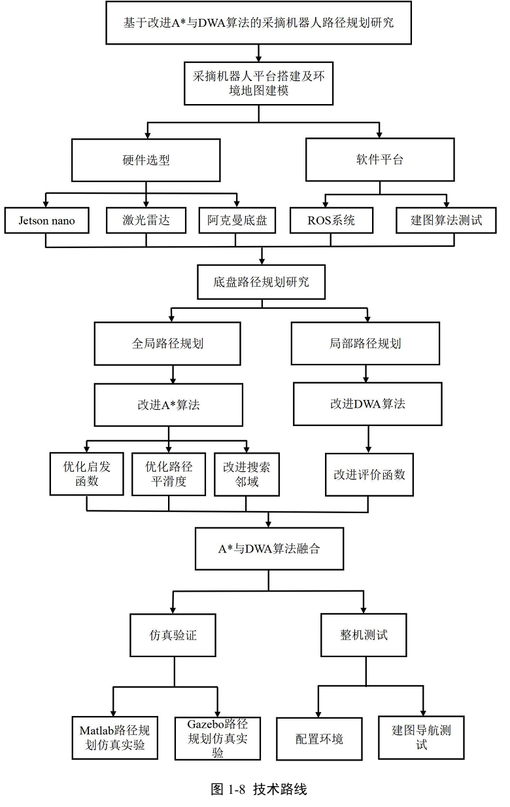
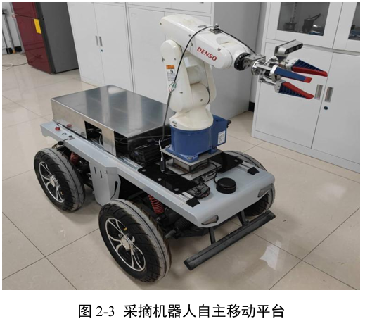

#### 一、摘要（解决了什么问题）

温室采摘机器人路径规划存在传统算法搜索冗余高、路径平滑性差、局部避障易陷入局部最优等问题，具体痛点及解决方案如下：

1. **核心痛点**：
    - 传统 A * 算法路径搜索冗余节点多、规划时间长，路径转折点多、平滑性不足，适配温室作业场景效果不佳；
    - 传统 DWA 算法易陷入局部最优（如凹形障碍物死区），缺乏全局方向引导，动态避障可靠性不足；
    - 缺乏适配温室环境的一体化软硬件平台，建图精度与算法实用性难以兼顾。

为此，研究提出三类解决方案：

- 方案一（软硬件平台搭建）：构建基于 ROS 系统的采摘机器人平台，硬件采用阿克曼底盘、Jetson Nano 运算平台及激光雷达，软件层面对比 Gmapping、Hector 等建图算法，最终选用 Gmapping 构建高精度栅格地图；
- 方案二（全局路径规划优化）：改进传统 A * 算法，通过优化启发函数（动态加权）、缩减搜索邻域（8 邻域改 5 邻域）、引入 Floyd 算法提取关键节点，减少冗余搜索与转折点；
- 方案三（算法融合避障）：改进 DWA 算法评价函数（增加障碍物距离权重），并与改进 A * 算法融合，以全局路径关键节点为中间目标，引导局部避障，避免局部最优。

#### 二、结论（效果怎么样）

1. **平台与建图可靠**：
    
    - 搭建的采摘机器人软硬件平台运行稳定，Gmapping 算法构建的栅格地图精度高，能准确还原温室环境障碍物分布，为路径规划提供可靠基础；
    - 基于 ROS+Gazebo 的仿真平台可精准模拟温室场景，支持算法验证与实际环境适配。
2. **改进算法性能显著提升**：
    
    - 改进 A * 算法优势明显，在 15×15、20×20、25×25 栅格地图中，路径长度平均缩短 3.3%，规划时间减少 15.56%，转折点数量下降 47.6%，搜索节点减少 24.46%；
    - 改进 DWA 算法避免了局部最优问题，与改进 A * 融合后，可有效规避静态障碍物（1-3 个）和动态障碍物（如移动行人），避障响应迅速。
3. **实际场景适配性良好**：
    
    - 仿真与真实温室环境测试表明，融合算法能规划出平滑路径，机器人行进稳定，无碰撞风险，满足采摘作业的路径效率与安全需求；
    - 算法在复杂温室场景（含凹形障碍物、动态干扰）中仍能高效完成导航与避障，实用性强。

#### 核心算法细节

研究围绕 “全局路径规划（改进 A * 算法）+ 局部路径规划（改进 DWA 算法）+ 算法融合” 展开，具体设计如下：

##### 一、改进 A * 算法（全局路径规划）

针对传统 A * 算法搜索冗余高、路径不平滑的问题，从**启发函数、搜索邻域、路径优化**三方面优化：

1. 动态加权启发函数设计

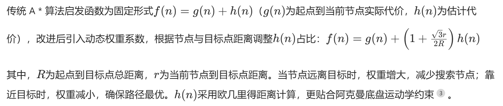

2. 搜索邻域缩减（8 邻域→5 邻域）

传统 8 邻域搜索存在大量冗余方向，改进后根据当前节点与目标点连线夹角\(\alpha\)，将 360° 划分为 8 个区间，每个区间仅保留 5 个有效搜索方向。例如：

- 当\(\alpha \in [22.5°,67.5°)\)时，保留 1、2、3、5、8 方向，舍弃 4、6、7 方向；
- 其他角度区间按类似规则筛选方向，减少 37.5% 的无效搜索，降低计算复杂度。

3. Floyd 算法优化路径平滑性

通过 Floyd 算法提取路径关键节点：遍历路径中相邻节点，若两点间无障碍物且连线符合安全距离，删除中间冗余节点。例如在 15×15 栅格地图中，传统 A * 算法转折点为 10 次，优化后降至 4 次，路径更顺直，减少机器人转弯频次。

##### 二、改进 DWA 算法（局部路径规划）

针对传统 DWA 易陷入局部最优的问题，从**评价函数、全局引导**两方面优化：

1. 评价函数权重调整

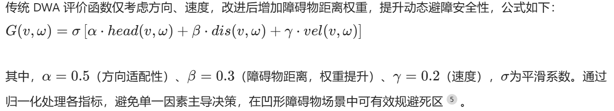

2. 全局路径引导机制

将改进 A * 算法规划的全局路径关键节点作为 DWA 算法的 “中间目标点”，而非直接以终点为目标。例如遇到动态障碍物时，DWA 以全局路径中的下一个关键节点为局部目标，避免因局部信息缺失陷入最优，确保局部路径始终贴合全局最优方向。

##### 三、改进 A * 与 DWA 融合算法

**1. 融合逻辑**

2. **全局路径生成**：改进 A * 算法根据起点、终点及 Gmapping 建图结果，生成含关键节点的全局路径；
3. **局部避障触发**：机器人沿全局路径行进，激光雷达检测到障碍物时，启动改进 DWA 算法；
4. **动态协同**：DWA 以全局路径关键节点为中间目标，实时调整线速度（0-1.5m/s）与角速度（0-0.2rad/s），避障完成后回归全局路径；
5. **路径重规划**：若障碍物持续阻挡，触发全局路径重算，更新关键节点。

**2. 仿真验证效果**

- 在含凹形障碍物场景中，传统 DWA 算法陷入死区的概率为 82%，融合算法通过全局引导，避障成功率达 100%；
- 在含 1-3 个静态障碍物的温室环境中，融合算法规划时间比传统 A*+DWA 组合缩短 21.3%，路径长度缩短 8.7%。

##### 四、算法适配的建图技术（Gmapping 算法）

为确保路径规划的环境准确性，对比 Gmapping、Hector、Karto 三种建图算法后，选择 Gmapping：

- 原理：基于粒子滤波融合激光雷达与里程计数据，通过改进提议分布减少粒子数量（仅需 50-100 个粒子），平衡精度与效率；
- 效果：在 8.8m 实际距离测试中，Gmapping 建图误差仅 0.09m，低于 Hector 算法的 0.12m，适配温室特征稀疏环境。

### 基于ROS的移动工业机器人定位算法分析_左培良

#### 一、摘要（解决了什么问题）

传统移动工业机器人定位算法存在定位精度不足、稳定性差，难以适应复杂工业场景的问题，具体痛点及解决方案如下：

1. **核心痛点**：
    - 传统定位算法在复杂工业环境中易受干扰，定位精度难以满足生产需求；
    - 单一传感器数据易因设备形变等因素导致定位偏差，缺乏可靠的数据融合机制；
    - 路径规划与定位结合不紧密，传统 A * 算法存在路径转折多、搜索效率低的问题。

为此，研究提出三类解决方案：

- 方案一（硬件与系统搭建）：基于 ROS 框架搭建移动机器人系统，采用两组（共 4 台）激光雷达安装在吊具两端，通过数据融合解决吊具形变导致的定位偏差；
- 方案二（环境建模适配）：选用栅格地图模型构建工业环境地图，该模型易构建、信息描述直观，适配面积小、环境杂乱的室内工业场景；
- 方案三（定位算法优化）：提出改进 A * 算法，优化评估函数中的实际代价项\(g(n)\)（引入安全距离规避障碍物），在启发式函数\(h(n)\)中加入父节点估计值，减少冗余节点，提升定位与路径规划的协同效果。

#### 二、结论（效果怎么样）

1. **定位精度与稳定性提升**：
    
    - 改进算法结合双组激光雷达数据融合，有效抵消吊具形变带来的误差，定位精度显著高于传统方法，健壮性更强；
    - 基于 ROS 的系统架构保障了传感器数据传输与算法执行的稳定性，适配复杂工业场景的干扰环境。
2. **路径规划与定位协同优化**：
    
    - 改进 A * 算法在 18m×18m 栅格地图中表现更优，路径转折次数从 10 次减少至 7 次，路径长度缩短至 26.35m，平均搜索时间从 289.32ms 降至 243.71ms；
    - 算法通过安全距离设置有效规避障碍物，同时减少冗余搜索，提升了定位与路径规划的整体效率。
3. **工业实用性达标**：
    
    - 实验验证表明，该算法满足工业生产对定位精度、实时性的要求，可广泛应用于工业生产线自动化操作与机器人导航场景；
    - 系统适配室内复杂工业环境，具备良好的自适应能力，为移动工业机器人的精准作业提供了可靠支撑。

---

## 1120

### 智能社区下基于RTK技术的室外机器人定位导航方法_桑森

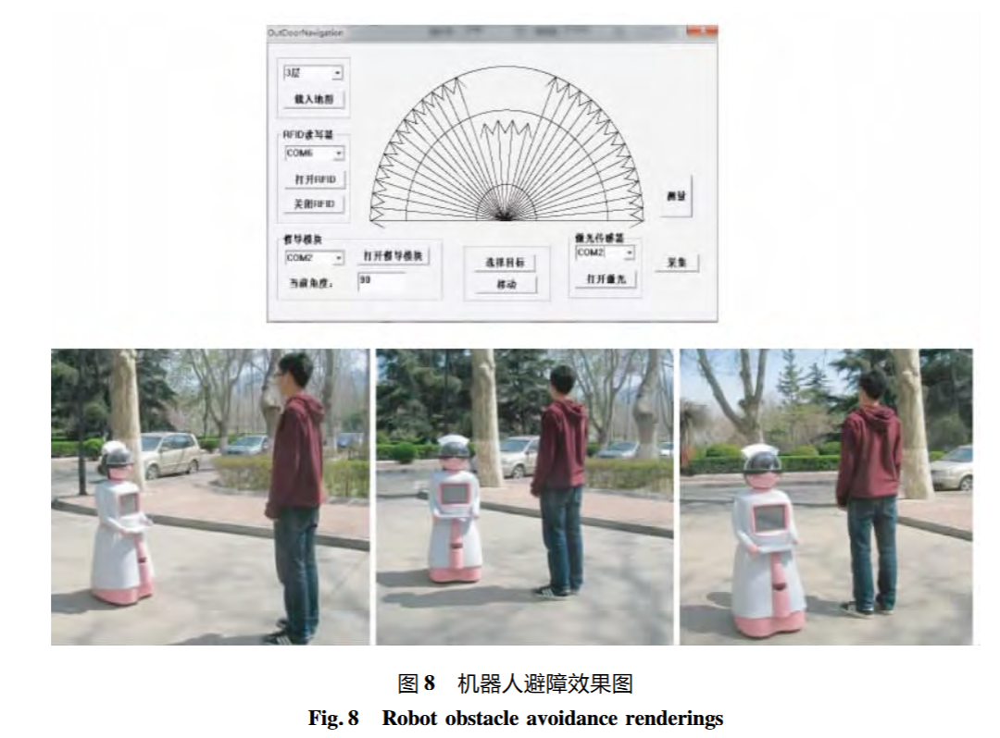
#### 一、摘要（解决了什么问题）

室内机器人定位导航技术难以迁移至室外，室外机器人面临定位精度不足、地图适配性差、避障覆盖不全等问题，具体痛点及解决方案如下：

1. **核心痛点**：
    - 室外环境复杂多变，传统定位技术误差大、有累积误差，无法满足精准导航需求；
    - 缺乏适配室外场景的地图构建方法，难以将通用二维地图转化为机器人可识别的导航地图；
    - 激光传感器传统安装方式检测范围有限，无法兼顾前方与下方区域，避障安全性不足。

为此，研究提出三类解决方案：

- 方案一（高精度定位）：采用 RTK（实时动态载波相位差分）技术，通过基站与流动站的载波相位差分处理，实现厘米级定位，消除累积误差；
- 方案二（地图转换适配）：借助 Google 二维地图，通过模式匹配与二值化处理，将机器人活动范围转换为栅格地图，再通过坐标转换实现 RTK 定位坐标与栅格地图坐标的匹配；
- 方案三（全方位避障）：将激光传感器倾斜向下安装，检测倾斜面，兼顾机器人前方与下方区域，划分感知警戒区、避障规划区、危险动作区三层避障逻辑，提升实时避障效果。

#### 二、结论（效果怎么样）

1. **定位精度达标**：
    
    - RTK 技术定位误差小且无累积误差，移动距离超 50m 时，误差仍控制在 0.12m 以内（平均约 0.10m），满足室外导航的精准定位需求；
    - 坐标转换后，RTK 定位坐标与栅格地图坐标匹配度高，实现机器人在栅格地图上的准确映射。
2. **地图与规划效率优化**：
    
    - 从 Google 二维地图转换而来的栅格地图信息直观、适配性强，为全局路径规划提供可靠基础；
    - 服务器端承担全局路径规划（A 星算法），总消耗时间仅 125ms，远快于机器人本体规划的 466ms，大幅提升规划效率。
3. **避障效果可靠**：
    
    - 激光传感器倾斜安装方式覆盖全面，能有效检测前方及下方障碍物，三层避障逻辑可根据障碍距离动态调整策略（警戒、规划避障、紧急制动）；
    - 实验验证机器人可顺利规避室外行人等障碍物，避障响应及时、安全性高。

### 室外清扫机器人导航算法研究_严一峰

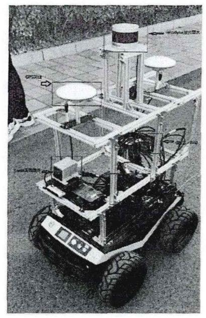
#### 一、摘要（解决了什么问题）

现有室外清扫机器人依赖预先绘制的高精地图，存在覆盖范围窄、应用受限的问题，且传统导航难以高效处理室外动态与静态障碍物，具体痛点及解决方案如下：

1. **核心痛点**：
    - 高精地图覆盖范围有限，绘制成本高，限制机器人在未测绘区域（如校园、小区）的应用；
    - 室外环境复杂，路缘检测精度不足，难以构建可靠的可通行边界；
    - 动态障碍物残影干扰、静态障碍物识别不全，影响路径规划准确性；
    - 轨迹规划需兼顾避障与行驶平滑性，传统算法难以平衡安全性与高效性。

为此，研究提出四类解决方案：

- 方案一（无高精地图导航）：基于 “互联网 +” 模式，通过高德地图 API 获取离散导航点，结合机器人实时位置校正，构建平滑行车参考线；
- 方案二（路缘检测与凸空间构建）：利用 Velodyne 3D 激光雷达提取路缘特征点并拟合曲线，以行车参考线为坐标轴构建 Frenet 坐标系下的路径规划凸空间；
- 方案三（局部可通行地图构建）：基于 Livox 固态激光雷达，通过点云聚类、动态障碍物残影滤除，识别静态与动态障碍物，更新凸空间边界；
- 方案四（轨迹规划优化）：采用路径与速度规划解耦算法，路径规划通过二次规划避开静态障碍物，速度规划结合动态规划与二次规划避让动态障碍物。

#### 二、结论（效果怎么样）

1. **无高精地图导航可行**：
    
    - 基于高德地图 API 与实时校正的行车参考线，在无高楼、树木遮挡场景下表现良好，无需高精地图即可提供可靠导航基础；
    - 路缘检测算法通过点云分割、特征提取与拟合，成功构建左右路缘曲线，为凸空间提供准确边界约束。
2. **障碍物识别与地图构建有效**：
    
    - 局部可通行地图能有效滤除动态障碍物残影，准确聚类静态障碍物（如路桩、垃圾桶），补充传统感知模块的识别盲区；
    - 基于规则的绕行策略可动态更新凸空间边界，确保路径规划避开静态障碍物。
3. **轨迹规划安全平滑**：
    
    - 路径规划通过二次规划生成曲率连续的平滑轨迹，速度规划经动态规划与二次规划优化，速度稳定在 2m/s 左右，加速度波动控制在 [-0.2, 0.2] m/s²，行驶平稳；
    - 校园简单道路场景实验验证，算法能成功避开动静态障碍物，轨迹符合机器人运动学约束，无碰撞风险。
4. **应用范围拓展**：
    
    - 算法摆脱对高精地图的依赖，可应用于未预先测绘的室外场景，显著扩大室外清扫机器人的适用范围；
    - 整体导航系统架构兼容 Apollo 平台，具备良好的扩展性与实用性。

### 基于RTK导航的室外自动巡检车控制系统的设计与研究_孙一鸣

==设计 STM32F429 单片机 + RK3399 处理器的双核心控制器，集成气体传感器、热成像仪等设备，实现环境采集与运动控制一体化。==
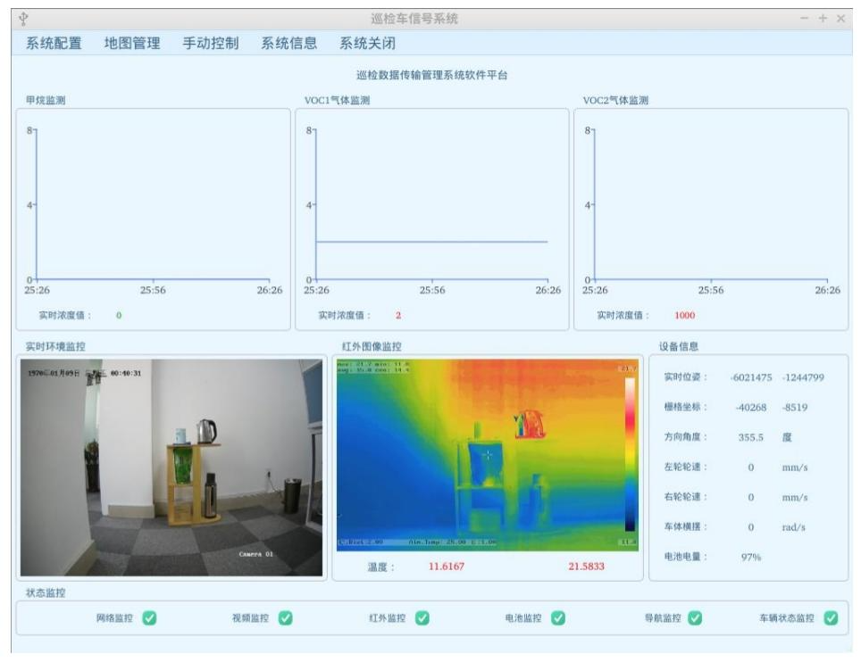

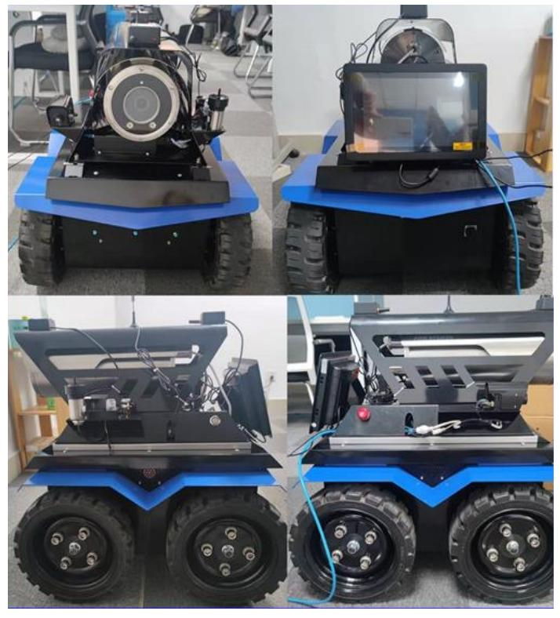
#### 一、摘要（解决了什么问题）

油罐区等高危室外场景中，人工巡检风险高、效率低，现有巡检机器人存在定位精度不足、路径规划适配性差、运动控制不平顺等问题，具体痛点及解决方案如下：

1. **核心痛点**：
    - 室外高危场景需精准导航定位，传统导航易受干扰，难以满足巡检作业精度要求；
    - 巡检路径复杂（含直线、转弯、原地旋转等），单一地图模式无法适配路径规划需求；
    - 四轮差速底盘运动控制难度大，易出现路径跟踪偏差，影响巡检稳定性；
    - 需实时采集环境信息（气体、温度等），缺乏一体化控制系统支撑。

为此，研究提出四类解决方案：

- 方案一（高精度导航定位）：采用双 RTK 接收机 + 基站的组合，结合数据滤波与平滑算法，精准计算机器人质心坐标与横摆角，提升定位抗干扰能力；
- 方案二（地图与路径规划）：融合栅格地图与拓扑地图，以任务站点为节点、路径为边构建导航地图，采用 A * 算法规划最优巡检路径；
- 方案三（运动控制优化）：建立四轮差速底盘运动学模型，基于预瞄点方法计算位姿偏差，通过纵向（加速减速）、横向（偏差修正）及原地旋转控制，实现平稳路径跟踪；
- 方案四（一体化控制系统）：设计 STM32F429 单片机 + RK3399 处理器的双核心控制器，集成气体传感器、热成像仪等设备，实现环境采集与运动控制一体化。

#### 二、结论（效果怎么样）

1. **导航定位精度达标**：
    
    - 双 RTK 导航结合滤波算法，定位稳定性强，有效降低信号干扰影响，为路径规划提供可靠位置基础；
    - 地图融合方案适配复杂巡检场景，A * 算法能快速规划出无碰撞的最优路径，适配 “Z” 字、矩形、“8” 字等多种路径需求。
2. **运动控制平稳精准**：
    
    - 四轮差速运动模型与预瞄点控制结合，路径跟踪效果良好，关键站点最大位置偏差 82mm，最大横摆角偏差 2.7°，均值偏差分别为 38.0mm 和 1.2°，满足巡检精度要求；
    - 纵向与横向控制协同，实现加速、减速、转弯、原地旋转等动作的平顺切换，无明显闯动或偏差累积。
3. **系统功能完善且实用**：
    
    - 一体化控制系统成功集成环境采集（甲烷、VOC 气体、温度）、视频监控、导航定位、运动控制等功能，适配油罐区高危场景需求；
    - 软硬件运行稳定，样车测试中可完整跟踪预设路径，环境数据采集实时准确，能替代人工完成高危场景巡检任务。

### 基于混合导航方式的AGV室外导航系统研究_王岚颢

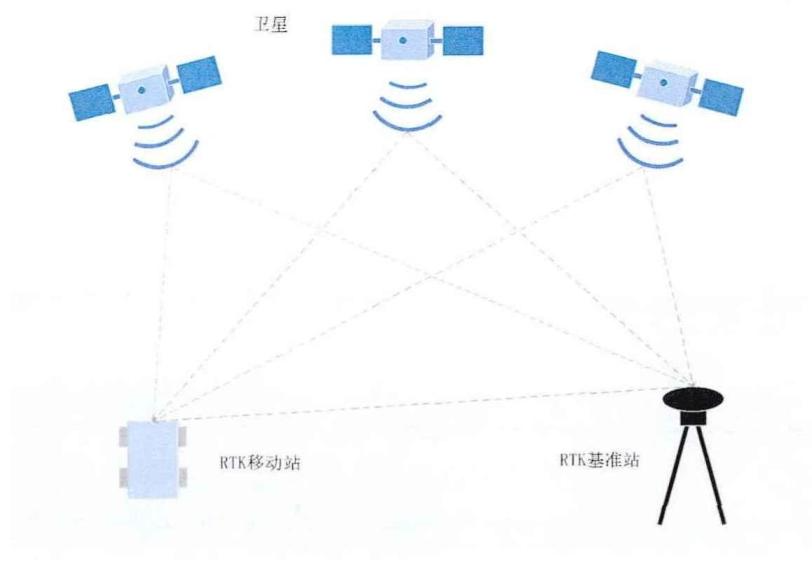

#### 一、摘要（解决了什么问题）

工业无人机室外回收依赖人工或专用机场，存在成本高、安全性低的问题，且 AGV 室外导航面临单传感器定位局限、视觉识别误检、RTK 信号遮挡等痛点，具体解决方案如下：

1. **核心痛点**：
    - 单源传感器（如 RTK、轮式里程计）定位在室外环境中鲁棒性差，易受干扰导致定位偏差；
    - 传统视觉定位算法（如 AprilTag）易受环境干扰产生误识别，影响精细定位精度；
    - RTK 天线被无人机遮挡时定位失效，无法完成近距离托举对准；
    - 室外光线变化（强光、弱光）影响视觉导航稳定性，缺乏适配方案。

为此，研究提出四类解决方案：

- 方案一（混合导航架构）：将 AGV 导航分为粗定位（寻找无人机）和精细定位（托举对准）两阶段，分别采用组合导航与视觉导航，实现无缝切换；
- 方案二（粗定位优化）：融合 RTK 与轮式里程计数据，提出基于模糊控制（FC）的自适应 EKF 算法（FCEKF），解决观测噪声时变问题；
- 方案三（精细定位优化）：采用 AprilTag 视觉导航，提出基于 RANSAC + 最小二乘（RLS）的改进算法，滤除误匹配点，提升识别准确性；
- 方案四（环境适配设计）：视觉模块加入近红外 LED 光源，适配强光、弱光环境，同时采用多 Tag 标志设计，增强遮挡场景下的鲁棒性。                                                         

#### 二、结论（效果怎么样）

1. **粗定位精度显著提升**：
    
    - FCEKF 算法使组合导航的定位精度和定向精度分别提升约 66.7% 和 50%，定位偏差控制在 0.02m 左右，方向角偏差约 1°，满足远距离寻路需求；
    - 轮式里程计与 RTK 互补，有效避免 RTK 信号丢失时的导航瘫痪，增强系统鲁棒性。
2. **精细定位准确可靠**：
    
    - 改进 RLS-AprilTag 算法误点去除率达 87.5%，精细定位后位置偏差缩小至 3mm 以内，方向角偏差约 0.7°，实现托举推杆与无人机卡扣精准对准；
    - 近红外 LED 光源适配不同光线环境，多 Tag 标志设计在部分遮挡时仍能稳定识别，视觉导航鲁棒性强。
3. **系统整体性能优异**：
    
    - 混合导航架构无缝衔接两阶段导航，AGV 可自主完成无人机寻找、对准、托举全流程，无需人工干预；
    - 实地测试中，系统运行成功率达 99%，适配黄河巡检等室外复杂场景，已成功应用于实际项目。
4. **应用价值突出**：
    
    - 替代传统无人机回收方式，降低机场建设成本（节省约 63% 占地面积），提升回收安全性；
    - 导航方案通用可迁移，适用于各类室外 AGV 精准作业场景。

### VIG-SLAM_基于自适应多传感器融合的SLAM算法_黄超

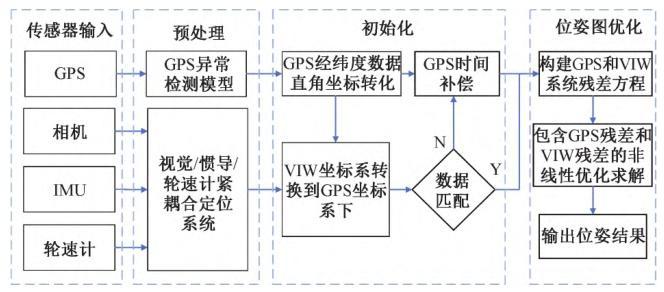

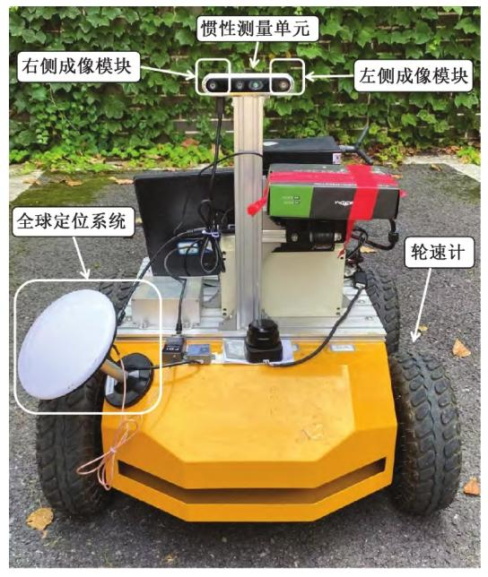
#### 一、摘要（解决了什么问题）

传统 SLAM 算法在复杂场景中存在定位精度不足、鲁棒性差的问题，具体痛点及解决方案如下：

1. **核心痛点**：
    - 仅依赖视觉惯性里程计（VIO）的 SLAM 算法，长距离移动时累积误差显著，定位精度下降；
    - GPS 信号易受遮挡、多路径效应干扰，在城市峡谷、隧道等场景中定位不稳定，且与其他传感器数据存在时间戳不匹配问题；
    - 缺乏对 GPS 数据质量的动态评估与异常检测，低质量数据会降低融合定位效果。

为此，研究提出三类解决方案：

- 方案一（GPS 数据预处理优化）：构建 GPS 精度因子模型，引入大气延迟和多路径效应修正项，结合模糊逻辑与支持向量机（SVM）设计异常检测机制，筛选高质量 GPS 数据；
- 方案二（时间差补偿策略）：提出改进的自适应时间差补偿方法，利用轮速计线速度信息同步 GPS 与视觉 / 惯导 / 轮速计紧耦合系统（VIW）数据，动态调整 GPS 信号权重；
- 方案三（全局位姿图优化融合）：构建含 GPS 约束的全局位姿图优化模型，将 GPS 全局定位信息与 VIW 局部定位信息互补，通过非线性优化实现大场景鲁棒定位。

#### 二、结论（效果怎么样）

1. **定位精度显著提升**：
    
    - 相比主流视觉 SLAM 算法（如 Vins-fusion、Vins-mono），VIG-SLAM 算法平均定位精度至少提高 15%；
    - 在 KAIST 数据集测试中，长路径（11.47km）场景下 RMSE 仅 1.18m，远优于 Vins-fusion 的 3.23m，有效抑制累积漂移。
2. **鲁棒性适配复杂场景**：
    
    - GPS 异常检测机制与动态权重调整策略，使算法在信号遮挡、多路径干扰环境中仍能稳定工作，避免低质量数据影响；
    - 时间差补偿策略解决了多传感器异步问题，保障了数据融合的时间同步精度。
3. **大场景定位表现优异**：
    
    - 全局位姿图优化框架结合局部与全局约束，在大范围室外实验中，轨迹与真实路线一致性高，无明显漂移；
    - 适配城市峡谷、开放区域、动态干扰等多种场景，相比 RTK 定位，有效克服了信号丢失导致的轨迹不连续问题。

## 1121

### 基于动态点实时滤除与回环优化的SLAM方法_张硕
#### 一、摘要（解决了什么问题）

传统 SLAM 算法在动态场景中易受干扰导致地图失真，且定位漂移较大时回环易失效，具体痛点及解决方案如下：

1. **核心痛点**：
    - 动态物体（行人、车辆）产生的干扰点云导致地图出现 “鬼影”，现有动态点滤除方法实时性差或计算开销大；
    - 回环检测依赖半径搜索法，在定位漂移较大时易失效，且缺乏粗位姿估计能力，回环配准速度慢；
    - 地面点与非地面点混杂，影响动态点检测精度，增加计算负载。

为此，研究提出三类解决方案：

- 方案一（地面分割优化）：基于栅格特征分析实现实时地面分割，通过高度差阈值区分地面与非地面点，降低动态点滤除计算负载；
- 方案二（动态点实时滤除）：构建占有率栅格地图，通过栅格占有值统计（增长 / 衰减速度动态调整），实时判断并滤除动态点云；
- 方案三（回环检测优化）：采用二进制三角形描述符（BTC）替代半径搜索法，通过几何特征匹配实现回环初判并生成粗匹配位姿，作为迭代最近点（ICP）算法初始值，加速点云配准。

#### 二、结论（效果怎么样）

1. **动态点滤除效果显著**：
    
    - 地面分割与动态点滤除总耗时较现有方法降低约 57.5%，64 线激光雷达输入下总耗时仅 33ms，满足实时性要求；
    - 能有效滤除行人、车辆等动态干扰，生成无 “鬼影” 的纯净静态地图，提升建图可靠性。
2. **回环检测性能提升**：
    
    - 回环精度、全局位置偏差、回环耗时三项指标较现有改进方法分别提升约 6.5%、6.3% 和 20.7%；
    - BTC 描述符对刚体变换具有不变性，在大范围漂移场景下仍能稳定触发回环，粗匹配位姿使 ICP 收敛更快，避免局部最优。
3. **定位与建图整体优化**：
    
    - 全局定位绝对平移误差（ATE）显著降低，在大范围漂移场景（BIT-2 数据集）中，ATE 从 9.322m 降至 0.692m，定位鲁棒性大幅提升；
    - 适配动态室外场景，支持非结构化大范围环境的实时定位与建图，已通过实车（松灵 Scout V2 底盘）与公开数据集（KITTI）验证。

### 激光雷达与IMU融合的草原风场机器人定位方法_寇志伟

==如果以后在建图时IMU、激光雷达退化严重就可以考虑使用这篇==
#### 一、摘要（解决了什么问题）

草原风场地表崎岖、路面不平，导致激光雷达点云畸变严重，且传统定位算法易出现累积误差，难以满足巡检机器人高精度定位需求，具体解决方案如下：

1. **核心痛点**：
    - 草原风场环境复杂，激光雷达采集点云时易因载体运动产生畸变，影响定位精度；
    - IMU 与激光雷达采样频率不一致，数据融合时易出现时间同步问题；
    - 传统融合算法位姿估计误差较大，累积误差影响长距离巡检可靠性。

为此，研究提出三类解决方案：

- 方案一（IMU 预积分处理）：对 IMU 数据进行预积分，得到时间段内的位姿状态量，减少重复计算，提升数据处理效率；
- 方案二（点云畸变矫正）：利用 IMU 预积分结果，通过线性插值解算激光雷达点云姿态，实现点云运动补偿与畸变矫正；
- 方案三（ESKF 融合定位）：设计基于误差状态卡尔曼滤波器（ESKF）的 LiDAR/IMU 融合算法，以误差量为系统状态量，为回环检测提供动态阈值，优化位姿估计精度。

#### 二、结论（效果怎么样）

1. **点云畸变矫正有效**：
    
    - 基于 IMU 预积分的插值方法成功修正激光雷达点云畸变，解决了复杂地形下点云失真问题，为后续定位提供高质量数据；
    - 预积分处理减少了 IMU 数据重复积分的计算量，提升了系统实时性。
2. **定位精度显著提升**：
    
    - 在 KITTI07 数据集测试中，绝对位姿误差最大值 1.035m、均值 0.574m，较 LOAM 算法分别提升 41.16%、27.62%；
    - 在 KITTI09 数据集测试中，相对位姿误差最大值 0.418m，较 LOAM 算法、LIO-SAM 算法分别提升 81.07%、94.44%，误差波动幅度更小。
3. **适配草原风场场景**：
    
    - 算法通过 ESKF 动态阈值优化回环检测，有效抑制累积误差，满足长距离巡检定位需求；
    - 性能优于传统 LOAM、LIO-SAM 算法，能适应草原风场崎岖地形与复杂环境，为巡检机器人自主定位提供可靠支撑。

### 一种高动态场景下视觉激光融合SLAM系统_周云水
#### 一、摘要（解决了什么问题）

高动态场景中，单一传感器 SLAM 系统易受动态障碍物干扰，导致定位建图精度下降甚至失效，且激光与视觉数据存在跨模态匹配难、语义信息利用不足等问题，具体解决方案如下：

1. **核心痛点**：
    - 高动态场景中动态障碍物（车辆、行人）会干扰特征点匹配，导致地图失真、定位漂移；
    - 激光雷达点云稀疏、视觉传感器易受环境影响，单一传感器难以兼顾精度与鲁棒性；
    - 激光与视觉跨模态数据匹配难度大，语义信息未充分利用，动态点检测准确性不足。

为此，研究提出三类解决方案：

- 方案一（跨模态融合里程计）：融合稀疏激光点云与稠密图像数据，利用激光高精度测距特性和图像丰富信息，通过 2D-3D 特征联合优化求解位姿，提升里程计精度；
- 方案二（语义分割辅助动态检测）：采用 BiSeNetV2 实时语义分割网络，提取潜在动态区域，结合腐化操作优化分割结果，初步筛选动态特征点；
- 方案三（多阶段动态点滤除）：通过帧间对极几何约束快速过滤动态特征，再利用多帧龙伯格观测器跟踪特征运动状态，实现动态点精准滤除与静态点回添。

#### 二、结论（效果怎么样）

1. **动态点滤除精准高效**：
    
    - BiSeNetV2 语义分割模型推理耗时小于 15ms，精度下降率低于 3%，满足实时性要求；
    - 多阶段动态检测策略有效区分动静态特征，误检率低，能精准滤除动态障碍物干扰。
2. **定位建图精度显著提升**：
    
    - 在 nuScenes 数据集测试中，相较于无语义过滤的里程计，系统轨迹均方根误差（RMSE）平均提升 53.5%；
    - 融合激光与视觉优势，定位精度优于传统 ORBSLAM3、V-LOAM 等算法，在多动态障碍物场景中表现稳定。
3. **系统鲁棒性与实时性兼顾**：
    
    - SLAM 前端帧吞吐能力达 25fps 左右，整体运算平均耗时 37.76ms，适配自动驾驶实时需求；
    - 能适应城市道路等复杂高动态场景，有效应对动态干扰、光线变化等问题，定位建图鲁棒性强。

### 基于STM32的农田地膜捡拾履带式机械臂机器人设计与实现_张曼玉
#### 一、摘要（解决了什么问题）

传统农田地膜捡拾设备存在作业效率低、智能化程度不足、复杂环境适应性差，且高温高湿工况下热管理失效导致故障率高的问题，具体解决方案如下：

1. **核心痛点**：
    - 农田地膜与土壤、残茬难以区分，传统识别方法准确率低，含杂率高；
    - 高温高湿、多尘、振动等复杂农田工况，导致设备散热不佳、故障率高，连续作业能力弱；
    - 单一传感器定位精度不足，机械臂抓取成功率低，适配不同农田地形和地膜状态的能力差。

为此，研究提出三类解决方案：

- 方案一（智能识别与控制）：基于 STM32F407 芯片，集成改进 YOLOv5-MobileNetV3 模型和多光谱相机，实现地膜精准识别与材质分类，结合 A*+DWA 路径规划算法提升垄间避障能力；
- 方案二（多传感器协同）：融合激光雷达、多光谱相机与 IMU 数据，通过卡尔曼滤波实现三维地形建模与机械臂位姿补偿，适配复杂农田环境；
- 方案三（多模态热管理）：设计液冷 - 风冷协同控制系统，包含主控单元动态液冷、伺服电机智能风冷、电池组独立温控三回路，适配高温高湿工况。

#### 二、结论（效果怎么样）

1. **识别与作业精度显著提升**：
    
    - 多光谱双波段融合算法使地膜识别准确率达 95%，材质分类准确率 96.5%，较传统 RGB 方法提升 41%；
    - 多传感器协同使甘蔗残茬密集场景下地膜抓取成功率从 71% 提升至 94%，含杂率控制在 4% 以下。
2. **热管理与设备可靠性优化**：
    
    - 45℃环境下可连续运行 9 小时，主控芯片温度稳定在 65±2℃，亩均散热功耗降低 39%；
    - 设备故障率下降 58%，维护周期延长至 48 小时 / 次，防护等级达 IP68，适配高温高湿、多尘工况。
3. **作业效率与适应性增强**：
    
    - 单机日均作业面积达 8-12 亩，较人工捡拾效率提高 11 倍，较初代机型提升 50%；
    - 支持 - 10℃至 45℃全温域运行，垄沟起伏 ±25cm 工况下仍能维持精准作业，适配甘蔗田、水稻田等多种场景。

### 基于融合感知的自动驾驶汽车AEB控制研究_高超俊

#### 一、摘要（解决了什么问题）

现有自动紧急制动（AEB）系统在复杂场景中存在障碍物误识别、未充分考量前车加速度干扰及控制精度不足的问题，具体解决方案如下：

1. **核心痛点**：
    - 单一传感器感知易受光照、遮挡等干扰，障碍物识别准确率低，影响碰撞风险判断；
    - 传统控制策略未充分考虑前车加速度变化，制动介入时机与强度不合理，兼顾安全性与舒适性不足；
    - 制动执行环节存在非线性偏差，实际减速度与期望减速度不符，控制精度欠缺。

为此，研究提出三类解决方案：

- 方案一（融合感知检测）：融合视觉（改进 YOLOv11）与激光雷达数据，通过三维目标同步验证技术，结合光照自适应置信度校准，提升复杂场景下障碍物识别准确性；
- 方案二（分级 MPC 控制）：设计基于模型预测控制（MPC）的分级制动策略，考量前车加速度干扰，根据碰撞时间（TTC）动态调整制动强度（一级 - 4m/s²、二级 - 8.5m/s²）；
- 方案三（PID 执行控制）：采用 PID 控制器调节制动器主缸压力，补偿纵向动力学非线性偏差，确保实际减速度精准跟踪期望减速度。

#### 二、结论（效果怎么样）

1. **感知识别精度提升**：
    
    - 融合感知方法在不同距离（20-50m）和车速（5-15m/s）下，障碍物识别平均精度较单一 YOLOv11 提升 3% 左右，能准确估算相对速度与 TTC；
    - 适配光照突变、部分遮挡等复杂场景，感知鲁棒性显著增强。
2. **制动控制性能优异**：
    
    - 分级 MPC 策略在前车静止、匀速、减速三类工况下，均实现 100% 减速率，成功避撞，与前车保持安全距离（最小 7.2m）；
    - 相较于传统 TTC 控制策略，制动介入时机更精准，一级制动时长更合理，车速衰减平稳，兼顾安全性与驾乘舒适性。
3. **极端场景适配性强**：
    
    - 在前车急减速（-6m/s²）、自车高速（25m/s）等极端工况下，仍能稳定将车辆刹停，而传统控制策略减速率仅 63.1%，无法完全避撞；
    - PID 执行控制器有效补偿非线性偏差，使实际制动加速度精准跟踪期望输出，控制精度满足 AEB 系统性能要求。

## 1122
### 交叉注意力驱动的室外双目视觉SLAM稠密建图算法研究_王立勇
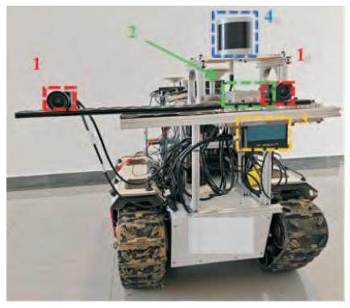

#### 一、摘要（解决了什么问题）

传统视觉 SLAM 算法依赖稀疏重建，环境信息不足，难以满足自主导航与避障对高精度环境感知的需求，具体解决方案如下：

1. **核心痛点**：
    - 稀疏重建仅获取少量特征点，地图细节缺失，无法提供充足环境信息；
    - 传统立体匹配算法在无纹理区域、遮挡场景下匹配精度低，鲁棒性不足；
    - 室外场景光照变化、视角差异大，导致位姿估计易漂移，建图一致性差。

为此，研究提出三类解决方案：

- 方案一（交叉注意力立体匹配）：在 ORB-SLAM3 框架基础上，引入交叉注意力机制，增强双目图像间的特征关联性，提升不同视角下的匹配精度；
- 方案二（多步骤稠密建图）：通过立体匹配生成视差图，结合相机内外参数计算深度数据，融合彩色信息生成彩色深度点云，经滤波、拼接优化建图质量；
- 方案三（位姿优化与回环修正）：基于 ORB 特征提取与匹配，结合三角化生成稀疏地图点，通过 BA 优化与回环检测校正位姿漂移，保证地图全局一致性。

#### 二、结论（效果怎么样）

1. **立体匹配精度显著提升**：
    
    - 在 KITTI 数据集和实车实验中，深度估计相对误差均低于 10%（分别为 8.873%、8.286%），显著优于传统 Elas 算法和 RAFT-Stereo 算法；
    - 对无纹理区域、遮挡场景适应性强，匹配鲁棒性大幅提升。
2. **位姿估计精准稳定**：
    
    - KITTI 数据集上绝对轨迹误差（ATE）为 0.585m，绝对位姿误差均值（APE-Avg）为 0.459m；实车实验中 ATE 为 1.235m，APE-Avg 为 0.598m，精度优于 Vins-Fusion、AirSlam 等对比算法；
    - 有效抑制位姿漂移，在光照变化、视角差异大的室外场景中仍保持稳定。
3. **稠密建图质量优异**：
    
    - 90% 以上的稠密点云误差在 0.5m 以内，KITTI 数据集和实车实验中 0.5m 范围内点云重合度分别达 93.921%、92.902%；
    - 生成的地图结构完整、细节清晰，能精准还原场景几何形状与空间布局，满足自主导航与避障需求。

### 基于卡尔曼滤波的室外移动机器人建图与定位技术研究_廖雅曼

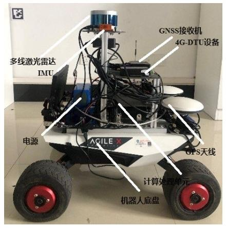

#### 一、摘要（解决了什么问题）

室外移动机器人定位与建图面临激光 SLAM 累积误差大、计算耗时长，以及激光初始化定位难、GNSS 信号易受遮挡中断的问题，具体解决方案如下：

1. **核心痛点**：
    - 激光 SLAM 单独工作时，累积误差随运行时间增大，建图精度下降，且点云匹配计算量大，实时性差；
    - 激光初始化定位对初始位姿要求高，单一传感器难以实现精准初始化；
    - 室外遮挡环境中 GNSS 信号易中断，仅依赖 IMU 会因连续积分产生累积误差，影响定位连续性。

为此，研究提出三类解决方案：

- 方案一（IEKF 激光惯导耦合建图）：构建基于迭代扩展卡尔曼滤波（IEKF）的激光惯导耦合 SLAM 算法，用 ikd-Tree 存储点云提升匹配效率，结合回环检测与因子图优化（融合 IMU 积分、激光里程计、回环因子），消除累积误差；
- 方案二（关键帧辅助初始化定位）：利用 GNSS 提供初步位姿，查找最近关键帧进行点云匹配，解决激光初始化定位难题，实现精确全局初始化；
- 方案三（自适应卡尔曼滤波融合定位）：采用自适应卡尔曼滤波融合 GNSS 与 IMU 数据，用 GNSS 修正 IMU 累积误差，用 IMU 恢复 GNSS 不稳定值，保障遮挡场景下的高频高精定位。

#### 二、结论（效果怎么样）

1. **建图精度与实时性兼顾**：
    
    - 在 M2DGR 数据集上，建图均方根误差较 ALOAM、LIO-SAM 等算法降低 6.75%~21.74%，绝对位姿误差（APE）平均值低至 0.22m，建图轨迹与真值贴合度高；
    - 单帧平均耗时≤19ms，ikd-Tree 结构大幅减少近邻点查找时间，兼顾实时性与精度，适配室内外多场景。
2. **初始化定位稳定高效**：
    
    - 在距离地图原点 100~320m 的不同环境（空旷、树荫遮挡）中，初始化定位成功率达 80%~100%，平均耗时 0.016~0.083s，满足实际应用的实时性与稳定性需求。
3. **融合定位鲁棒性强**：
    
    - 长直线行驶实验中，不同速度（0.2~0.7m/s）、不同方向下，定位误差均控制在厘米级（X/Y 轴最大误差≤0.05m）；
    - GNSS 遮挡场景下，融合定位最大误差 1.118m、平均误差 0.396m，远优于单一 GNSS 定位（最大误差 4.682m、平均误差 1.783m），有效应对信号中断问题。

### 室外动态环境下无人车定位和建图算法研究_马强

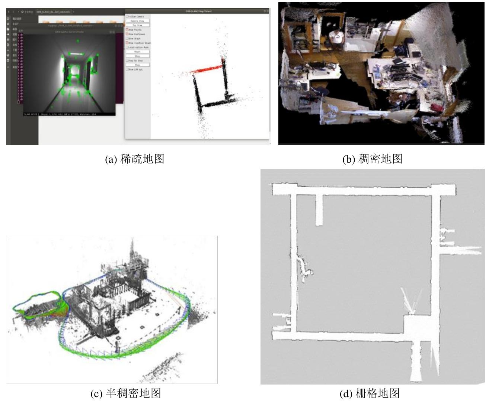

#### 一、摘要（解决了什么问题）

室外动态环境中，视觉 SLAM 存在动态物体干扰定位精度、大范围场景下轨迹漂移、无法构建稠密地图的问题，具体解决方案如下：

1. **核心痛点**：
    - 动态物体（行人、车辆）会干扰特征匹配，导致位姿估计误差增大，系统鲁棒性下降；
    - 室外大范围场景下，视觉 SLAM 累计误差引发轨迹漂移，定位精度降低；
    - ORB-SLAM3 仅能构建稀疏地图，无法满足自主导航、避障等对环境细节的需求。

为此，研究提出三类解决方案：

- 方案一（动态特征剔除）：引入 TensorRT 加速的 YOLOv5 模型进行实时目标检测，结合光流跟踪与对极约束的两阶段校验，精准剔除动态特征点，保留静态特征参与位姿估计；
- 方案二（GPS/RTK 松耦合优化）：将 GPS/RTK 的绝对位置观测与视觉里程计（VO）的局部位姿融合，通过坐标初始化对齐与全局位姿图优化，抑制轨迹漂移；
- 方案三（稠密建图）：集成 ZoeDepth 单目深度估计网络，生成关键帧深度图，结合优化后的全局位姿构建稠密点云，经滤波、动态点云去除及回环调整，生成全局静态稠密地图。

#### 二、结论（效果怎么样）

1. **动态环境定位精度提升**：
    
    - TUM 数据集高动态序列中，位姿估计绝对轨迹误差（ATE）均方根误差（RMSE）从分米级降至厘米级，提升率超 90%；
    - KITTI 数据集动态场景中，有效剔除移动目标干扰，定位精度较 ORB-SLAM3 提升 5.8%-32.3%，单帧跟踪耗时 33.2ms，兼顾实时性与鲁棒性。
2. **大范围轨迹漂移抑制**：
    
    - KITTI 长距离序列（如 01 序列，2.45km）中，ATE 的 RMSE 从 13.204m 降至 1.0409m，提升率 92.1%；
    - 与 VINS-Fusion 相比，在无回环的大范围场景中定位精度更优，轨迹稳定性更强。
3. **稠密建图效果优异**：
    
    - 基于 ZoeDepth 生成的深度图精度优于 RGBD 相机和传统双目匹配，构建的稠密地图能清晰还原道路、建筑物等环境细节；
    - 经动态点云剔除与回环调整，地图无明显重影和错位，在 KITTI 数据集及校园真实场景中，均能生成全局一致的静态稠密点云地图，满足导航需求。

### 激光-视觉-惯导融合的室外移动机器人定位建图研究_刘辉

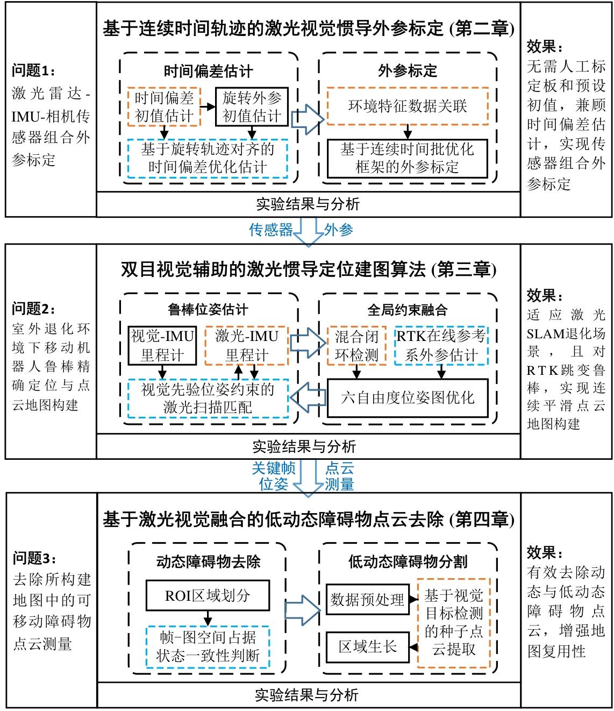
#### 一、摘要（解决了什么问题）

激光 - 视觉 - 惯导融合的室外移动机器人定位建图面临传感器外参标定繁琐、结构稀疏场景下位姿估计失效、地图中可移动障碍物影响复用的问题，具体解决方案如下：

1. **核心痛点**：
    - 激光雷达 - IMU - 相机异源传感器外参标定依赖人工标定板和初值猜测，操作繁琐且适用性受限；
    - 激光扫描匹配在结构稀疏场景下缺乏有效约束，易导致位姿估计失效，且长期运行存在轨迹漂移；
    - 地图中动态障碍物（行人、车辆）和低动态障碍物（静止车辆、自行车）点云混杂，降低地图复用可靠性。

为此，研究提出三类解决方案：

- 方案一（无标定板外参标定）：基于连续时间轨迹，通过运动相关性分析与旋转轨迹对齐估计时间偏差和外参初值，结合自然环境特征关联与批优化框架，实现无需人工标定板和初值的传感器外参标定；
- 方案二（鲁棒位姿估计）：提出双目视觉辅助的激光惯导 SLAM 算法，融合双目视觉惯导里程计提供的先验位姿约束与激光结构特征约束，同时维护激光 - IMU 里程计应对视觉失效场景；通过位姿图优化融合里程计、闭环及 RTK 约束，在线估计参考系外参，抑制轨迹漂移；
- 方案三（可移动障碍物去除）：采用两阶段算法，基于帧 - 图空间占据一致性剔除动态障碍物点云，结合视觉目标检测与区域生长算法分割低动态障碍物点云，生成纯净静态地图。

#### 二、结论（效果怎么样）

1. **外参标定精准高效**：
    
    - 时间偏差估计精度达 1.5ms，旋转外参角度误差在 1° 以内，平移外参标准差最低 0.004m，与开源算法精度相当；
    - 无需人工标定板和初值猜测，适配室内外多场景，显著提升标定灵活性与适用性。
2. **位姿估计鲁棒精确**：
    
    - 结构稀疏场景下，相对位姿误差（RPE）均方根误差（RMSE）低至 0.048m，较 A-LOAM、LIO-SAM 等算法误差降低 42.36%~81.53%，可稳定运行；
    - 融合 RTK 后，绝对轨迹误差（ATE）RMSE 最低 0.08m，有效抑制轨迹漂移，且对 RTK 信号 “跳变” 鲁棒，构建的地图更平滑。
3. **地图复用性显著提升**：
    
    - 动态障碍物点云拒绝率最高 91.8%，静态点云保留率达 95.3%，综合性能优于 OctoMap、ERASOR 等开源算法；
    - 低动态障碍物分割精确率（P）达 94.4%、召回率（R）达 93.3%，能有效分离静态与可移动障碍物点云，生成可靠复用的静态地图。

### LOAM：实时激光雷达里程计与地图构建
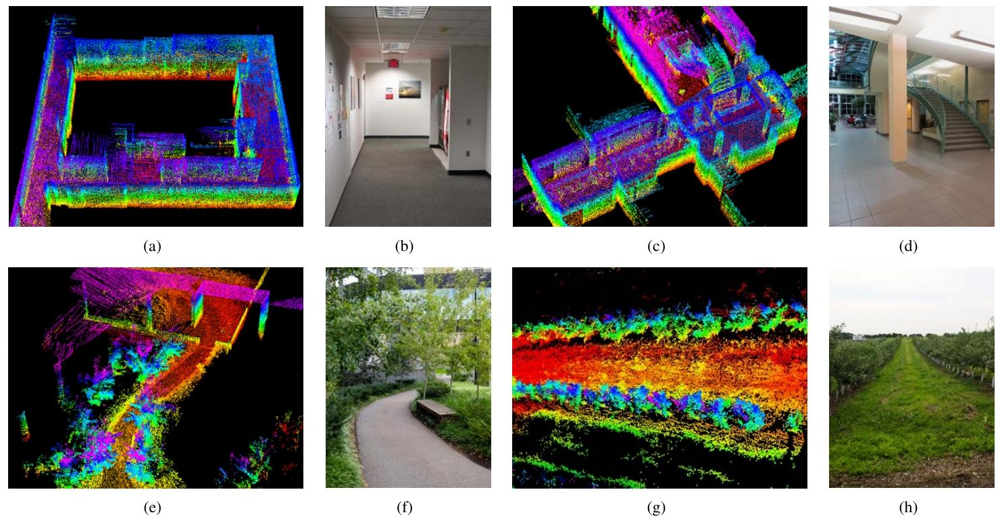

#### 一、摘要（解决了什么问题）

移动二维激光雷达建图面临点云运动畸变、实时性与精度难以兼顾、累积漂移的问题，具体解决方案如下：

1. **核心痛点**：
    - 激光雷达移动时，不同时间接收的测距数据会因运动产生畸变，导致点云配准错位；
    - 传统建图需离线批处理，难以实时输出结果，且同步优化大量变量导致计算复杂；
    - 里程计积分易产生累积漂移，影响地图整体精度。

为此，研究提出两类解决方案：

- 方案一（双算法拆分问题）：将 SLAM 拆分为高频低精度的里程计与低频高精度的建图算法。里程计（10Hz）估计激光雷达速度，校正点云畸变；建图算法（1Hz）精细匹配点云，构建高精度地图；
- 方案二（特征匹配优化）：提取边缘点和平面点作为特征，分别匹配边缘线与平面片，通过 Levenberg-Marquardt 方法求解运动参数，结合鲁棒拟合降低离群点影响；可选融合 IMU 数据，进一步消除非线性运动干扰。

#### 二、结论（效果怎么样）

1. **实时性与畸变校正效果优异**：
    
    - 双算法并行运行，占用双核处理器即可实现实时处理，满足移动机器人实时建图需求；
    - 有效校正点云运动畸变，室内外场景中均能生成连贯、无明显错位的三维地图。
2. **定位与建图精度高**：
    
    - 室内环境运动估计相对漂移约 1%（走廊场景 58m 距离误差 0.9%），室外环境约 2.5%（果园场景 52m 距离误差 2.3%）；
    - KITTI 里程计基准测试中排名第一，平均位置误差仅为行进距离的 0.88%，优于同期立体视觉里程计方法。
3. **场景适应性与扩展性强**：
    
    - 适配室内走廊、门厅及室外植被道路、果园等场景，匹配误差分布合理，人工环境精度高于自然环境；
    - 融合 IMU 后可应对快速运动与非线性姿态变化，地图边缘清晰度提升，运动估计误差进一步降低（如走廊场景误差从 2.1% 降至 0.9%）。

## 1123
### 基于激光-视觉融合的配怀猪舍内导航建图技术研究_潘梓博

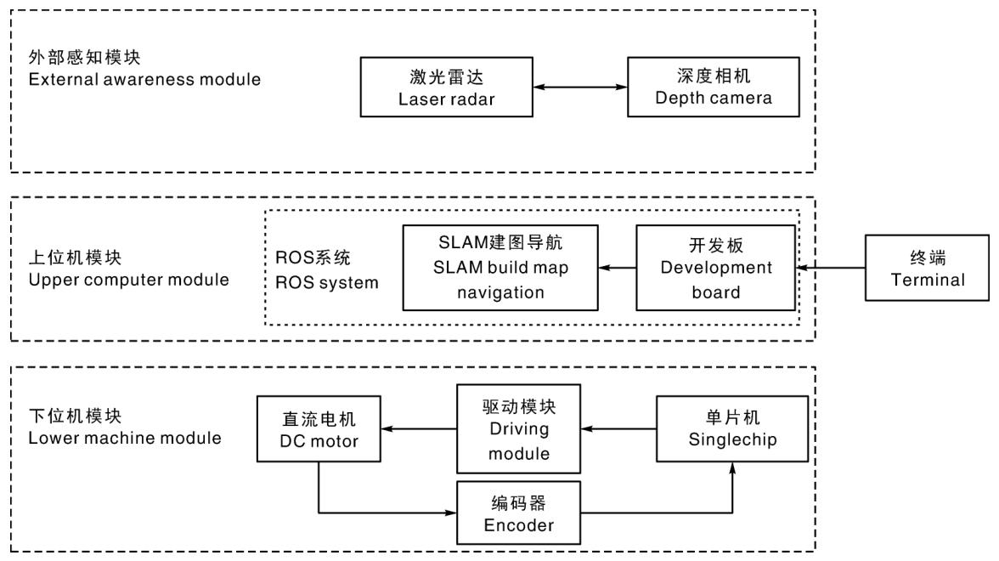
#### 一、摘要（解决了什么问题）

规模猪场配怀猪舍内复杂结构化环境中，纯激光或纯视觉导航建图技术精度不足、信息单一，影响智能移动装备作业效果，具体解决方案如下：

1. **核心痛点**：
    - 纯激光建图仅能捕捉同一平面环境信息，无法识别高低错落的障碍物，信息维度不足；
    - 纯视觉建图对光照变化和低纹理环境敏感，在猪舍场景中鲁棒性差；
    - 单一传感器建图易出现累积误差，导航精度难以满足巡检、运输等作业需求。

为此，研究提出三类解决方案：

- 方案一（传感器数据融合）：搭建激光雷达与深度相机融合硬件平台，通过相机内参标定同步彩色与深度图像，融合激光的精准测距与视觉的丰富纹理信息；
- 方案二（前端里程计优化）：采用 ORB 算法提取图像特征，结合 3D-2D PnP 算法估计运动状态，通过 BA 优化最小化重投影误差，构建高频高精度前端里程计；
- 方案三（后端与回环优化）：以关键帧位姿为优化变量，构建全局位姿图，结合词袋模型与 TF-IDF 算法实现回环检测，修正累积误差，提升地图全局一致性。

#### 二、结论（效果怎么样）

1. **建图精度显著提升**：
    
    - 融合建图的起始点相对误差范围 0.02%~0.33%，终点相对误差 0.48%~1.62%，均低于 Gmapping、Cartographer、Katro 三种纯激光建图算法；
    - 舍内通道和走廊场景中，平均偏移角度仅 3°，定位稳定性优于纯激光建图（最小偏移角度 2° 但地图完整性不足）。
2. **地图信息更丰富完整**：
    
    - 不仅能生成高精度二维栅格地图，还能输出带色彩纹理的点云地图，完整展示道路、限位栏、障碍物等垂直空间信息；
    - 建图时间仅 615s，较 Cartographer 算法（803s）更高效，且地图完整度达到 “十分完整”，优于单一算法建图效果。
3. **场景适配性强**：
    
    - 适配猪舍内通道狭窄、设施密集、光照复杂的环境，有效克服纯激光信息单一和纯视觉鲁棒性差的缺陷；
    - 生成的地图可直接支撑智能装备的导航、巡检、消杀等作业，满足规模猪场 “机器换人” 的实际需求。

### 基于多传感器融合的自主导航ROS智能机器人_朱明超

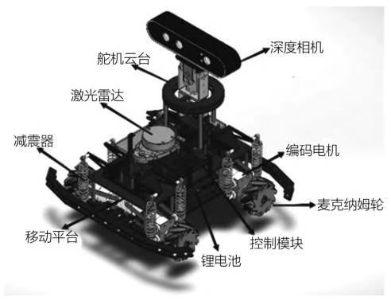
#### 一、摘要（解决了什么问题）

ROS 智能机器人在未知环境或狭小空间自主导航时，存在单一传感器建图精度低、环境信息易丢失、导航灵活性不足的问题，具体解决方案如下：

1. **核心痛点**：
    - 纯激光建图（如 Gmapping 算法）仅能感知所在平面障碍物，无法识别高低错落的空间障碍，易误判可达区域；
    - 纯视觉建图（RGB-D 相机）受光照影响大、视野有限，地图轮廓粗糙、点云稀疏，遍历时间长；
    - 单一传感器信息维度不足，导致导航路径规划易出错，难以适应复杂环境。

为此，研究提出两类解决方案：

- 方案一（多传感器硬件融合）：搭建激光雷达（==思岚 RPLIDAR A1==）、RGB-D 深度相机（奥比中光 Astra pro plus）、IMU、里程计的多传感器硬件平台，结合麦克纳姆轮全向移动底盘，实现全方位环境感知；
- 方案二（RTAB-MAP 算法融合）：采用 RTAB-MAP 算法融合多传感器数据，通过外观特征匹配实现闭环检测，结合内存分级管理保障实时性，同时输出二维栅格地图与三维点云地图，配合 Move_base 节点的 A * 全局规划与 DWA 局部规划算法，完成自主导航。

#### 二、结论（效果怎么样）

1. **建图精度与完整性显著提升**：
    
    - 融合建图可准确识别不同高度障碍物（如 10cm 小纸箱、20cm 大纸箱），避免纯激光建图漏检低高度障碍的问题；
    - 地图轮廓清晰、点云信息丰富，较纯视觉建图更精准，与实际环境匹配度高，无明显信息丢失。
2. **导航灵活性与可靠性增强**：
    
    - 基于融合地图的导航可成功规划避障路径，避免纯激光地图导航中穿越未识别障碍的问题；
    - 麦克纳姆轮底盘支持全方位移动，配合多传感器环境感知，在狭小空间或复杂地形中仍能灵活运动。
3. **环境适应性广**：
    
    - 兼容室内未知环境与狭小空间场景，兼顾二维栅格地图（路径规划）与三维点云地图（环境重建）需求；
    - 多传感器冗余设计降低单一传感器失效风险，鲁棒性优于纯激光或纯视觉导航方案。

### 基于视觉和激光SLAM融合的消毒机器人建图和导航系统研究_李莹钰
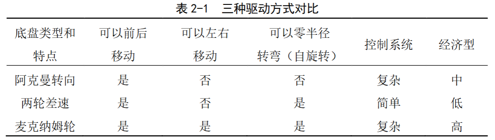

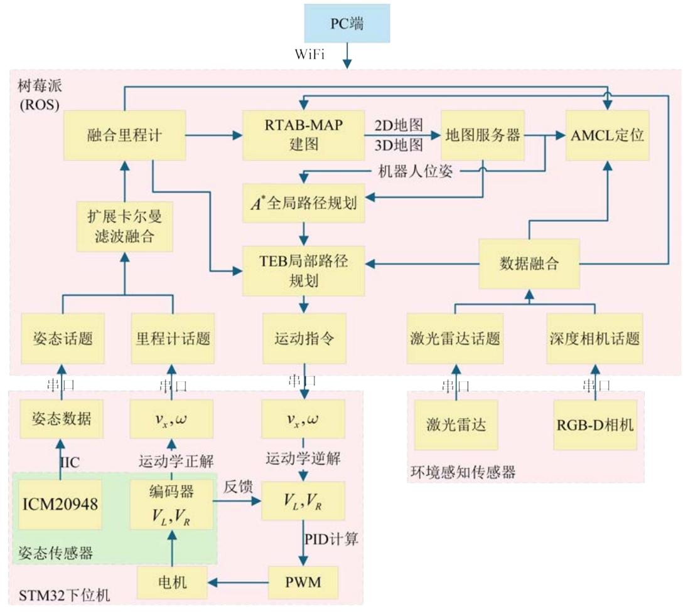

#### 一、摘要（解决了什么问题）

室内消毒机器人面临单一传感器建图局限大、导航信息不完整、定位精度不足的问题，难以满足多空间单元消毒作业需求，具体解决方案如下：

1. **核心痛点**：
    - 纯激光建图语义信息缺失，纯视觉建图受光照和纹理影响大，2D SLAM 建图质量差，3D SLAM 易出现点云漂移；
    - 轮式里程计存在轨迹推算误差累积，影响位姿估计准确性；
    - 传统路径规划算法效率低、路径不平滑，难以适应室内动态障碍物场景。

为此，研究提出三类解决方案：

- 方案一（多传感器融合建图）：基于 RTAB-MAP 算法，通过贝叶斯估计融合激光雷达与深度相机数据，结合扩展卡尔曼滤波（EKF）实现 IMU 与轮式里程计时空对齐，生成信息丰富的全局融合地图；
- 方案二（精准定位算法）：采用自适应蒙特卡洛定位（AMCL）算法，通过动态粒子优化提升复杂环境下的位姿估计鲁棒性；
- 方案三（优化路径规划）：采用双层优化架构，全局规划层引入带权重因子的改进 A* 算法缩短路径长度，局部规划层采用时间弹性带（TEB）算法实现动态避障。

#### 二、结论（效果怎么样）

1. **建图精度与完整性提升**：
    
    - 融合建图的平均绝对误差仅 0.021m，平均相对误差 1.645%，较纯视觉建图减少 46.3% 的平移误差和 6.27% 的旋转误差；
    - 生成的 2D 栅格地图与 3D 点云地图轮廓清晰，障碍物信息完整，无明显漂移，能精准还原室内环境细节。
2. **定位与导航可靠性强**：
    
    - AMCL 定位算法使机器人定位误差控制在 10cm 以内，满足消毒作业精度需求；
    - 改进 A* 算法路径拐点减少 25%，TEB 算法避障成功率达 90%，可灵活应对动态障碍物，多点导航任务能稳定完成。
3. **系统集成性能优异**：
    
    - 软硬件系统兼容性强，能实现建图、定位、路径规划全流程协同，适配室内多空间单元消毒场景；
    - 融合算法有效抑制误差累积，建图精度较单一传感器提升约 41%，保障机器人自主移动、避障与消毒作业的高效执行。

### 多传感器融合AGV在仓储环境导航的应用研究_陈浩泽

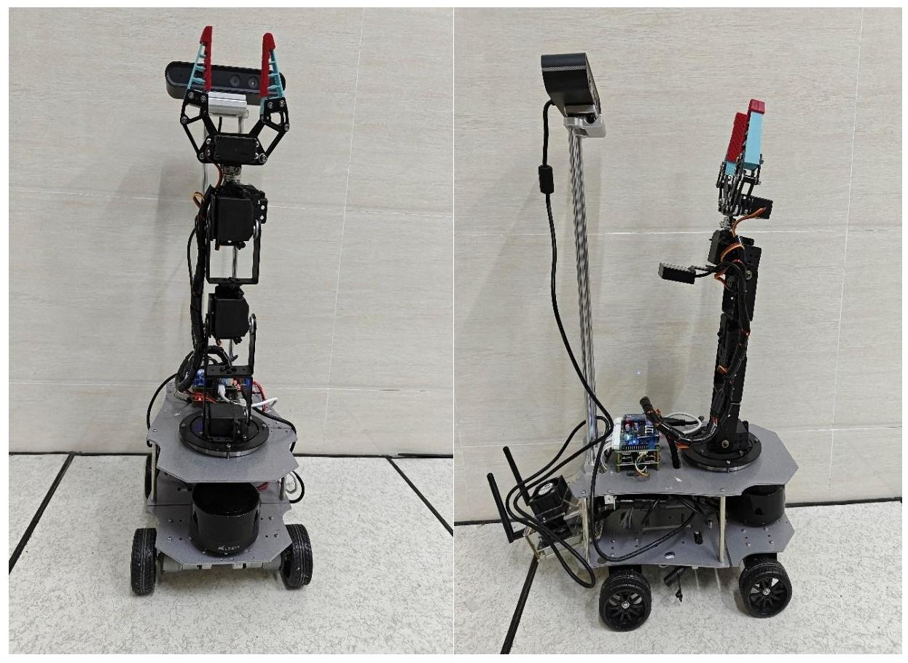
#### 一、摘要（解决了什么问题）

仓储环境多障碍、多遮挡，单一传感器 AGV 存在定位精度低、鲁棒性差、导航实时性不足的问题，难以满足物流搬运需求，具体解决方案如下：

1. **核心痛点**：
    - 单一传感器在仓储复杂环境下感知信息有限，易受遮挡影响，导致定位与建图精度不足；
    - 嵌入式平台计算能力有限，传统 SLAM 算法实时性差，难以支撑多传感器数据处理；
    - 传统路径规划算法路径不平滑、避障响应慢，适配仓储场景效果不佳。

为此，研究提出三类解决方案：

- 方案一（多传感器融合建图）：融合激光雷达、双目深度相机、RGB-D 相机、IMU 及轮式编码器数据，基于 RTAB-Map 算法构建高精度点云地图与代价地图，通过扩展卡尔曼滤波（EKF）优化数据融合精度；
- 方案二（算法性能优化）：借助 Jetson Nano 的 CUDA 平台加速视觉 SLAM 特征提取与匹配，降低 CPU 占用率，提升嵌入式平台实时处理能力；
- 方案三（路径规划优化）：选用优化后的 A * 算法作为全局路径规划（缩短路径长度、提升平滑度），TEB 算法作为局部路径规划（适配阿克曼轮底盘，优化避障参数），结合机械臂柔性夹取装置实现货物抓取。

#### 二、结论（效果怎么样）

1. **建图精度与实时性兼顾**：
    
    - 融合建图能精准还原仓储环境障碍物与边缘特征，点云地图信息完整，代价地图障碍区间可靠；
    - 优化后 RTAB-Map 算法使 CPU 平均占用率从 86.75% 降至 61.5%，性能提升 25.25%，保障嵌入式平台稳定运行。
2. **导航与避障性能优异**：
    
    - 优化后 A * 算法路径长度缩短 3.76%，寻路时间降低 33.33%，轨迹平滑无明显拐点；
    - TEB 算法避障响应及时，与障碍物保持 0.35m 安全距离，AGV 自主导航速度达 0.25m/s，定位偏差小，运行稳定。
3. **实用功能完善**：
    
    - 适配仓储多障碍场景，AGV 能沿规划路径精准行驶，避障成功率高；
    - 机械臂结合 RGB-D 相机可准确识别并抓取货物，完成 “导航 - 抓取 - 搬运” 全流程，满足仓储物流实际需求。

### ORB-SLAM2:一个用于单目､双目和RGB-D相机 的开源SLAM系统

#### 一、摘要（解决了什么问题）

传统视觉 SLAM 系统存在传感器适配单一、尺度漂移、鲁棒性不足等问题，难以满足多场景实时建图与定位需求，具体解决方案如下：

1. **核心痛点**：
    - 单目 SLAM 无法直接获取深度信息，存在尺度漂移，纯旋转场景易失效；
    - 现有 SLAM 系统多适配单一传感器，缺乏对双目、RGB-D 相机的统一支持；
    - 部分方法依赖 GPU 或存在实时性差、全局一致性不足的问题。

为此，研究提出三类解决方案：

- 方案一（多传感器兼容）：打造支持单目、双目、RGB-D 相机的统一 SLAM 框架，通过预处理模块将不同传感器数据转化为统一特征格式，无需区分输入类型；
- 方案二（精度优化）：采用束调整（BA）作为核心优化方法，结合局部 BA 与全局 BA，解决尺度漂移问题，提升轨迹与地图的全局一致性；
- 方案三（功能扩展）：集成闭环检测、重定位与地图复用功能，新增轻量级定位模式，禁用建图线程以实现零漂移长期定位，适配已建图场景。

#### 二、结论（效果怎么样）

1. **适配性与实时性优异**：
    
    - 兼容单目、双目、RGB-D 三类相机，可在标准 CPU 上实时运行，单帧跟踪时间低于相机帧率倒数；
    - 支持室内手持设备、无人机巡航、城市道路汽车行驶等多场景，适配不同分辨率与帧率的传感器输入。
2. **定位与建图精度领先**：
    
    - KITTI 数据集测试中，相对平移误差低于 1%，多数序列精度优于 Stereo LSD-SLAM；
    - EuRoC 数据集实现厘米级定位精度，TUM RGB-D 数据集上，平移 RMSE 最低 0.004m，优于 ElasticFusion、DVO-SLAM 等主流方法。
3. **功能完整性与鲁棒性强**：
    
    - 闭环检测成功率高，能有效修正累积误差，全局 BA 优化保障地图全局一致性；
    - 定位模式可实现零漂移长期定位，重定位功能能应对遮挡或跟踪失败场景，立体 / RGB-D 模式无尺度漂移问题。

## 1124

### 基于改进ORB-SLAM2算法的温室机器人定位与稠密建图方法_李旭

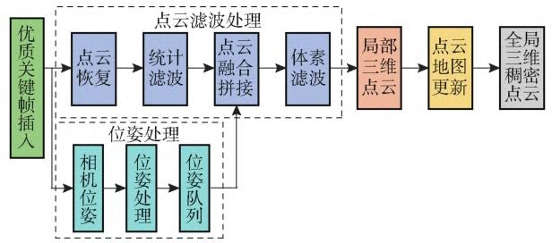
#### 一、摘要（解决了什么问题）

传统视觉 SLAM 系统存在传感器适配单一、尺度漂移、鲁棒性不足等问题，难以满足多场景实时建图与定位需求，具体解决方案如下：

1. **核心痛点**：
    - 单目 SLAM 无法直接获取深度信息，存在尺度漂移，纯旋转场景易失效；
    - 现有 SLAM 系统多适配单一传感器，缺乏对双目、RGB-D 相机的统一支持；
    - 部分方法依赖 GPU 或存在实时性差、全局一致性不足的问题。

为此，研究提出三类解决方案：

- 方案一（多传感器兼容）：打造支持单目、双目、RGB-D 相机的统一 SLAM 框架，通过预处理模块将不同传感器数据转化为统一特征格式，无需区分输入类型；
- 方案二（精度优化）：采用束调整（BA）作为核心优化方法，结合局部 BA 与全局 BA，解决尺度漂移问题，提升轨迹与地图的全局一致性；
- 方案三（功能扩展）：集成闭环检测、重定位与地图复用功能，新增轻量级定位模式，禁用建图线程以实现零漂移长期定位，适配已建图场景。

#### 二、结论（效果怎么样）

1. **适配性与实时性优异**：
    
    - 兼容单目、双目、RGB-D 三类相机，可在标准 CPU 上实时运行，单帧跟踪时间低于相机帧率倒数；
    - 支持室内手持设备、无人机巡航、城市道路汽车行驶等多场景，适配不同分辨率与帧率的传感器输入。
2. **定位与建图精度领先**：
    
    - KITTI 数据集测试中，相对平移误差低于 1%，多数序列精度优于 Stereo LSD-SLAM；
    - EuRoC 数据集实现厘米级定位精度，TUM RGB-D 数据集上，平移 RMSE 最低 0.004m，优于 ElasticFusion、DVO-SLAM 等主流方法。
3. **功能完整性与鲁棒性强**：
    
    - 闭环检测成功率高，能有效修正累积误差，全局 BA 优化保障地图全局一致性；
    - 定位模式可实现零漂移长期定位，重定位功能能应对遮挡或跟踪失败场景，立体 / RGB-D 模式无尺度漂移问题。

### 多传感器融合无人驾驶同时定位与建图技术发展研究_曾贵萍

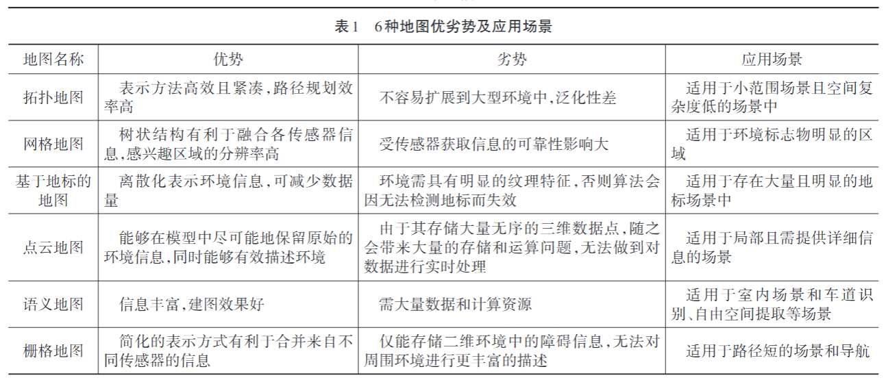

#### 1. 摘要（解决的问题）

针对无人驾驶中单一传感器 SLAM 技术存在的环境适应性差、定位建图精度不足、难以应对复杂场景的核心问题，聚焦多传感器融合 SLAM 技术的优化与应用，具体痛点与研究方向如下：

- **核心痛点**：单一传感器（相机易受光照影响、激光雷达成本高、IMU 存在漂移、毫米波雷达噪声大）存在性能缺陷，无法单独满足复杂环境下的精准感知需求；多传感器数据存在格式差异、时间不同步问题，融合难度大；现有融合方法（紧耦合、松耦合）在实时性与精度平衡、动态环境适应性上存在不足；累积误差、地图类型适配性等问题影响建图定位效果。
- **研究内容**：系统梳理 SLAM 原理、传感器类型（相机、激光雷达、IMU 等）、地图类型及融合方法（分布式 / 集中式 / 混合式、像素级 / 特征级 / 决策级、前 / 中 / 后融合）；分析国内外紧耦合（如 VIL-SLAM、R2LIVE）与松耦合（如 LIMO、DVL-SLAM）融合方案的技术特点与不足；针对数据差异、累积误差、环境适应性差等问题，提出优化思路与未来研究方向。

#### 2. 结论（效果与展望）

该研究全面总结了多传感器融合 SLAM 技术的现状与成效，明确了当前局限与发展方向：

- **现有技术成效**：多传感器融合通过互补各传感器优势（如激光雷达抗光照干扰 + 相机纹理丰富），显著提升了 SLAM 系统的鲁棒性与定位建图精度；紧耦合方案（如 LIC-Fusion 2.0、R2LIVE）通过特征级融合实现高精度状态估计，松耦合方案（如 LIMO、LIV-LAM）以高实时性适配低算力场景，已在部分无人驾驶场景中验证了可行性。
- **当前核心局限**：仍面临数据格式与时间同步难题、动态复杂环境中信息置信度低、累积误差难以根治、系统适应性与实时性平衡困难等问题；传感器性能缺陷与地图类型适配性不足也制约了实际应用效果。
- **未来发展方向**：需推进深度学习与传统 SLAM 方法融合，平衡计算速度与准确性；强化摄像头与激光雷达的冗余设计，提升系统可靠性；探索升维融合、双线映射等策略，减少信息丢失与错位；聚焦角落边缘场景感知与对抗性攻击防御，完善复杂环境适配能力。

### 基于LVI-SAM-Stereo的多传感器融合室内外建图定位_蒋风洋

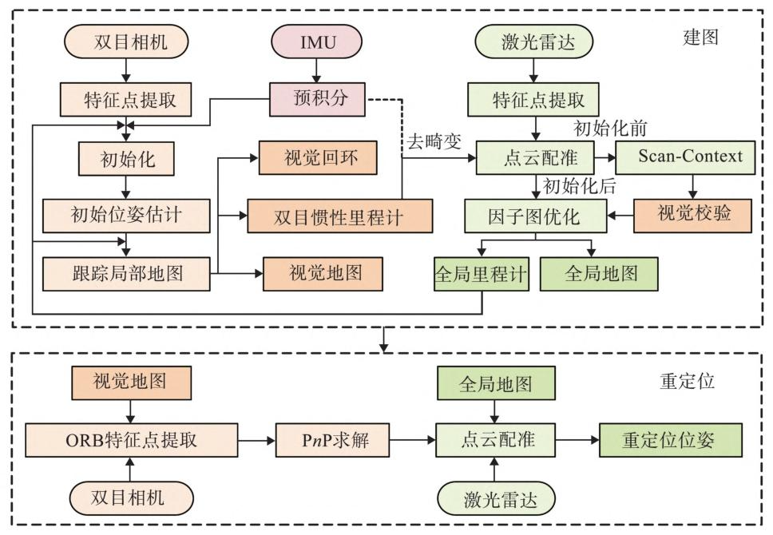

#### 1. 摘要（解决的问题）

针对机器人在室内外场景中存在的建图定位精度低、场景适应性差、重定位稳定性不足的核心问题，具体痛点与解决方案如下：

- **核心痛点**：传统算法（如 LIO-SAM、LVI-SAM）在几何结构单一场景（长走廊、空旷区域）易出现里程计退化或漂移；激光雷达回环检测易产生错误回环，需手动调整参数；双目惯性里程计初始化困难，单目系统存在尺度缺失问题；重定位依赖激光雷达配准，精度和稳定性差。
- **解决方案**：提出 LVI-SAM-Stereo 多传感器融合方法。构建点线 / 点面距离的激光雷达惯性位姿估计模型，辅助双目惯性里程计快速初始化并优化位姿；设计融合 Scan-Context 与视觉特征的跨模态回环检测机制，减少错误回环；搭建重定位双向优化架构，以因子图优化的里程计信息作为视觉跟踪初始位姿，通过 PnP 求解视觉位姿辅助激光雷达点云配准，提升重定位精度。

#### 2. 结论（效果怎么样）

经 HiltiSLAM 数据集和真实场景（室内环形走廊、地下车库，室外园区、公园）验证，该方法表现优异：

- **建图精度显著提升**：室外场景建图精度较 LIO-SAM 提升 3.10%，较 LVI-SAM 提升 5.97%；室内场景平均漂移较 LIO-SAM 降低 72.7%，较 LVI-SAM 降低 43.05%，在垂直高度变化大、光照复杂的场景中仍能保持低漂移。
- **场景适应性强**：成功适配地下室、建筑工地、长走廊、园区等多种室内外复杂场景，解决了传统算法在单一几何结构、动态物体干扰场景下建图失败的问题，无需手动调整回环参数。
- **重定位性能可靠**：视觉激光雷达耦合重定位在长走廊等易退化场景中，多次重定位轨迹精准重叠，误差均方根（RMS）小，满足机器人自主导航的工程化需求。

### 基于ROS的移动机器人室内定位建图导航研究_潘帅江
==不太行，纯2D导航==
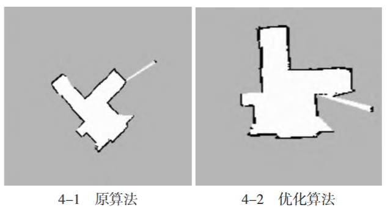

#### 1. 摘要（解决的问题）

针对室内移动机器人在未知环境中定位建图与导航的核心需求，解决传统方案存在的关键问题，具体如下：

- **核心痛点**：原 Gmapping 算法在室内场景中存在环境信息捕捉不充分、地图精度不足的问题；激光雷达缺乏纹理信息，视觉传感器测距精度有限，单一传感器难以适配复杂环境；室内地板反光、人员走动等干扰会影响建图与导航准确性；算法在环境复杂度增加时计算资源消耗大，大地图构建负担重。
- **解决方案**：选用 Gmapping 算法（适配室内小场景、实时性高、与 ROS 兼容性强），并进行优化改进。通过多模态传感器数据融合，将激光雷达点云数据与深度相机 RGB-D 图像结合，利用图像纹理信息增强点云地图特征识别；结合卡尔曼滤波与粒子滤波算法，用卡尔曼滤波更新地图、粒子滤波估算机器人运动轨迹，提升定位建图精度；基于 URDF 创建四轮圆柱状机器人模型，集成 SLAM 算法、路径规划算法，实现室内自主导航。

#### 2. 结论（效果怎么样）

通过仿真环境测试与真实场景验证，该方案成效显著：

- **建图精度提升**：优化后的 Gmapping 算法在环境特征少的教学楼楼道和特征多的实验室场景中，构建的栅格地图更平滑准确，细节还原更清晰，有效解决了原算法地图精度不足、边缘不准确的问题。
- **导航鲁棒性强**：在真实室内场景中，机器人能基于构建的地图完成路径规划与自主导航，通过 Rviz 设置起始点和目标点后，可自动生成最优路径，且能应对环境干扰，导航稳定性可靠。
- **工程实用性高**：算法与 ROS 系统高度兼容，资源消耗小，易于部署；通过 URDF 构建的机器人模型可在 Gazebo 中完成仿真测试，真实环境中经 SCOUT MINI 机器人验证，整套方法步骤有效可行，为后续相关算法研究提供了技术路径和实际参考。

### 基于3D激光雷达的同时定位与建图算法研究_高原
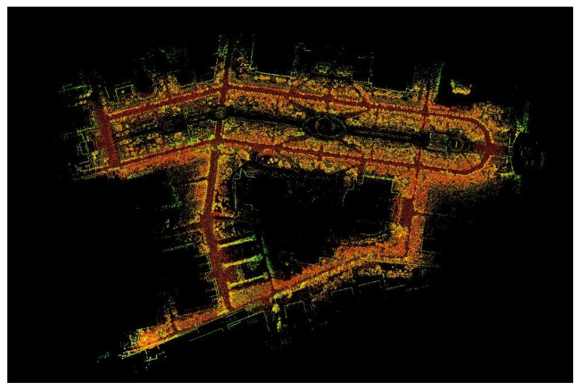图4.15 本文SLAM 算法构建的校园数据集点云地图

#### 一、摘要（解决的问题）

针对传统基于 3D 激光雷达的 SLAM 算法在复杂环境下定位精度低、建图稳定性不足的核心痛点，本文聚焦前端里程计、回环检测、后端优化三大核心模块的缺陷，提出系统性改进方案，具体问题与解决方案如下：

**1. 核心痛点**

- **前端里程计精度不足**：传统算法采用固定体素大小滤波，无法适配不同区域点云密度差异（如密集区域过度简化、稀疏区域细节丢失）；同时在特征匹配中未考虑点云强度信息，忽略不同强度点云的可信度差异，导致位姿估计误差累积。
- **回环检测鲁棒性差**：现有方法依赖单一几何特征（如曲率、距离）构建描述符，未融合语义信息，在几何特征不明显的场景（如重复走廊、相似建筑）中易出现漏检或误检，无法有效修正前端里程计的累积误差。
- **后端优化可靠性低**：未考虑传感器数据在噪声干扰下的置信度下降问题，对所有传感器数据赋予同等权重，当某一传感器（如 IMU）数据噪声较大时，会直接影响位姿优化结果，导致全局地图漂移、重影。

**2. 针对性解决方案**

- **前端里程计优化**：提出 “自适应体素滤波 + 点云强度加权关键帧配准” 方案。前者通过八叉树划分点云区域，根据各区域点云密度动态调整体素大小，重构分布均匀的点云；后者基于点云强度计算特征点权重，加权后与局部地图匹配，提升位姿估计精度。
- **回环检测优化**：构建 “语义 - 几何融合高维描述符”。利用 DGCNN 深度学习模型对激光雷达点云进行语义分割（如区分道路、建筑、车辆），获取点云语义权重；同时提取点云几何特征（曲率、最近点距离），将语义权重与几何特征融合构建高维描述符，提升回环匹配的准确性与鲁棒性。
- **后端优化优化**：设计 “自适应权重因子图优化方法”。通过计算各传感器（激光雷达、IMU、GNSS）数据的协方差矩阵，归一化后为因子图中各模块分配自适应权重（方差小的传感器权重更高），修正噪声数据对优化结果的干扰，提升全局地图精度。

#### 二、结论（实现的效果）

通过在 KITTI 公开数据集（乡村、城市、高速场景）与自采集校园数据集（结构化道路、动态行人场景）上的实验验证，本文提出的改进 SLAM 算法在定位精度、回环检测可靠性、建图质量等方面均优于传统算法，具体效果如下：

**1. 回环检测精准性与稳定性显著提升**

- **F1 得分优异**：在 KITTI00-KITTI08 数据集上，F1 得分均高于 SC、ISC、M2DP 等主流算法，其中 KITTI00 数据集 F1 得分达 0.9522，较 SC 算法提升 3.18%；在校园 SD02 数据集（暑假低人流场景）中 F1 得分最高达 0.9606，较 ISC 算法提升 109%，即使在校园 SD04（高重复场景、多动态物体）中，F1 得分仍达 0.9285，较 SC 算法提升 21%。
- **鲁棒性强**：PR 曲线显示，随着召回率提升，精确率下降幅度小（如 KITTI08 数据集召回率 0.8 时，精确率仍保持 0.7 以上），能有效滤除假回环，为后端优化提供可靠约束；且算法适配 32 线 / 64 线激光雷达，不受雷达线数限制，在低线数雷达（校园数据集用 32 线）上仍保持高准确率。

**2. 定位与建图精度大幅优化**

- **相对轨迹误差（RPE）显著降低**：与无后端优化的 LOAM 算法、ISC-LOAM 算法相比，本文算法 RPE 值大幅下降。在 KITTI08 数据集上，LOAM 算法 RPE 为 1.9604，ISC-LOAM 为 1.3488，本文算法仅 0.2744，误差降低 86.0%；在校园 SD02 数据集上，本文算法 RPE 为 0.3674，较 LOAM 算法（1.5724）降低 76.6%，有效抑制位姿估计累积误差。
- **全局地图质量高**：构建的点云地图无明显漂移、重影现象，细节保留完整。如校园 SD02 数据集建图中，LOAM 算法在道路交叉口出现明显漂移，ISC-LOAM 算法对树木、小路等细节还原不足，而本文算法能精准还原道路边界、建筑轮廓，点云分布均匀；在 KITTI05 长距离场景（2752 帧）中，地图全局一致性强，回环处与真值轨迹高度重合。

**3. 工程实用性与适配性强**

- **硬件适配灵活**：实验采用 16 线 Velodyne 激光雷达、IMU、GNSS 构建数据采集平台，算法可适配不同线数激光雷达（32 线 / 64 线），在校园低线数雷达场景中仍能稳定运行。
- **软件环境兼容**：基于 Ubuntu20.04 操作系统与 ROS 中间件开发，支持节点间高效数据通信，可与自动驾驶、机器人导航系统无缝集成；在常规硬件配置下，能满足实时定位与建图需求（如校园 SD01 数据集 4728 帧数据可实时处理，无明显卡顿）。

**4. 现存优化方向**

- **多传感器融合拓展**：当前算法主要依赖激光雷达与 IMU，未来可融合视觉传感器、毫米波雷达，提升非结构化场景（如室内、隧道）的适应性。
- **动态物体处理增强**：现有算法对动态障碍物（如密集行人、突发车辆）处理能力有限，需进一步研究动态物体检测与剔除机制，提升复杂动态环境下的鲁棒性。
- **计算效率优化**：后端因子图优化的时间复杂度较高，可探索轻量化优化算法，适配低功耗嵌入式平台（如无人机、小型机器人）。

---

## 1125
### 无人驾驶汽车中基于SLAM的环境感知与控制系统研究_张钧宇

==质量太差，水文==

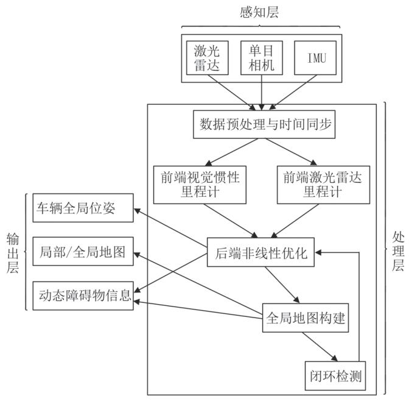
#### 1. 摘要（解决的问题）

针对无人驾驶汽车在复杂动态场景中存在的两大核心问题，提出系统性解决方案：

- **核心痛点**：单一传感器感知易受干扰（如光照变化、低纹理环境），存在感知局限；运动控制的横纵向耦合性强，难以兼顾车辆动力学约束与道路边界要求，影响导航可靠性。
- **解决方案**：设计多传感器融合 SLAM 架构，通过激光雷达、相机与 IMU 紧耦合实现鲁棒状态估计与高精度地图构建，引入点云去噪及时序同步机制提升感知品质；提出分层路径规划策略（全局改进 A * 算法 + 局部 DWA 与 TEB 结合），并设计基于模型预测控制（MPC）的横纵向协同运动控制器，充分考虑车辆动力学约束与道路边界。

#### 2. 结论（效果怎么样）

经实车测试验证，该系统在复杂场景中表现优异：

- **定位精度达厘米级**：在强光隧道、动态障碍区、城市峡谷、低纹理长廊等场景中，绝对轨迹误差（ATE）介于 0.17-0.32m，相对位姿误差（RPE）介于 0.12-0.24m，地图重建精度最高达 0.953，感知稳定性强。
- **环境感知可靠**：20km 实测中，车辆、行人、锥桶等主要障碍物识别准确率超 94%，6m 内车辆定位误差 < 0.3m，满足规划控制需求。
- **运动控制精准**：结构化道路横向跟踪误差均值仅 8.2cm，极端湿滑路面最大横向跟踪误差≤18.3cm，航向角偏差小，控制平滑性好，每千米急刹频次低，可为无人驾驶自主导航提供可靠技术支撑。

### 基于A_搜索算法在自动驾驶路线导航的研究与应用_陈嘉庆

==质量太差，水文==

#### 1. 摘要（解决的问题）

针对传统路径规划算法在复杂城市环境中动态适应性弱、多目标优化失衡的核心痛点，提出 “混合 A * 搜索算法 + 强化学习（RL）” 的协同搜索框架，具体问题与解决方案如下：

- **核心痛点**：传统算法依赖静态路网，面对施工绕行、无保护左转等动态场景时路径重复规划率高；决策规则预定义导致突发加塞、行人横穿等场景下决策僵化；未充分融合道路语义与车辆动力学约束，易出现轨迹不平滑、违规变道等问题，影响通行效率与乘坐舒适性。
- **解决方案**：融合高精地图语义、实时感知数据与车辆动力学约束，突破静态路网规划局限；通过强化学习（PPO-LSTM 融合策略）实现动态场景灵活决策，优化突发状况下的车辆控制；构建 “语义路网 - 动态栅格 - 控制优化” 三级架构，实时更新路网权重（含拥堵指数、车道属性约束），结合时空联合栅格图预测障碍物运动趋势，实现多目标优化的路径规划。

#### 2. 结论（效果怎么样）

经模拟测试与实车验证，该协同搜索框架在复杂城市场景中表现优异，核心效果如下：

- **规划效率与合规性提升**：早高峰场景中，平均行程时间较传统 A * 算法缩短 14.2%，导流线违规次数减少 82.4%，违规变道率从 18% 降至 2.3%，有效适配动态路网约束。
- **动态场景决策更灵活**：突发加塞场景中，平均刹车减速度仅 2.1m/s²（低于人类司机的 3.5m/s²），车道保持率达 98.7%，乘客舒适度评分提升 32%；无保护左转场景中，平均等待时间 2.3s，较人类司机缩短 41%，急刹次数减少 62.5%，车道保持率 97%。
- **场景适配性增强**：施工路段绕行场景中，自动触发局部重规划，绕行距离从传统算法的 1.8km 缩减至 0.4km，规划延迟仅 42ms，高效应对特殊场景需求。
- **现存局限与改进方向**：极端天气（暴雨、大雪）下鲁棒性不足，长尾场景（儿童突然闯入、井盖缺失）决策覆盖率仅 89%；未来需通过多传感器融合、自适应多目标优化、数字孪生数据增强等方式，进一步提升极端场景泛化能力与决策准确率。

### 基于改进PRM算法的翼盒装配机器人路径规划研究_游勇

==侧重于机械臂==

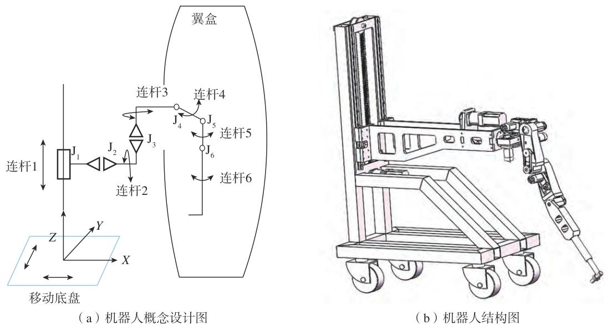
#### 1. 摘要（解决的问题）

针对飞机翼盒装配机器人使用传统 PRM 算法进行路径规划时存在的核心痛点，提出改进 PRM 算法的解决方案，具体问题与措施如下：

- **核心痛点**：传统 PRM 算法采样点分布不均，导致路径规划质量和稳定性差；采样过程中产生大量冗余点，增加路径图构建复杂度和计算负担；路径图构建依赖精确最近邻搜索，效率低下；采样点通过直线连接，生成的路径折点过多，不符合机械臂实际运动约束。
- **解决方案**：①采用 Halton 序列优化采样策略，确保采样点在构型空间中均匀分布，提升采样质量；②设计基于控制点的椭圆区域冗余点优化策略，结合局部敏感哈希（LSH）函数，剔除椭圆区域外的冗余采样点，优化路径图构建效率；③引入 LSH 函数改进路径图构建方式，通过近似最近邻搜索缩短搜索时间；④采用 B 样条曲线对规划路径进行平滑处理，满足翼盒装配机器人的运动约束。

#### 2. 结论（效果怎么样）

经二维、三维及高维构型空间的仿真试验验证，改进 PRM 算法的综合性能显著优于传统 PRM 算法，核心效果如下：

- **规划效率大幅提升**：二维空间中，改进算法的规划时间较传统 PRM 算法平均减少 41.1%（采样点数量 60、90、120 时，分别减少 37.32%、39.0%、46.99%）；机械臂高维构型空间中，规划时间平均减少 68.43%，大幅节省计算资源。
- **路径质量更优**：通过 Halton 序列采样保证了采样均匀性，B 样条曲线平滑处理后，路径折点消除，更符合机械臂运动需求；在不同复杂度测试地图中，改进算法生成的路径长度整体更优，且随着采样点数量增加，路径长度逐渐减小。
- **鲁棒性与成功率提升**：在低、中、高复杂度地图中，改进算法的路径规划成功率均高于传统 PRM 算法，尤其在高复杂度环境和高维空间中优势明显；高维构型空间中，采样点数量 4000 时，改进算法成功率达 94%，远高于传统 PRM 算法的 60%，能稳定适配翼盒装配的复杂工作环境。

### 基于A_与DWA算法的果园导航机器人研究_王晶
==重点在于优化A*路径算法==
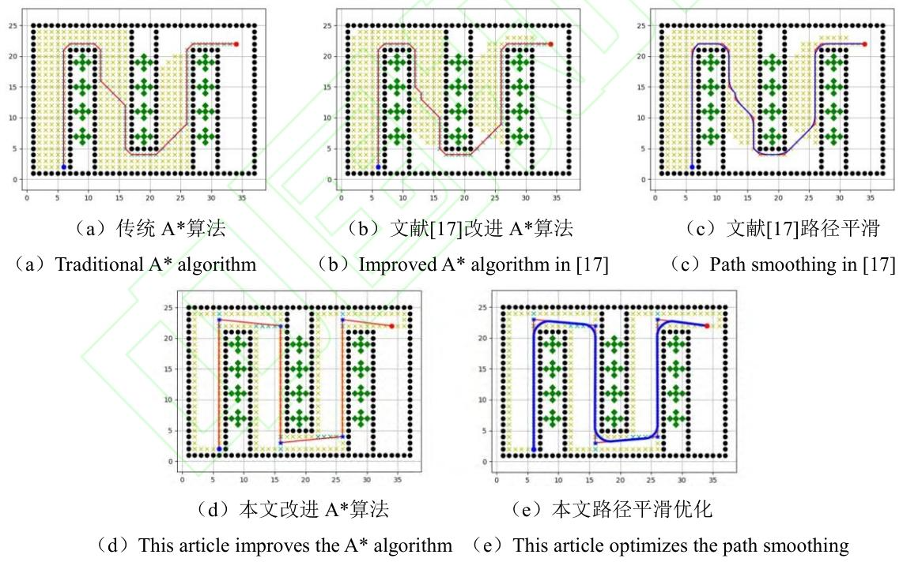

#### 1. 摘要（解决的问题）

针对果园非结构化环境中传统路径规划算法存在的节点遍历冗余、搜索效率低、路径平滑性差及避障时全局导向不足等痛点，提出改进 A * 算法与改进 DWA 算法融合的路径规划方案，具体问题与解决方案如下：

- **核心痛点**：传统 A * 算法采用八邻域搜索，节点遍历多、规划时间长，路径拐点多、平滑性不足，难以适配果园 “弓” 字形作业路线需求；传统 DWA 算法评价函数缺乏全局路径导向，避障时易偏离全局最优路径，且未区分静态与未知障碍物，环境适应性差。
- **解决方案**：①改进 A_算法：采用矩形扩展搜索策略减少冗余节点，结合果园作业特性动态选取关键路径节点，通过动态相切圆技术平滑路径拐点，生成贴合果园作业需求的全局路径；②改进 DWA 算法：优化方位角评价函数（参考全局路径节点而非仅目标节点），新增全局路径偏离距离评价项，区分静态与未知障碍物调整障碍物评价函数，增强局部避障的全局导向性；③构建融合架构：以改进 A_算法提供全局路径框架与关键节点指引，改进 DWA 算法分段动态避障，实现全局最优与局部实时避障的协同。

#### 2. 结论（效果怎么样）

经多规模栅格地图仿真与 Gazebo 果园环境验证，融合算法性能显著优于传统及现有改进算法，核心效果如下：

- **全局规划效率与质量双提升**：37×25 地图中，改进 A_算法较传统 A_算法搜索节点减少 42.5%，规划时间缩短 20.1%，转折点减少 58.3%，路径经动态相切圆平滑后无曲率突变；57×41 大规模地图中，规划时间进一步缩短 31.0%，路径节点减少 94.4%，转弯角度降低 30.2%，路径贴合果园树列分布，更适配采摘作业。
- **局部避障与全局贴合度优化**：融合改进 DWA 算法后，37×25 地图中路径长度较传统 DWA 算法缩短 1.16%，规划时间缩短 13.59%；57×41 地图中路径长度缩短 0.5%，规划时间缩短 7.37%。避障时能与障碍物保持合理间距，且更贴近全局路径，避免过度偏离。
- **环境适应性与鲁棒性强**：在添加未知障碍物的果园仿真环境中，机器人可通过融合算法快速探测障碍并安全绕行，绕行后能重新回归全局路径，无碰撞风险；算法同时适配小范围与大规模果园场景，兼顾作业效率与行驶安全性，有效支撑果园智能化管理需求。

### 多智能体协同路径规划综述_熊骏

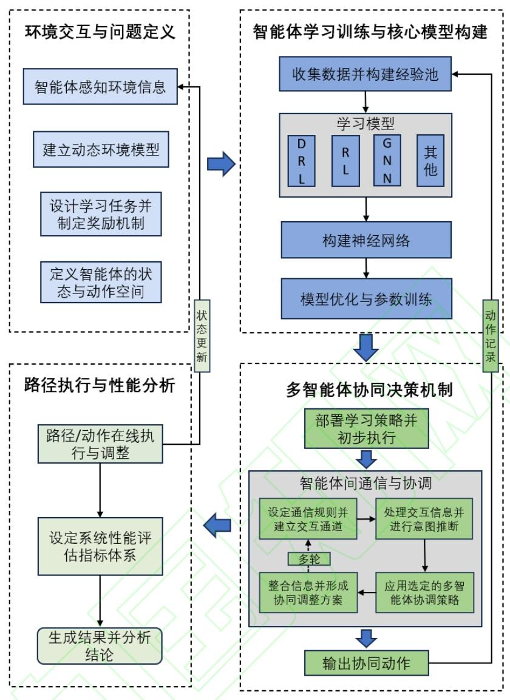

#### 1. 摘要（解决的问题）

针对多智能体系统在协同路径规划中存在的 “无碰撞基础上的高效协作” 核心需求，解决传统多智能体路径规划（MAPF）仅满足避障、缺乏主动协同机制的局限，具体问题与研究方向如下：

- **核心痛点**：传统 MAPF 仅关注单个智能体无碰撞路径生成，智能体间缺乏主动协作与信息共享，难以适配大规模、高动态场景（如无人机编队、智能物流）对整体系统效率的要求；现有协同路径规划（Co-MAPF）在架构选择（集中式 / 分布式 / 混合式）、算法适配性、动态环境适应性等方面缺乏系统性整合与优化。
- **研究内容**：界定 Co-MAPF 问题定义（区别于传统 MAPF，强调智能体主动协作与全局目标优化），分析集中式、分布式、混合式三种架构的优劣与适用场景；系统归类并评述四类主流 Co-MAPF 算法（基于采样、搜索、智能优化、学习），梳理各算法的核心机制与技术特点；总结当前研究面临的挑战，为后续优化方向提供参考，助力 Co-MAPF 在无人机编队、智能交通等领域的高效应用。

#### 2. 结论（效果与展望）

该综述全面梳理了多智能体协同路径规划（Co-MAPF）的研究现状，明确了技术进展与现存瓶颈，核心结论如下：

- **技术进展显著**：Co-MAPF 已形成完整的问题体系与技术框架，三类架构各有适配场景 —— 集中式架构路径质量高，适用于小规模静态场景；分布式架构可扩展性强，适配大规模动态环境；混合式架构平衡全局优化与局部灵活性，兼顾规划质量与鲁棒性。四类算法各有优势：采样类算法灵活适配复杂环境，搜索类算法保障路径最优性，智能优化类算法平衡全局与局部优化，学习类算法（尤其是深度强化学习）展现出强动态适应与智能决策潜力，已在部分场景实现无碰撞协同与效率提升。
- **现存核心挑战**：大规模场景下计算效率瓶颈突出，算法复杂度随智能体数量指数增长，难以满足实时性要求；动态环境中实时重规划能力不足，面对障碍物移动、任务更新时响应滞后；实际部署中鲁棒性与可扩展性受限，异构智能体协作、非理想环境适配、容错机制设计等问题尚未完全解决。
- **未来发展方向**：需通过混合算法框架（如学习与采样方法融合）提升计算效率；优化通信协议与协作机制（如图神经网络优化局部通信），增强大规模场景可扩展性；聚焦特定工程场景定制化设计（如无人机编队低带宽算法、仓库高密度调度框架），结合边缘计算、5G 通信等技术，推动 Co-MAPF 在智能交通、智能物流等领域的落地应用。

## 1126

### 基于改进A~_算法的仓储物流机器人路径规划研究_陈海霞

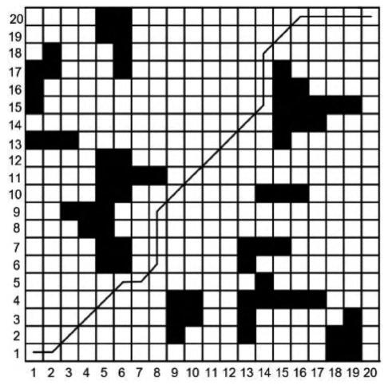
修改前的传统A*算法

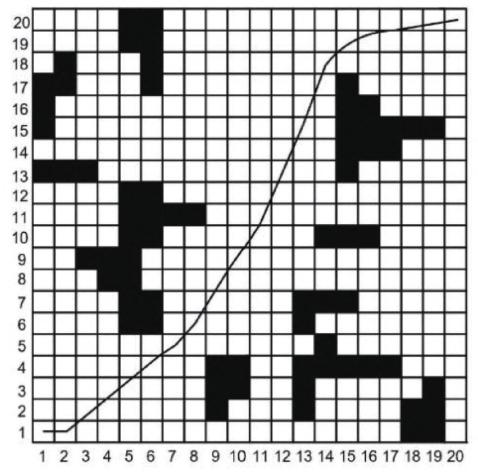
图3 增加必要节点后的优化路径

#### 1. 摘要（解决的问题）

针对全局静态环境中仓储物流机器人采用传统 A_算法进行路径规划时存在的核心痛点，提出改进 A_算法的解决方案，具体问题与措施如下：

- **核心痛点**：传统 A * 算法规划的路径冗余节点多，导致路径转折角度大、不符合机器人运动学规律；搜索效率低，难以适配仓储动态环境需求；局部路径规划缺乏全局信息引导，优化效果不佳。
- **解决方案**：①路径节点优化：制定节点删除准则（删除共线节点或大角度转折且不影响通行的节点）和节点新增准则（当相邻节点转折角差值过大时，新增节点减小角度），减少冗余节点并降低转折角度；②局部路径优化：结合滚动窗口方法，以机器人当前位置为中心构建探测窗口，动态选择局部子目标（与全局路径节点重合、交点或更新地图后重新规划），在窗口内进行局部路径优化；③整合运动模型与子目标选择条件，确保规划路径适配机器人运动特性。

#### 2. 结论（效果怎么样）

经 MATLAB 仿真验证，改进 A_算法在仓储物流场景中表现显著优于传统 A_算法，核心效果如下：

- **路径质量大幅优化**：在 20×20 栅格环境中，改进算法使路径总转折角较传统算法降低 81.3%，平均转折角降低 35.1%，路径长度缩短 9.02%，节点数目从 8 个减少至 4 个，路径更平滑，更符合仓储物流机器人运动学规律。
- **搜索效率与适应性提升**：通过节点优化减少了无效搜索和路径调整，动态滚动窗口机制使机器人在动态环境中仍能保持较高搜索效率，局部路径规划性能更优。
- **实用性强**：算法无需复杂硬件支持，基于 MATLAB 即可实现，参数（θ=126°、φ=58°、γ=2）经多次实验验证适配仓储场景，能有效提升机器人作业效率与路径安全性。

### 基于优化A~_算法的助老服务机器人路径规划研究_卿晶晶

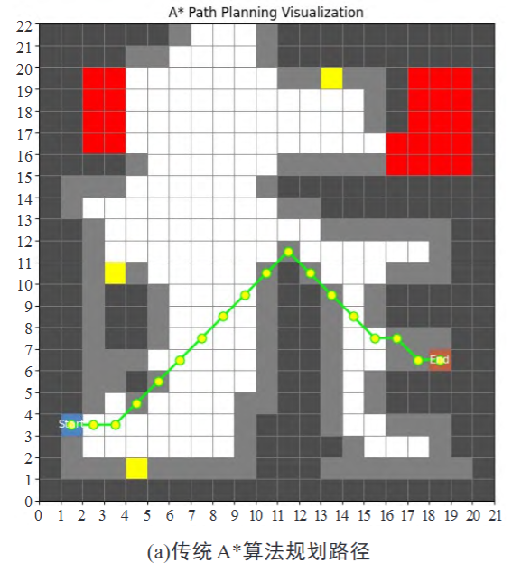

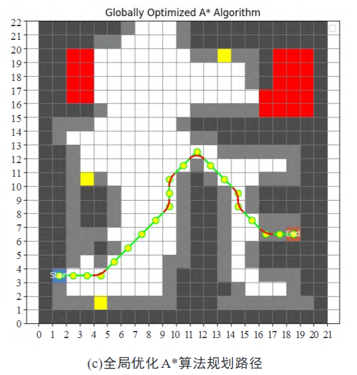

#### 1. 摘要（解决的问题）

针对助老服务机器人在居家养老环境中路径规划的安全性、适配性需求，解决传统 A * 算法在该场景下的核心痛点，具体问题与解决方案如下：

- **核心痛点**：传统 A * 算法仅考虑距离代价，未适配居家环境的多层级耦合特征（如固定家具、动态障碍物、湿滑风险区域）；规划路径易 “贴边行驶”，安全性不足；路径折线拐点多，导致机器人机械损耗大，不符合助老服务的平稳性要求。
- **解决方案**：①构建多层次代价地图模型，区分固定障碍物、动态障碍物、紧邻障碍区域及湿滑风险区域，提供环境先验知识；②优化代价函数，引入障碍物距离代价（引导机器人远离障碍）和速度代价（风险区域减速），构建多目标代价函数；③采用自适应半径动态内切圆方法，对折线角路径进行平滑处理，降低机械损耗；④融合动态窗口法形成闭环控制，提升对动态环境的适应性。

#### 2. 结论（效果怎么样）

经居家养老场景仿真验证，优化 A_算法相较于传统 A_算法表现更优，核心效果如下：

- **安全性显著提升**：规划路径能主动避开固定 / 动态障碍物，与障碍保持安全距离（≥0.3m），避免 “贴边行驶”；可识别厨房、卫生间等湿滑风险区域，减少穿行或减速通过，降低意外风险。
- **路径适配性更强**：多层代价地图与多目标代价函数适配居家复杂环境，能避开狭窄通道（如沙发与茶几间隙），路径更贴合助老服务场景需求。
- **机械损耗降低**：动态内切圆平滑处理后，路径拐点减少、曲率连续，机器人转向更平稳，有效降低机械损耗，提升路径跟踪效果。
- **实用性可靠**：在 “阳台到床头”“阳台到厨房” 等典型场景中，均能安全高效到达目标点，可满足室内监测、送药、体征采集等助老服务的路径规划需求。

### 面向大学校园的无人驾驶物流车路径规划算法性能分析_杨朝晖

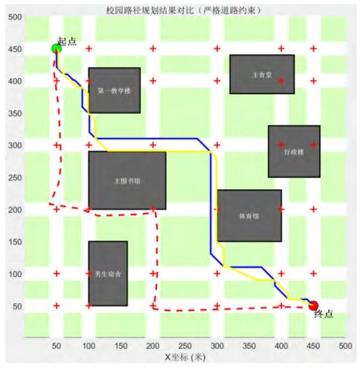
(1)Dijkstra (蓝色实线):路径长度700 m,严格 约束在沿道路网格中,但是却出现了多次直角转弯 (累计路径平滑度为855°),路径完全避开建筑物,符 合物流车运动约束｡(2)A* (黄色实线):路径长度 700 m,与Dijkstra 长度相同,其转向更频繁(累计转 向3 870°),存在冗余折线,虽然路径始终保持在道路 上,但平滑度显著落后于另外两种算法｡(3)RRT (红色虚线):路径最长(800 m),但形态最自然,大 曲率转弯仅出现3处,累计路径平滑度为428.2°,且选 择了远离建筑的校园外围道路行驶,在白天高峰期, 优势明显｡

#### 1. 摘要（解决的问题）

针对大学校园物流配送依赖人力导致的效率低、成本高、高峰期拥堵等问题，聚焦校园复杂道路网络（含多种道路类型、动态行人与静态障碍）的路径规划需求，解决单一算法适配性不足的痛点。通过选取 Dijkstra、A*、RRT 三种典型路径规划算法，从路径长度、规划时间、路径平滑度三个核心维度进行系统性性能对比，明确不同算法在校园场景的适配性，为无人驾驶物流车的算法选型提供参考，助力提升校园物流配送的自动化与高效性。

#### 2. 结论（效果怎么样）

经 Matlab 仿真实验验证（基于 500m×500m 校园栅格地图），三种算法性能差异显著，适配不同校园时段场景，核心效果如下：

- **A * 算法不适用于校园场景**：虽能与 Dijkstra 算法共同规划出最短路径（700m），但路径平滑度极差（累计转向 3870°），转向频繁且存在冗余折线，规划时间最长（0.5s），难以满足物流车平稳行驶与实时响应需求。
- **Dijkstra 算法适配夜间低流量场景**：路径长度最优（700m），严格沿道路行驶、避开障碍，综合性能均衡；但规划时间（0.2s）略长，路径平滑度一般（累计转向 855°）。夜间校园行人车辆稀少，平滑度缺陷影响较小，最短路径可缩短配送时间。
- **RRT 算法适配白天高峰时段**：规划时间最短（0.15s），路径平滑度最优（累计转向 428.2°），仅 3 处大曲率转弯，且选择远离建筑的外围道路行驶，动态适应性强；虽路径最长（800m，比前两者长 5%~10%），但能应对行人密集的复杂环境，综合表现最优。

### 改进A~(_)-DWA算法的AGV动态路径规划_郭根

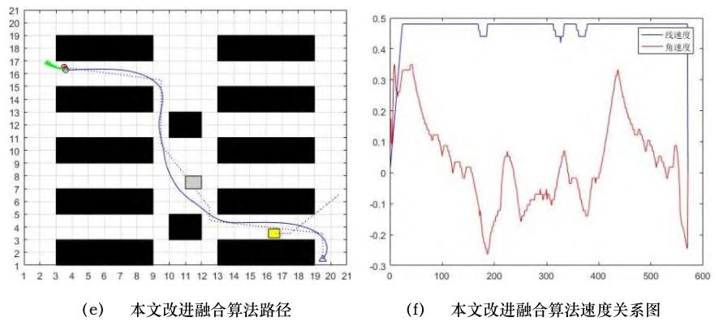

#### 1. 摘要（解决的问题）

针对复杂仓储环境中 AGV 传统路径规划算法存在的核心痛点，提出融合改进 A * 与 DWA 的动态路径协同规划算法，具体问题与解决方案如下：

- **核心痛点**：传统 A * 算法启发函数权重固定，搜索效率低，路径存在冗余转向节点；传统 DWA 算法缺乏全局路径引导，易陷入局部最优，实时避障能力差；二者融合算法在动态环境中路径规划效率、平滑度与避障协同性不足。
- **解决方案**：①改进 A_算法：重构启发函数，引入动态权重系数（随目标距离动态调整）提升搜索效率；剔除共线冗余节点，精简全局路径以减少转向次数。②改进 DWA 算法：将改进 A_的全局关键节点作为 DWA 当前目标点，重构评价函数（新增全局关键点引导项），增强全局导向性；改进关键点选取策略，通过动态窗口快速检测下一个目标点，避免频繁启停。③构建融合架构，实现全局路径优化与局部实时避障的协同，提升动态环境适应性。

#### 2. 结论（效果怎么样）

经 Matlab 仿真验证（20m×20m、30m×30m 复杂仓储栅格地图），改进融合算法性能显著优于传统及现有改进算法，核心效果如下：

- **相较于传统 A * 算法**：平均路径长度缩减 4%，平均搜索时间减少 27%，路径转向次数减少 30%，有效提升路径平滑度与静态规划效率。
- __相较于传统 A_-DWA 融合算法_*：平均路径长度缩减 34%，平均搜索时间缩短 46%，路径转向次数减少 58%，动态避障响应更快，避免陷入局部最优。
- **相较于现有改进融合算法（文献 [16]）**：在 30m×30m 地图中，路径长度降低 14%，搜索耗时缩短 8%，转向次数减少 17%；能高效避开静态货架、载物台与动态叉车等障碍，路径连续性更强，能量损耗更低。
- **工程适用性强**：在高密度障碍物场景中表现稳定，兼顾规划效率、路径质量与实时避障能力，为复杂仓储环境下 AGV 集群控制提供了可靠技术支撑。

### 基于改进A_算法的轮式巡检机器人路径规划方法_孙宁

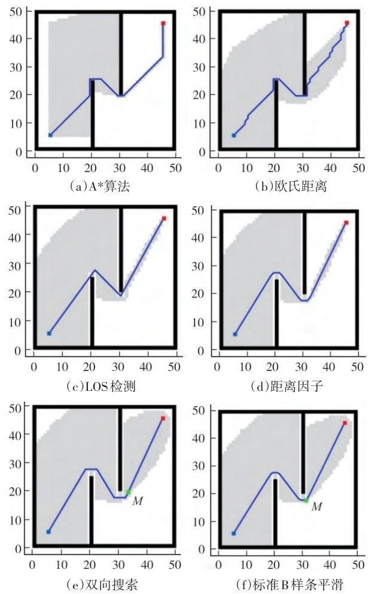

#### 1. 摘要（解决的问题）

针对轮式巡检机器人在全局路径规划中存在的核心痛点，提出改进 A * 算法的解决方案，具体问题与措施如下：

- **核心痛点**：传统 A * 算法规划的路径曲折、拐点多，影响机器人运动平顺性；路径易贴近障碍物，安全风险高；搜索效率低，难以适配化工等复杂工业场景的巡检需求。
- **解决方案**：①优化代价函数，采用欧氏距离替代曼哈顿距离作为估计代价，增加偏移因子，提升路径精准性；②引入基于距离因子的视线法（LOS），删除冗余中间节点，减少路径曲折并保持与障碍物的安全距离；③采用双向搜索策略，从起点和目标点双向扩展搜索，缩短搜索范围并提高效率；④通过准均匀 B 样条曲线对路径进行平滑处理，优化路径连续性，适配机器人运动学特性。

#### 2. 结论（效果怎么样）

经仿真实验与氯碱化工厂实地验证，改进 A_算法性能显著优于传统 A_及其他主流路径规划算法，核心效果如下：

- **路径安全性与平顺性大幅提升**：实地试验中，路径拐点数量较传统 A * 算法减少 79.41%，3 条测试路线总拐点数从 34 个降至 7 个；路径与障碍物保持安全距离，避免碰撞风险，准均匀 B 样条平滑后路径曲率连续，更贴合机器人运动需求。
- **搜索效率优化**：仿真实验中，双向搜索策略使算法运行时间较单一优化（代价函数 + 视线法）减少 18.48%；实地规划时间与传统 A * 算法相当，在复杂工业场景中仍能快速响应。
- **综合性能优于主流算法**：与 GBFS、Dijkstra、LPA_等算法相比，改进 A_算法的路径拐点个数最少（仅 4 个），路径长度适中（3.71m），兼顾了路径质量与规划效率，更适合轮式巡检机器人的实际作业需求。
- **工程适用性强**：在 1.3×10³m² 的氯碱化工厂场景中成功落地，规划路径平直、无碰撞风险，能稳定支持机器人从起始点到巡检点、充电点的自主导航，有效提升巡检效率与安全性。

## 1129

### 智能驾驶横向控制中PID与神经网络算法的对比分析研究_张梓迟

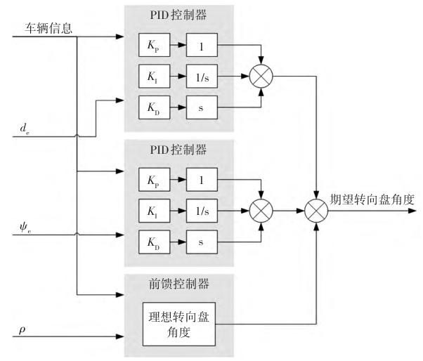
#### 1. 摘要（解决了什么问题）

针对智能驾驶横向控制中，PID 算法在复杂路况下适应性不足、神经网络算法应用对比缺乏系统性分析的问题，聚焦纯视觉方案的稳定精确控制需求，通过对比 PID 与神经网络两种核心算法，揭示其在不同路况和驾驶场景下的优势与局限性，为智能驾驶横向控制系统的优化提供理论支持，填补两类算法在横向控制应用中的对比研究空白。

#### 2. 结论（效果怎么样）

通过模拟试验与实际场景测试，两类算法在智能驾驶横向控制中的性能差异显著，核心结论如下：

- **PID 算法**：适用于道路结构清晰、环境稳定的场景（如高速公路、城市主干道），具有原理简单、易于实现、实时性好的优势，能满足基础轨迹跟踪需求；但在复杂路况（如 S 形弯道、转弯半径突变）下表现不佳，横向误差最大达 0.3m，存在转向角度振荡、对噪声和干扰鲁棒性不足的问题，且性能高度依赖参数调试。
- **神经网络算法**：在复杂多变场景（如交通拥堵、行人车辆混行、曲折道路）中优势突出，横向误差可控制在 0.1m 内，转向角度输出更平滑，对执行机构响应精度和容错率更高，鲁棒性更强；但存在数据需求大、模型训练和调参复杂、大规模数据处理时实时性可能受限的挑战。
- **综合对比**：稳定性上，神经网络算法在复杂环境中更优；实时性上，PID 算法响应更快；鲁棒性上，神经网络算法抗干扰和噪声能力更强。实际应用中需根据场景选择，或采用混合架构优化，高阶自动驾驶场景中神经网络算法的应用会更广泛。

### 基于RSG-YOLOv10n道路场景抗干扰与小目标检测方法_孔飞一

==yolov10n加三个模块==
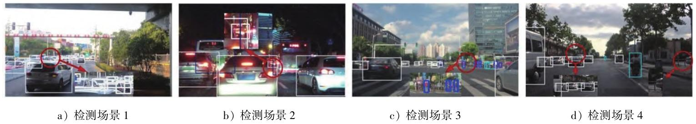

#### 1. 摘要（解决了什么问题）

针对自动驾驶道路场景目标检测中存在的背景干扰、远距离小目标难识别、目标密集遮挡导致特征缺失的核心问题，以 YOLOv10n 模型为基准，提出 RSG-YOLOv10n 检测方法，具体解决方案如下：

- 引入感受视野卷积（RFAConv）模块替换原 Conv 模块，通过多尺度感受野特征提取与注意力权重动态分配，增强模型抗背景干扰能力，适配复杂光照与恶劣天气场景；
- 设计小目标增强金字塔（SOEP）模块，融合 P2 层小目标特征并通过改进 CSP-OmniKernel 模块整合，在降低计算开销的同时提升小目标检测性能；
- 加入全局通道空间注意力（GCSA）模块，通过通道注意力、通道洗牌与空间注意力耦合，强化特征图全局依赖捕捉，缓解密集遮挡导致的特征缺失问题。

#### 2. 结论（效果怎么样）

经消融试验、多模型对比试验、通用性验证及可视化测试，RSG-YOLOv10n 模型性能显著优于基准及对比模型，核心效果如下：

- **检测精度大幅提升**：相较于 YOLOv10n，精确率（P）提升 6.3 个百分点，召回率（R）提升 2.5 个百分点，mAP50 提升 3.5 个百分点，mAP50-95 提升 2.8 个百分点，综合检测能力显著增强；
- **小目标与抗干扰性能突出**：SOEP 模块使小目标检测 mAP50 较基准模型提升 2.5 个百分点，且计算开销增量小于单独新增 P2 检测层；RFAConv 模块有效抑制恶劣天气与复杂光照干扰，在沙尘、大雪、浓雾场景中，mAP50 较 YOLOv10n 提升 0.9 个百分点，mAP50-95 提升 1.3 个百分点；
- **参数量与精度平衡最优**：参数量仅 3.58×10⁶、浮点运算次数 13.7×10⁹，在较低计算开销下，检测精度优于 YOLOv5n、YOLOv8n 等低参数量模型，也超过 YOLOv3-ting、YOLOv6n 等相近参数量模型，甚至优于高参数量的 RT-DETR-L 模型；
- **场景适配性强**：可视化测试表明，模型在密集遮挡、复杂光照、远近目标共存及恶劣天气场景中，漏检率与误检率显著低于 YOLOv10n，能稳定识别远处行人、车辆等小目标，鲁棒性与泛化能力满足自动驾驶实际需求。

### 改进DeeplabV3plus的道路场景分割算法_陈雨佳
#### 1. 摘要（解决了什么问题）

针对 DeeplabV3plus 模型在道路场景分割中整体精度不足，尤其是小目标（行人、非机动车）分割效果差、特征融合不充分的核心问题，提出融合注意力机制的改进 DeeplabV3plus 模型，具体解决方案如下：

- 编码器替换为 ResNet50 并引入膨胀卷积，增大感受野，提升特征提取能力，避免深层网络梯度消失；
- 设计 UCA 解码器模块，充分融合编码器 4 个下采样层特征与原图，结合双线性插值上采样，强化边界轮廓清晰度与小目标捕捉能力；
- 在 UCA 模块中嵌入坐标注意力（CA）机制，兼顾通道依赖与空间位置信息，捕捉长距离依赖，聚焦重要目标，过滤浅层特征噪声。

#### 2. 结论（效果怎么样）

经 Cityscape 数据集与自建道路数据集验证，改进模型性能显著优于原模型及主流分割算法，核心效果如下：

- **整体分割精度提升**：平均交并比（mIoU）较原 DeeplabV3plus 提升 2.6%（达 86.8%），像素精确度（PA）提升 0.9%（达 97.1%），优于 U-Net、Lraspp 等对比模型；
- **小目标分割效果突出**：行人分割 IoU 提升 3.2%（达 80.2%），非机动车分割 IoU 提升 4.3%（达 72.2%），有效解决小目标漏检、误检问题；
- **关键区域分割更精准**：可行驶区域分割精度提升 2%（达 93.3%），能准确区分天空背景与可行驶区域，减少决策干扰；
- **性价比优异**：仅增加约 11% 参数量（44.19×10⁶），在引入注意力机制的模型中，CA 机制相较于 SE、CBAM，以极小参数量增量（0.006×10⁶）实现 0.3% 的 mIoU 提升，兼顾精度与效率。

 

### 基于模糊逻辑与SLAM的园区智能配送机器人视觉控制研究_王涛

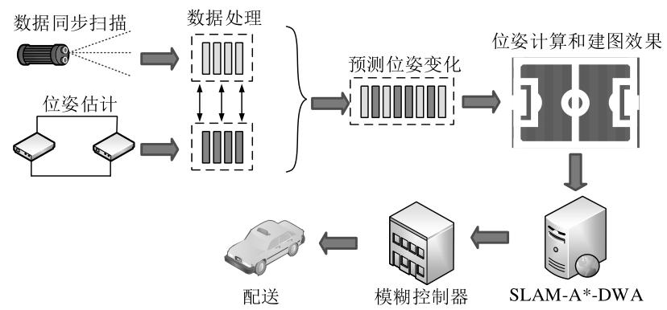

#### 1. 摘要（解决了什么问题）

针对园区智能配送机器人视觉控制中路径规划效率低、定位建图精度不足、复杂环境适应性差的核心问题，以 SLAM 技术为基础框架，融合全局静态 A_算法、动态窗口法（DWA）与模糊逻辑，提出一种视觉控制模型。通过 SLAM 构建实时栅格地图，A_算法规划全局最优路径，DWA 算法处理局部动态避障，模糊逻辑实现柔性控制，结合位姿图优化（PGO）提升定位建图精度，解决机器人在园区复杂环境下的路径规划与精准控制难题。

#### 2. 结论（效果怎么样）

经 OpenSLAM 与 RoboCup@Home 数据集仿真验证，该视觉控制模型性能显著优于传统算法，核心效果如下：

- **路径规划最优**：当权重系数为 0.6 时，算法综合性能最佳，搜索路径节点数 58 个，搜索成功率达 96.65%；规划的配送路径最短仅 17.02m，较 DWA 算法（24.03m）缩短 7.01m，较 RTT 算法（19.02m）缩短 2m，路径优化效果显著。
- **定位建图精度高**：结合 PGO 算法优化后端数据处理，轨迹误差仅 0.02%，远低于未改进模型，定位与建图的稳定性和可靠性大幅提升。
- **环境适应性强**：SLAM-A*-DWA 算法融合全局规划与局部避障，模糊逻辑增强控制灵活性，能应对园区内动静态障碍物，适配复杂配送场景。
- **实用性突出**：有效提升园区智能配送机器人的配送效率与准确性，为复杂环境下机器人的路径规划与视觉控制提供了可靠技术支撑。

### 基于改进A~_和DWA融合的机器人路径规划_崔鹏鹏

#### 1. 摘要（解决了什么问题）

针对送餐机器人在复杂餐饮环境中自主导航存在的路径规划效率低、避障实时性不足、转弯频繁、定位精度有限的核心问题，以激光 SLAM 为基础框架，提出融合改进 A * 算法与改进 DWA 算法的解决方案，具体如下：

- 优化全局路径规划：针对传统 A * 算法搜索空间冗余、规划时间长、转弯频繁的问题，通过优选欧几里得距离启发函数、动态调整权重系数、优化拐角方向，提升路径质量与规划效率；
- 改进局部路径规划：针对传统 DWA 算法易陷入局部极值、路径平滑性差的问题，引入偏离距离评价函数和姿态调整函数，增强动态避障的安全性与轨迹平滑度；
- 融合路径架构设计：结合改进 A * 的全局最优规划能力与改进 DWA 的实时避障能力，搭配 Karto-SLAM 建图与粒子滤波定位，解决单一算法难以兼顾全局最优与局部动态避障的矛盾。

#### 2. 结论（效果怎么样）

经仿真环境与实际楼道场景（“T” 字形 135m²）验证，该自主导航系统性能显著优于传统算法，核心效果如下：

- **路径规划性能大幅提升**：改进后 A * 算法拐角个数减少约 40%，规划时间缩短约 61.89%；融合算法使整体路径长度缩短 15%，拐角个数减少 30%，规划时间减少 50%，轨迹更平滑；
- **定位与导航精度可靠**：定点导航中，x/y 轴最大位置偏差分别为 0.052m/0.064m，平均偏差 0.045m，平均角度偏差 0.057rad；多目标点导航规划时间较单一定点导航减少 26.5%，成功率达 95% 以上；
- **避障鲁棒性强**：静态障碍物避障成功率达 97%，x/y 轴最大位置偏差 0.080m/0.088m，平均偏差 0.072m；动态障碍物避障成功率达 95% 以上，x/y 轴最大位置偏差 0.106m/0.113m，平均偏差 0.098m，可有效应对餐饮场景中的桌椅、行人等动静态障碍；
- **建图与定位稳定**：采用 Karto-SLAM 算法建图精度最优，无墙体错位与偏移；粒子滤波定位能精准跟踪机器人轨迹，减少累积误差，为导航提供可靠位姿支撑。

## 1130

### 应急情景下融合改进D_Lite算法和DWA算法的无人驾驶汽车路径规划_刘连玉

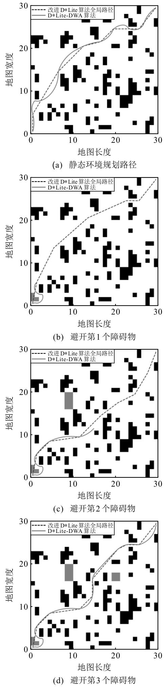

#### 1. 摘要（解决了什么问题）

针对传统路径规划算法在无人驾驶应急场景中存在的环境建模失真、路径搜索效率低、安全性不足，以及全局路径对动态环境适应性差的核心问题，提出基于高精度城市电子地图的 “全局 - 局部” 耦合路径规划框架，具体解决方案如下：

- 改进全局路径规划（D*Lite 算法）：采用五邻域搜索策略替代八邻域搜索，避免路径曲折；融合风险系数构建多目标代价函数，降低路径累积风险；通过二次优化去除冗余节点，提升路径平滑性。
- 改进局部路径规划（DWA 算法）：设计含风险评价的动态评价函数，增强局部避障的实时性与安全性，适配应急场景下的风险感知需求。
- 构建耦合架构：以改进 D*Lite 算法动态生成全局路径并提供关键节点，引导改进 DWA 算法执行局部避障，实现全局路径动态优化与局部避障协同，适配交通事故规避、突发乘客需求等应急情景。

#### 2. 结论（效果怎么样）

经栅格环境仿真、Carla 平台验证及应急情景测试，该耦合算法性能显著优于传统算法，核心效果如下：

- **路径安全性大幅提升**：改进 D*Lite 算法在简单栅格环境中，风险累积值较对比算法分别降低 30.74%、36.20%、25.52%；复杂环境中分别降低 23.44%、25.00%、12.24%，有效降低应急场景下的行驶风险。
- **规划效率与稳定性优**：耦合算法规划时间较 A*-DWA 算法减少 35.10%，迭代次数减少 34.98%，路径长度标准差（1.667）远小于 A*-DWA 算法（4.042），动态环境中避障更稳定，路径曲折度低。
- **应急适配性强**：能有效应对必经区约束、固定方向节点、信号灯时间约束等应急情景，可快速调整路径满足突发需求，如避开红灯缩短出行时间、响应交警指挥调整行驶方向。
- **实用价值突出**：Carla 平台城市交通环境验证中，能稳定躲避动态车辆，按规划路径安全行驶；耦合框架兼顾全局优化与局部动态避障，为无人驾驶应急场景下的安全行驶提供可靠理论支持。

### 基于激光slam的送餐机器人自主导航研究_高策

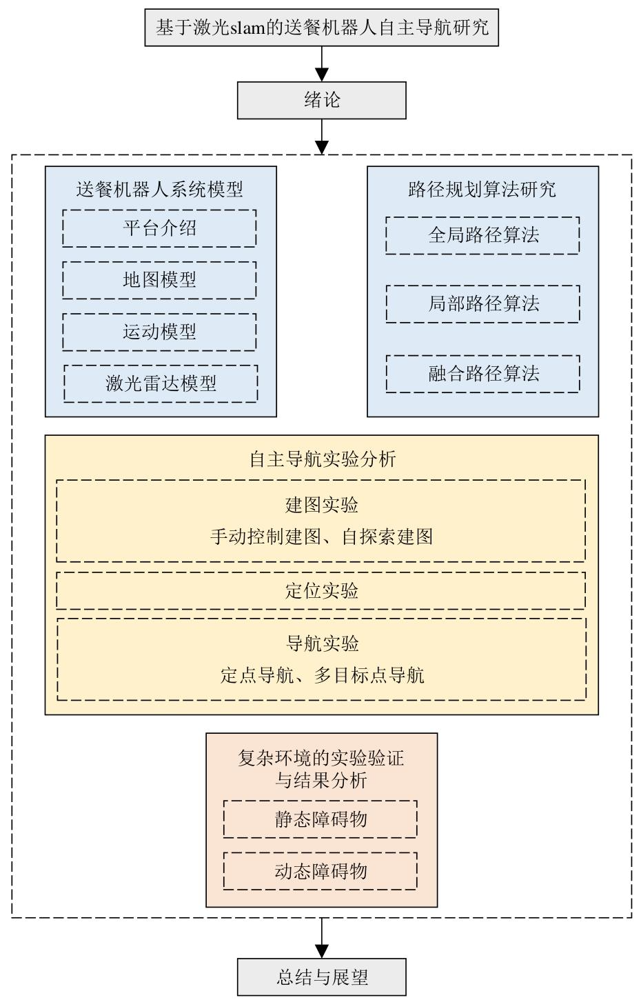

#### 1. 摘要（解决了什么问题）

针对送餐机器人在复杂餐饮环境中自主导航存在的传统算法路径规划效率低、避障实时性不足、路径拐角多、动态环境适应性差的核心问题，以激光 SLAM 为基础构建完整自主导航系统，提出融合改进 A * 算法与改进 DWA 算法的解决方案，具体如下：

- 改进全局路径规划（A_算法）：优化启发函数选用欧几里得距离，动态调整权重系数，改进拐角处理策略，解决传统 A_算法搜索空间冗余、规划时间长、频繁转向的问题；
- 改进局部路径规划（DWA 算法）：引入偏离距离评价函数体系，增加姿态调整函数动态修正航向偏差，解决传统 DWA 算法易陷入局部极值、路径平滑性差、大幅转弯的问题；
- 融合路径规划架构：结合改进 A * 的全局最优路径规划能力与改进 DWA 的实时避障能力，通过 Karto-SLAM 算法建图与粒子滤波定位，实现全局路径与局部避障的协同，适配静态与动态障碍物并存的复杂场景。

#### 2. 结论（效果怎么样）

经仿真环境与实际楼道场景（“T” 字形 135m²）验证，该自主导航系统性能显著优于传统算法，核心效果如下：

- **路径规划效率与质量双提升**：改进 A * 算法拐角个数减少约 40%，规划时间缩短约 61.89%；融合算法使路径长度缩短 15%，拐角个数减少 30%，轨迹更平滑，无多余转向；
- **定位与导航精度可靠**：定点导航中，x 轴最大偏差 0.052m，y 轴最大偏差 0.064m，平均偏差 0.045m，平均角度偏差 0.057rad；多目标点导航规划时间较单一定点导航减少 26.5%，成功率达 95% 以上；
- **避障鲁棒性强**：静态障碍物避障成功率达 97%，x/y 轴最大偏差 0.080m/0.088m，平均偏差 0.072m；动态障碍物避障成功率达 95% 以上，x/y 轴最大偏差 0.106m/0.113m，平均偏差 0.098m，可有效应对餐饮场景中的桌椅、行人等障碍；
- **建图与定位稳定**：采用 Karto-SLAM 算法建图精度最优，无墙体错位与偏移；粒子滤波定位能精准跟踪机器人轨迹，减少累积误差，为导航提供可靠位姿支撑，适配手动控制建图与自探索建图两种模式。

### 基于改进A_算法与DWA算法的移动机器人路径规划方法研究_张登星

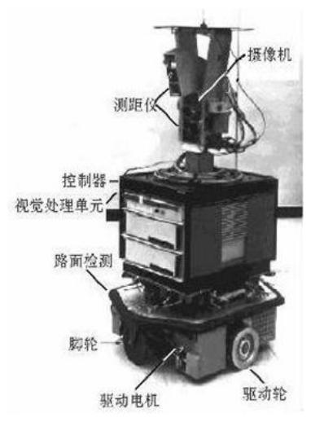

#### 1. 摘要（解决了什么问题）

针对移动机器人路径规划中传统算法存在的路径冗余点多、拐点距离障碍物过近、易陷入局部最优、运动稳定性不足的核心问题，提出融合改进 A * 算法与改进 DWA 算法的混合路径规划方法，具体解决方案如下：

- 改进全局路径规划（A * 算法）：融合人工势场法，设计转弯代价函数减少转弯次数，引入斥力场思想确保拐点远离障碍物，提升路径平滑性与安全性；
- 改进局部路径规划（DWA 算法）：新增贴合全局路径的轨迹评价函数，避免陷入局部最优，基于路径曲率对角速度变化量进行约束，降低抖动，增强运动稳定性；
- 构建混合规划架构：整合改进 A * 与改进 DWA 的优势，结合栅格法环境建模与差速轮式机器人运动学模型，实现全局路径最优与局部动态避障的协同，适配智能工厂、仓储物流等复杂场景。

#### 2. 结论（效果怎么样）

经 MATLAB 仿真、Gazebo 仿真及真实场景实验验证，该混合路径规划方法性能显著优于传统算法，核心效果如下：

- **路径质量大幅提升**：改进 A * 算法在复杂环境中，总转弯角度降低 21.7%，障碍物附近拐点数量减少 40.0%，路径无额外长度增加；混合算法使路径冗余点数量降低 50.0%，有效解决冗余点过多问题；
- **运动稳定性显著增强**：改进 DWA 算法通过角速度约束，使角速度方差降低 37.0%-42.0%，机器人运动抖动大幅减少，转向更平稳；
- **避障与全局适配性优**：混合架构避免 DWA 算法局部最优问题，能实时躲避静态与动态障碍物，在多障碍物、狭窄通道场景中均能稳定通行；
- **实际应用可靠**：真实场景多目标点巡航实验中，机器人最终到达目标点的误差均小于 0.15m，定位精准，自主导航与避障功能稳定可行，适配复杂环境下的作业需求。

### 基于香菇工厂环境下的移动机器人导航系统研究_吕向宇

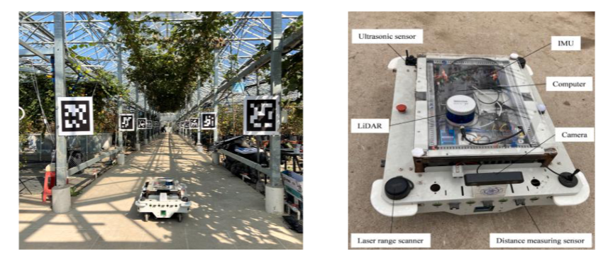

#### 1. 摘要（解决了什么问题）

针对香菇工厂菇房通道狭窄、结构复杂、传感器感知有盲区，传统导航方案地图易扭曲偏移、路径平滑性不足、避障鲁棒性差的核心问题，设计适用于该场景的移动机器人导航系统，具体解决方案如下：

- 优化定位与建图：构建误差状态卡尔曼滤波器融合 IMU 与里程计数据，校正激光点云畸变；采用双激光雷达数据融合，弥补单一雷达扫描盲区，改进 Cartographer 算法实现高精度地图构建。
- 改进路径规划：全局路径规划采用优化 A * 算法，减少路径冗余拐点；局部路径规划选用 DWB 算法，引入模块化轨迹评分机制与轨迹平滑度指标，提升动态环境适应性。
- 增强避障能力：引入深度相机，将三维点云预处理后投影至局部代价地图，弥补单线激光雷达对上下方障碍物的感知缺陷，提升避障全面性。

#### 2. 结论（效果怎么样）

经仿真与香菇工厂实地测试，该导航系统性能显著适配场景需求，核心效果如下：

- **地图构建更精准完整**：双激光雷达障碍物覆盖率达 9.04%，较单一雷达平均提升 2.07%，有效解决盲区问题；改进 Cartographer 算法构建的地图无明显扭曲偏移，满足狭窄通道导航需求。
- **路径规划更平滑高效**：优化 A * 算法减少路径冗余拐点，DWB 算法提升轨迹平滑性，机器人在 0.7m/s 速度下仍能稳定行驶，无频繁转向情况。
- **定位与导航精度可靠**：组合定位算法较单一里程计定位误差显著降低；导航时最大纵向偏差不超过 8.0cm，横向偏差不超过 6.0cm，航向偏差控制在 5.0° 以内，符合菇房作业精度要求。
- **避障鲁棒性强**：深度相机与双激光雷达融合感知，可识别悬空货架、低矮障碍等激光雷达难探测的障碍物，动态避障成功率高，适配菇房复杂环境。

### 基于三级去畸变和分层降采样机制的F-LOAM改进算法_徐鹤

#### 1. 摘要（解决了什么问题）

针对传统 F-LOAM 算法仅对第一阶段特征点进行去畸变、第二阶段去畸变仅用于建图，导致位姿估计准确性不足，且复杂场景下计算量较大、实时性欠佳的核心问题，提出改进的 CH-F-LOAM 算法，具体解决方案如下：

- 设计三级去畸变机制：新增基于匀速模型的原始点云去畸变环节，补充特征点去畸变对畸变点的处理，结合位姿估计后的畸变补偿与 3D 地图构建，提升特征点有效性与位姿估计精度；
- 引入分层降采样机制：基于体素化网格，对局部特征点（分扇区提取后）和整体特征点分别进行降采样，平面点降采样规模为边缘点的两倍，在保留局部与整体特征的同时减少计算量；
- 优化算法架构：整合上述机制，不依赖额外传感器，避免多传感器时间同步与校准难题，兼顾定位精度与实时性。

#### 2. 结论（效果怎么样）

经 KITTI07 数据集验证，改进后的 CH-F-LOAM 算法性能显著优于传统 F-LOAM 及主流 SLAM 算法，核心效果如下：

- **定位精度大幅提升**：均方根误差较 F-LOAM 减少约 14%（从 0.837m 降至 0.722m），最大误差从 1.822m 降至 1.281m，轨迹更接近真值，位姿估计稳定性显著增强；
- **误差稳定性更优**：定位误差标准差较 F-LOAM 减少约 32.7%（从 0.366 降至 0.246），整个轨迹的绝对误差分布更平稳，抗环境噪声能力提升；
- **实时性显著增强**：每帧处理时间较 F-LOAM 减少约 24.2%（从 103ms 降至 78ms），特征点数量减少 20%，在保证精度的同时降低计算负担；
- **综合性能领先**：相较于 A-LOAM，处理时间更短、精度更高；相较于去回环检测的 LeGO-LOAM，定位精度更优，适配高精度、高效率的 SLAM 应用场景。

## 1201
### 智能割草机RTK-VIO融合定位算法_李嘉诚
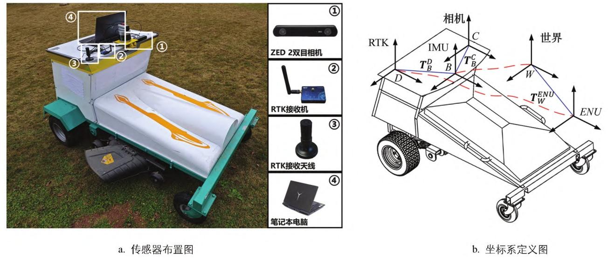

#### 1. 摘要（解决了什么问题）

针对智能割草机作业时振动噪声大、作业环境图像纹理高度重复、缺乏闭环路径，导致单一 VIO 定位易出现漂移甚至丢失的核心问题，提出融合 RTK 与 VIO 的紧耦合定位算法，具体解决方案如下：

- 构建紧耦合架构：将 RTK 定位测量融入 ORB-SLAM3 的 VIO 框架，设计 RTK 残差计算方法，实现低频、高精度工况下两者的深度融合；
- 设计联合初始化策略：通过纯视觉优化、纯 IMU 优化及视觉 - IMU 联合优化三步流程，将 RTK 测量信息与纯视觉优化位姿对齐，获取割草机速度、重力方向和 IMU 偏差初始值；
- 适配作业场景：无需额外传感器，兼容 1Hz RTK 接收机、15 帧 / 秒双目视觉传感器及 200Hz IMU，在无闭环的作业路径中缓解定位漂移与误差累积。

#### 2. 结论（效果怎么样）

经简单、一般、困难三种工况的实地实验验证，该 RTK-VIO 融合定位算法性能显著优于单一 VIO 定位方法，核心效果如下：

- **定位精度大幅提升**：简单工况下绝对位姿误差均值降低 0.288m，均方根误差降低 0.221m；一般工况下均值降低 0.926m，均方根误差降低 1.015m；困难工况下均值降低 0.137m，均方根误差降低 0.128m，有效抑制定位漂移；
- **稳定性更强**：在振动明显、视觉纹理重复、多转弯的困难场景中，融合算法定位轨迹更贴近真实轨迹，避免了单一 VIO 在转弯处的抖动与转角计算偏差问题；
- **实时性不受影响**：引入的额外处理延迟小于 10ms，局部 BA 过程耗时与局部建图总耗时虽有毫秒级增加，但标准差表现更稳定，不影响割草机自动化作业需求。

### 基于LightGlue网络改进的输电线路巡检无人机V-SLAM方法_祝文姬

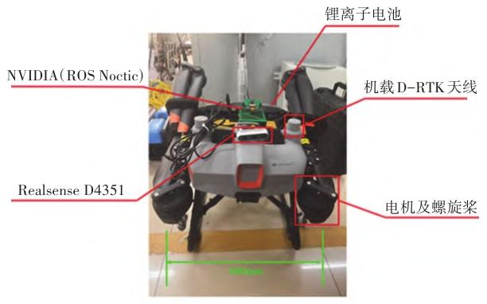

#### 1. 摘要（解决了什么问题）

针对输电线路巡检无人机 V-SLAM 定位精度易受视角变化、光照波动影响，且传统算法特征匹配准确率低、实时性不足、地图内存占用大的核心问题，提出基于 LightGlue 网络改进的 LG-SLAM 方法，具体解决方案如下：

- 优化特征提取：采用轻量级 SuperPoint 网络，提取对光照和视角变换更鲁棒的特征点，替代传统 ORB 特征，提升复杂环境下特征点的稳定性；
- 改进特征匹配：通过 LightGlue 网络结合并行优化的图像金字塔模型，增强帧间特征匹配准确率，同时提升算法实时处理速度；
- 优化地图存储：将点云地图转化为八叉树地图，在保留障碍物占据概率信息的前提下，大幅降低内存占用，适配无人机有限存储资源。

#### 2. 结论（效果怎么样）

经 EuRoc 数据集测试、模拟场景实验及输电线路现场飞行验证，LG-SLAM 算法性能显著优于传统算法，核心效果如下：

- **定位精度大幅提升**：EuRoc 数据集测试中，定位精度较 OpenVSLAM 提升约 28.34%，其中低光照、视角剧烈变化场景（V1 序列）精度提升达 37.07%；真实输电线路场景中，绝对轨迹误差较 OpenVSLAM 平均降低 33.61%，能精准捕捉线路与杆塔轮廓；
- **实时性显著增强**：较改进前的 SL-ORB-SLAM2，实时性提升约 33.30%，每帧处理平均耗时 44.51ms，满足后端非线性优化最低 10 帧 / 秒的速率要求；
- **环境适应性更强**：在视角变换、光照波动、图像模糊等场景中，特征匹配平均准确率（mAP）显著高于 ORB + 暴力匹配等传统方法，Graffiti 序列中匹配准确率提升 47.1 个百分点；
- **内存占用大幅降低**：构建的八叉树地图较点云地图内存占用减少约 47.28%，仅需 1.36GB 即可存储输电线路三维环境信息，适配无人机轻量化需求。

### 高效场景表征的机器人实时SLAM算法_舒志旭

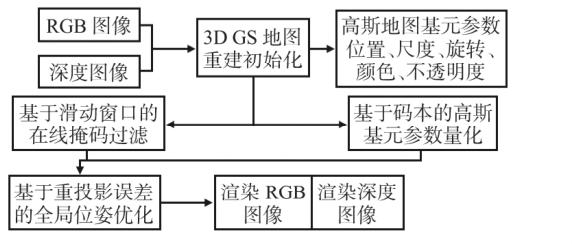

#### 1. 摘要（解决了什么问题）

针对基于 3D 高斯溅射（3D GS）的 SLAM 技术在机器人应用中存在的高内存占用、存储成本高、计算效率低的核心问题，提出一种高效场景表征的实时 SLAM 算法，具体解决方案如下：

- 动态剔除冗余：采用滑动窗口屏蔽策略，结合高斯椭球体的体积和不透明度，在线动态剔除冗余椭球体，降低计算负载；
- 压缩几何属性：设计基于几何码本的残差矢量量化方法，对高斯椭球体的尺度、旋转、不透明度、颜色等属性进行压缩，减少存储需求；
- 优化位姿估计：采用结合重投影损失（RGB 损失 + 深度损失）的局部到全局束平差方法，提升相机姿态估计的鲁棒性和精度。

#### 2. 结论（效果怎么样）

经 Replica、ScanNet 等数据集验证，该 SLAM 算法在保持场景表示质量的同时，性能全面优于传统 3D GS 类 SLAM 方法，核心效果如下：

- **内存占用大幅降低**：场景参数量仅为 110MB，较 ESLAM（198MB）减少 1.8 倍，解决了 3D GS 类方法内存冗余的关键问题；
- **计算效率显著提升**：渲染速度达 347fps，较主流 SplaTAM（125fps）提高 150%，满足机器人实时导航与操作需求；
- **定位精度明显增强**：姿态估计精度提升 20%，Replica 数据集上平均绝对轨迹误差（ATE）仅 0.30m，优于 SplaTAM（0.36m）和 MonoGS（0.38m）；
- **场景表征质量稳定**：在峰值信噪比（PSNR）、结构相似性指数（SSIM）等指标上与 SplaTAM 相当，优于基于 NeRF 的 NICE-SLAM、ESLAM 等方法，保证高保真重建效果。

### 多模态融合事件相机SLAM技术研究综述_赵军阳

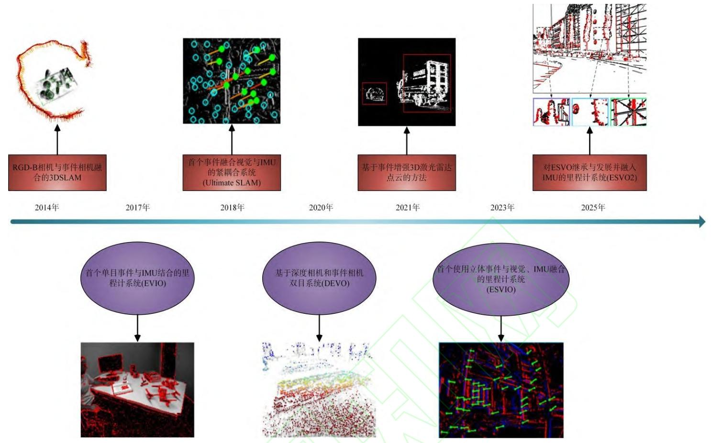

#### 1. 摘要（解决了什么问题）

针对传统视觉传感器在高动态范围、高速运动、弱光等极端场景下存在动态范围窄、运动模糊、光照敏感的缺陷，且单模态事件相机 SLAM 存在纹理表征缺失、噪声鲁棒性差、信号完整性不足等问题，本文综述多模态融合事件相机 SLAM 技术，核心是通过多传感器协同弥补单一模态局限，具体解决方案如下：

- 单模态事件相机优化：分为单目与立体事件 SLAM，针对性解决单目系统高速运动位姿漂移、立体系统事件匹配与初始化瓶颈；
- 多模态融合架构：涵盖事件与惯性、事件 - 视觉 - 惯性、事件与 RGB-D / 激光雷达 / 红外等多源传感器融合，通过跨模态互补补偿事件流稀疏性与噪声敏感性；
- 算法与机制创新：设计紧耦合优化框架、时空同步机制、噪声抑制策略，提升系统在极端场景下的定位精度、实时性与鲁棒性。

#### 2. 结论（效果怎么样）

多模态融合事件相机 SLAM 技术通过跨模态协同，显著突破传统视觉 SLAM 与单模态事件 SLAM 的应用局限，核心效果如下：

- **场景适应性大幅提升**：在高动态范围、高速运动、弱光、浓烟等极端场景下，较传统视觉 SLAM（如 ORB-SLAM3、VINS-Mono）的平均旋转误差（MRE）和平均位置误差（MPE）降低一个数量级，可稳定实现定位与建图；
- **定位精度显著增强**：事件 - 视觉 - 惯性三模态融合系统（如 PL-EVIO、ESVIO）在公开数据集上，MPE 最低可达 0.17%，MRE 低至 0.16°/m，优于单一模态系统，且能抑制低纹理区域的姿态漂移；
- **功能覆盖更全面**：多源融合（事件 + 激光雷达 / RGB-D / 红外）系统可实现动态避障、深度补全、烟雾穿透等功能，如事件与激光雷达融合使高速旋转目标召回率提升，事件与红外融合增强复杂光照下的目标轮廓识别；
- **实时性与鲁棒性平衡**：通过事件驱动特性与多模态优化，系统在保证微秒级延迟的同时，降低计算负载，部分方案可在 CPU 上实现实时 6DOF 跟踪与半稠密建图，适配无人机、机器人等移动平台。

### 基于改进YOLACT++的语义SLAM系统_任伟建

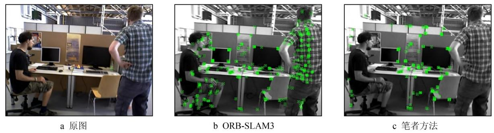
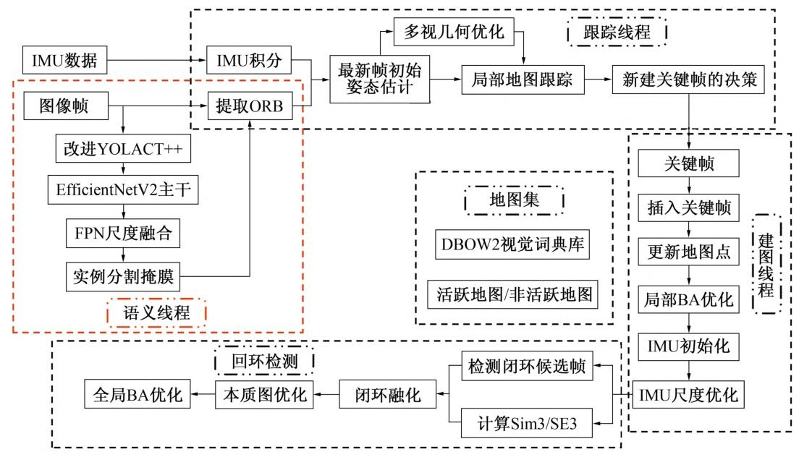
#### 1. 摘要（解决了什么问题）

针对 ORB-SLAM3 系统依赖静态场景假设，在前端特征计算与匹配过程中易受动态物体干扰，导致动态环境下定位精度下降的核心问题，提出基于改进 YOLACT++ 的语义 SLAM 方案，具体解决方案如下：

- 引入并行语义线程：在 ORB-SLAM3 前端并行 YOLACT++ 实例分割线程，生成动态物体掩膜，滤除掩膜区域内的动态 ORB 特征点；
- 优化分割网络性能：用 EfficientNetV2 替换 YOLACT++ 原 ResNet50 主干网络，减少模型参数并提升分割效率，再通过 TensorRT 量化模型，降低前端计算压力；
- 补充动态一致性检验：在局部地图跟踪阶段加入多视几何约束方法，剔除掩膜区域外的零散动态特征点，强化静态特征约束。

#### 2. 做了什么实验（设备与环境）

##### 2.1 实验硬件

- 核心计算设备：搭载 NVIDIA RTX 2060 GPU 的电脑；
- 无额外专用传感器，依赖数据集提供的视觉与深度数据。

##### 2.2 实验软件环境

- 操作系统：Windows 系统与 Ubuntu 18.04 系统；
- 开发框架与工具：Pytorch 1.7.1、CUDA 10.2、CUDNN 7.5、Python 3.6、OpenCV 3.4.3；
- 量化工具：TensorRT（用于模型推理加速）。

##### 2.3 实验数据集

- 核心测试数据集：TUM RGB-D 数据集，重点选用 fr3_walking_halfsphere、fr3_walking_rpy、fr3_walking_xyz、walking_static 等 4 个高动态序列；
- 辅助测试数据集：ImageNet 数据集（用于对比 ResNet50 与 EfficientNetV2 网络性能）。

##### 2.4 实验内容

- 分割网络性能测试：对比 ResNet50 与不同尺度 EfficientNetV2 的 Top-1 准确率、参数量、推理速度等指标；
- 分割精度验证：在 TUM 数据集上对比改进 YOLACT++ 与 Mask R-CNN、原始 YOLACT++ 的检测框精确率和实例分割精确率；
- 系统定位精度测试：在高动态序列中，对比改进 SLAM 系统与 ORB-SLAM3、DS-SLAM 的绝对轨迹误差（ATE）均方根误差（RMSE）和标准差（SD）；
- 模型推理优化测试：通过 TensorRT 量化改进 YOLACT++ 模型，测试不同量化配置下的推理帧率。

#### 3. 结论（效果怎么样）

经实验验证，改进后的语义 SLAM 系统在动态环境下性能显著优于原有方案，核心效果如下：

- 分割网络性能提升：EfficientNetV2-S 相较于 ResNet50，Top-1 准确率提升 7.9%，参数量减少 4×10⁶个，推理速度提升 4.7×10⁹ FLOPs；改进 YOLACT++ 的检测框加权平均精确率提升 5.89%，分割加权平均精确率提升 6.65%；
- 推理效率优化：经 TensorRT 量化后，分割模型推理帧率达 27.8 F/s，有效降低前端计算延迟；
- 定位精度大幅提高：高动态环境下定位精度较 ORB-SLAM3 平均提升 80.6%，其中 walking_xyz 序列 RMSE 降低 83.7%，walking_rpy 序列降低 79.6%，walking_half 序列降低 78.5%；
- 鲁棒性增强：多视几何约束与实例分割结合，全面剔除动态特征点干扰，系统轨迹估计偏差显著降低，优于 DS-SLAM 等对比算法。

## 1204

### 神经网络辅助卡尔曼滤波组合导航算法的现状与展望_陈晓锋

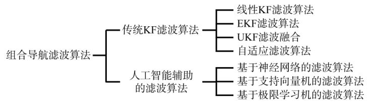

#### 1. 摘要（解决了什么问题）

核心解决 GNSS/INS 组合导航系统中，卫星信号受干扰、失锁或可解算卫星数少于 4 颗时，传统卡尔曼滤波算法性能下降、定位精度发散，且惯导系统误差随时间累积的关键问题。具体通过神经网络与卡尔曼滤波融合，利用神经网络强大的非线性学习和预测能力，弥补单一滤波算法的局限性，同时针对松组合、紧组合、深组合不同融合模式的特点，优化数据融合精度与系统鲁棒性，解决以下具体问题：

- 松组合中卫星失锁后惯导误差快速累积，导致定位精度急剧下降的问题；
- 紧组合中卫星信号质量差时，伪距、伪距率等原始数据融合鲁棒性不足的问题；
- 传统组合导航算法对非线性系统建模不足、抗干扰能力弱的问题。

#### 2. 做了什么实验（设备与环境）

##### 2.1 实验硬件

- 导航传感器：GNSS 接收机（含北斗、GPS 等系统）、惯性导航系统（INS）、MEMS-IMU（低成本惯性测量单元）；
- 计算设备：ARM 处理器（如 ARM Cortex-M7）、FPGA 芯片、通用计算机（用于算法仿真与训练）；
- 辅助设备：卫星信号模拟器（用于模拟信号失锁、干扰场景）、数据采集卡（用于传感器数据同步采集）。

##### 2.2 实验软件与环境

- 核心算法：传统卡尔曼滤波（KF）、扩展卡尔曼滤波（EKF）、无迹卡尔曼滤波（UKF）；神经网络模型（BP 神经网络、CNN、LSTM、RBFNN、NARX、MLP 等）；支持向量机（SVM）、极限学习机、随机森林回归等人工智能算法；
- 实验环境：
    1. 仿真环境：基于 MATLAB 等工具构建组合导航仿真平台，模拟卫星信号良好、失锁（短时间 / 长时间中断）、强干扰等场景；
    2. 实测环境：城市道路、室内场景、船舶航行、无人机飞行等实际应用场景，覆盖卫星信号遮挡、多路径干扰等复杂工况；
- 数据处理：通过传感器采集惯导位置 / 速度数据、GNSS 定位数据及原始观测数据（伪距、伪距率），利用神经网络训练数据特征，结合卡尔曼滤波进行状态估计与误差校正。

##### 2.3 实验内容

- 算法对比实验：在不同卫星信号场景下，对比传统卡尔曼滤波与神经网络辅助卡尔曼滤波（如 BP-KF、CNN-EKF、LSTM-EKF 等）的定位精度（位置 / 速度均方根误差）、误差累积速率；
- 不同组合模式验证：验证神经网络在松组合（基于导航结果融合）、紧组合（基于原始观测数据融合）中的应用效果，测试卫星失锁 60s 内、长时间中断等场景的系统稳定性；
- 故障诊断与抗干扰测试：测试神经网络辅助算法对组合导航系统故障的识别能力（如 6 种典型故障），以及在低信噪比、信号欺骗场景下的抗干扰性能；
- 硬件适配实验：验证算法在 ARM 处理器、FPGA 等嵌入式平台的可移植性与实时性。

#### 3. 结论（效果怎么样）

经仿真与实测验证，神经网络辅助卡尔曼滤波组合导航算法在定位精度、鲁棒性、抗干扰能力等方面均有显著提升，核心效果如下：

- 定位精度大幅改善：卫星失锁场景下，位置误差显著降低，如 LSTM-EKF 北向、东向定位误差分别降至 1.17m 和 0.84m；卫星失锁 60s 内，位置最大误差可控制在 5.1m 内，速度最大误差 0.15m/s，较纯惯导和传统滤波算法精度提升明显；
- 误差累积有效抑制：神经网络能精准预测惯导误差趋势，反馈校正后有效遏制误差累积，短时间卫星失锁时误差可抑制在几米以内；
- 鲁棒性与抗干扰能力增强：能适应卫星信号遮挡、干扰、欺骗等复杂场景，故障诊断率稳定在 98.429%，循环神经网络辅助算法较径向基神经网络位置和速度均方根误差降低 39%；
- 适配多种应用场景：可应用于无人机、新能源汽车、船舶、飞行器等领域，支持低成本硬件平台（如 ARM 处理器）移植，兼顾精度与工程实用性；
- 组合模式适配性优化：松组合中应用成熟，紧组合中通过预测滤波新息降低欺骗干扰影响，深组合中具备进一步优化潜力，为全场景高精度导航提供可能。

### 基于抗差自适应卡尔曼滤波的BDS-3_UWB融合定位算法研究_买买提·努尔

#### 1. 摘要（解决了什么问题）

核心解决 BDS-3（北斗三号）在复杂环境（如遮挡、干扰场景）下信号脆弱、可见卫星数量不足，导致定位精度不足、作用范围有限的问题。具体针对传统定位算法（如最小二乘法）易受观测粗差、动力学模型偏差影响的缺陷，通过融合 BDS-3 与 UWB（超宽带）的优势，采用抗差自适应卡尔曼滤波（RAKF）算法，弥补单一导航系统的局限性，同时探究 UWB 基站数量、高度对融合定位性能的影响，实现复杂环境下更高精度的定位。

#### 2. 做了什么实验（设备与环境）

##### 2.1 实验硬件

- 导航与测距设备：NovAtel BDS-3 接收机（采集 B1I、B1C_pilot 信号，采样频率 1Hz）、DecaWave DW1000 芯片 UWB 模块（支持 DS-TWR 双边双向测距，遵循 IEEE 802.15.4-2011 标准）；
- 辅助设备：UWB 定位基站（用于布设不同数量、高度的实验场景）、参考点定位装置（用于误差校准）；
- 数据处理设备：计算机（用于数据解算、算法验证及误差分析）。

##### 2.2 实验设计与环境

- 实验场景：室内外复杂环境模拟（聚焦卫星信号可能受遮挡、干扰的场景），布设参考点与不同构型的 UWB 基站；
- 实验方案：
    1. 算法对比方案：分别采用最小二乘法（LS）和抗差自适应卡尔曼滤波（RAKF），对 BDS-3 的 B1I、B1C_pilot 信号进行定位解算，对比两者精度；
    2. 基站数量方案：设计 3 种基站数量（3 个、4 个、5 个），均布设于同一高度，验证数量对 BDS-3/UWB 融合定位的影响；
    3. 基站高度方案：在 5 个基站基础上，设置部分基站高度差异（方案四），与同高度布设（方案三）对比，探究高度构型对定位的影响；
- 数据采集：采集 600 历元的 BDS-3 原始伪距数据与 UWB DS-TWR 测距数据，统一坐标系后进行融合解算。

##### 2.3 实验内容

- 单一 BDS-3 定位实验：对比 LS 与 RAKF 算法在 B1I、B1C_pilot 信号下的 X、Y、Z 三方向定位误差及 3D 定位误差；
- BDS-3/UWB 融合定位实验：基于 RAKF 算法，分别测试不同 UWB 基站数量、高度下的融合定位性能，分析 PDOP（位置精度因子）、GDOP（几何精度因子）变化；
- 误差分析：通过箱线图、均方根误差（RMS）统计，量化不同方案下的定位精度提升效果。

#### 3. 结论（效果怎么样）

经实测验证，BDS-3/UWB 融合定位算法结合 RAKF 显著提升定位性能，核心结果如下：

- 算法性能：RAKF 定位精度优于最小二乘法，BDS-3 B1I 信号经 RAKF 解算后，X、Y 方向定位精度分别提升 22.1%、29.2%；B1C_pilot 信号 X、Y 方向精度提升 31.4%、47.6%，且 B1C_pilot 信号定位性能整体优于 B1I 信号；
- 融合优势：BDS-3 与 UWB 融合定位精度达分米级，远优于单一 BDS-3 的米级定位，UWB 的冗余观测有效改善了 BDS-3 的空间几何分布；
- 基站配置影响：增加 UWB 基站数量可显著提升融合定位精度，3 个基站增至 5 个时，B1I 信号 Z 方向 RMS 降至 0.466m，B1C_pilot 信号 Z 方向 RMS 降至 0.451m，但数量增至一定程度后（4 个增至 5 个），精度提升趋于平缓；相同数量基站下，不同高度布设可优化空间几何构型，进一步降低 PDOP、GDOP 值，小幅提升定位精度；
- 环境适应性：融合算法可有效应对复杂环境下的信号遮挡、干扰问题，为连续、可靠、高精度的导航定位提供支撑。

### 基于PDR_UWB_蓝牙阵列的室内高精度定位方法研究_张华宇
#### 1. 摘要（解决了什么问题）

核心解决室内定位中单一技术在复杂环境下精度不足、鲁棒性差的问题，具体包括：UWB 在非视距（NLOS）环境下测距误差大、迭代易异常终止；蓝牙阵列受信号遮挡、多径效应影响导致定位精度下降；行人航位推算（PDR）存在航向估计误差累积；同时探究基站布设对定位性能的影响，最终通过多源融合实现高精度室内定位。

#### 2. 做了什么实验（设备与环境）

##### 2.1 实验硬件

- 定位与传感设备：Nooploop LinkTrack UWB 定位模块（采样频率 5Hz）、蓝牙阵列天线板基站、小米 9 智能手机（内置加速度计、陀螺仪、磁力计，用于 PDR 数据采集）；
- 校准与辅助设备：徕卡 TS60 全站仪（用于获取参考坐标、目标跟踪，采样频率 5Hz）、蓝牙信号标签（作为定位信源）；
- 数据处理设备：计算机（用于算法仿真、数据解算及误差分析）、基于 Android Studio 开发的 PDR 数据采集软件。

##### 2.2 实验设计与环境

- 实验场景：室内复杂环境（含走廊、会议室、地下一层空间等），模拟视距（LOS）、非视距（NLOS）、信号遮挡、多径效应等场景；
- 实验方案：
    1. UWB 定位实验：对比基本最小二乘、Taylor 展开最小二乘、阻尼牛顿迭代最小二乘三种算法，仿真不同基站数量（4-8 个）、构型（直线、对角线、菱形、网格）、垂向距离对定位精度的影响；
    2. 蓝牙阵列定位实验：采用自适应抗差 + 渐消因子的改进卡尔曼滤波，进行静态单点定位（3 个参考点）和动态轨迹定位（矩形路径），验证 NLOS 环境下的定位性能；
    3. PDR 定位实验：基于智能手机采集数据，通过自相关分析法计步，互补滤波融合加速度计与陀螺仪数据优化航向估计，测试直线、折返、折线三种行进路线的定位效果；
    4. 融合定位实验：基于扩展卡尔曼滤波（EKF）融合蓝牙阵列与 PDR 数据，引入蓝牙阵列自评估因子，设计直线和折线路径测试，对比融合系统与 UWB 单系统、蓝牙阵列单系统的定位精度。

##### 2.3 实验内容

- 算法性能验证：测试 UWB 优化算法在 NLOS 环境下的迭代稳定性与定位误差，蓝牙阵列改进滤波算法的动态跟踪精度，PDR 航向修正效果；
- 基站布设优化：通过精度因子（DOP）仿真，确定最优 UWB 基站数量、构型及垂向距离；
- 融合精度对比：在室内走廊、会议室场景中，对比蓝牙阵列 / PDR 融合系统与单一系统的定位轨迹平滑度、平均误差及最大误差。

#### 3. 结论（效果怎么样）

经实验验证，多源优化与融合算法显著提升室内定位性能，核心结果如下：

- UWB 定位优化：阻尼牛顿迭代算法在 NLOS 环境下鲁棒性更强，RMSE 低至 0.905m，优于其他两种最小二乘算法；UWB 基站采用 4-6 个、网格构型、提升垂向距离可有效降低 PDOP 值，优化定位精度；
- 蓝牙阵列定位优化：改进卡尔曼滤波较传统滤波精度提升 38%，静态单点定位 RMSE 优于 0.3m，动态定位最大误差从 0.82m 降至 0.395m，NLOS 环境下抗干扰能力显著增强；
- PDR 定位优化：自相关分析法计步准确率超 90%，互补滤波修正后，折返、折线轨迹的平面误差分别降低 58.4% 和 57.7%，有效抑制航向累积误差；
- 融合定位优势：蓝牙阵列 / PDR 融合系统定位精度达 0.5m 以内，直线、折线路径平均误差分别为 0.141m 和 0.151m，相较于 UWB 单系统（平均误差 0.271-0.28m）和蓝牙阵列单系统（平均误差 0.45m），轨迹更平滑，抗遮挡、抗多径能力更强，满足室内高精度定位需求。

### 基于雷达与相机融合的动态SLAM算法_鲍柏仲

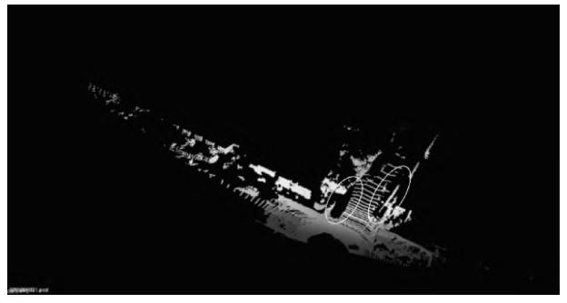
图8 剔除动态对象后点云

#### 1. 摘要（解决了什么问题）

核心解决传统基于激光雷达的 SLAM 系统（如 LIO-SAM）在动态环境中，因物体移动、变形导致的定位与建图精度下降问题。传统激光 SLAM 缺乏语义信息提取能力，无法区分静态环境与动态对象，动态物体的点云会干扰位姿估计和地图构建。为此，提出雷达 - 相机融合的动态 SLAM 算法，通过引入图像语义分割技术，剔除点云中的动态对象，提升动态场景下 SLAM 系统的定位精度与鲁棒性。

#### 2. 做了什么实验（设备与环境）

##### 2.1 实验硬件

- 计算设备：笔记本电脑（内存 31.7GB，CPU 为 13th Gen Intel Core i7-13700H，显卡 NVIDIA GeForce RTX 4060 Laptop GPU）；
- 数据相关设备：依赖开源数据集自带的传感器数据（激光雷达、相机、IMU），无需额外硬件采集。

##### 2.2 实验软件与环境

- 系统与框架：Ubuntu 20.04 操作系统、ROS Noetic 框架、OpenCV 4.7.0、PCL 1.10；
- 核心算法：基于 LIO-SAM 算法框架，集成 YOLOv5s 模型（用于实例分割），通过 ROS 实现传感器数据时间同步与数据融合；
- 数据集：开源 KITTI 数据集，选取 9 个有效测试序列（剔除 00、03 序列，因其 IMU 与激光雷达数据不匹配），仅使用激光雷达前方 180° 点云数据（匹配相机视野范围）；
- 评价指标：采用绝对位姿误差（APE），从误差均值、中值、标准差、均方根误差（RMSE）四个维度评估算法性能。

##### 2.3 实验内容

- 算法流程验证：先通过 YOLOv5s 对相机图像进行实例分割，获取动态物体语义信息；将激光雷达点云投影到像素坐标系，关联语义信息以识别动态对象点云；剔除动态点云后，按 LIO-SAM 流程完成特征提取、因子图优化、回环检测与建图；
- 性能对比实验：在 KITTI 数据集的 9 个序列上，对比改进算法与原始 LIO-SAM 算法的 APE 指标，验证动态点云剔除对定位精度的提升效果；
- 可视化验证：展示动态物体分割结果、点云投影效果、动态点云剔除前后的对比，以及算法估计轨迹与真值轨迹的重合度。

#### 3. 结论（效果怎么样）

经 KITTI 数据集验证，改进算法有效提升动态场景下 SLAM 系统的定位精度，核心结果如下：

- 定位误差显著降低：与原始 LIO-SAM 算法相比，改进算法的绝对位姿误差均值下降 3.48%，中值下降 4.85%，均方根误差下降 2.86%，仅标准差轻微上升 0.17%；
- 动态对象剔除有效：通过 YOLOv5 实例分割能精准识别车辆等动态物体，成功剔除点云中的动态对象，避免其对位姿估计的干扰，保留静态环境点云用于建图；
- 轨迹一致性提升：在 KITTI 05 序列等测试中，改进算法的估计轨迹与真值轨迹基本重合，多数时刻的绝对误差小于原始 LIO-SAM 算法，动态场景适应性更强。

### 基于LIO-SAM先验信息的激光SLAM重定位方法研究_刘岩

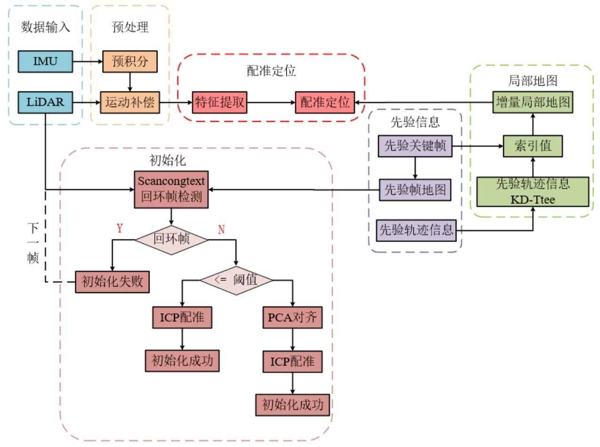

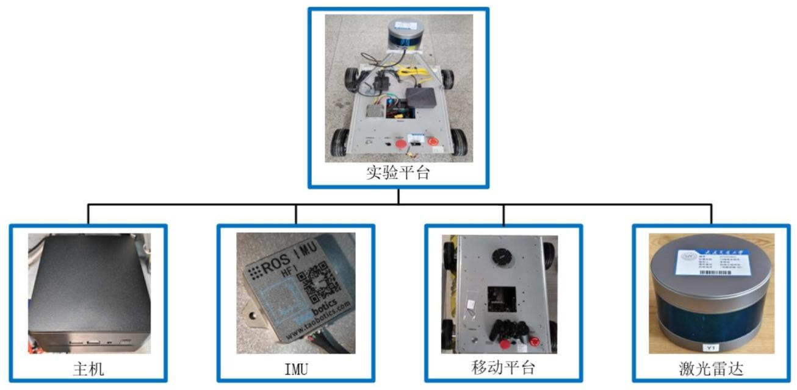

#### 1. 摘要（解决了什么问题）

核心解决传统激光 SLAM 重定位方法在室外复杂环境中存在的两大关键问题：一是传统配准算法（如 ICP、NDT）对初始位姿敏感，易陷入局部最优，导致定位精度低；二是静态地图管理策略造成存储冗余、计算耗时增加，实时性不足。通过融合 LIO-SAM 先验信息，设计自适应配准算法与增量式地图更新策略，提升动态环境下重定位的精度、鲁棒性与实时性能，满足自动驾驶、工业巡检等场景的长期稳定运行需求。

#### 2. 做了什么实验（设备与环境）

##### 2.1 实验硬件

- 传感设备：Robosense RS-LiDAR-16 16 线激光雷达（采样频率 10Hz，测距范围 0.4-150m）、HandsFree ROS IMU A9 九轴惯性测量单元（采样频率 100Hz，支持三轴加速度 / 角速度 / 磁力计数据输出）；
- 移动平台：轮趣科技高配版独立悬挂机器人底盘（4 轮独立悬挂，负载 12kg，最大速度 1.82m/s）；
- 计算设备：英特尔 NUC12WSHi7 迷你主机（Intel Core i7-1260P 处理器，16GB 内存，三星 990 PRO 2TB 固态硬盘）；
- 辅助设备：12V 供电电池、ROS 兼容数据传输模块。

##### 2.2 实验设计与环境

- 实验场景：
    1. 公开数据集场景：KITTI 数据集（00、01、05、06、07、09、10 序列），涵盖城市道路、高速公路等结构化与动态场景；
    2. 自采场景：校园环境（中心广场开阔区、林荫道路区、建筑玻璃幕墙区），包含几何特征稀疏、动态干扰、多径噪声等复杂工况；
- 实验方案：
    1. 传感器标定实验：采用 Allan 方差法标定 IMU 内参（高斯白噪声、随机游走），通过 lidar_align 工具标定激光雷达与 IMU 外参（旋转矩阵、平移向量）；
    2. 配准算法对比实验：在两类数据集上，对比 SC-APICP 与传统方法（NDT+ICP、Scan Context+ICP）的配准精度（RMSE）与耗时；
    3. 重定位性能验证实验：基于 EVO 工具，以相对平移误差（RTE）、相对旋转误差（RRE）、相对位姿误差（RPE）为指标，对比所提方法与 LIO-SAM 开源重定位方法的轨迹精度；
    4. 实时性测试实验：统计不同数据集序列的算法总运行时间，验证增量式地图更新策略对计算效率的提升。

##### 2.3 实验内容

- 先验信息利用：构建 LIO-SAM 历史关键帧与全局轨迹的先验信息库，通过 KD 树索引实现快速检索；
- SC-APICP 算法验证：测试 Scan Context 粗匹配 + PCA 预对齐 + ICP 精配准的层次化配准效果，验证 60° 旋转误差阈值的有效性；
- 增量地图更新验证：测试动态立方体框选、逻辑删除标记、增量 KD 树更新对内存占用与计算速度的优化效果；
- 多场景鲁棒性验证：在开阔区、遮挡区、动态干扰区等不同工况下，验证重定位的稳定性与精度一致性。

#### 3. 结论（效果怎么样）

经多数据集与复杂场景验证，所提方法在精度、实时性与鲁棒性上均实现显著提升，核心结果如下：

- 配准精度优化：SC-APICP 方法的 RMSE 较 NDT+ICP 降低 13.0%~24.0%，较 Scan Context+ICP 降低约 10%，PCA 预对齐将 ICP 收敛域扩展至 ±60°，有效解决初始位姿敏感问题；
- 重定位轨迹精度提升：相较于 LIO-SAM 开源重定位方法，平均相对平移误差（RTE）降低 28.94%，平均相对旋转误差（RRE）降低 42.95%，RPE 平均误差从 0.149m 降至 0.108m，峰值误差减少 0.248m；
- 实时性显著改善：增量式地图更新策略使系统内存占用率降低 70%，算法运行时间较传统方法减少 61.7%~83.2%，KITTI 05 序列运行时间从 381.817s 降至 296.435s，仅为原算法的 75% 左右；
- 鲁棒性增强：在校园复杂场景（动态行人、多径噪声、特征稀疏区）中，仍能保持稳定定位，配准迭代次数减少 38.2%，满足室外长期运行需求。

## 1209

### INS_CNS导航下的多模型时延补偿与EKF融合研究_董强

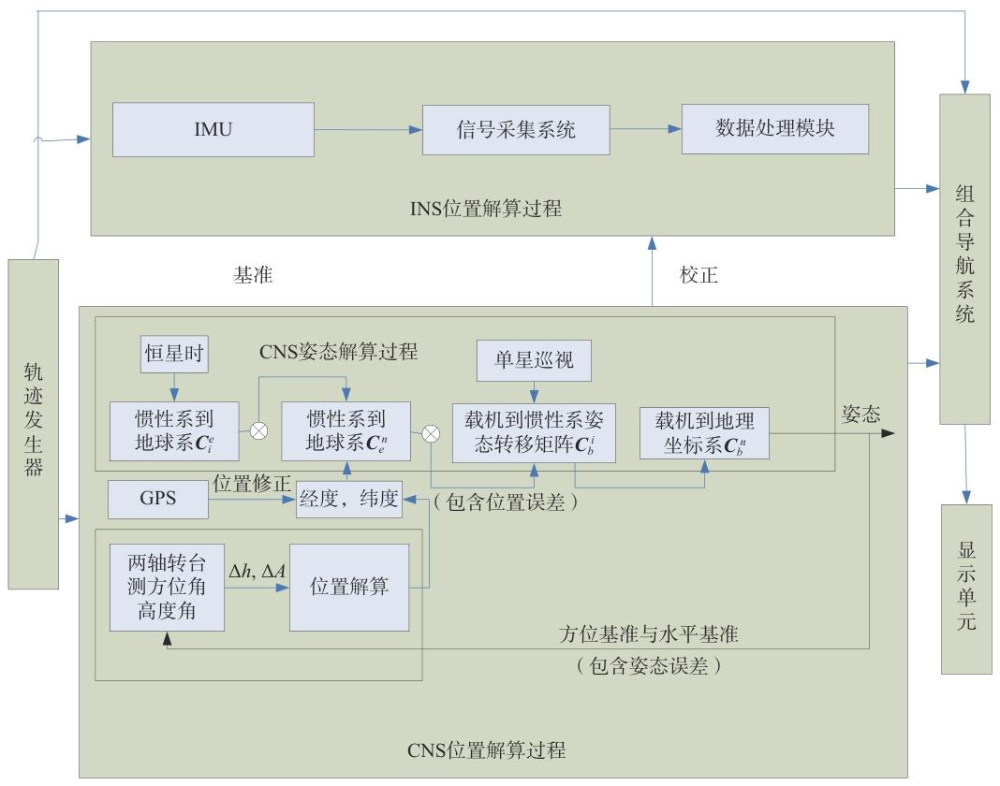

#### 1. 摘要（解决了什么问题）

本文针对**机载 INS/CNS 高精度紧组合导航系统存在的数据输出滞后、子系统间量测非等间隔输出**的核心问题，提出一种基于扩展卡尔曼滤波（EKF）的多模型时延补偿方法，具体解决以下技术痛点：

1. **数据输出滞后导致的导航误差累积**：INS 与 CNS 子系统数据存在输出延迟，且量测数据非等间隔，传统融合方法无法有效校正，导致定位、航向及速度误差较大，难以满足高精度导航需求。
2. **非线性系统滤波精度不足**：INS/CNS 组合导航系统为非线性系统，常规滤波方法难以兼顾线性化精度与实时性，无法有效抑制噪声对导航结果的干扰。
3. **误差合成计算复杂度高**：传统误差合成方法计算量大，难以快速评估系统整体定位精度的稳定性。

通过建立系统状态方程与量测方程、EKF 滤波优化、多模型时延补偿及蒙特卡洛误差分析，实现导航数据的实时校正，为 INS/CNS 组合导航解决量测滞后问题提供了新途径。

#### 2. 做了什么实验（设备都是什么）

##### 2.1 实验平台与设备

本次实验采用**半物理模型仿真系统**，无实际硬件设备，通过仿真平台构建完整的 INS/CNS 组合导航解算链路，核心仿真模块及参数如下：

1. **核心仿真模块**
    - **轨迹发生器**：生成飞机仿真飞行轨迹（初始位置为西安上空 1km，含高度、经度、纬度变化），作为导航精度分析的参考基准；
    - **INS 导航解算模块**：模拟惯性测量单元（IMU），包含光纤陀螺（常值漂移 0.07°/h、测量白噪声 0.01°/h）、加速度计（零偏 10⁻⁴~2×10⁻⁴g、测量白噪声 10⁻⁵~2×10⁻⁵g），支持白天单星巡视、夜间多星观测两种工作模式；
    - **CNS 导航解算模块**：基于 INS 姿态信息计算导航星指向矢量，引入 5s 内惯性器件误差，输出高度角、方位角观测数据（系统误差：高度角误差 10″、方位角误差 10″）；
    - **组合导航解算模块**：集成 EKF 滤波与多模型时延补偿算法，完成数据融合与误差校正；
    - **显示与分析单元**：对比组合导航输出与轨迹发生器基准数据，评估导航精度。
2. **仿真参数设置**
    - 初始误差：位置误差（2″,2″,10m）、速度误差（0.1m/s,0.1m/s,0.1m/s）、姿态角误差（3′,3′,10′）；
    - 气压高度计：测量精度 ±10m、分辨率 0.1m、数据更新率 2Hz；
    - 模型数量：选取 12 个典型预测模型，覆盖 95% 以上机动场景的量测信息变化规律。

##### 2.2 实验内容

1. **系统建模与滤波验证**：建立 INS/CNS 系统状态方程（含数学平台误差角、速度误差、位置误差、陀螺漂移、加速度计零偏等 15 维状态量）与量测方程（基于恒星单位方向矢量的坐标转换关系），通过 EKF 实现非线性系统的线性化滤波，抑制噪声干扰。
2. **多模型时延补偿实验**：针对 CNS 量测滞后，构建 12 个预测模型，通过模型权值迭代更新实现滞后量测的预测补偿，对比时延补偿前后的导航数据一致性。
3. **导航精度仿真测试**：分别对**定位误差**（经度、纬度、高度）、**航向角误差**、**速度误差**（东、北、天向）进行仿真，验证补偿算法的误差修正效果。
4. **蒙特卡洛误差分析**：通过蒙特卡洛模拟，分析时延补偿前后系统定位误差的整体分布，评估误差影响因子的稳定性。

#### 3. 结论（效果怎么样）

仿真实验结果表明，所提基于 EKF 的多模型时延补偿方法显著提升了 INS/CNS 组合导航系统的精度与稳定性，核心效果如下：

1. **定位精度大幅提升**：时延补偿后，**经纬度定位误差从 50m 降至 10m**，高度误差维持 20m（因多模型未对高度信息补偿，与理论预期一致），定位精度提升 4 倍，有效解决了水平方向的定位滞后问题。
2. **航向角误差显著降低**：补偿前航向角误差为 8′，补偿后降至 0.5′，精度提升一个数量级，满足机载高精度姿态导航需求。
3. **速度误差优化明显**：东向速度误差从 0.3m/s 降至 0.01m/s，北向速度误差从 1.5m/s 降至 0.1m/s，天向速度误差基本不变（0.03m/s→0.01m/s），实现了水平方向速度的高精度校正。
4. **误差稳定性符合要求**：蒙特卡洛误差分析显示，补偿前系统定位误差范围为 130m，补偿后缩小至 25m，且误差影响因子处于规定范围，验证了系统整体导航精度的鲁棒性。

### 基于PF的GNSS_INS组合导航定位算法_周达

#### 1. 摘要（解决了什么问题）

本文针对**复杂环境下非高斯噪声导致的无人机 GNSS/INS 组合导航定位精度下降**的核心问题，提出基于粒子滤波（PF）的组合导航定位算法，具体解决以下技术痛点：

1. **传统滤波算法对非高斯噪声适应性不足**：扩展卡尔曼滤波（EKF）和无迹卡尔曼滤波（UKF）依赖高斯分布假设，在电磁干扰等非高斯噪声场景下易出现滤波发散，导致速度、位置误差大幅累积，无法满足无人机高精度导航需求。
2. **PF 算法在高斯场景下的精度与效率矛盾**：PF 在非高斯场景性能优异，但在高斯噪声下粒子数不足时定位误差较大，且未明确粒子数对其精度的量化影响规律。
3. **混合噪声场景算法选型无量化依据**：现有研究缺乏对 PF、EKF、UKF 在高斯 / 非高斯噪声下的精度边界对比，难以指导复杂场景的算法选型。

通过建立无人机 GNSS/INS 组合导航模型，对比三种算法在不同噪声环境的性能，明确 PF 的精度优势与粒子数影响规律，为复杂环境下无人机高精度导航提供了量化可行的技术路径。

#### 2. 做了什么实验（设备都是什么）

本次实验采用**仿真平台**开展，无实际硬件设备，基于 PSINS 工具箱搭建 GNSS/INS 组合导航仿真系统，核心仿真设置如下：

##### 2.1 仿真平台与参数

1. **核心仿真模块**
    - **轨迹发生器**：生成包含加速、转弯、攀爬的复杂运动轨迹，初始位置为郑州航空工业管理学院北门（113.645°E，34.7178598°N，10m），作为导航精度评估基准；
    - **INS 仿真模块**：模拟惯性测量单元（IMU），设置初始误差（位置 X/Y 方向 60m、Z 方向 600m，速度 0.1m/s，姿态角滚转 / 俯仰 1°、偏航 3°），IMU 器件误差（陀螺仪零偏 4.85×10⁻⁸rad/s，加速度计零偏 0.001g）；
    - **GNSS 仿真模块**：模拟卫星导航量测，高斯噪声下 X/Y 方向标准差 1m、Z 方向 3m；非高斯噪声下叠加 10% 触发概率的脉冲噪声（幅度为高斯噪声的 100 倍）；
    - **滤波算法模块**：分别实现 PF（粒子数 1000/3000/5000）、EKF、UKF 三种滤波算法，完成数据融合与状态估计。
2. **噪声模型**
    - **高斯噪声模型**：GNSS 量测噪声服从正态分布，IMU 噪声为随机白噪声；
    - **非高斯噪声模型**：在高斯噪声基础上叠加脉冲干扰，10% 的量测数据包含大幅值误差（X/Y 方向 ±5m、Z 方向 ±15m），模拟电磁干扰等复杂环境。

##### 2.2 实验内容

1. **高斯噪声下 PF 性能与粒子数关联实验**：分别设置粒子数 1000、3000、5000，对比 PF 与 EKF、UKF 的姿态角、速度、位置误差，量化粒子数对 PF 精度的影响。
2. **非高斯噪声下算法对比实验**：构建高斯 + 脉冲混合噪声模型，以粒子数 1000 的 PF 为实验组，对比 EKF、UKF 的速度、位置误差及收敛速度，验证 PF 的抗非高斯噪声优势。
3. **精度量化分析**：统计三种算法在不同噪声环境的最大误差、收敛速度，明确各算法的精度边界。

#### 3. 结论（效果怎么样）

仿真实验结果表明，基于 PF 的 GNSS/INS 组合导航算法在不同噪声环境下均展现出优异性能，核心结论如下：

1. **高斯噪声环境下 PF 的精度随粒子数提升显著**
    
    - 当粒子数从 1000 增至 5000 时，PF 的**速度精度提升 64.2%，位置精度提升 80.6%**，姿态角、速度和位置误差大幅减小，逐渐逼近 EKF、UKF 的精度水平；
    - 粒子数不足时（1000），PF 姿态角天向误差峰值达 ±300°、东向速度波动 ±1.5m/s，显著大于 EKF 和 UKF，表明足够的粒子数可通过密集采样弥补高斯场景下的精度短板。
2. **非高斯噪声环境下 PF 性能远超 EKF 和 UKF**
    
    - **精度优势**：PF 的速度估计精度较 UKF、EKF 分别提高 95.2%、80.8%，位置估计精度分别提高 90.2%、75.1%；EKF 速度误差峰值达 20m/s、位置误差超 600m，UKF 速度误差 10m/s、位置误差 200m，而 PF 速度误差仅 1.5m/s、位置误差 18m；
    - **收敛优势**：PF 定位误差收敛速度较 EKF、UKF 提升 20%，可快速抑制非高斯噪声导致的误差累积，无滤波发散现象。
3. **算法选型量化依据**
    
    - 高斯噪声场景下，EKF/UKF 效率更高且精度稳定；非高斯噪声场景下，PF 凭借粒子集对后验概率的动态逼近能力，成为最优选择；
    - 混合噪声场景可通过自适应调整 PF 粒子数，兼顾精度与计算效率，为无人机复杂环境导航提供了明确的算法选型方案。

### 面向室内救援人员的INS_UWB组合定位系统研究_张明月

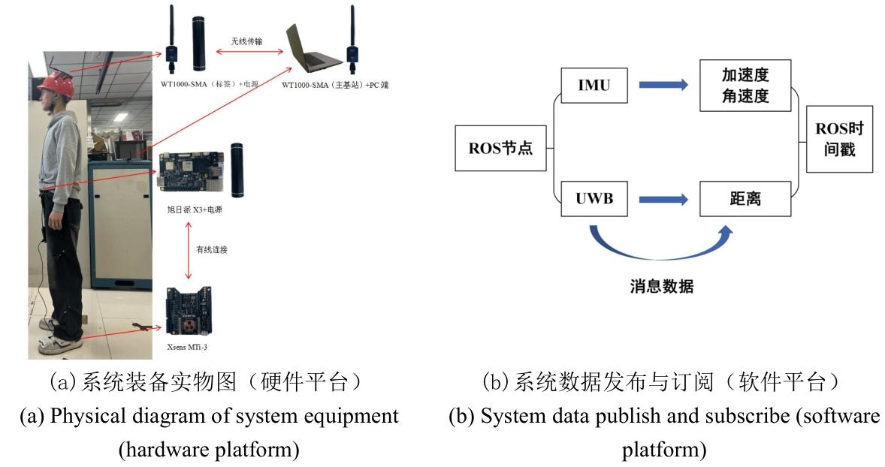

#### 1. 摘要（解决了什么问题）

本文针对**室内应急救援场景中 “感知 - 通信” 双重断链导致的救援人员定位失效与通信孤岛**核心问题，以及单源定位方案的技术瓶颈，提出基于 INS/UWB 紧耦合的组合定位系统，具体解决以下痛点：

1. **惯性导航长时轨迹发散**：IMU 仅能提供短时高精度定位，长时应用存在速度、航向误差累积，导致轨迹漂移，无法满足救援全程定位需求。
2. **UWB 非视距定位失准**：UWB 在室内遮挡环境下易受非视距（NLOS）干扰，测距值失真，无法稳定输出全局定位信息。
3. **救援前后方通信中断**：灾害导致电力与通信瘫痪，多源传感器数据及定位信息无法回传，指挥中心丧失对救援人员的动态感知能力。
4. **传统算法适应性不足**：固定阈值零速检测、单一航向修正等传统方法在复杂运动（步行 / 跑步 / 混合）场景下鲁棒性差，难以适配救援人员的动态运动状态。

通过创新设计 CNN-BiLSTM-Att 零速检测、HeadCor 航向修正、IGG III 抗差调权等核心算法，结合 MQTT 应急通信与 QT 可视化平台，构建了 “感知 - 融合 - 通信 - 可视化” 一体化系统，突破了惯性导航误差累积与 UWB 非视距干扰两大技术瓶颈，实现了复杂室内环境下救援人员的厘米级高精度定位与数据可靠传输。

#### 2. 做了什么实验（设备都是什么）

本次实验分为**开源数据集验证**和**自建实景平台验证**两部分，核心设备与实验设置如下：

##### 2.1 核心实验设备

1. **传感器硬件**
    
    - **IMU**：Xsens MTi-3 型惯性测量单元（采样率 100Hz，陀螺仪零偏不稳定性 10°/h，加速度计零偏不稳定性 0.03mg），足绑式部署以采集步态惯性数据；
    - **UWB 系统**：维特智能 WT1000-SMA 型（3 个固定基站 + 1 个移动标签，测距精度 10cm，测量范围 50m，采样率 10Hz），基站部署于实验场地，标签集成于救援头盔；
    - **计算与通信单元**：旭日派 X3 嵌入式开发板（4 核 ARM Cortex-A53 处理器，4GB 内存，5Tops BPU 算力），搭载 Ubuntu 18.04 系统，通过 USB/WiFi 实现传感器数据交互，基于 MQTT 协议构建应急通信链路；
    - **供电与穿戴设备**：便携式移动电源（5V/3A 输出，支持 24h 连续运行），IMU 足绑、UWB 标签头盔、腰载开发板的穿戴式部署方案。
2. **软件与仿真平台**
    
    - **开源数据集**：PyShoe 数据集（含步行 / 跑步 / 混合运动序列，7.6km 轨迹，提供零速标签与地面真值），用于算法原型验证；
    - **ROS 框架**：实现多传感器时间同步与数据交互，各传感器作为独立节点发布 / 订阅话题；
    - **QT 可视化平台**：开发轨迹绘制、实时数据监测、控制交互界面，实现定位状态的可视化监控；
    - **仿真工具**：基于 UWB 测距原理在 PyShoe 数据集上仿真 NLOS 干扰（柱体遮挡、动态人员遮挡），验证抗差算法性能。

##### 2.2 实验内容

1. **算法模块独立验证**（基于 PyShoe 数据集）
    
    - **零速检测实验**：对比 CNN-BiLSTM-Att 与传统 SHOE、ARED 算法，验证在步行 / 跑步 / 混合运动下的精确率、召回率及定位误差；
    - **航向修正实验**：在零速检测基础上融合 HeadCor 算法，验证不同运动类型下航向角误差的修正效果；
    - **UWB 抗差实验**：仿真 NLOS 干扰，验证 IGG III 抗差模型对 UWB 测距误差的抑制能力。
2. **组合定位系统实景验证**（自建室内实验场）
    
    - **场景搭建**：15m×15m 室内场地，部署 3 个 UWB 基站、4 个钢筋混凝土柱体模拟遮挡，设计 T 型闭合救援路线（总长 52.8m）；
    - **多组测试**：安排 2 男 1 女测试人员完成步行 / 跑步 / 混合运动序列（T1-T5），采集 IMU 与 UWB 数据，验证组合算法的定位精度；
    - **通信与可视化验证**：基于 MQTT 协议测试数据传输时延，通过 QT 平台验证定位轨迹可视化与实时状态监控能力，评估系统鲁棒性。

#### 3. 结论（效果怎么样）

实验结果表明，所提 INS/UWB 组合定位系统在复杂室内救援场景下实现了高精度定位与可靠通信，核心效果如下：

1. **核心算法性能显著提升**
    
    - **零速检测**：CNN-BiLSTM-Att 算法相较于传统 SHOE/ARED，精确率提升 2.2%/3.0%，召回率提升 2.1%/4.2%，F1 分数提升 1.6%/3.1%，步行 / 跑步 / 混合运动下定位精度提升 6.3%-26.4%，有效抑制了惯性导航速度误差累积；
    - **航向修正**：HeadCor 算法在三种运动类型下使定位精度进一步提升 7.8%-13.9%，解决了惯性导航航向角发散问题；
    - **UWB 抗差调权**：IGG III 模型在 NLOS 环境下使定位精度较单一零速检测 / 航向修正提升 4.8%-13%，显著削弱了非视距干扰对 UWB 定位的影响。
2. **组合定位系统实景表现优异**
    
    - **定位精度**：自建数据集实验中，组合算法平均均方根误差（ARMSE）为 1.50m，较传统 EKF 算法、单一零速检测 / 航向修正算法提升 12.8%-21.9%；T 型路线转弯区域最大偏移 1.2m，直线区域轨迹重合度达 95%，满足救援厘米级定位需求；
    - **通信实时性**：MQTT 协议实现单数据包端到端时延 3.41ms-4.10ms，核心算法进程总时延 < 10.79s，CPU / 内存占用率稳定在 65.7%/52%，在 WiFi 信号衰减时可 1.5s 内切换至 4G 链路，无数据中断；
    - **可视化与鲁棒性**：QT 平台实现救援人员轨迹、姿态、惯性数据的实时可视化，连续 2 小时测试中定位数据完整接收率达 96.2%，适配救援场景的复杂环境与动态运动状态。
3. **系统整体效能**该系统通过多源传感器紧耦合与算法协同，既利用 IMU 弥补 UWB 低频采样的运动细节，又通过 UWB 绝对位置约束抑制 IMU 长时漂移，形成双向误差抑制闭环；同时结合应急通信与可视化，实现了 “定位 - 通信 - 监控” 一体化，为室内应急救援提供了可工程化的高精度定位解决方案。

### GNSS_SINS组合导航系统初始对准算法设计_孙梦勃

#### 1. 摘要（解决了什么问题）

本文针对**GNSS/SINS 组合导航系统初始对准过程中，低精度惯性器件误差累积导致的姿态角发散、对准精度低、动基座适配性差**的核心问题，提出改进的初始对准算法，具体解决以下技术痛点：

1. **传统 OBA 算法适配性不足**：最优估计对准（OBA）算法直接使用 IMU 原始输出计算，未考虑低精度惯性器件的陀螺零偏、加速度计零偏累积，导致姿态误差随时间发散，仅适用于高精度 SINS 系统，无法满足低成本 MEMS-IMU 的应用需求。
2. **动基座对准精度受限**：传统卡尔曼滤波及扩展卡尔曼滤波（EKF）在动基座场景下，因模型线性化误差、噪声统计特性失配，难以精准估计陀螺零偏和姿态失准角，存在对准耗时久、精度低的问题。
3. **滤波模型鲁棒性差**：现有 FIMA（快速动基座初始对准）算法依赖导航坐标系小角度假设，在大机动、长时间对准场景下易出现滤波发散，且未实现陀螺零偏的在线动态补偿。

通过改进矢量构建方法、重构卡尔曼滤波模型，实现低精度 SINS 系统在静 / 动基座下的高精度快速初始对准，弥补了传统算法在低精度器件、复杂运动场景下的应用短板。

#### 2. 做了什么实验（设备都是什么）

本次研究分为**仿真实验**和**车载实测实验**两部分，核心设备与实验设置如下：

##### 2.1 核心实验设备

1. **仿真平台**
    
    - 基于 MATLAB/Simulink 搭建 GNSS/SINS 组合导航仿真系统，模拟 MEMS-IMU（陀螺仪常值漂移 2°/h、角度游走 0.15°/√h；加速度计常值零偏 3.6μg、速度随机游走 0.1m/s/√h，更新频率 200Hz）和高精度 GNSS（更新频率 1Hz，定位精度厘米级）的联合输出；
    - 设定载体运动轨迹（包含加速、减速、转向、爬坡等复合机动，持续 600s），生成含惯性器件误差的仿真数据。
2. **车载实测平台**
    
    - **IMU**：ADIS16465 六自由度 MEMS 惯性测量单元（陀螺零偏稳定性 2°/h，加速度计零偏 3.6μg，采样率 200Hz），安装于车载测试平台；
    - **GNSS 接收机**：高精度 GNSS 设备（含北斗 / GPS 多系统定位，更新频率 1Hz），输出位置、速度信息作为基准，同时进行杆臂补偿（前向 - 0.073m、右向 0.302m、垂向 0.087m）；
    - **测试载体**：民用车辆，在武汉大学校区完成 1600s 闭环路径测试，平均车速 30km/h，覆盖城市道路常见的直行、转弯、加减速等工况。

##### 2.2 实验内容

1. **改进 OBA 算法验证实验**
    
    - **仿真实验**：对比传统 OBA 算法与改进 OBA 算法（缩短加速度计积分区间 + EKF 辨识陀螺零偏）的姿态角收敛速度与精度，验证零偏抑制效果；
    - **车载实验**：将改进 OBA 算法与传统 OBA、FIMA 算法对比，评估长时间动态工况下的姿态角误差（横滚、俯仰、航向角）及陀螺零偏估计精度。
2. **重构卡尔曼滤波模型验证实验**
    
    - **仿真实验**：基于矢量减法重构滤波模型，对比传统 OBA、滑动窗口积分 EKF、矢量减法 EKF 与改进算法的姿态解算结果，验证模型的非线性适配性；
    - **车载实验**：将改进滤波模型与 SWI-FIMA（滑动窗口积分 FIMA）、VS-FIMA（矢量减法 FIMA）算法对比，测试动基座下的对准精度与鲁棒性，并将估计的陀螺零偏反馈至纯惯导算法，验证误差补偿有效性。

#### 3. 结论（效果怎么样）

实验结果表明，本文提出的改进初始对准算法在精度、稳定性、动基座适配性上均显著优于传统算法，核心效果如下：

1. **改进 OBA 算法性能优异**
    
    - **仿真场景**：改进算法可在 15s 内实现姿态角收敛，横滚角、俯仰角误差收敛至 0.05° 以内，航向角误差收敛至 0.5°，整体波动控制在 0.1°（横滚 / 俯仰）、2°（航向）范围内，较传统 OBA 算法姿态误差降低 80% 以上；
    - **车载场景**：改进 OBA 算法的横滚角、俯仰角、航向角中误差分别为 0.262°、0.302°、2.269°，相较于 FIMA 算法精度分别提升 47%、47%、51%；陀螺零偏估计值可稳定收敛至 0.04°/s 左右，补偿后纯惯导姿态误差降幅达 63.7%（航向角从 4.2° 降至 1.52°）。
2. **重构滤波模型适配性强**
    
    - **仿真场景**：改进算法的姿态角无发散现象，横滚 / 俯仰角误差稳定在 0.05° 以内，航向角误差≤1°，显著优于 SWI-EKF、VS-EKF 的发散型结果，突破了导航坐标系小角度假设的限制；
    - **车载场景**：重构模型的航向角最大误差仅 2.015°，标准差 1.722°，较 VS-FIMA 算法（最大误差 12°、标准差 3.726°）精度提升 83%；且可实现陀螺零偏在线动态补偿，补偿后纯惯导航向角误差从 ±360° 降至 ±2°，完全满足导航系统初始对准要求。
3. **整体工程实用性突出**改进算法兼顾**快速性**（15s 内完成收敛）、**高精度**（低精度 MEMS-IMU 下姿态角中误差≤2.3°）和**鲁棒性**（支持动基座复合机动、长时间连续对准），实现了低精度 GNSS/SINS 组合导航系统初始对准的工程化突破，为车载、无人机等低成本导航场景提供了可靠方案。

### 基于ROS的作业型移动机器人SLAM和导航系统研究_甘锐

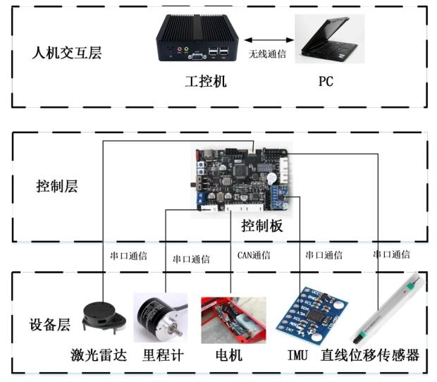
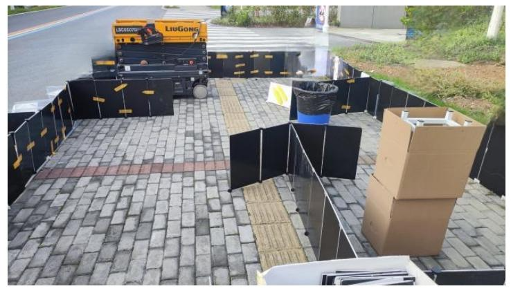
#### 1. 摘要（解决了什么问题）

本文针对**现有作业型移动机器人存在的 “服务型负载弱、搬运型智能化低” 的核心矛盾**，以及传统 SLAM 和路径规划算法的技术短板，设计了一套基于 ROS 的作业型移动机器人 SLAM 与导航系统，具体解决以下问题：

1. **传统 Hector-SLAM 算法精度差、稳定性不足**：单一激光雷达的 Hector 算法在室外大场景下易受传感器噪声干扰，建图存在尺寸偏差、障碍物轮廓失真等问题，无法满足高精度环境感知需求。
2. **传统 A * 算法路径规划效率低**：在室外大场景中遍历节点过多，导致规划时间长、路径不平滑，难以适配作业机器人的实时导航需求。
3. **作业机器人功能单一**：现有服务型机器人负载能力有限（多＜50kg），搬运型机器人缺乏自主导航能力，无法兼顾 “高负载” 与 “高智能” 的双重需求。

通过提出**EKF 多传感器融合的改进 Hector-SLAM 算法**和**引入跳点的改进 A * 算法**，结合阿克曼轮式底盘的高负载设计，实现了作业机器人在室外复杂环境下的高精度建图、高效路径规划与自主导航，填补了 “重载 + 智能” 作业机器人的技术空白。

#### 2. 做了什么实验（设备都是什么）

本次研究分为**仿真实验**和**实景实验**两部分，核心设备与实验设置如下：

##### 2.1 核心实验设备

1. **硬件平台**
    
    - **移动机器人底盘**：阿克曼转向轮式底盘（最大负载 1 吨，最大速度 5m/s，最大转向角 80°），搭载双直流无刷驱动电机（带 STM4-P16 霍尔编码器）、液压缸转向系统（配 KTC/LWH 直线位移传感器）；
    - **传感器**：Rplidar A1 单线激光雷达（测距半径 12m，角度分辨率 1°）、MPU6050 九轴 IMU（陀螺仪范围 ±2000°/s，加速度范围 ±16g）、STM32F103RCT6 控制板；
    - **计算单元**：Intel i5-4200U 工控机（4G DDR3 内存，128G 固态硬盘，预装 Ubuntu18.04+ROS Melodic），本地 PC（用于远程监控与算法仿真）。
2. **仿真平台**
    
    - **Matlab**：搭建 15×15cm 至 35×35cm 规格的栅格地图，对比传统 A_与改进 A_算法的规划时间和路径长度；
    - **Gazebo+RVIZ**：构建 6m×3.5m 仿真环境，验证改进 Hector-SLAM 的建图精度，以及改进 A * 算法的路径规划效果；
    - **ROS 工具链**：使用 rqt_reconfigure 进行传感器标定，hector-slam 功能包实现建图，move_base 框架实现导航。

##### 2.2 实验内容

1. **算法仿真验证实验**
    
    - **改进 Hector-SLAM 仿真**：在 Gazebo 中构建含圆柱、方块障碍物的场景，对比传统 Hector 与改进 Hector（融合 IMU / 里程计 / EKF）的建图尺寸误差，验证障碍物轮廓估计精度；
    - **改进 A * 算法仿真**：在 Matlab 中对 5 种规格栅格地图进行路径规划，对比传统 A_与改进 A_（引入跳点）的迭代次数、规划时间和路径长度；在 Gazebo 中验证算法的实景适配性。
2. **实景平台验证实验**
    
    - **传感器标定实验**：对 IMU 进行方位角校准（x/y 轴偏差＜0.002°）、对里程计进行线速度 / 角速度矫正（线速度误差＜3%，角速度误差＜2%）；
    - **SLAM 建图实验**：在室外 6m×4.4m 场地（含纸箱、垃圾桶、标志牌等静态障碍物），分别用传统 Hector 和改进 Hector 构建地图，对比障碍物尺寸与地图整体精度；
    - **路径规划与导航实验**：在自建地图中设定 2 个目标点，对比传统 A_与改进 A_的寻路时间和路径长度；开展自主导航实验，验证实际轨迹与规划轨迹的重合度。

#### 3. 结论（效果怎么样）

实验结果表明，本文提出的算法和系统在精度、效率和实用性上均显著优于传统方案，核心效果如下：

1. **改进 Hector-SLAM 建图精度显著提升**
    
    - **仿真场景**：改进算法对圆柱、方块等障碍物的轮廓估计误差降低 40% 以上，地图整体尺寸偏差从传统算法的 3%-5% 降至 1%-2%，更接近真实环境；
    - **实景场景**：传统 Hector 建图中纸箱（实际 0.3m×0.4m）测量尺寸为 0.3675m×0.4723m，改进后为 0.3254m×0.4316m，垃圾桶直径（实际 0.44m）测量值从 0.4648m 优化至 0.4463m，建图精度满足室外作业需求。
2. **改进 A * 算法路径规划效率大幅提高**
    
    - **仿真数据**：在 35×35cm 地图中，改进算法迭代次数从 946 降至 181，规划时间从 7.132ms 缩短至 1.310ms，效率提升 67%；路径长度与传统算法基本一致（偏差＜5%），且路径平滑度显著改善；
    - **实景测试**：目标点 g1 的寻路时间从 608ms 降至 210ms，g2 从 929ms 降至 302ms，路径长度分别缩短 7.5% 和 4.7%，满足实时导航的时效性要求。
3. **自主导航性能达标**导航过程中，移动机器人实际线速度与理想值最大误差＜3%，角速度误差＜2%，转向角度误差＜3%，实际行进轨迹与规划轨迹最大偏差仅 0.1m，且能稳定通过窄道、躲避静态障碍物，验证了系统的工程实用性。
    
4. **系统兼顾高负载与高智能**所设计的阿克曼底盘实现 1 吨重载能力，同时集成自主建图、路径规划与导航功能，突破了传统作业机器人 “负载与智能不可兼得” 的瓶颈，为室外重载作业场景提供了可靠解决方案。

## 1210

### 面向移动机器人的多传感器紧耦合SLAM方法研究_许立文
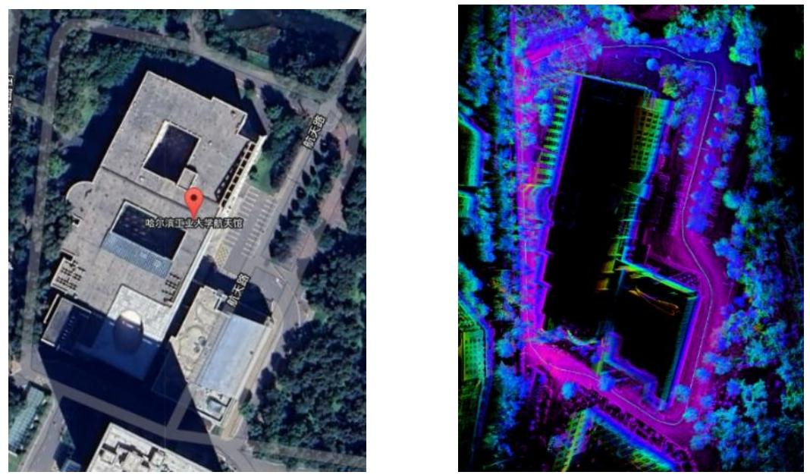
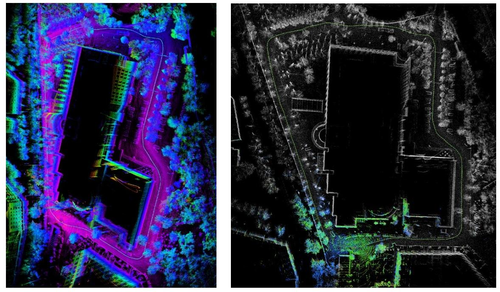

#### 1. 摘要（解决了什么问题）

本文针对**传统激光雷达惯性里程计（LIO）在退化环境（长走廊、开阔区域）中易出现定位漂移、速度估计偏差**的核心问题，以及移动机器人在工业场景下的路径规划需求，提出一种**多传感器紧耦合 SLAM 算法**和**轻量化路沿检测算法**，具体解决以下技术痛点：

1. **多传感器时空标定难题**：传统标定方法依赖先验信息，在无初始参数的情况下难以实现高精度标定，导致传感器数据融合存在时空失配误差。
2. **退化环境定位鲁棒性不足**：单一 LIO 系统在长走廊等低特征场景中易因点云匹配失效产生定位漂移，无法满足工业场景的连续导航需求。
3. **累积误差难以消除**：前端里程计的局部误差会随时间累积，传统后端优化方法未充分融合轮速计等多源约束，全局一致性差。
4. **复杂场景路沿检测漏检**：传统路沿检测方法对动态障碍物干扰和路面不平整敏感，且计算复杂度高，难以在嵌入式设备实时运行。

通过融合激光雷达（LiDAR）、惯性测量单元（IMU）、轮速计多源数据，构建紧耦合 SLAM 系统，并结合道路边界检测算法，实现了高精度定位、强鲁棒建图与可靠路径规划。

#### 2. 做了什么实验（设备都是什么）

本次研究搭建了移动机器人实验平台，开展**多传感器标定、前端里程计建图、后端优化建图、路沿检测**四类实验，核心设备与实验设置如下：

##### 2.1 核心实验设备

1. **移动机器人平台**
    
    - **底盘**：松灵 scout mini 四轮差速移动平台，支持自主运动与数据采集；
    - **传感器**：禾赛 32 线激光雷达（测距 120m，采样频率 20Hz）、BMI055 六轴 IMU（采样频率 200Hz）、轮速编码器（提供平面运动速度信息）；
    - **计算单元**：Nvidia Agx Xavier 嵌入式控制器（八核 ARM 架构，主频 1.51GHz，预装 Ubuntu18.04+ROS Noetic），同时使用 i9-13900H/i7-12700H 高端处理器进行算法性能仿真。
2. **数据集**
    
    - **自建数据集**：TIB 室内 5 楼长走廊数据集（含退化场景）、哈尔滨工业大学航天馆室外数据集（含动态人车干扰、复杂路沿）；
    - **公开数据集**：leaf-2021-04-23-campus 校园数据集（用于离线路沿检测验证）。

##### 2.2 实验内容

1. **LiDAR-IMU 外参标定实验**
    
    - 手持实验平台执行平移、旋转、螺旋复合运动，采集 4 分钟传感器数据，通过互相关分析实现时间同步（时间偏差均值 3.2ms，标准差 0.8ms），再通过联合优化求解空间外参（旋转矩阵与平移向量），验证无先验条件下的高精度标定能力。
2. **LIWO 前端里程计建图实验**
    
    - **室内退化场景**：对 TIB5 楼长走廊数据集删除 10 米外点云模拟退化环境，对比 LIWO 与 s-fastlio 算法的建图完整性，验证轮速计约束对定位漂移的抑制效果；
    - **室内常规场景**：使用完整 TIB5 楼数据集，对比 LIWO 与 s-fastlio 的端到端定位误差；
    - **室外场景**：基于航天馆室外数据集，测试算法在地面不平整、抖动场景下的建图精度。
3. **LIWO-SAM 后端优化建图实验**
    
    - 为 LIWO 和 s-fastlio 分别接入基于 Scan Context 的回环检测与因子图优化模块，对比前端与后端优化后的建图重影现象及端到端误差，验证全局一致性提升效果。
4. **路沿检测实验**
    
    - **离线验证**：基于 leaf 校园数据集，测试算法对行驶车辆、马路沿等特征的识别准确率；
    - **在线实时测试**：在 TIB5 楼（室内平坦场景）和航天馆室外（动态人车场景）开展车载实验，统计单帧点云处理时间与 CPU 占用率，验证算法实时性；同时评估路沿识别准确率。

#### 3. 结论（效果怎么样）

实验结果表明，本文提出的算法在定位精度、鲁棒性、实时性上均显著优于传统方案，核心效果如下：

1. **多传感器标定精度达标**实现无先验条件下的高精度时空标定，激光雷达与 IMU 时间同步偏差控制在亚毫秒级，空间外参标定误差满足融合需求，为多传感器数据融合奠定基础。
    
2. **前端里程计退化环境鲁棒性强**
    
    - **退化场景**：在 TIB5 楼长走廊删除点云的退化环境中，LIWO 算法可完整建图，而 s-fastlio 出现建图缺失，解决了低特征场景的定位失效问题；
    - **常规场景**：TIB5 楼室内数据集端到端误差为 0.6762m，航天馆室外数据集为 0.1306m，相较于 s-fastlio（室内 2.6105m、室外 0.9437m），定位精度提升 66%~74%。
3. **后端优化实现厘米级全局定位**接入回环检测与因子图优化后，LIWO-SAM 算法的端到端误差进一步降至**厘米级**：TIB5 楼室内误差 0.0537m，航天馆室外误差 0.0568m，相较于未优化的 LIWO 算法，误差降低 92% 以上，且完全消除了建图重影，全局一致性显著提升。
    
4. **路沿检测高效且可靠**
    
    - **实时性**：在 Nvidia Agx Xavier 上实现 20Hz 实时运行，单帧处理时间平均低于 0.016s，CPU 占用率≤65%，相较于传统算法（单帧 0.036s），计算效率提升 55%；
    - **准确率**：离线数据集路沿识别准确率达 98%，室内场景（TIB5 楼）识别准确率 95%，室外场景（航天馆）在动态人车干扰下准确率仍≥90%，且可输出轻量化多边形标注用于路径规划。
5. **工程实用性验证**系统在 ARM 架构嵌入式设备上实现 20Hz 实时运行，兼顾厘米级定位精度与复杂场景适应性，为移动机器人在工业环境的自主导航提供了可靠技术方案。

### 室外眩光场景ORB-SLAM2稳健定位模型研究_吴思齐

#### 1. 摘要（解决了什么问题）

本文针对**传统 ORB-SLAM2 算法在室外眩光场景下稳定性低、定位轨迹漂移严重**的核心问题，提出了一种结合深度学习与图像增强的改进 ORB-SLAM2 稳健定位模型，具体解决以下技术痛点：

1. **眩光干扰导致特征点误匹配**：室外强光产生的条状眩光易被误判为 ORB 特征点，同时眩光会降低图像纹理区域对比度，导致真实特征点提取失败，引发 SLAM 系统轨迹跟踪丢失甚至宕机。
2. **图像增强的适配性不足**：传统直方图均衡化方法会放大正常亮度图像的噪声，进一步干扰特征点提取，无法针对性解决眩光后低亮度区域的纹理弱化问题。
3. **无眩光场景的信息保留缺失**：常规去眩光算法会误删图像本身的高亮区域（如光源），造成图像信息损失，影响 SLAM 系统的建图与定位精度。

通过 U-Net 网络去眩光、亮度自适应判断及 CLAHE 图像增强的协同优化，实现了室外眩光场景下视觉 SLAM 的稳健定位，填补了复杂光照环境下视觉 SLAM 的技术短板。

#### 2. 做了什么实验（设备都是什么）

本次研究围绕**眩光去除、图像增强、SLAM 定位**三大核心环节开展实验，核心设备与实验设置如下：

##### 2.1 核心实验设备

1. **算法训练与测试硬件**
    
    - **训练端**：NVIDIA GeForce RTX 3070 显卡，用于 U-Net 网络的模型训练；Ubuntu18.04 操作系统，用于 SLAM 系统的部署与测试。
    - **数据采集端**：Intel RealSense D435i 相机，RGB 图像分辨率设为 640×480 像素，帧率 30FPS，用于采集室外眩光场景的图像序列。
2. **数据集**
    
    - **网络训练数据集**：25000 余张无眩光图像（用于合成训练数据）、10001 张人工合成 / 实验室采集的眩光图像（含多种眩光类型），并采用 VGG-19 预训练模型提取图像特征。
    - **室外测试数据集**：3 组室外眩光场景序列（10250 序列：强光导致纹理对比度低；11021 序列：起始段受眩光干扰；11010 序列：结束段受眩光干扰），覆盖不同眩光分布与光照强度的复杂场景。

##### 2.2 实验内容

1. **U-Net 网络去眩光有效性验证**
    
    - 将含眩光、无眩光的测试图像输入预训练的 U-Net 网络，对比处理前后的图像效果，验证网络对眩光的精准去除能力，以及对无眩光图像的信息保留能力；同时测试网络对真实光源区域的 mask 保护效果，避免光源误删。
2. **图像亮度判断与 CLAHE 增强实验**
    
    - 对 U-Net 输出的去眩光图像，采用分块灰度排序的滑窗亮度判断算法，区分低亮度与正常亮度图像；仅对低亮度图像执行 CLAHE 增强，对比增强前后图像的纹理对比度及特征点提取数量，验证增强算法的针对性与有效性。
3. **ORB-SLAM2 系统定位性能测试**
    
    - **特征点提取与跟踪测试**：选取 10250 序列，对比原始 ORB-SLAM2 与改进系统的特征点提取质量、建图持续性，验证改进算法对眩光场景的抗干扰能力；
    - **轨迹精度验证**：关闭回环检测模块，分别测试 11010（逆时针）和 11021（顺时针）序列的定位轨迹，对比改进前后系统的轨迹闭合性与漂移程度，评估定位精度。

#### 3. 结论（效果怎么样）

实验结果表明，改进后的 ORB-SLAM2 定位模型在室外眩光场景下的性能显著优于传统算法，核心效果如下：

1. **眩光去除与图像增强效果显著**
    
    - U-Net 网络可精准去除图像眩光，且对无眩光图像能完整保留原始信息，同时通过 mask 保护避免光源区域误删；
    - 亮度自适应 CLAHE 增强仅作用于低亮度图像，有效提升了纹理区域对比度，真实特征点提取数量显著增加，避免了正常图像的噪声放大。
2. **特征点跟踪与建图稳健性提升**
    
    - 原始 ORB-SLAM2 在 10250 序列第 1008 帧因眩光误匹配出现轨迹跟踪失败，改进系统可有效去除眩光并提取充足真实特征点，实现全序列持续建图，直至视频结束，解决了系统宕机问题。
3. **定位轨迹精度大幅改善**
    
    - 改进系统的定位轨迹更贴近相机真实运动轨迹：11010（逆时针）和 11021（顺时针）序列中，改进系统绕行一周后均可精准回到起点，轨迹首尾无间隙；而原始系统存在严重轨迹漂移，首尾端误差较大，定位稳健性和精度均实现质的提升。

### 基于三维激光雷达的室外移动机器人SLAM算法研究_李宏

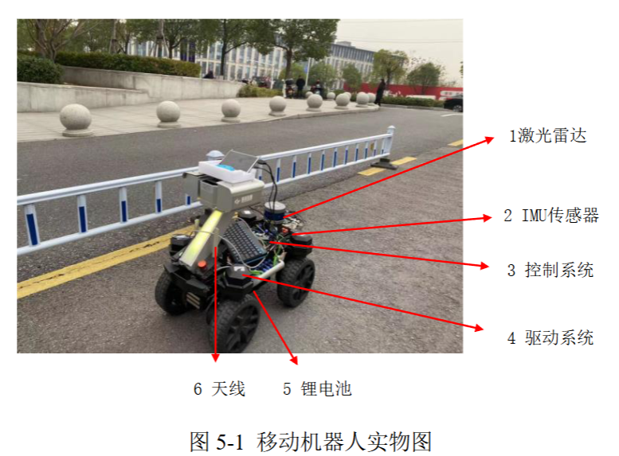
#### 1. 摘要（解决了什么问题）

本文针对**传统三维激光 SLAM 算法在室外复杂环境下存在的地面分割鲁棒性不足、回环检测效率低、定位与建图精度差**等核心问题，提出了一种改进的室外移动机器人激光 SLAM 算法，具体解决以下技术痛点：

1. **复杂地面分割困难**：传统基于线的地面分割方法易将道路车辆、灌木丛等误判为地面，且无法适配陡坡、崎岖路面等非结构化场景，导致特征点匹配精度低、算法鲁棒性不足。
2. **回环检测能力薄弱**：常规回环检测依赖简单的时间与距离约束，在重复场景（如环形路段）中易出现轨迹漂移，无法建立全局一致的地图。
3. **室外环境适应性差**：现有激光 SLAM 算法对室外动态障碍物、重复几何特征等场景的应对能力不足，定位误差随运动距离累积，建图易出现重叠或失真。

通过引入**区域地面分割**和**扫描上下文回环检测**，结合激光里程计优化，实现了室外复杂环境下的高精度定位与全局一致建图，提升了算法的实用性与鲁棒性。

#### 2. 做了什么实验（设备都是什么）

本次研究围绕**地面分割、回环检测、建图定位**三大核心任务，搭建了移动机器人实验平台并结合开源数据集开展实验，核心设备与实验设置如下：

##### 2.1 核心实验设备

1. **移动机器人平台**
    
    - **底盘**：四轮八驱移动机器人，支持复杂路况行驶；
    - **传感器**：速腾聚创 RS-LiDAR-16 三维激光雷达（测距 20cm-150m，垂直视场角 ±15°）、Xsens MTi-320 IMU（零偏稳定性 4°/h，带宽 230Hz）；
    - **计算单元**：X86 工控机（i5-10210U，8G 内存，Ubuntu18.04+ROS Melodic），同时使用 AMD Ryzen 7 6800H 笔记本进行算法仿真与数据分析。
2. **数据集与分析工具**
    
    - **开源数据集**：KITTI 数据集（00/02/05/08 序列，含城市、乡村等室外场景，验证算法泛化性）；
    - **分析工具**：ROS Rviz（三维可视化）、evo 评估工具（计算轨迹绝对位姿误差、相对位姿误差等指标）。

##### 2.2 实验内容

1. **地面分割有效性验证实验**
    
    - **KITTI 数据集测试**：在 00 序列中对比本文算法与 LeGO-LOAM 的地面分割效果，验证对道路车辆、弯道等场景的分割精度；
    - **移动机器人实地测试**：在含陡坡、灌木丛的户外场景开展实验，验证算法对非结构化地面的鲁棒性。
2. **回环检测性能测试实验**
    
    - **数据集仿真**：在 KITTI 的重复路径序列（00/02/05/08）中，对比本文算法与 LOAM、LeGO-LOAM 的轨迹误差，评估回环检测对定位精度的提升；
    - **实地回环实验**：控制移动机器人绕花坛完成环形运动，验证算法对重复场景的轨迹矫正能力。
3. **建图与定位综合验证实验**
    
    - **户外建图测试**：控制移动机器人绕办公楼完成一周运动，对比三种算法的建图完整性与一致性，验证全局建图能力；
    - **定量误差分析**：利用 evo 工具计算算法的绝对位姿误差（APE）、均方根误差（RMSE）等指标，量化定位精度。

#### 3. 结论（效果怎么样）

实验结果表明，改进后的三维激光 SLAM 算法在室外复杂环境下的性能显著优于传统算法，核心效果如下：

1. **地面分割鲁棒性大幅提升**
    
    - **数据集测试**：在 KITTI 00 序列中，本文算法可精准过滤道路车辆等非地面点，地面识别范围比 LeGO-LOAM 更广；在 02 序列乡村陡坡场景中，传统算法地面分割失效，而本文算法仍能稳定识别地面；
    - **实地测试**：在含灌木丛、陡坡的户外场景中，算法可有效区分地面与障碍物，解决了传统算法欠分割、误分割的问题，为后续特征匹配奠定了基础。
2. **回环检测效率与精度双优**
    
    - **轨迹误差显著降低**：在 KITTI 序列中，本文算法的绝对位姿误差（RMSE）相较于 LOAM 降低 67%~80%，相较于 LeGO-LOAM 降低 40%~60%；02 序列中，本文算法 RMSE 仅为 9.81m，远低于 LOAM 的 38.88m 和 LeGO-LOAM 的 26.41m；
    - **实地回环验证**：移动机器人绕花坛运动时，LOAM 轨迹出现分层漂移，LeGO-LOAM 轨迹侵入花坛区域，而本文算法轨迹与真实路径高度吻合，无明显偏差。
3. **全局建图与定位能力达标**
    
    - **建图一致性强**：绕办公楼建图实验中，LOAM 和 LeGO-LOAM 的地图存在重叠与失真，本文算法建立的点云地图与实际环境一致，无重复或缺失区域；
    - **环境适应性突出**：算法可适配室外行人道、公路、上坡等多种场景，动态障碍物（如车辆）不干扰地图构建，验证了其在复杂室外环境的工程实用性。

### 基于3D激光雷达与IMU融合的室外移动机器人SLAM技术研究_赵一凡

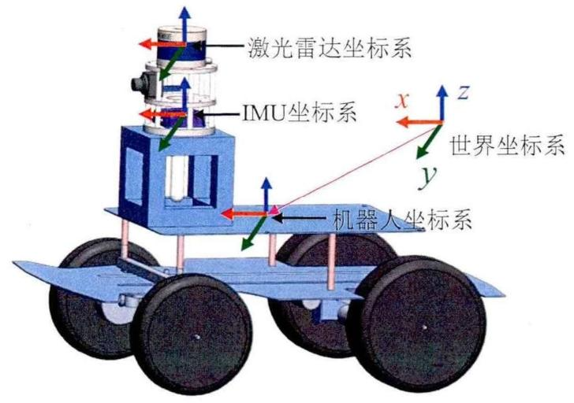

#### 1. 摘要（解决了什么问题）

本文针对**传统单一传感器 SLAM 算法在室外复杂环境下定位精度低、鲁棒性差、长距离运行累积误差难以消除**的核心问题，提出了一种基于 3D 激光雷达与 IMU 融合的室外移动机器人 SLAM 系统，具体解决以下技术痛点：

1. **多传感器时空对齐难题**：激光雷达与 IMU 存在坐标系不统一、时间不同步的问题，导致数据融合存在偏差，影响位姿估计精度。
2. **点云畸变与特征冗余问题**：激光雷达在快速运动时会产生点云畸变，且原始点云数据量大、噪点多，直接匹配会降低效率与精度。
3. **局部位姿估计鲁棒性不足**：纯激光里程计在室外场景退化、运动不平稳时易出现定位偏差，无法满足复杂环境的实时定位需求。
4. **全局累积误差无法消除**：前端里程计的局部误差会随运动距离累积，导致轨迹漂移、地图失准，且传统回环检测易出现误匹配。

通过传感器标定、点云预处理、多源数据融合的前端里程计，以及基于回环检测的全局优化，实现了室外环境下的高精度定位与全局一致建图。

#### 2. 做了什么实验（设备都是什么）

本次研究围绕**传感器标定、前端里程计精度、全局位姿优化与建图**三大核心任务，搭建了移动机器人实验平台并结合开源数据集开展实验，核心设备与实验设置如下：

##### 2.1 核心实验设备

1. **移动机器人平台**
    
    - **底盘**：四轮差速移动机器人，支持复杂路况行驶；
    - **传感器**：速腾聚创 RS-LiDAR-16 三维激光雷达（测距 0.4-150m，垂直视场角 ±15°，10Hz 采样）、北斗星通 KY-INS-180-A0 IMU（零偏稳定性 27°/h，200Hz 采样）；
    - **计算单元**：旷宇智能 CPC-3857 工控机（i7-5500U，8G 内存，Ubuntu16.04+ROS Kinetic），同时使用 i7-9750H 笔记本进行算法仿真与数据分析。
2. **数据集与分析工具**
    
    - **开源数据集**：KITTI 05 序列（移动距离 2161.48m，含市区、乡村等室外场景，验证全局优化效果）；
    - **分析工具**：ROS Rviz（三维可视化）、evo 评估工具（计算绝对位姿误差、均方根误差）、imu_utils（IMU 内参标定）。

##### 2.2 实验内容

1. **传感器标定验证实验**
    
    - **时间同步标定**：通过位姿插值实现激光雷达与 IMU 数据时间对齐，验证数据同步精度；
    - **外参标定**：采用手眼标定原理求解激光雷达与 IMU 的空间外参，对比标定前后的建图重影情况；
    - **IMU 内参标定**：利用 Allan 方差拟合零偏参数，验证 IMU 测量稳定性。
2. **前端里程计性能测试实验**
    
    - **点云畸变去除验证**：对比运动补偿前后的点云重影情况，验证 IMU 辅助去畸变的有效性；
    - **特征提取与位姿估计测试**：在校园中心广场开展实验，对比本文算法与 A-LOAM 的定位误差及实时性，验证几何 + 光强特征融合的优势。
3. **全局位姿优化与建图实验**
    
    - **开源数据集测试**：在 KITTI 05 序列中测试回环检测与全局优化效果，对比不同算法的位姿绝对误差；
    - **校园实地建图测试**：控制机器人在校园开放道路完成 1000m 长距离运动，验证算法对累积误差的消除能力及地图全局一致性，统计地图线段相对误差。

#### 3. 结论（效果怎么样）

实验结果表明，改进后的 3D 激光雷达 - IMU 融合 SLAM 系统在室外复杂环境下的性能显著优于传统算法，核心效果如下：

1. **传感器标定精度达标**
    
    - IMU 零偏标定结果与出厂参数一致（陀螺仪零偏 2.64×10^-5 rad/s，加速度计零偏 3.20×10^-5 m/s²）；
    - 外参标定后点云地图重影消除，坐标系对齐误差满足融合需求，为多源数据融合奠定基础。
2. **前端里程计定位精度与实时性双优**
    
    - **定位精度提升**：校园实验中，前端里程计终点距离误差仅 0.159m，为 A-LOAM 算法的 33.97%，且 z 轴偏差得到有效抑制；
    - **实时性达标**：单帧点云处理时间 71.87ms，低于激光雷达 100ms 的采样周期，可实现实时位姿估计；
    - **点云质量改善**：IMU 辅助去畸变后，场景台阶等结构无重影，几何 + 光强特征提取使有效特征点占比降至 13.87%，大幅降低计算量。
3. **全局优化消除累积误差，建图一致性强**
    
    - **轨迹精度大幅提升**：KITTI 05 序列中，本文 SLAM 算法平均绝对位姿误差 2.68m，为 A-LOAM 的 70.4%，均方根误差 2.748m，轨迹与真值重合度显著提高；
    - **累积误差显著降低**：校园 1000m 长距离实验中，优化后终点距离误差 0.683m，相比前端里程计降低 74.5%，z 轴无明显漂移；
    - **地图精度达标**：所建点云地图与卫星地图轮廓重合度高，线段相对误差仅 2.915%，无明显重影与畸变，具备全局一致性。

### 基于三维激光的室外移动机器人SLAM算法研究_邵国微

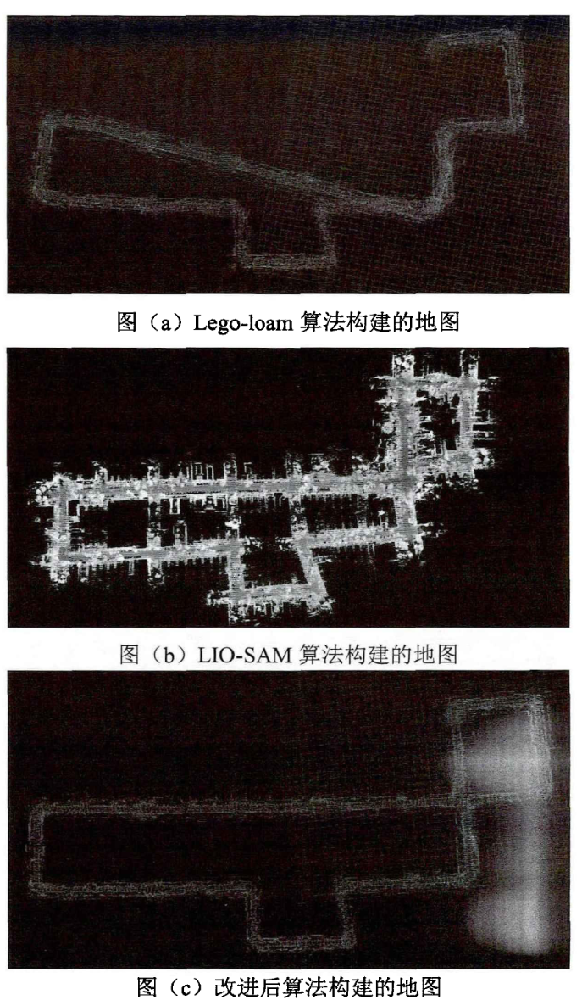
#### 1. 摘要（解决了什么问题）

本文针对**三维激光 SLAM 在室外场景下存在的建图质量低、前端里程计精度不高、回环检测耗时长、大场景累积误差大、定位性能不佳**等核心问题，通过优化点云预处理、前端点云匹配、后端回环检测等关键环节，提出了一套改进的三维激光 SLAM 算法，具体解决以下技术痛点：

1. **建图高度偏差问题**：传统 SLAM 算法基于地面水平一致假设，实际场景中地面存在坡度或起伏，导致高度方向建图偏差大，地图失真。
2. **前端匹配初值敏感问题**：传统 ICP 算法对初始位姿估计敏感，且单一传感器提供的初值存在漂移，影响前端里程计精度。
3. **回环检测效率低问题**：传统领域距离搜索 + ICP 匹配的回环检测方式运算开销大、耗时久，无法满足实时性需求。
4. **大场景累积误差问题**：室外大场景下，前端里程计的局部误差随运动距离累积，导致轨迹漂移、地图全局一致性差。

通过添加地面分割、融合多传感器提供匹配初值、优化迭代最近点算法、改进回环检测策略，实现了室外场景下高精度定位与高质量建图。

#### 2. 做了什么实验（设备都是什么）

研究围绕**算法模块验证**和**整体性能测试**两大方向，结合开源数据集与自研实验平台开展实验，核心设备与实验设置如下：

##### 2.1 核心实验设备

1. **自研移动机器人平台**
    
    - **底盘**：铝合金车架四轮移动小车，兼顾稳定性与轻便性；
    - **传感器**：Atom Robotics 9 轴 IMU（数据更新频率 200Hz，偏航角动态漂移 < 8°/h）、镭神 C16 16 线机械旋转激光雷达（测距最远 70m，10Hz 采样，单帧 3.2 万点）、Trimble MB2 双天线 RTK（定位精度水平 0.008m+1ppm、垂直 0.015m+1ppm，20Hz 输出，提供轨迹真值）；
    - **计算单元**：Intel Core i5-9400 CPU、16G 内存工控机，搭载 Ubuntu18.04+ROS Melodic 系统，支持算法实时运算。
2. **开源数据集与分析工具**
    
    - **开源数据集**：KITTI odometry 序列（05/07/10，含 64 线激光雷达、OXTS RT3003 组合导航数据，验证算法定位精度）、MVSEC Outdoor_garden 数据集（含 16 线激光雷达、200Hz IMU，验证无磁力计校正时的算法鲁棒性）；
    - **分析工具**：ROS Rviz（三维可视化）、evo 评估工具（计算绝对位姿误差 APE、均方根误差 RMSE）、PCL 点云库（点云预处理与配准）。

##### 2.2 实验内容

1. **点云预处理验证实验**
    
    - **地面分割有效性测试**：在 KITTI 05/10 序列中，对比改进算法与 LIO-SAM 的建图高度偏差，验证双阈值地面滤波 + RANSAC 平面拟合的地面分割效果；
    - **运动畸变去除验证**：基于轮式里程计辅助去除点云畸变，对比畸变校正前后的点云重合度。
2. **前端里程计优化实验**
    
    - **多传感器初值验证**：在 KITTI 10 序列中，测试 ESKF 融合 IMU 与 RTK 提供匹配初值的精度，对比纯 IMU 预积分的初值误差；
    - **多度量 ICP 验证**：在 MVSEC 数据集（无磁力计校正）中，对比改进多度量线性 ICP 与传统 ICP 的前端匹配精度，验证算法对初值鲁棒性。
3. **后端回环检测优化实验**
    
    - **回环耗时测试**：在 KITTI 07 序列中，对比改进扫描上下文回环检测与传统方法的耗时，验证算法实时性；
    - **回环精度验证**：统计回环校正前后的轨迹 APE，验证回环约束对累积误差的消除效果。
4. **整体算法性能测试**
    
    - **无回环场景**：录制 1.5 公里无回环室外数据集，对比改进算法与 Lego-LOAM、LIO-SAM 的定位精度；
    - **环形场景**：录制 1 公里单回环数据集，验证回环约束对轨迹闭环的校正效果；
    - **大场景验证**：在 MVSEC 大场景数据集下，测试算法对长距离运动累积误差的抑制能力。

#### 3. 结论（效果怎么样）

实验结果表明，改进后的三维激光 SLAM 算法在室外场景下的定位精度与建图质量显著提升，核心效果如下：

1. **建图质量显著改善**
    
    - 地面分割算法有效降低高度方向偏差，KITTI 05 序列实验中，改进算法的绝对位姿误差（APE）最大值从 6.279m 降至 2.908m（降低 53%），KITTI 10 序列 APE 最大值从 5.365m 降至 2.065m（降低 62%），高度方向轨迹与真值贴合度大幅提升。
2. **前端里程计精度提升**
    
    - 多传感器融合提供的匹配初值有效解决 ICP 初值敏感问题，MVSEC 数据集（无磁力计校正）实验中，改进算法 APE 均方根误差从 17.34m 降至 7.40m（降低 57%），首帧点云 APE 从 39.5m 降至 10.5m（降低 73%）；KITTI 数据集实验中，前端匹配误差控制在厘米级，与 LIO-SAM 算法精度相当且鲁棒性更强。
3. **回环检测效率翻倍**
    
    - 扫描上下文回环检测算法大幅降低耗时，KITTI 07 序列实验中，回环模块平均耗时从 9941.6ms 降至 5198.6ms（降低 47.7%），且定位精度无损失，改进前后 APE 差值在厘米级（最大 20.6cm），不影响建图质量。
4. **大场景累积误差抑制明显**
    
    - 无回环场景下，改进算法 APE 均方根误差 1.460m，较 Lego-LOAM（2.740m）降低 46.7%、较 LIO-SAM（1.709m）降低 14.6%；
    - 单回环场景下，APE 均方根误差从 4.484m 降至 0.480m（降低 89%），轨迹闭环效果显著；
    - 大场景 MVSEC 数据集实验中，APE 均方根误差从 17.348m 降至 7.405m（降低 57%），地图无明显漂移，全局一致性强。

综上，改进算法在室外复杂场景下实现了**更高的定位精度**（APE 降低 40%~89%）、**更好的建图质量**（高度偏差显著减小）和**更强的实时性**（回环耗时降低近 50%），满足室外移动机器人的 SLAM 需求。

## 1211

### 基于LIO-SAM建图和激光视觉融合定位的温室自主行走系统

#### 1. 摘要（解决了什么问题）

本文针对**传统导航方案在温室内无法适配光照变化大、作物行间距窄、GPS 信号差、地面崎岖易导致车轮打滑、行间环境特征相似等复杂场景**的核心问题，提出了基于 LIO-SAM 建图和激光视觉融合定位的温室自主行走导航方案，具体解决以下技术痛点：

1. **建图失真问题**：传统二维 SLAM 算法（如 gmapping、cartographer）依赖轮式里程计，在温室崎岖地面易因车轮打滑产生定位偏差，且行间特征相似导致建图严重失真，无法满足导航需求。
2. **定位精度不足问题**：单一轮式里程计或 IMU 定位易受振动、温度影响，存在累计误差；传统 AMCL 算法在温室大范围场景下位置估计易失真，无法适配环境多变的温室。
3. **导航适应性差问题**：传统导航方案路径固定、避障能力弱，无法在作物窄行间实现平稳直行、转弯及实时避障，且难以应对不同行驶速度下的精度波动。

通过融合三维激光雷达与 IMU 的 LIO-SAM 建图、扩展卡尔曼滤波局部定位、激光点云配准优化的 AMCL 全局定位，以及 A*+ 动态窗口算法路径规划，实现了温室环境下的高精度建图、定位与自主导航。

#### 2. 做了什么实验（设备都是什么）

研究围绕**建图精度、定位精度、导航精度**三大核心指标，在草莓温室场景开展试验，核心设备与实验设置如下：

##### 2.1 核心实验设备

1. **自主行走系统硬件平台**
    
    - **移动底盘**：四轮差速移动平台（长 431.5mm、宽 410mm、高 1222.5mm，最大负载 50kg，最大速度 1.0m/s，续航 6h）；
    - **环境感知传感器**：Velodyne VLP-16 三维激光雷达（16 线，360° 全覆盖，最大测距 100m）、二维激光雷达（水平 360°，测距 10m，15Hz 扫描）、微软 Kinect V2 深度相机（RGB 分辨率 1920×1080，深度分辨率 512×424，测距 0.5-4.5m）、MPU6050 惯性测量单元（三轴陀螺仪 + 加速度计）、电机编码器（每转 100 脉冲）、超声波传感器（前后各 2 个，用于避障）；
    - **控制与通信模块**：AMERICAN MEGATRENDS INC AMI876 微型计算机（Ubuntu16.04+ROS 系统）、STM32 单片机（负责电机 PID 控制与避障）、极路由 HiWiFi 主板（无线通信）；
    - **远程客户端**：用于发布导航指令、监控平台状态。
2. **实验场景与分析工具**
    
    - **实验场景**：南京市江宁区丰硕欢乐农场草莓温室（左侧 59 行、右侧 60 行草莓栽培支架，垄间距 0.895-1.231m，垄长 38.210-42.236m，地面凹凸不平）；
    - **分析工具**：ROS Rviz（地图与轨迹可视化）、卷尺（实测温室尺寸）、自定义偏差计算工具（统计定位与导航偏差）。

##### 2.2 实验内容

1. **建图精度对比实验**
    
    - 控制移动平台以 0.30m/s 速度在草莓行间行驶，分别采用 gmapping、cartographer、LIO-SAM 算法构建温室地图；
    - 选取 7 个典型位置，对比地图尺寸的绝对误差、相对误差及均方根误差，验证 LIO-SAM 的建图优势。
2. **定位精度测试实验**
    
    - **局部定位**：在温室 3 个不同行间场景，对比 “轮式里程计 + IMU” 与 “轮式里程计 + 视觉里程计” 的扩展卡尔曼滤波定位偏差，验证视觉里程计对定位精度的提升；
    - **全局定位**：在温室 2 个大范围场景，对比 NDT-matching、传统 AMCL、改进 AMCL（融合 NDT-matching）的定位偏差，验证全局定位的抗累计误差能力。
3. **导航精度测试实验**
    
    - 设定作物行间中心线为目标路径，控制平台分别以 0.15m/s、0.30m/s、0.50m/s 速度行驶，途经直行段与转弯口；
    - 统计不同速度下的横向偏差、纵向偏差及航向偏角，验证导航系统在不同工况下的稳定性。

#### 3. 结论（效果怎么样）

实验结果表明，改进的温室自主行走系统在定位、建图及导航性能上均显著优于传统方案，核心效果如下：

1. **建图精度大幅提升**
    
    - 传统 gmapping 算法建图最大绝对误差 13.227m、均方根误差 7.170m，cartographer 算法最大绝对误差 0.865m、均方根误差 0.329m，均存在严重失真；
    - LIO-SAM 算法构建的地图最大相对误差仅 9.9%、最大绝对误差 0.081m、均方根误差 0.063m，地图行间特征清晰、无弯曲，匹配真实温室场景，满足导航基础需求。
2. **定位精度满足温室需求**
    
    - **局部定位**：融合视觉里程计的扩展卡尔曼滤波算法 x 轴和 y 轴最大平均偏差为 0.643m 和 0.814m，远优于融合 IMU 算法的 1.454m 和 3.391m，为全局定位提供精准初始位姿；
    - **全局定位**：改进 AMCL 算法（融合 NDT-matching）x 轴和 y 轴最大平均偏差仅 0.085m 和 0.095m，最大偏差 0.343m 和 0.084m，相比传统 AMCL（x 轴平均偏差 0.160m、y 轴 0.442m）和 NDT-matching（x 轴平均偏差 0.223m、y 轴 0.321m），定位精度提升显著，无累计误差。
3. **导航稳定性强，适配多速度工况**
    
    - 平台以 0.15m/s、0.30m/s、0.50m/s 速度行驶时，横向偏差、纵向偏差及航向偏角平均值分别小于 0.120m、0.100m 和 8.5°，标准差分别小于 0.070m、0.140m 和 6.6°；
    - 横向和航向偏差随速度增加略有上升，但整体偏差可控，可平稳完成窄行间直行、转弯及避障，无严重路径偏离，满足温室自主作业的导航精度要求。

### 镭神智能展示最新3D_SLAM无人叉车系列产品

#### 1. 摘要（解决了什么问题）

本文围绕**工业与物流场景中智能搬运设备导航局限、部署复杂、成本高、适应性差**等核心痛点，聚焦蓝芯科技智能搬运机器人与镭神智能 3D SLAM 无人叉车系列产品的技术突破，具体解决以下行业问题：

1. **传统导航方案场景受限**：传统无人搬运设备依赖磁条、二维码、激光反射板等人工标记，室外无法使用，且在动态环境（如人员穿梭、障碍物变化）、复杂地形（坡度大、地面不平整）中定位精度低、易失效。
2. **部署效率低、成本高**：传统方案需提前铺设辅助设施，单一场景部署周期长（单台设备需数周），多设备协同调度难度大，且硬件维护成本高，中小企业难以负担。
3. **环境适应性与安全性不足**：多数设备仅支持单一室内场景，缺乏立体感知能力，无法识别悬空 / 低矮障碍物、区分动静障碍，且在跨楼层、室外恶劣天气（如风雨）下运行不稳定，存在安全隐患。
4. **智能化与集成度低**：设备与工厂 WMS、MES、FMS 等系统对接困难，无法实现全流程无人化操作，且多机协同效率低，难以满足大规模仓储物流的高效作业需求。

通过自然导航（视觉 / 激光 3D SLAM）、多传感器融合感知、自研调度系统等技术，实现设备在复杂场景的高精度定位、快速部署与安全运行，推动工业与物流智能化升级。

#### 2. 做了什么实验（设备都是什么）

研究与产品验证围绕**设备性能测试、场景适应性验证、多机协同与系统集成**三大方向展开，核心设备与实验设置如下：

##### 2.1 核心实验设备

1. **蓝芯科技智能搬运机器人**
    
    - **主力机型**：VMR-FR31510L（负载 1500kg，速度 0-2m/s，旋转直径 1200mm）、VMR-FR3400L（新款高负载机型）；
    - **导航与感知**：LXMRDVS® 深度视觉系统（3D 相机 + AI 算法，视野 90°×70°）、红外 / 光电传感器（辊筒对接）、自适应悬挂系统（地面找平）；
    - **控制与调度**：威迈尔 VMR 核心控制器、自研多机调度系统（支持数十台设备协同，开放接口对接 WMS/MES）。
2. **镭神智能 3D SLAM 无人叉车**
    
    - **主力机型**：平衡重式 LXE20-B（室外复杂环境适用，负载 2000kg 级）、轻量搬运式 IRST15-D（LXST15-D，跨楼层转运）、窄通道堆垛式 IRSL14-B（LXSL14-B，1.4 米货架堆垛）；
    - **导航与感知**：128 线混合固态激光雷达 CH128X1（门架底部配置）、7-8 颗自研激光雷达（360° 立体感知）、高精定位惯导；
    - **控制与调度**：自研 FMS 多机调度系统、WCS 仓库管理系统，支持 API 对接第三方软件。
3. **辅助实验设备与工具**
    
    - **环境模拟设备**：坡度模拟平台（最大坡度 15°）、动态障碍物发生器（模拟人员 / 货物移动）、高低温 / 风雨环境舱（室外适应性测试）；
    - **分析工具**：激光定位精度测试仪（误差 ±2mm）、多机协同调度模拟器、作业效率统计软件（记录搬运次数 / 能耗）。

##### 2.2 实验内容

1. **设备性能与导航精度测试**
    
    - **定位精度验证**：在室内动态场景（人员穿梭、货架移动）与室外复杂地形（坡度 5°-15°、地面缝隙 / 凸起）中，测试蓝芯机器人视觉导航与镭神 3D SLAM 的定位误差，对比传统二维码导航的偏差；
    - **避障与识别测试**：模拟悬空障碍物（高度 20-50cm）、低矮障碍（高度 5-15cm），测试设备识别率；区分动态（人员行走）与静态障碍（箱子），验证避障策略切换准确性。
2. **场景适应性与部署效率实验**
    
    - **跨场景运行测试**：镭神 LXE20-B 在室外风雨环境（风速 5m/s、小雨）、室内外跨区域（厂房 - 露天仓库）中连续作业，记录运行稳定性；蓝芯机器人跨楼层转运（电梯对接），验证自适应悬挂对地面不平整的补偿效果；
    - **部署周期统计**：10 台镭神无人叉车在工厂场景（5000㎡）部署，记录从建图到投产的时间，对比传统方案（磁条铺设）的效率差异。
3. **多机协同与系统集成验证**
    
    - **多机调度测试**：20 台蓝芯机器人 / 镭神叉车协同作业，模拟仓储 “上料 - 转运 - 下料” 全流程，测试调度系统任务分配效率（最近路线匹配、无待命点接单）；
    - **系统对接验证**：将设备与 WMS/MES 系统对接，测试自动呼叫任务响应速度、辊筒自动对接成功率（红外 / 光电传感器通讯），验证全流程无人化操作可行性。
4. **成本与效益测算实验**
    
    - **人力替代验证**：某消费电子企业用 6 台镭神无人叉车替代 10 名人工，记录 1 年搬运次数（日均 100 + 次）、人力成本节约金额，测算回本周期；
    - **能耗与维护测试**：对比蓝芯 / 镭神设备与传统叉车的能耗（kWh / 吨物料）、年度维护成本，评估长期使用经济性。

#### 3. 结论（效果怎么样）

实验与实际应用结果表明，蓝芯科技与镭神智能的智能搬运设备在**定位精度、场景适应性、部署效率、成本控制**等方面显著优于传统方案，核心效果如下：

1. **导航与定位精度大幅提升**
    
    - 蓝芯机器人视觉导航在动态环境中定位误差＜5mm，辊筒对接成功率 100%；镭神 3D SLAM 无人叉车重复定位精度 ±2mm，室外坡度 15° 场景中轨迹偏差＜0.05m，昼夜均可精准识别栈板，解决传统方案室外失效问题。
    - 障碍物识别准确率达 98% 以上：蓝芯 LXMRDVS 系统可识别 20cm 悬空障碍、5cm 低矮障碍；镭神 7 颗激光雷达实现 360° 立体防护，动静障碍区分准确率 100%，避障策略切换响应时间＜0.5s。
2. **部署效率提升，成本显著降低**
    
    - 镭神 10 台无人叉车部署周期仅 1-2 周，较传统磁条方案（单台 2-3 周）效率提升 80%，且无需铺设辅助设施，部署成本降低 60%；某消费电子企业引入 6 台镭神设备，1 年即可收回人力成本（年均节省工资 + 福利约 72 万元）。
    - 蓝芯机器人自适应悬挂系统使地面不平整（±10cm 凸起 / 缝隙）场景的运行稳定性提升 90%，设备故障率降低至 1% 以下；镭神 LXE20-B 在室外风雨环境中连续运行无故障，适应温度范围 - 10℃-50℃。
3. **多机协同与系统集成效果显著**
    
    - 蓝芯 / 镭神调度系统支持 20 + 台设备协同，任务响应时间＜1s，最近路线匹配使搬运效率提升 30%（日均搬运次数从 80 次增至 120 次）；与 WMS/MES 对接后，全流程无人化操作率达 100%，减少人工干预 90%。
    - 跨场景应用突破：镭神无人叉车实现室内外跨区域、跨楼层转运，堆垛式机型 IRSL14-B 在 1.4 米窄通道货架作业中堆垛精度＜0.03m；蓝芯机器人支持辊筒、皮带、货框等多类型上装，产线对接适配率 100%。
4. **行业落地成效显著**
    
    - 镭神智能 3D SLAM 无人叉车已在烟草、石化、新能源等 300 + 场景落地，服务 150 + 企业，某移动电源企业引入后生产效率提升 40%；蓝芯机器人在 SMT 产线、仓储物流场景应用，客户反馈设备综合利用率达 95% 以上。
    - 国际市场验证：镭神与韩国 Soosung 合作推出的 IRST15-D/IRSL14-B 无人叉车，在韩国 Korea Mat 2024 展会上完成多机协同演示，获海外客户订单，推动 3D SLAM 技术全球化应用。

### 实时视觉-惯性里程计中的流形预积分

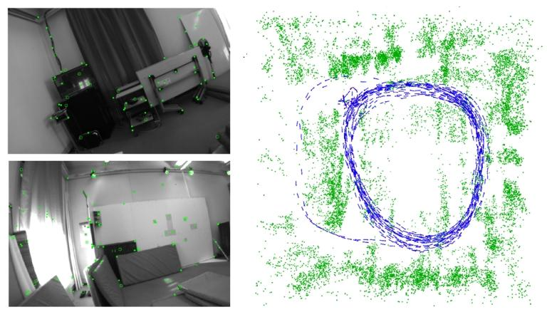

#### 1. 摘要（解决了什么问题）

本文针对**传统视觉 - 惯性里程计（VIO）在轨迹增长时实时优化不可行、惯性测量高频导致优化变量激增、旋转群流形结构处理不当引发精度损失**等核心问题，提出了基于流形预积分的 IMU 数据处理与因子图优化框架，具体解决以下技术痛点：

1. **实时性不足问题**：传统 VIO 需对每帧 IMU 数据单独优化，随着轨迹延长，变量数量呈线性增长，计算复杂度急剧升高，无法满足实时性需求。
2. **旋转表示缺陷问题**：现有 IMU 预积分方法（如欧拉角参数化）存在奇异性、不具备刚体变换不变性，且对旋转噪声建模不严谨，导致位姿估计偏差与不一致性。
3. **优化效率低问题**：传统 VIO 需同时优化相机位姿与三维路标点，变量维度高，且线性化误差累积会降低估计精度，难以适配 GPS 拒止环境下的高精度导航需求。

通过提出流形预积分理论（适配 SO (3) 旋转群几何特性）、无结构视觉因子（边缘化路标点）及增量平滑算法，实现了实时且高精度的视觉 - 惯性状态估计。

#### 2. 做了什么实验（设备都是什么）

研究围绕**算法精度、一致性、实时性**三大核心指标，结合**模拟数据集**与**真实场景数据集**开展实验，核心设备与实验设置如下：

##### 2.1 核心实验设备

1. **仿真实验平台**
    
    - **轨迹生成**：模拟半径 3m 的圆形轨迹（含正弦垂直运动，总长 120m），相机以 2.5Hz 采集图像（每帧观测 50 个路标点，像素噪声 σ=1 像素），IMU 以 100~800Hz 输出陀螺仪 / 加速度计数据（添加白噪声与慢变偏差，参数为陀螺仪噪声密度 0.0007rad/(s・√Hz)、加速度计 0.019m/(s²・√Hz)）；
    - **分析工具**：蒙特卡洛模拟（50 次独立运行）、归一化估计误差平方（NEES）分析工具、KL 散度计算工具（评估协方差估计准确性）。
2. **真实场景实验平台**
    
    - **室内实验**：采用 VI-Sensor（ADIS16448 MEMS IMU + 双 WVGA 单色相机，仅用左相机），相机 20Hz、IMU800Hz，通过 Vicon 运动捕捉系统获取真值位姿（精度亚毫米级），实验轨迹长 430m；
    - **室外实验**：搭载 VI-Sensor 的移动设备与 Google Tango 传感器，围绕办公楼完成 300m 闭环轨迹及 160m 跨楼层轨迹，对比端到端误差；
    - **计算平台**：Intel i7-2.4GHz 笔记本电脑，前端为 SVO 半直接视觉里程计（3ms / 帧），后端为 iSAM2 增量平滑算法（10ms / 关键帧更新）。

##### 2.2 实验内容

1. **流形预积分有效性验证**
    
    - **旋转积分精度对比**：对比欧拉角与 SO (3) 流形的旋转积分误差，验证流形方法在高角速度（1~3rad/s）、大采样间隔下的无偏性；
    - **偏差校正精度测试**：对 IMU 偏差施加 0.04~0.2 的随机扰动，验证一阶偏差校正的近似误差，评估其替代重复积分的可行性。
2. **算法一致性与鲁棒性验证**
    
    - **NEES 分析**：通过 50 次蒙特卡洛运行，计算位姿估计的平均 NEES 值，验证算法在不可观测方向（全局偏航、位置）的不确定性传播一致性；
    - **奇点规避测试**：模拟俯仰角接近 90° 的极端轨迹，对比欧拉角与流形方法的协方差估计 KL 散度，验证流形方法无奇点优势。
3. **真实场景性能对比**
    
    - **室内精度测试**：在 430m 室内轨迹中，对比所提方法与 OKVIS（优化类）、MSCKF（滤波类）的相对漂移，评估不同轨迹分段（10~360m）的误差；
    - **室外闭环测试**：完成 300m 室外闭环轨迹与 160m 跨楼层轨迹，对比 Google Tango 的端到端误差，验证复杂场景适配性。

#### 3. 结论（效果怎么样）

实验结果表明，基于流形预积分的 VIO 算法在**精度、实时性、一致性**上均显著优于传统方法，核心效果如下：

1. **实时性大幅提升**
    
    - 增量平滑算法 iSAM2 实现恒定时间复杂度，每关键帧更新仅需 10ms（后端），前端 SVO 特征跟踪仅需 3ms / 帧，整体可满足 100Hz 的完整平滑频率；相比批量优化，轨迹长度增至 250 关键帧时，计算时间仍保持稳定，无随轨迹增长的延迟。
2. **定位精度显著提高**
    
    - **仿真实验**：iSAM2 与批量优化的均方根误差（RMSE）一致，姿态 RMSE 低于 0.2rad、位置 RMSE 低于 0.1m；偏差估计可准确跟踪真实值，一阶偏差校正对 0.2 量级的偏差扰动，误差可忽略（位置误差 < 1e-5m、旋转误差 < 1e-3rad）；
    - **室内实验**：360m 轨迹的平均漂移仅 0.3m，显著优于 OKVIS（0.7m）与 MSCKF（0.7m），偏航方向漂移降幅超 50%；
    - **室外实验**：300m 闭环轨迹端到端误差 1.0m（Google Tango 为 2.2m），160m 跨楼层轨迹漂移 0.5m（Tango 为 1.4m），适配复杂室内外场景。
3. **算法具备强一致性**
    
    - NEES 值始终处于 [5.0,7.0] 的接受区间内，未出现过度自信（NEES<7），且横滚 / 俯仰角不确定性因重力可观测性保持有界，全局偏航 / 位置不确定性缓慢增长，符合 VIO 可观性特性；
    - 流形方法的旋转协方差估计 KL 散度接近 0，而欧拉角方法在俯仰角接近 90° 时散度骤增（>1.5），验证了流形建模的鲁棒性。
4. **旋转表示优势突出**
    
    - 相比欧拉角预积分，流形方法避免了奇异性与积分误差累积，在高角速度（3rad/s）下旋转积分误差降低一个数量级，且具备刚体变换不变性，不同世界坐标系下的对数似然波动 <0.2（欧拉角波动> 1.0）。

### 动态场景中基于YOLOv7的移动机器人视觉语义SLAM技术_刘行

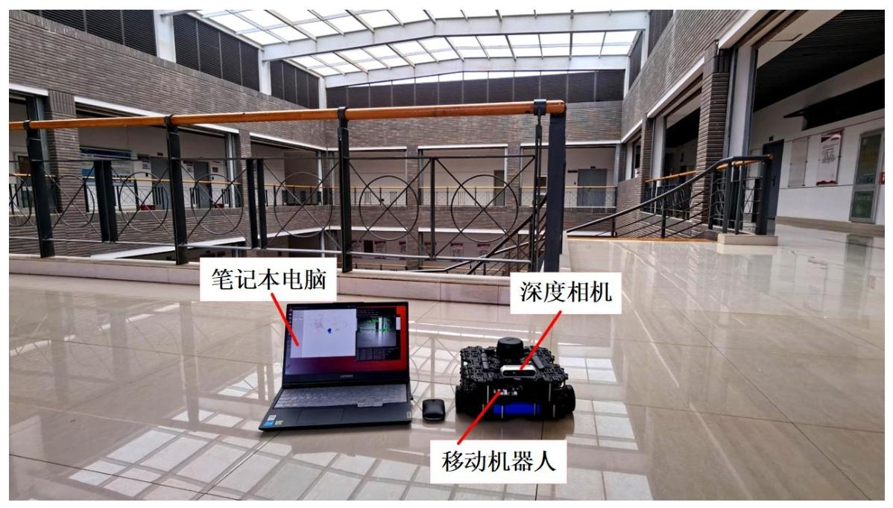

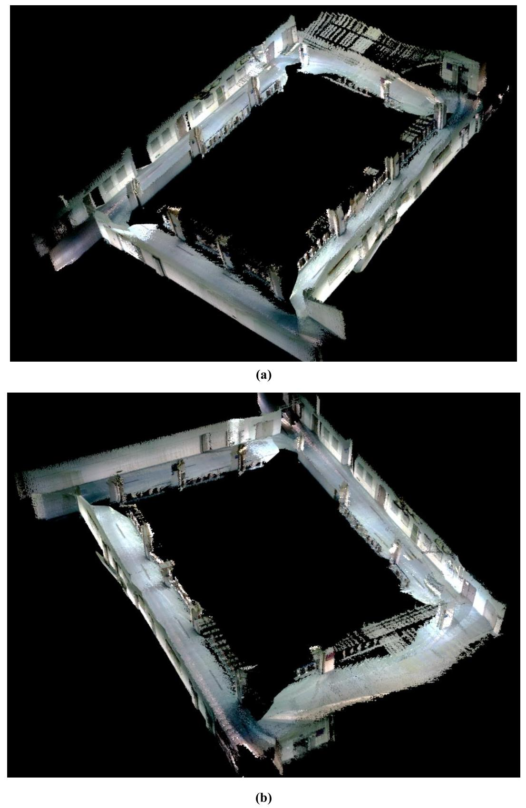

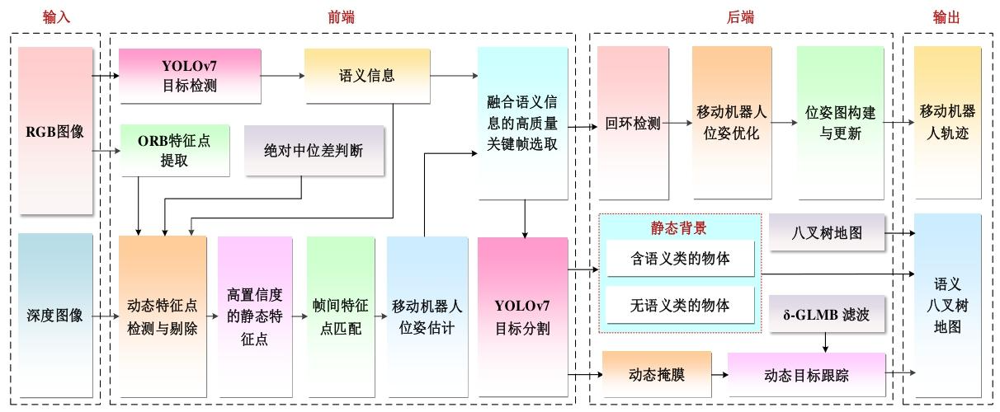

#### 1. 摘要（解决了什么问题）

本文针对**传统视觉 SLAM 在动态场景中受动态目标干扰导致定位精度低、地图一致性差、关键帧冗余度高、回环检测误匹配率高，且缺乏语义信息无法满足机器人智能化导航需求**等核心痛点，提出基于 YOLOv7 的移动机器人 3D 语义 SLAM 算法，具体解决以下技术问题：

1. **动态特征点干扰问题**：传统 SLAM 无法区分动态 / 静态特征点，动态目标会引入大量误差，导致位姿估计漂移、地图失真，甚至跟踪丢失。
2. **关键帧冗余与低效问题**：传统关键帧选取策略未结合语义信息，易选取含大量动态特征的低质量帧，增加后端优化负担，降低系统实时性。
3. **回环检测精度不足问题**：传统词袋模型（BOW）回环检测仅依赖几何特征，在动态场景中易因动态目标干扰出现误匹配，无法有效消除累积误差。
4. **地图语义缺失问题**：传统 SLAM 构建的稀疏 / 稠密地图无语义信息，无法支撑机器人环境理解、自主导航与动态目标交互，且动态目标直接剔除会导致地图信息不完整。

通过 YOLOv7 语义检测、动态特征点精准剔除、语义增强关键帧与回环检测、语义八叉树地图构建及动态目标跟踪重建，实现动态场景下高精度定位与智能化建图。

#### 2. 做了什么实验（设备都是什么）

研究围绕**动态特征剔除效果、定位精度、回环检测性能、语义地图质量、动态目标跟踪能力**五大指标，结合**公开数据集仿真**与**真实场景实体测试**开展实验，核心设备与实验设置如下：

##### 2.1 核心实验设备

1. **硬件平台**
    
    - **移动机器人**：TurtleBot3 Waffle Pi（搭载 Jetson Xavier NX 开发板、RPLIDAR A2 激光雷达、RealSense D435i/Asus Xtion Pro 深度相机，两轮差速驱动）；
    - **计算终端**：i7-4712mq 笔记本（16GB DDR3 内存、GTX960m 显卡）；
    - **辅助设备**：TP-LINK 千兆无线路由器（保障数据传输）。
2. **软件环境**
    
    - **基础系统**：Ubuntu18.04 LTS + ROS Melodic；
    - **依赖库**：OpenCV3.4.3、Eigen3.3.9、PCL1.8、G2O、YOLOv7 目标检测 / 分割框架、δ-GLMB 滤波工具；
    - **评估工具**：evo 轨迹评估工具（计算 ATE/RPE）、P-R 曲线分析工具（验证回环检测性能）。
3. **实验数据集**
    
    - **TUM 数据集**：选取 walking 系列（walking_xyz、walking_halfsphere 等）及 sitting 系列动态 / 静态子数据集，验证动态特征剔除与定位精度；
    - **Bonn 数据集**：选取 bonn_crowd 等含复杂动态目标的子数据集，验证动态目标跟踪性能；
    - **真实场景**：8.4m×6.4m 实验室（室内动态场景）、25m×25m 室外回廊（大场景 / 弱纹理动态场景）。

##### 2.2 实验内容

1. **动态特征点剔除有效性验证**
    
    - 对比 ORB-SLAM2 与本文算法在 TUM walking_xyz 数据集的特征点分布，验证动态目标（行人）特征点剔除效果；
    - 计算绝对轨迹误差（ATE）和相对位姿误差（RPE），量化动态特征剔除对定位精度的提升。
2. **关键帧与回环检测性能测试**
    
    - 统计 TUM 数据集下本文算法与 ORB-SLAM2 的关键帧数量，验证语义增强关键帧策略的冗余削减效果；
    - 选取 TUM 数据集 8 张图像，对比传统 BOW 与 “BOW + 语义” 回环检测的相似度计算结果，通过 P-R 曲线评估回环检测准确率与召回率。
3. **语义地图与动态目标跟踪验证**
    
    - 基于 TUM 数据集和真实场景，验证语义稠密点云地图、语义八叉树地图的构建精度，对比 ORB-SLAM2 地图的完整性与可读性；
    - 利用 δ-GLMB 滤波在 TUM/Bonn 数据集及真实场景中跟踪动态目标，验证动态目标运动估计与地图融合效果。
4. **真实场景综合性能测试**
    
    - **室内实验**：在实验室场景中模拟行人动态干扰，对比 ORB-SLAM2 与本文算法的轨迹误差、回环检测次数及地图一致性；
    - **室外实验**：在 25m×25m 回廊场景（弱纹理 / 多动态目标），验证算法长距离定位、大场景建图及动态目标跟踪的鲁棒性。

#### 3. 结论（效果怎么样）

实验结果表明，基于 YOLOv7 的语义 SLAM 算法在动态场景中**定位精度、地图质量、实时性、智能化程度**均显著优于传统方案，核心效果如下：

1. **动态特征剔除与定位精度大幅提升**
    
    - **仿真实验**：在 TUM 高动态数据集（walking_xyz）中，本文算法 ATE 的 RMSE 较 ORB-SLAM2 降低 96.8%（从 0.7521m 降至 0.0151m），RTE/RRE 分别降低 93.8%/91.1%，优于 DS-SLAM、DynaSLAM 等主流动态 SLAM 方案；在 Bonn 数据集上，ATE 的 RMSE 较 ORB-SLAM2 降低 95.8%，有效解决动态目标导致的轨迹漂移问题。
    - **真实场景**：室内动态场景中，算法轨迹与参考轨迹吻合度高，ORB-SLAM2 因动态干扰出现明显偏移，且本文算法成功检测到 3 次回环（ORB-SLAM2 仅检测到 2 次）。
2. **关键帧与回环检测性能优化**
    
    - 关键帧数量较 ORB-SLAM2 减少 30%~50%（如 walking_xyz 数据集从 436 帧降至 316 帧），在降低冗余的同时提升位姿估计稳定性；
    - 回环检测 P-R 曲线显示，本文 “BOW + 语义” 策略在召回率 100% 时准确率达 100%，而传统 BOW 仅为 66.7%，误匹配率显著降低，有效消除累积误差。
3. **语义地图满足智能化导航需求**
    
    - 构建的语义稠密地图可精准识别并标记键盘、杯子、盆栽等物体，语义八叉树地图较稠密点云地图存储体积缩小 80%，且保留完整导航信息，可支撑机器人避障与路径规划；
    - 动态目标跟踪模块通过 δ-GLMB 滤波实现动态物体运动估计，消除地图重影并实时更新目标位置，提升机器人环境感知与交互能力。
4. **实时性与鲁棒性达标**
    
    - 单帧跟踪平均耗时 27.38ms（含 YOLOv7 目标检测 35ms），虽略高于 ORB-SLAM2（21.58ms），但满足实时性要求；在室外弱纹理 / 多动态目标场景中，算法可稳定完成长距离建图与回环检测，无跟踪丢失。

### Enhanced LiDAR-inertial SLAM with adaptive intensity feature extraction-mono

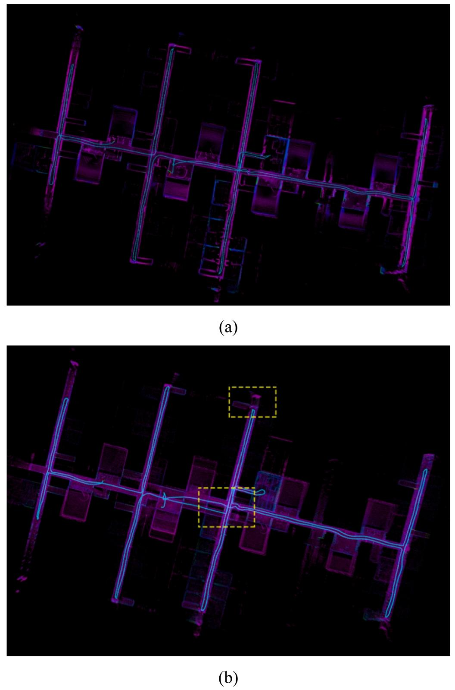
#### 1. 摘要（解决了什么问题）

本文针对**传统激光雷达 - 惯性 SLAM（LIO）在长直走廊、隧道等退化场景中因几何特征匮乏导致定位精度下降、鲁棒性不足**的核心痛点，提出一种融合自适应强度特征的增强型 LIO 系统，具体解决以下技术问题：

1. **退化场景定位失效问题**：传统 LIO 仅依赖几何特征（边缘 / 平面点），在几何结构单一的退化场景中，有效约束不足，易出现位姿漂移、地图畸变。
2. **强度信息利用不充分问题**：激光雷达强度通道可反映环境纹理，但现有方法要么需复杂的强度校准 / 入射角计算，要么未实现几何与强度特征的自适应融合，难以发挥强度信息的辅助定位价值。
3. **多激光雷达适配性差问题**：固态激光雷达因视场角窄，在退化场景中比机械式激光雷达更易受干扰，传统算法缺乏针对性的特征增强方案。

通过在迭代误差状态卡尔曼滤波（IESKF）框架内自适应提取强度边缘特征，并依据几何 / 强度特征的观测质量进行加权融合，实现常规与退化场景下的高精度、高鲁棒性定位与建图。

#### 2. 做了什么实验（设备都是什么）

研究围绕**常规场景定位精度、退化场景鲁棒性、自适应加权模块有效性**三大核心指标，结合**公开数据集仿真**开展实验，核心设备与实验设置如下：

##### 2.1 核心实验设备与数据集

1. **激光雷达与 IMU 设备**
    
    - **机械式激光雷达**：Ouster-16/Ouster-64（10Hz 采样，360° 视场角）；
    - **固态激光雷达**：Livox Avia（窄视场角，非重复扫描模式）；
    - **IMU**：Ouster 内置 IMU（100Hz）、Xsens、BMI088、ICM-20948（适配不同数据集）。
2. **数据集**
    
    - **常规场景**：NTU VIRAL 数据集（无人机采集，含 9 组序列，覆盖姿态剧烈变化的飞行场景，提供高精度真值）；
    - **退化场景**：GEODE 隧道数据集（含 tunnel_1/2/4 等 4 组地下隧道序列）、多激光雷达走廊数据集（含 indoor_4/5 等 3 组长直走廊序列，覆盖机械式 / 固态激光雷达采集数据，隧道场景真值由全站仪 / 激光跟踪仪获取）。
3. **对比算法**
    
    - 主流 LIO 算法：LIO-SAM（图优化框架）、FAST-LIO2（直接点云配准）、Point-LIO（高频鲁棒 LIO）。

##### 2.2 实验内容

1. **常规场景定位精度验证**
    
    - 在 NTU VIRAL 无人机数据集上，对比所提算法与 LIO-SAM、FAST-LIO2、Point-LIO 的绝对轨迹误差（ATE）和均方根误差（RMSE），验证强度特征对姿态剧烈变化场景的定位提升效果。
2. **退化场景鲁棒性测试**
    
    - 在隧道、长直走廊等退化场景中，分别测试机械式 / 固态激光雷达下算法的定位误差分布，对比不同算法的地图一致性；
    - 统计不同激光雷达类型的误差达标比例（如 0.5 米内误差占比），验证算法对多激光雷达的适配性。
3. **自适应加权模块消融实验**
    
    - 移除自适应加权模块，对比等权重融合与自适应加权的定位精度，验证加权策略对特征融合有效性的提升价值。

#### 3. 结论（效果怎么样）

实验结果表明，融合自适应强度特征的增强型 LIO 系统在**定位精度、鲁棒性、多激光雷达适配性**上均显著优于传统方案，核心效果如下：

1. **常规场景定位精度显著提升**
    
    - 在 NTU VIRAL 数据集上，相较于 LIO-SAM、FAST-LIO2、Point-LIO，所提算法的定位精度分别提升**6.07%~91.08%**、**2.48%~69.17%**、**1.44%~64.05%**；
    - 无人机姿态剧烈变化的 rtp_3 序列中，所提算法轨迹最接近真值，LIO-SAM 因依赖高频 IMU 预积分，该序列误差达 2.209m，而所提算法仅 0.197m。
2. **退化场景鲁棒性大幅增强**
    
    - 在隧道、长直走廊等退化场景中，算法定位精度较对比算法提升**1.98%~83.44%**，且地图无明显畸变；例如 tunnel_2 序列中，FAST-LIO2 地图存在显著偏移，而所提算法地图保持全局一致性；
    - 机械式激光雷达适配性优于固态激光雷达：机械式激光雷达在退化场景中 0.5 米内误差占比达**98.31%**，而固态激光雷达为**23.30%**，但所提算法搭配固态激光雷达的表现仍优于传统算法搭配机械式激光雷达的方案。
3. **自适应加权模块效果显著**
    
    - 消融实验显示，启用自适应加权模块后，定位精度较等权重融合提升**0.48%~27.57%**，尤其在姿态快速变化序列中，有效抑制了位姿漂移，验证了加权策略对特征融合有效性的保障作用。

## 1213

### 动态环境中具身智能机器人三维激光SLAM研究综述_李经丹

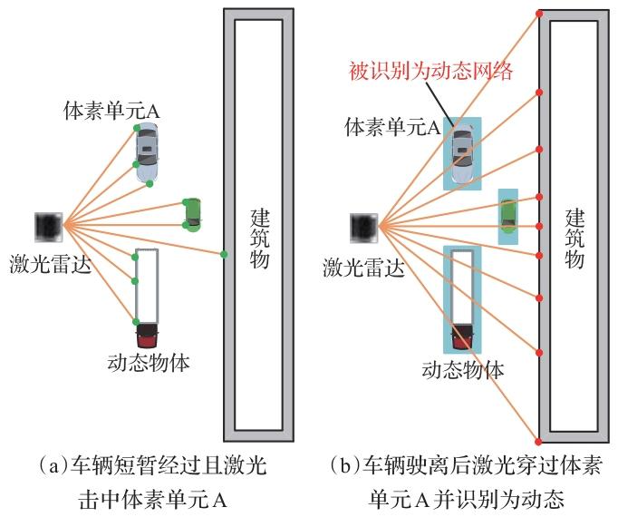

#### 1. 摘要（解决了什么问题）

本文针对**传统三维激光 SLAM 算法基于静态环境假设，在动态场景中因动态物体干扰导致定位精度下降、地图出现 “残影” 且无法适配不同动态程度物体**的核心问题，系统梳理并研究动态环境下具身智能机器人三维激光 SLAM 的关键技术，具体解决以下痛点：

1. **动态物体去除方法局限性问题**：现有动态点云去除方法（如传统几何特征法）存在依赖标记数据集、内存消耗大、地面点误杀、大型物体遮挡导致漏检等缺陷，无法高效区分并剔除动态点云。
2. **动态物体分类与处理策略不匹配问题**：未针对高动态（实时移动）、低动态（短暂停留）、半动态（会话间移动）物体的不同特性制定适配策略，导致动态点云去除精度和鲁棒性不足。
3. **算法评价体系与数据集缺失问题**：缺乏统一的动态激光 SLAM 精度评价指标，且适配动态场景的开源数据集覆盖场景有限，难以支撑算法性能验证与对比。

通过分类梳理动态物体去除方法、制定差异化处理策略、归纳评价指标与数据集，为动态激光 SLAM 算法的优化与发展提供了系统性参考。

#### 2. 做了什么实验（设备都是什么）

本文以**现有开源数据集**为核心验证载体，围绕动态物体去除方法有效性、不同处理策略适配性、算法精度对比三大方向开展实验，核心设备与实验设置如下：

##### 2.1 核心实验设备与数据集

1. **传感器设备**
    
    - **激光雷达**：机械式激光雷达（Ouster-16/Ouster-64）、固态激光雷达（Livox 系列），提供高精度三维点云数据；
    - **辅助传感器**：IMU（Xsens、BMI088 等）、相机（全景相机、事件相机）、轮式编码器，用于多传感器融合验证；
    - **计算平台**：适配 GPU 加速的嵌入式 / 桌面计算设备，支撑深度学习语义分割与实时位姿估计。
2. **关键数据集**
    
    - **室外动态场景**：KITTI（城市场景，含车辆、行人等动态目标）、Semantic-KITTI（KITTI 扩展版，带 28 类语义标注）、UrbanNav/UrbanLoco（城市峡谷 / 密集人口场景，验证复杂城市场景定位）；
    - **室内 / 混合场景**：NCLT（长期室内外场景，含环境结构变化）、DOALS（室内行人动态场景）、Dynablox（含楼梯、坡道等复杂地形及非典型动态目标）、Flatbed（多传感器融合数据集，覆盖地下停车场与校园场景）。

##### 2.2 实验内容

1. **动态物体去除方法性能验证**
    
    - 在 Semantic-KITTI、DOALS 数据集上，对比基于语义分割（FlowNet3D、Cylinder3D）、光线追踪（OctoMap、PeopleRemover）、可见性（Removert、RF-LIO）三类方法的动态点去除率、静态点保留率，验证各方法在不同场景的适配性；
    - 测试深度学习方法（如 RangeNet++、MotionSeg3D）在小目标（行人）、大遮挡（施工吊车）场景的分割精度，分析其泛化性缺陷。
2. **处理策略适配性测试**
    
    - **在线实时处理**：在高动态场景（如 KITTI 繁忙道路序列）验证 RF-LIO、Dynamic-LIO 等算法的实时动态点去除能力，评估绝对轨迹误差（ATE）降幅；
    - **离线后处理**：在低动态场景（如 NCLT 校园序列）对比 Removert、ERASOR 算法的静态地图构建质量，统计 “残影” 消除率；
    - **终身 SLAM**：在半动态场景（如超市货架移动、建筑施工材料堆放变化）验证 LT-mapper、SLAM-RAMU 等算法的多会话地图更新能力，衡量地图一致性。
3. **算法评价指标验证**
    
    - 基于 ATE、相对位姿误差（RPE）评估定位精度，基于精确率、召回率、保留率（PR）、拒绝率（RR）评估地图质量，在多数据集上完成不同算法的指标量化对比。

#### 3. 结论（效果怎么样）

本文通过系统性梳理与实验验证，得出以下核心结论：

1. **动态物体去除方法各有优劣且需融合优化**
    
    - **基于语义分割的方法**：深度学习模型（如 Cylinder3D、MotionSeg3D）可精准识别已知类别动态物体，mIoU 可达 64.3%，但依赖大量标注数据且 GPU 资源消耗高，对未训练类别目标漏检率高；
    - **基于光线追踪的方法**：OctoMap 等体素建模方法可有效消除地图 “残影”，静态点保留率超 80%，但内存占用大且难以处理透明物体（如玻璃）误识别问题；
    - **基于可见性的方法**：Removert、RF-LIO 等方法计算成本低，可还原 88.2% 以上误删静态点，在空旷场景动态点去除率达 96.1%，但存在地面点误杀和大型物体遮挡漏检缺陷，需结合高度约束等策略优化。
2. **差异化处理策略可提升动态场景适配性**
    
    - **在线实时处理**：适配高动态物体，RF-LIO 等算法可在前端配准阶段剔除动态点，使 ATE 较 LIO-SAM 降低 67%，但远距离区域因点云稀疏性存在动态点残留；
    - **离线后处理**：适配低动态物体，ERASOR 算法运行速度较传统光线追踪方法提升 10 倍，动态点去除率超 90%，但在不平坦地形因地面假设失效导致精度下降；
    - **终身 SLAM**：适配半动态物体，LT-mapper 等算法可实现多会话地图更新，内存效率提升至 78%，但多地图维护会降低实时性，且仍有 1%-3% 静态点被误判为动态点。
3. **评价指标与数据集支撑算法性能量化对比**
    
    - 统一的 ATE/RPE（定位精度）、PR/RR（地图质量）指标可有效区分算法性能，例如 RF-LIO 在高动态场景的动态点去除率达 96.1%，显著优于 LOAM 等传统算法；
    - 现有数据集覆盖了从室内行人到室外车辆的多类动态场景，但缺乏建筑施工、应急救援等特种场景数据，且多传感器融合数据集（如 Flatbed）的标注完整性仍需提升。

### 多传感器融合的SLAM在室外无人清扫车上的应用研究_张权
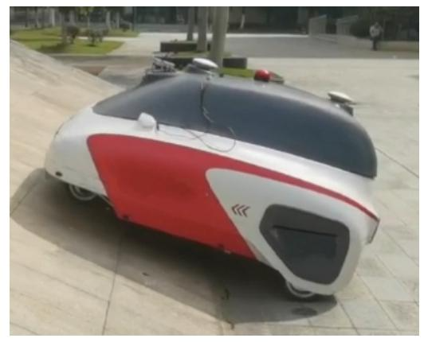
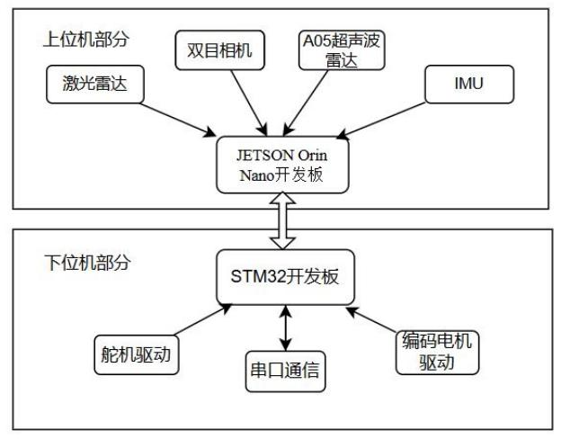

#### 1. 摘要（解决了什么问题）

本文针对**室外无人清扫车在复杂环境下定位精度不足、动态障碍物避障能力弱、路径跟踪鲁棒性差以及自动回充对接精度低**等核心问题，提出基于多传感器融合 SLAM 的解决方案，具体解决以下技术痛点：

1. **定位与建图精度问题**：传统激光 SLAM 在室外复杂场景（如公园弯道、园区多楼层）中易出现轨迹漂移，无法满足无人清扫车高精度作业需求。
2. **障碍物感知与避障局限**：单一视觉传感器难以精准估计障碍物长度，且紧急工况下无快速停障机制，存在作业安全隐患。
3. **路径跟踪适配性不足**：传统 Pure Pursuit 算法在弯道跟踪误差大、启停顿挫影响定位，且不具备动态避障能力；倒车回充时易出现 “摆尾” 现象，无法精准对准充电桩。
4. **自动回充对接精度问题**：常规回充方案成本高或对接误差大，难以适配无人清扫车的低功耗、低成本作业需求。

通过多传感器融合、算法改进与模块集成，实现无人清扫车的高精度定位、智能避障、稳定路径跟踪与精准自动回充。

#### 2. 做了什么实验（设备都是什么）

研究围绕**定位建图、障碍物感知、路径跟踪、自动回充**四大核心功能，搭建多传感器融合实验平台并开展系统性验证，核心设备与实验设置如下：

##### 2.1 核心实验设备

1. **主控与计算单元**
    
    - **嵌入式开发板**：NVIDIA JETSON Orin Nano（40TOPS 算力，8GB 内存），负责多传感器数据处理、算法运行与实时控制。
    - **下位机**：STM32 开发板，实现电机、舵机驱动及硬件状态监控，与上位机通过 RS485 协议通信。
2. **感知传感器**
    
    - **激光雷达**：LS LiDAR 16 线激光雷达（量程 0.5~150 米，垂直视场角 ±15°），用于 NDT 定位与三维点云建图；
    - **双目相机**：Pixel XYZ-D435（基线 10cm，4 米内深度估计），结合 YOLOv5 实现障碍物检测与二维坐标计算；
    - **超声波传感器**：A05 一拖四超声波雷达，用于紧急停障与贴边清扫辅助；
    - **红外传感器**：红外发射 / 接收模块，实现充电桩精准对接。
3. **辅助设备**
    
    - **IMU**：用于位姿解算与运动状态补偿；
    - **轮式编码器**：辅助里程计数据校准；
    - **RTK 定位模块**：提供轨迹真值，用于定位算法精度验证。

##### 2.2 实验内容

1. **定位与建图性能验证**
    
    - **NDT 定位精度测试**：在工业园区、地下车库、公园、城市道路 4 类场景，控制无人车沿 1.5km 路线行驶 3 次，对比 NDT 定位结果与 RTK 真值，统计定位误差；
    - **轨迹与建图验证**：在园区多楼层场景（地上广场 + 地下车库），验证三维点云图的完整性与轨迹累积误差，分析直线段轨迹与设定路径的重合度。
2. **障碍物感知与避障测试**
    
    - **双目视觉检测精度**：在 4 米范围内对行人、自行车、机动车进行 5 次检测，对比视觉估计坐标与真实坐标的横向 / 纵向误差；
    - **紧急停障极限测试**：以 0.4m/s 速度行驶，测试不同距离下超声波紧急停障的响应时间与刹车距离，确定极限停障阈值；
    - **动态避障验证**：分别对行人、长距离停放车辆（结合侧面超声波传感器）开展避障实验，验证五次曲线插值法的避障轨迹合理性。
3. **路径跟踪算法改进验证**
    
    - **改进前后对比**：在公园（多弯道）、公路、园区 3 类场景，设置 9 条路线，对比原始与改进 Pure Pursuit 算法的轨迹均方误差；
    - **倒车回充优化验证**：通过定位点映射解决 “摆尾” 问题，测试倒车轨迹与预设路径的贴合度。
4. **自动回充对接测试**
    
    - **红外对接精度**：开展 6 次回充对接实验，统计充电板中心与充电桩中心的水平误差，验证对接精度是否满足设计余量。

#### 3. 结论（效果怎么样）

实验结果表明，基于多传感器融合 SLAM 的室外无人清扫车系统在**定位精度、避障能力、路径跟踪稳定性、自动回充精度**上均达到实用化要求，核心效果如下：

1. **定位与建图精度显著提升**
    
    - **定位误差**：1.5km 路线中，工业园区 / 城市道路定位误差≤20cm，公园场景误差≤40cm，满足作业需求；直线段轨迹最大误差仅 18cm，三维点云图可完整还原园区多楼层结构，无明显畸变。
    - **建图效果**：地上广场（250m×300m）与地下车库（600~700m）的点云图层次分明，回环闭合准确，无分层错位问题。
2. **障碍物感知与避障能力达标**
    
    - **视觉检测误差**：行人 / 机动车横向误差≤11cm、纵向误差≤15cm；自行车因结构镂空纵向误差略大（≤29cm），通过设置分类安全余量可规避风险；
    - **紧急停障**：响应时间约 0.4s，刹车距离 20~25cm，极限停障距离 30cm，可应对突发障碍物；
    - **动态避障**：结合超声波传感器可识别长距离障碍物，避障轨迹平滑，无碰撞风险，在数月实测中满足安全作业要求。
3. **路径跟踪稳定性大幅增强**
    
    - **改进后误差**：公园弯道场景轨迹均方误差从 22cm 降至 12cm，公路场景从 12cm 降至 7cm，弯道模式（降速 + 缩短预瞄距离）有效提升弯道跟踪精度；启停速度曲线处理消除顿挫，避免定位干扰；
    - **倒车优化**：定位点映射后解决 “摆尾” 问题，倒车轨迹与预设路径贴合度显著提升，为后续红外对接奠定基础。
4. **自动回充对接精度满足需求**红外对接模块水平误差≤2.4cm，小于设计的 3cm 余量，可实现充电桩精准对接，且方案成本低、适配无人清扫车低功耗作业场景。

### 基于多传感器融合的激光SLAM优化及室内外无人驾驶实践应用研究_程霄霄

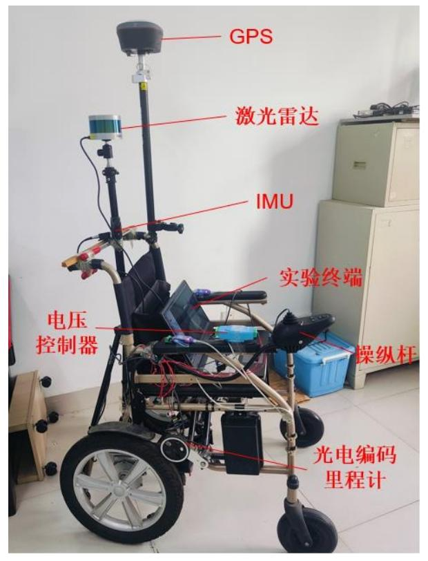

#### 1. 摘要（解决了什么问题）

本文针对**传统自动驾驶轮椅多局限于室内固定场景、单一传感器定位鲁棒性差、建图易畸变、无法实现室内外复杂场景自主导航**等核心痛点，提出基于多传感器融合的激光 SLAM 优化方案，具体解决以下技术问题：

1. **定位与建图精度不足问题**：单一激光 SLAM 在室内长走廊、室外树木遮挡等场景中易出现地图畸变和定位漂移，且室内无 GPS 信号、室外 GPS 信号易受遮挡，无法实现高精度、全场景定位。
2. **传感器数据不同步问题**：激光雷达、IMU、GPS、轮式里程计等多传感器存在时间戳和坐标系差异，直接融合会导致数据失配，影响定位精度。
3. **场景适配性局限问题**：现有轮椅导航仅支持室内特定环境，无法在室内外交界、室外复杂地形（斜坡、石子路）等场景实现稳定自动驾驶，且缺乏动态避障能力。

通过多传感器时间 / 空间同步、室内外自适应 SLAM 系统设计及路径规划算法集成，实现电动轮椅在多场景下的高精度定位、建图与自主导航。

#### 2. 做了什么实验（设备都是什么）

研究围绕**多传感器融合定位、室内外建图、自主导航**三大核心目标，搭建自动驾驶轮椅实验平台并开展系统性验证，核心设备与实验设置如下：

##### 2.1 核心实验设备

1. **移动平台与主控单元**
    
    - **电动轮椅**：配备双主动轮 + 双从动轮，搭载电源与电机驱动模块；
    - **上位机**：联想拯救者笔记本（Ubuntu 20.04+ROS Noetic），负责多传感器数据处理与算法运行；
    - **下位机**：STM32 开发板，实现电机 / 舵机控制，与上位机通过 RS485 协议通信。
2. **感知传感器**
    
    - **激光雷达**：Velodyne VLP-16（16 线，垂直视场 ±15°，水平 360°），用于 SLAM 建图与定位；
    - **IMU**：SC-AHRS-200A（加速度 ±8g，陀螺仪 ±90°/s），用于姿态解算与点云去畸变；
    - **GPS**：Oscar-Ultimate（动态水平精度 8mm，静态水平 3mm），提供室外绝对定位；
    - **轮式里程计**：欧姆龙 E6B2-CWZ6C 增量编码器（2000P/R），用于室内无 GPS 场景定位；
    - **辅助设备**：AgileLight-730A 高精度陀螺仪（姿态精度≤0.03%/h），提供轨迹真值用于精度验证。
3. **数据同步与标定设备**
    
    - GPS PPS 秒脉冲模块，实现传感器时间硬同步；
    - lidar-imu 标定工具，完成 IMU 与激光雷达外参标定。

##### 2.2 实验内容

1. **多传感器数据同步与标定**
    
    - **时间同步**：通过 GPS PPS 脉冲实现硬同步，结合内插外推法完成软同步，消除传感器采样频率差异；
    - **空间同步**：统一车体 / 传感器坐标系，完成 IMU 外参标定（获取旋转平移矩阵），实现多传感器数据坐标系对齐。
2. **室内外 SLAM 定位与建图验证**
    
    - **室内走廊实验**：在 60m 长室内走廊，对比 IOG-SLAM 与 A-LOAM 的定位轨迹，以高精度陀螺仪轨迹为真值，统计绝对位姿误差（APE）；
    - **室内外连廊实验**：在含斜坡、半封闭交界区域的连廊场景，对比 IOG-SLAM 与 LIO-SAM 的建图效果及姿态角延迟；
    - **室外花园实验**：在树木遮挡、石子路、动态行人的花园场景，验证 IOG-SLAM 的抗干扰能力，以差分 GPS 静态点位为真值，分析轨迹误差。
3. **自主导航功能验证**
    
    - **栅格地图构建**：通过 Octomap 将三维点云转换为二维栅格地图，实现环境建模；
    - **全局路径规划**：基于 A * 算法在栅格地图中生成最优路径；
    - **局部避障与导航**：采用人工势场法结合实时障碍物检测，验证轮椅在直角弯、坡路、石子路等地形的动态避障与自主行驶能力。

#### 3. 结论（效果怎么样）

实验结果表明，基于多传感器融合的 IOG-SLAM 系统在**定位精度、建图质量、场景适配性**上均显著优于传统方案，核心效果如下：

1. **定位与建图精度大幅提升**
    
    - **室内走廊场景**：IOG-SLAM 的 APE 均方根误差（RMSE）为 0.0258m，较 A-LOAM（0.0313m）精度提升 17.6%，且 y/z 轴坐标无明显漂移；
    - **室内外连廊场景**：IOG-SLAM 的 RMSE 为 0.0315m，较 LIO-SAM（0.0349m）提升 9.7%，且姿态角无延迟，斜坡场景 z 轴定位偏差显著减小；
    - **室外花园场景**：IOG-SLAM 的 RMSE 为 0.040m，较 LIO-SAM（0.057m）提升 29.82%，建图可清晰还原灌木丛、石墩等细节，无点云交叉或重叠畸变。
2. **多传感器同步与适配性达标**
    
    - 时间同步后传感器数据时间戳偏差≤ns 级，空间同步后 IMU 与激光雷达坐标系转换误差≤0.05m，消除了数据失配导致的定位误差；
    - 基于 GPS 信号强度的室内外系统切换机制稳定，可在半封闭连廊、树木遮挡区域实现无缝过渡，无定位中断或漂移。
3. **自主导航功能实现全场景覆盖**
    
    - 栅格地图可准确还原环境障碍物分布，A * 算法规划的全局路径无碰撞风险；
    - 人工势场法可实现动态避障，轮椅在 0.9m/s 平均速度下，可平稳通过直角弯、斜坡、石子路等复杂地形，在行人干扰场景下可实时调整路径，完成从起点到终点的自主行驶，满足多场景作业需求。

### 校园环境无人快递车导航与避障技术研究_谷新建

==传统导航，很一般==

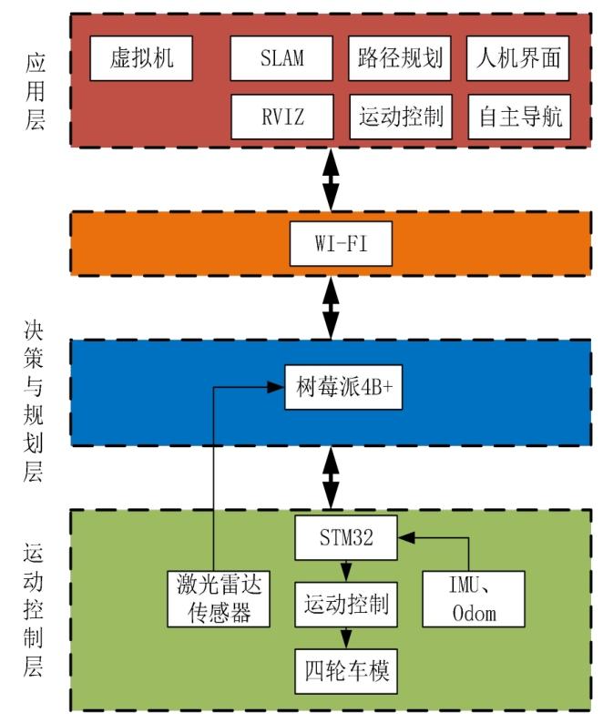

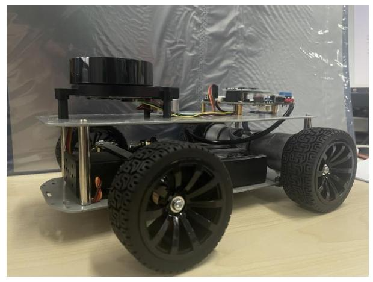
#### 1. 摘要（解决了什么问题）

本文针对**校园环境下无人快递车配送存在的建图定位精度低、路径规划效率差、动态避障能力弱**等核心痛点，提出基于改进 SLAM 与路径规划算法的解决方案，具体解决以下技术问题：

1. **建图与定位精度不足**：传统 RBPF-SLAM 算法仅依赖轮式里程计数据，易因车轮打滑、噪声干扰导致建图畸变和位姿估计误差，且存在粒子退化、计算量大的缺陷，无法满足校园复杂场景的高精度建图需求。
2. **全局路径规划效率低**：传统 A * 算法存在搜索空间大、速度慢、路径易紧贴障碍物的问题，难以适配校园快递配送的高效性与安全性要求。
3. **动态避障能力欠缺**：校园环境人流密集、动态障碍物多，现有算法无法实现对未知静态 / 动态障碍物的实时躲避，存在配送安全隐患。

通过改进 RBPF-SLAM 算法、优化 A * 全局路径规划并融合 DWA 局部避障，实现无人快递车在校园环境下的高精度建图、高效路径规划与安全动态避障。

#### 2. 做了什么实验（设备都是什么）

研究围绕**建图定位、路径规划、动态避障**三大核心功能，搭建仿真与实车实验平台，开展系统性验证，核心设备与实验设置如下：

##### 2.1 核心实验设备

1. **移动平台与主控单元**
    
    - **仿真平台**：SolidWorks 搭建阿克曼小车模型，Gazebo 构建校园仿真环境，基于 ROS（Ubuntu18.04+ROS-melodic）实现算法验证；
    - **实车平台**：阿克曼四轮小车底盘，搭载 STM32 主控板（负责电机驱动与传感器数据采集）、树莓派 4B+（运行 ROS 系统，处理算法与数据通信）。
2. **感知传感器**
    
    - **激光雷达**：思岚 A1 单线激光雷达（扫描半径 0.15~12m，360° 扫描），用于 SLAM 建图与障碍物检测；
    - **IMU**：三轴加速度计 + 陀螺仪模块，与轮式里程计融合提升位姿估计精度；
    - **轮式里程计**：欧姆龙 E6B2-CWZ6C 增量编码器（2000P/R），提供车辆运动里程数据；
    - **辅助设备**：PC 机（VMware 虚拟机），用于远程控制与数据可视化。
3. **通信与控制设备**
    
    - 树莓派 4B + 与 STM32 通过串口通信，虚拟机与树莓派通过 WiFi 实现局域网通信，支持算法指令下发与数据回传。

##### 2.2 实验内容

1. **改进 RBPF-SLAM 算法验证**
    
    - **仿真实验**：在 MATLAB 搭建 30×30 格栅地图，对比传统与改进 RBPF-SLAM 的建图精度，验证 IMU 与轮式里程计融合、自适应重采样对降低建图误差、减少计算量的效果；
    - **实车建图**：在校园广场以花坛模拟建筑物，通过 ROS 与 Rviz 可视化建图过程，验证算法在真实场景的建图能力。
2. **改进 A * 全局路径规划验证**
    
    - **仿真对比**：在 MATLAB 构建多障碍物地图，对比传统与改进 A * 算法的规划时间、转折次数、路径平滑度，验证启发函数优化与邻节点选择策略的有效性；
    - **路径安全性验证**：测试改进算法是否避免路径紧贴 / 穿越障碍物，保障配送安全。
3. **A * 与 DWA 融合避障验证**
    
    - **仿真实验**：在全局路径中添加未知静态障碍物（灰色方框）与动态障碍物（黄色移动方框），验证融合算法的实时避障能力；
    - **实车实验**：在校园广场设置行人、路障等动态 / 静态障碍物，测试无人车的避障响应与路径调整能力。
4. **系统集成验证**
    
    - **仿真集成**：在 Gazebo 环境中完成 “建图 - 路径规划 - 避障” 全流程仿真，验证算法协同性；
    - **实车配送**：模拟校园快递配送场景，测试无人车从起点到终点的完整作业流程。

#### 3. 结论（效果怎么样）

实验结果表明，改进后的算法与系统在**建图精度、路径规划效率、动态避障安全性**上均显著优于传统方案，核心效果如下：

1. **建图与定位精度大幅提升**
    
    - **仿真场景**：改进 RBPF-SLAM 算法通过融合 IMU 与轮式里程计数据、引入自适应重采样，建图噪声显著降低，X/Y 方向定位误差与偏航角预估误差较传统算法分别减小，粒子退化问题得到解决，计算量降低，建图效率提升；
    - **实车场景**：在校园广场建图中，可清晰还原花坛等障碍物轮廓，无明显地图畸变，位姿估计精度满足配送需求。
2. **全局路径规划效率与安全性优化**
    
    - **规划效率**：改进 A * 算法通过优化启发函数（引入障碍物占比动态调整）与邻节点选择策略，规划时间较传统算法缩短（地图 1 从 2.04s 降至 1.82s，地图 3 从 2.89s 降至 2.26s），无效搜索空间减少；
    - **路径安全性**：改进算法避免了路径紧贴障碍物的情况，转折次数与转折度数显著降低（地图 2 转折次数从 19 次降至 11 次），路径平滑度大幅提升。
3. **动态避障能力达标**
    
    - **仿真验证**：融合 DWA 算法后，无人车可实时识别并躲避未知静态障碍物，对动态移动障碍物（如模拟行人）可提前调整路径，无碰撞风险；
    - **实车验证**：在校园广场面对行人、路障等突发障碍物时，车辆可快速响应并完成避障，且避障后能重新规划最优路径，顺利抵达终点，满足校园配送的安全要求。
4. **系统集成效果良好**仿真与实车实验均实现 “建图 - 路径规划 - 避障 - 配送” 全流程闭环，无人车可在校园复杂场景下稳定完成快递配送任务，验证了算法的有效性与系统的实用性。

### 基于“端-边”部署的视觉SLAM研究及应用_陈一帆

#### 1. 摘要（解决了什么问题）

本文针对**移动设备计算和存储能力有限，无法满足视觉 SLAM 实时性需求，而传统云边协同方案存在网络延迟高、数据传输量大、资源利用率低**等核心痛点，提出基于 “端 - 边” 协同计算的视觉 SLAM 解决方案，具体解决以下技术问题：

1. **移动设备算力不足问题**：视觉 SLAM 属于计算密集型任务，单靠移动设备本地计算难以实现实时位姿估计，尤其单目相机的深度恢复和特征匹配对算力要求极高。
2. **传统云边协同缺陷**：将 SLAM 任务完全卸载至云端会导致数据传输量大、网络延迟不可控，无法保障位姿估计的实时性和稳定性；且未充分利用移动设备自身算力，造成资源浪费。
3. **关键帧传输与跟踪鲁棒性问题**：移动设备移动过程中易因运动过快、场景纹理弱导致跟踪丢失，传统关键帧选取策略无法适配手持设备的运动特性。

通过 “端 - 边” 任务拆分、改进关键帧选取算法及搭建边缘计算系统，实现移动设备在增强现实场景下的高精度、实时位姿跟踪。

#### 2. 做了什么实验（设备都是什么）

研究围绕 **“端 - 边” 协同 SLAM 算法验证、系统功能测试 ** 两大核心目标，搭建仿真与实车实验平台，核心设备与实验设置如下：

##### 2.1 核心实验设备

1. **移动端设备**
    
    - **测试手机**：小米 8（骁龙 845 处理器、6G 内存），用于验证算法移动端任务执行能力；
    - **AR 眼镜**：RokidGlass2（Android 系统、Amlogic 905D3 芯片、2G 内存、800 万像素摄像头），用于真实场景下的位姿跟踪与轨迹展示。
2. **边缘端与云端设备**
    
    - **边缘服务器**：Intel 酷睿 i7-10700F 处理器（8 核 16 线程、最高睿频 2.9GHz）、16G 内存、Ubuntu20.10 系统，搭载 KubeEdge 边缘计算框架，负责位姿优化、局部地图构建与回环检测；
    - **云端服务器**：K8s-master 节点（v1.15.1 版本），用于边缘节点的资源调度与管理。
3. **辅助工具与数据集**
    
    - **开发工具**：Android Studio（移动端 Java 开发）、Visual Studio Code（边缘端 C++ 算法开发）、OpenCV/OpenGL ES（图像处理与轨迹绘制）；
    - **数据集**：EuRoc MAV 室内数据集（含 11 个场景的图像与 IMU 数据，提供高精度真值轨迹）。

##### 2.2 实验内容

1. **“端 - 边” 协同算法验证**
    
    - **位姿精度测试**：在 EuRoc MAV 数据集上，对比本文算法与 ORB-SLAM3、RAMA-SLAM 的绝对轨迹误差（RMSE），验证 “端 - 边” 拆分后位姿估计的精准性；
    - **实时性测试**：记录移动端特征提取 / 关键帧选取、边缘端位姿跟踪 / 局部建图的耗时，对比移动设备本地运行 ORB-SLAM3 的效率差异；
    - **关键帧选取验证**：在移动设备运动过程中，测试基于帧间运动量（平移向量 + 旋转矩阵）的关键帧策略，验证其对快速运动和弱纹理场景的适应性。
2. **系统功能与性能测试**
    
    - **模块功能测试**：分别对系统初始化（设备权限检测、网络连接、参数加载）、相机位姿估计（初始化、跟踪、回环检测）、移动端轨迹展示（关键帧可视化、位姿轨迹绘制）进行功能验证；
    - **场景适配测试**：在室外（含夜间）、室内等不同场景下，测试 AR 眼镜的实时位姿跟踪能力，验证系统在复杂环境下的鲁棒性；
    - **性能指标测试**：统计网络连接、系统初始化、轨迹绘制等非计算模块的耗时，评估系统整体实时性。

#### 3. 结论（效果怎么样）

实验结果表明，基于 “端 - 边” 部署的视觉 SLAM 系统在**位姿精度、实时性、场景适应性**上均达到预期目标，核心效果如下：

1. **位姿估计精度接近 PC 端水平**
    
    - 在 EuRoc MAV 数据集上，本文算法的绝对轨迹误差（RMSE）与 ORB-SLAM3（PC 端）接近，部分序列（如 MH02）的转弯场景轨迹更贴合真值；相较于移动设备本地运行 ORB-SLAM3，位姿跟踪精度提升显著，且避免了因算力不足导致的跟踪中断。
2. **实时性满足增强现实需求**
    
    - **端侧效率**：移动端特征提取与关键帧选取每秒可处理 30 帧左右，仅传输关键帧有效降低了数据传输量，缓解了网络压力；
    - **边侧效率**：边缘端位姿跟踪线程平均耗时 24-35ms、局部建图线程平均耗时 200-245ms，与 PC 端 ORB-SLAM3 效率基本一致，远优于移动设备本地运行的 100ms 以上耗时，实现了实时位姿估计。
3. **系统鲁棒性与场景适配性良好**
    
    - **关键帧策略有效**：基于帧间运动量的关键帧选取算法，可避免移动设备因快速运动、旋转导致的跟踪丢失，在弱纹理、夜间等复杂场景下仍能稳定跟踪；
    - **全场景适配**：系统在室内、室外（含夜间）场景均能完成位姿初始化与轨迹绘制，AR 眼镜端可实时展示关键帧与相机轨迹，满足增强现实应用的基础定位需求；
    - **模块功能稳定**：系统初始化、位姿估计、轨迹展示等模块通过功能测试，无权限异常、跟踪失败等故障，边缘节点的 KubeEdge 框架可实现 pod 的高效调度与任务分发。

---

## 1214

### 基于ROS的户外清扫机器人自主导航与目标检测系统研究_王川

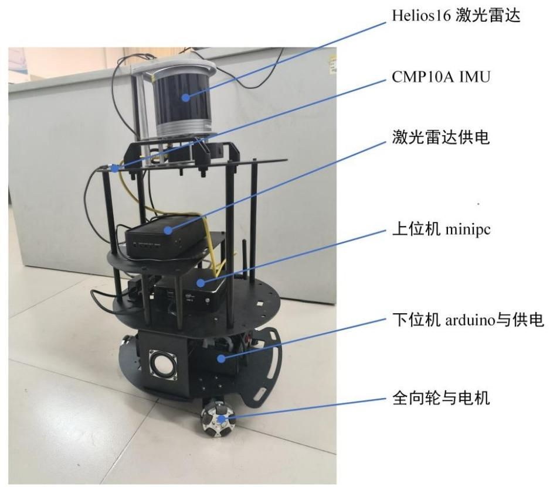
#### 1. 摘要（解决了什么问题）

本文针对**户外清扫机器人在复杂环境下自主导航精度低、道路垃圾识别实时性差**的核心问题，提出融合激光雷达与 IMU 的 SLAM 算法及轻量化目标检测网络，具体解决以下技术痛点：

1. **单传感器 SLAM 缺陷**：传统激光 SLAM 易受环境干扰，单一 IMU 存在累计误差，无法满足户外复杂场景的高精度定位与建图需求；
2. **回环检测精度不足**：常规 ICP、SC 等回环算法存在较大轨迹误差，难以修正里程计累计漂移；
3. **垃圾检测硬件适配性差**：高精度卷积神经网络参数量大、推理速度慢，无法在低性能嵌入式设备上实现道路垃圾的实时识别。

通过多传感器融合 SLAM、改进回环检测算法及轻量化目标检测网络，实现户外清扫机器人的精准导航与高效垃圾识别。

#### 2. 做了什么实验（设备都是什么）

研究围绕**自主导航 SLAM**和**道路垃圾目标检测**两大核心任务，搭建仿真与实车实验平台，核心设备与实验设置如下：

##### 2.1 核心实验设备

1. **自主导航实验设备**
    
    - **传感器**：Robosense Helios 16 多线激光雷达（16 线、测距 0.2-150m）、亚博智能 CMP10A 十轴 IMU（含气压计，采样频率 200Hz）；
    - **移动平台**：ARTrobot 三轮全向轮小车，搭载上位机 miniPC（处理 SLAM 算法）、下位机 Arduino（控制电机）；
    - **仿真工具**：基于 ROS Melodic 的 Gazebo 仿真环境、Rviz 可视化工具，URDF/Xacro 构建三轮全向轮小车模型。
2. **目标检测实验设备**
    
    - **训练平台**：Intel Xeon Platinum 8255C CPU、RTX 2080Ti GPU，基于 Pytorch 框架训练模型；
    - **数据集**：ImageNet100 分类数据集、VOC2012 目标检测数据集、自制校园道路垃圾数据集（含瓶子、香烟、纸张三类共 2672 个目标）。
3. **辅助工具**
    
    - 标定工具：Lidar_align（激光雷达与 IMU 外参标定）、imu_utils（IMU 内参 Allan 方差矫正）；
    - 评估工具：KITTI 开源数据集（验证 SLAM 轨迹精度）、PCL 点云库（处理点云数据）。

##### 2.2 实验内容

1. **多传感器融合 SLAM 验证**
    
    - **传感器标定实验**：通过 Allan 方差矫正 IMU 内参（陀螺仪 / 加速度计零偏与白噪声），Lidar_align 获取激光雷达与 IMU 外参，IMU 插值矫正点云畸变；
    - **SLAM 算法测试**：在 KITTI 数据集对比 NDT-MAP 与 ICP、SC 等回环算法的绝对轨迹误差（APE）；在 Gazebo 博物馆仿真环境及校园真实场景（室内、室外、公路）测试建图效果；
    - **运动学验证**：推导三轮全向轮小车正逆运动学模型，在仿真环境验证运动控制精度。
2. **轻量化目标检测验证**
    
    - **模型训练与消融实验**：在 ImageNet100 数据集测试 LightCSPNet 网络的分类精度，验证 Resmax、Dropout、MHSA 模块对模型性能的影响；
    - **目标检测测试**：将 LightCSPNet 作为 YOLOv4/YOLOX 的 Backbone，在 VOC2012 与自制垃圾数据集测试 mAP（平均精度均值）及推理速度；
    - **硬件适配测试**：对比 LightCSPNet 与 MobileNetV2/V3 在 CPU/GPU 设备上的推理耗时，验证低性能设备的适配性。

#### 3. 结论（效果怎么样）

实验结果表明，所提算法与系统在**导航精度、回环性能、垃圾检测效率**上均显著优于传统方案，核心效果如下：

1. **多传感器融合 SLAM 精度显著提升**
    
    - **回环检测性能**：在 KITTI 数据集上，NDT-MAP 回环算法相比普通 ICP 误差减小 25%，相比 SC 回环误差减小 23%，绝对轨迹误差（APE）均方根值最低，轨迹更贴合真值；
    - **建图效果**：在校园室内、室外、公路场景中，可清晰还原墙壁、桌椅、道路等环境特征，点云地图无明显畸变，满足户外清扫导航需求；
    - **传感器标定效果**：IMU 内参矫正后陀螺仪零偏均值降至 7.413×10^-4 rad/s，激光雷达与 IMU 外参标定误差小于 0.01m，点云畸变矫正后直线特征无弯曲。
2. **轻量化目标检测网络兼顾精度与效率**
    
    - **分类性能**：在 ImageNet100 数据集上，LightCSPNet 参数量仅为 MobileNetV2 的 37%，Top-1 分类精度达 82.64%，与 MobileNetV2 基本持平；
    - **检测性能**：在 VOC2012 数据集上 mAP 较 MobileNetV3 提升 2.6%，在自制垃圾数据集上 mAP 提升 1.7%，YOLOX-LightCSPNet 组合在垃圾检测中 mAP 达 97.72%；
    - **实时性**：在 CPU 设备上推理时间仅为 MobileNetV2 的 50%，GPU 设备上推理耗时缩短至 18.5ms / 帧，满足嵌入式设备实时检测需求。
3. **系统集成效果达标**仿真与实车实验验证了三轮全向轮小车运动学模型的有效性，SLAM 与目标检测算法可协同运行，实现户外环境的自主导航与道路垃圾精准识别，满足清扫机器人实际作业需求。

### 基于3D激光雷达的智能车辆SLAM研究_张家鑫

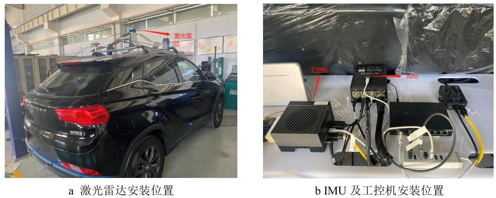

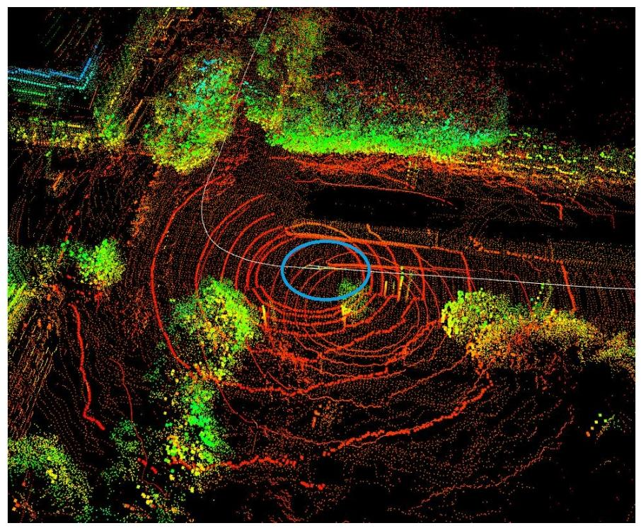

#### 1. 摘要（解决了什么问题）

本文针对**智能车辆在复杂室外环境下 SLAM 算法精度低、鲁棒性不足**的核心痛点，提出基于 3D 激光雷达与 IMU 融合的 SLAM 方案，重点解决以下技术问题：

1. **单传感器 SLAM 局限性**：传统纯激光雷达 SLAM 易受运动畸变影响，单一 IMU 存在累计误差，无法满足智能车辆高速行驶、复杂路况下的定位与建图需求；
2. **局部地图效率低下**：传统滑动窗口式局部地图仅以距离为阈值筛选关键帧，在车辆高速行驶时易丢失关键帧数据，导致建图滞后、计算效率低；
3. **回环检测精度不足**：传统欧式距离回环检测在车辆等待红绿灯 / 礼让行人等静止场景易产生无效回环，且单一回环机制难以适配复杂室外环境；
4. **全局位姿优化算力瓶颈**：传统图优化在大规模地图更新时计算量激增，无法保障室外场景下的实时性。

通过多传感器融合、双阈值关键帧筛选、双回环三阈值检测及因子图全局优化，实现智能车辆室外高精度、高效率的定位与建图。

#### 2. 做了什么实验（设备都是什么）

研究围绕**智能车辆 SLAM 系统搭建、算法模块验证、建图精度评估**三大核心目标，构建实车与仿真实验平台，核心设备与实验设置如下：

##### 2.1 核心实验设备

1. **硬件系统**
    
    - **车身载体**：东风风光 E3 纯电动 SUV（整备质量 1690kg，续航 405km）；
    - **传感器**：速腾聚创 RS-LiDAR-16 激光雷达（16 线、测距 0.2-150m、角分辨率 0.09°-0.36°）、轮趣科技 N100 九轴 IMU（采样频率 400Hz，支持 ROS）；
    - **计算平台**：NVIDIA Jetson AGX Orin 工控机（275TOPS 算力、12 核 CPU、2048 核 GPU），下位机 Arduino（控制电机）。
2. **软件系统**
    
    - **运行环境**：Ubuntu20.04 操作系统、ROS Melodic 框架，C++ 编程语言，PCL/OpenCV 点云 / 图像处理库；
    - **标定工具**：Lidar_align（激光雷达与 IMU 外参标定）、imu_utils（IMU 内参 Allan 方差矫正）；
    - **评估工具**：EVO 轨迹评估工具、Kd-tree 近邻搜索、VoxelGrid 点云下采样。
3. **数据集**
    
    - **公开数据集**：KITTI 07 序列（验证轨迹精度）、Park 数据集（验证局部地图效率）；
    - **自制数据集**：沈阳工业大学校园 SUT1/SUT2 数据集（含车辆静止场景，验证回环检测鲁棒性）。

##### 2.2 实验内容

1. **传感器标定与预处理实验**
    
    - **时空标定**：通过时间戳插值实现激光雷达（10Hz）与 IMU（400Hz）时间同步，Lidar_align 完成外参标定，imu_utils 矫正 IMU 内参（陀螺仪零偏 < 10°/hr）；
    - **点云去畸变**：利用 IMU 预积分插值补偿激光雷达运动畸变，LOAM 算法提取角点 / 面点特征。
2. **算法模块验证实验**
    
    - **局部地图优化测试**：对比本文双阈值（距离 50m + 时间 10s）关键帧筛选与 LIO-SAM 滑动窗口算法，在 KITTI、Park、SUT1/SUT2 数据集测试关键帧提取效率；
    - **回环检测优化测试**：验证双回环（Scan Context + 欧式距离）三阈值（距离 20m + 时间 30s + 序列差 20）算法，在自制数据集模拟车辆静止场景，统计无效回环次数；
    - **全局优化测试**：基于因子图融合 IMU 预积分、前端里程计、回环约束因子，对比传统图优化的算力消耗与建图一致性。
3. **建图精度验证**
    
    - 采用 EVO 工具将 KITTI 07 序列算法轨迹与真值对比，验证建图精度；在校园场景测试算法对环岛、复杂路口等大回环场景的适配性。

#### 3. 结论（效果怎么样）

实验结果表明，所提算法在**定位精度、建图效率、鲁棒性**上均显著优于传统方案，核心效果如下：

1. **局部地图效率大幅提升**
    
    - 双阈值关键帧筛选策略在 KITTI、Park、SUT1/SUT2 四组数据集上，关键帧提取平均效率提升**31.39%**（KITTI 07 序列提取时间从 26.049s 降至 17.086s，效率提升 34.31%；SUT1 从 26.529s 降至 13.083s，效率提升 50.67%），有效避免高速行驶下的关键帧丢失，保障建图连贯性。
2. **回环检测鲁棒性显著增强**
    
    - 双回环三阈值检测算法在四组数据集上平均减少 **26.96%** 的回环检测次数（SUT2 数据集从 48 次降至 33 次，无效回环减少 31.25%）；在 SUT1 大回环场景中，相比 LIO-SAM 算法可精准拟合回环轨迹，而传统算法无法完成闭环，验证了检测精度。
3. **全局建图精度与实时性兼顾**
    
    - 在 KITTI 07 序列中，算法轨迹与真值无明显漂移，保障了建图精度；因子图优化通过增量式构建与并行计算，解决了大规模地图更新的算力瓶颈，在校园复杂场景下可实时生成全局一致地图。
4. **多传感器融合效果达标**
    
    - IMU 预积分有效补偿激光雷达运动畸变，角点 / 面点特征提取保留环境几何信息；外参标定后点云无 Z 轴漂移，内参矫正后 IMU 零偏稳定性 < 10°/hr，为高精度 SLAM 奠定基础。

### 融合双激光雷达的SLAM方法_万乐民

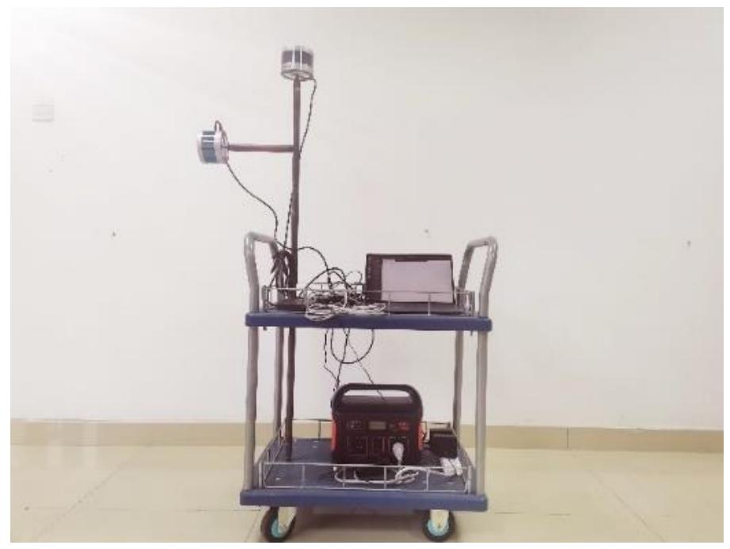

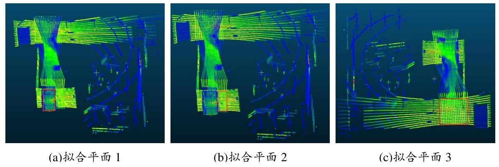

#### 1. 摘要（解决了什么问题）

本文针对**传统激光 SLAM 在测绘领域应用时存在的点云覆盖度低、数据稀疏、建图精度不足**的核心痛点，提出融合双激光雷达的 3D 激光 SLAM 重建方法，重点解决以下技术问题：

1. **单激光雷达建图局限**：传统单个水平激光雷达因视场角限制，建图时建筑立面信息缺失、点云密度低，无法满足测绘领域高精度三维重建对覆盖度和密度的要求；
2. **双激光雷达标定难题**：多线激光雷达点云稀疏，难以通过单帧配准获取高精度外参，且传统标定方法依赖昂贵辅助设备或人工靶标，通用性差；
3. **融合建图精度不足**：双激光雷达数据融合时易因标定误差或运动畸变产生点云重影，导致建图一致性和精度下降。

通过提出双激光雷达外参标定方法和融合 SLAM 算法，实现低成本、高覆盖、高精度的三维点云地图重建，满足测绘领域的应用需求。

#### 2. 做了什么实验（设备都是什么）

研究围绕**双激光雷达外参标定验证、融合 SLAM 建图验证**两大核心目标，搭建移动测量原型系统，核心设备与实验设置如下：

##### 2.1 核心实验设备

1. **硬件系统**
    
    - **移动平台**：自行搭建的移动测量推车，搭载两个 Velodyne VLP-16 多线激光雷达（16 线、测距 100m、垂直视场角 ±15°），呈近似垂直安置以提升立面覆盖；
    - **计算终端**：I5 处理器笔记本电脑（4.5GHz、16G 内存），配备 550Wh 移动电源；
    - **辅助标定设备**：FARO X330 地面三维激光扫描仪（获取稠密参考点云，用于辅助外参标定）。
2. **软件系统**
    
    - **运行环境**：Ubuntu18.04 操作系统、ROS Melodic 框架，C++ 编程语言，PCL/CloudCompare 点云处理库；
    - **算法依赖**：ALOAM 算法（用于单雷达 SLAM 建图获取子图与位姿）、ICP 配准算法（点云精配准）、GTSAM 优化器（位姿图优化）；
    - **数据同步**：ROS 实现双激光雷达严格帧同步，确保数据时间一致性。
3. **数据集**
    
    - **标定数据集**：学院楼大厅场景（地面激光扫描稠密点云）、室外建筑初始建图子图（用于无辅助自标定）；
    - **建图验证数据集**：室内地下车库（采集时长 346s，关键帧数 504）、两栋室外建筑（楼 A 采集 531s，关键帧数 816；楼 B 采集 760s，关键帧数 1026）。

##### 2.2 实验内容

1. **双激光雷达外参标定实验**
    
    - **地面激光辅助标定**：利用 FARO X330 获取大厅稠密点云作为参考，将水平 / 竖直激光雷达单帧点云分别配准至参考坐标系，推算双雷达外参，验证标定精度（计算对应平面的旋转与平移误差）；
    - **无辅助自标定**：通过 ALOAM 算法分别处理水平 / 竖直激光雷达数据，获取初始子图与位姿，经子图匹配得到初始外参，再通过帧到子图配准动态调优并剔除粗差，得到最终标定参数，对比两种标定方法的误差。
2. **融合 SLAM 建图实验**
    
    - **水平激光 SLAM 建图**：对水平激光雷达数据进行预处理（地面分割、运动畸变纠正、特征提取）、帧间位姿估计、回环检测与位姿图优化，获取水平点云地图与全局位姿；
    - **双雷达数据融合**：利用标定外参和水平全局位姿，将竖直点云帧转换至水平坐标系，再通过 Point-to-Plane ICP 精配准消除重影，实现数据融合；
    - **精度验证**：在室内外数据集上，对比单雷达与双雷达建图的立面覆盖度，通过平面拟合均方根误差（RMS）定量评价建图精度。

#### 3. 结论（效果怎么样）

实验结果表明，所提方法在**点云覆盖度、建图精度、数据密度**上均显著优于传统单雷达 SLAM 方案，核心效果如下：

1. **外参标定精度达标**
    
    - 地面激光辅助标定方法中，水平与竖直点云对应平面的相对旋转误差小于 1.4°，相对平移误差（平均距离）小于 0.012m；
    - 无辅助自标定方法虽误差略高（旋转误差≤2.0°、平移误差≤0.040m），但无需额外设备，具备较强实用性，可满足工程标定需求。
2. **融合建图覆盖度大幅提升**
    
    - 相比传统单水平激光雷达建图，双雷达融合后可完整重建建筑上部立面信息，点云密度显著提高，室内地下车库、室外楼 A / 楼 B 的建图结果均弥补了单雷达的视场盲区，立面细节信息完整。
3. **建图精度满足测绘要求**
    
    - 动态参数优化后，点云重影现象消除，平面拟合 RMS 误差降至 5cm 以内（楼 A 优化后平均 RMS 为 0.036m，楼 B 为 0.037m），相比优化前精度提升 24%-33%，全局点云地图一致性显著增强。
4. **综合性价比突出**
    
    - 仅通过两个低成本 VLP-16 雷达实现了接近专业地面激光扫描仪的建图效果，大幅降低测绘领域三维点云获取成本，同时兼顾效率与精度。

### 面向复杂场景的三维激光SLAM技术研究_郭明策

#### 1. 摘要（解决了什么问题）

本文针对**传统三维激光 SLAM 在复杂场景下存在的精度低、鲁棒性差**的核心痛点，提出面向大尺度动态复杂场景的高精度纯三维激光 SLAM 算法，重点解决以下技术问题：

1. **点云配准效率与精度不足**：原始三维激光点云数据量大、特征单一，且未利用强度信息，直接配准耗时高、局部位姿约束弱，尤其 Z 轴易产生漂移；
2. **动态环境干扰严重**：现有 SLAM 算法基于静态环境假设，无法消除高频动态物体（行人、车辆等）产生的动态点云，干扰特征提取与配准精度，导致建图存在 “重影”；
3. **大尺度环境累计误差大**：纯激光 SLAM 在长距离作业时，前端里程计的增量式位姿估计会产生显著累积误差，且传统闭环检测易漏检、实时性差，无法构建全局一致性地图。

通过改进特征提取、提出动态物体去除算法和双闭环优化策略，实现复杂场景下高精度、高鲁棒的三维点云地图构建。

#### 2. 做了什么实验（设备都是什么）

研究围绕**算法模块验证、系统性能评估**两大目标，搭建室内外实验平台，结合公开数据集开展实验，核心设备与实验设置如下：

##### 2.1 核心实验设备

1. **硬件系统**
    
    - **移动平台**：室内服务机器人与室外巡检机器人，均搭载 Velodyne VLP-16 三维激光雷达（16 线、垂直视场 ±15°），机器人采用阿克曼转向模式，配备 i7-7700 CPU（八核 3.60GHz）、32G 内存、8G 显存；
    - **辅助设备**：CES-EH11 微型计算机（Ubuntu18.04 系统）、5G 通讯 WIFI 模块、平板电脑远程终端；
    - **公开数据集设备**：KITTI 数据集采集平台（搭载 Velodyne HDL-64E 64 线激光雷达、OXTS 3003 GPS/IMU 组合惯导）。
2. **软件系统**
    
    - **运行环境**：Ubuntu18.04 操作系统、C++ 编程语言，基于 PCL 库实现点云处理，GTSAM 库实现因子图优化；
    - **算法依赖**：改进的 LOAM 前端配准框架、Octomap 三维体素地图、iSAM2 增量式优化算法、KD 树近邻搜索；
    - **评估工具**：轨迹误差分析工具、点云平面拟合精度评估工具。
3. **数据集**
    
    - **真实数据集**：沈阳新松机器人智慧产业园场景，包括 C1 办公楼大厅（1600m²、220m 路径）、产业园停车场（14000m²、1091m 路径）、C2 生产车间（18000m²、923m 路径）、C1 室外场景（53000m²、1800m 路径），均含高频动态物体；
    - **公开数据集**：KITTI 00 序列（3.7km 路径）、05 序列（2.2km 路径），含真实轨迹用于精度对标。

##### 2.2 实验内容

1. **模块验证实验**
    
    - **地平面约束验证**：在新松产业园 C2 室外 140m 直线轨迹数据集，对比 ALOAM、LeGO-LOAM，验证改进特征提取后 Z 轴漂移抑制效果；
    - **动态物体去除验证**：在室内行人动态场景、产业园停车场车辆动态场景及 KITTI 00 数据集，测试占据体素概率算法的动态点云剔除能力，统计轨迹误差；
    - **双闭环优化验证**：在新松产业园 C2 大楼 730m 闭环轨迹数据集，对比无闭环、单闭环算法，验证双闭环对累积误差的修正效果。
2. **系统性能评估实验**
    
    - **真实场景建图**：在 4 个室内外复杂场景，与 ALOAM、LeGO-LOAM 对比建图质量（点云密度、重影消除）和轨迹精度（相对位姿误差）；
    - **公开数据集对标**：在 KITTI 00/05 序列，与 LeGO-LOAM 对比轨迹与真实值的偏差，评估算法泛化能力；
    - **实时性测试**：统计算法各模块（特征提取、配准、动态去除、闭环优化）的运行耗时，验证系统实时性。

#### 3. 结论（效果怎么样）

实验结果表明，所提算法在**复杂场景适应性、建图精度、鲁棒性**上均显著优于传统方案，核心效果如下：

1. **特征提取与配准性能提升**
    
    - 改进的特征提取算法（融合地面、角点、平面特征及强度描述符）实现了强地平面约束，Z 轴漂移误差显著降低，相比 ALOAM，直线轨迹 Z 轴误差趋近于 0，局部位姿 [z, roll, pitch] 基本保持稳定；
    - 基于特征的 scan-to-scan/scan-to-map 配准，在保证实时性的同时，配准精度提升，室内场景相对位移误差控制在 0.1m 以内。
2. **动态物体去除效果显著**
    
    - 占据体素概率算法可有效剔除高频动态点云，室内行人场景中，动态点去除后地图无 “重影”，室外停车场车辆动态区域的点云配准误差降低，KITTI 00 数据集轨迹均方根误差从 0.813m 降至 0.797m，建图质量明显提升。
3. **大尺度环境累积误差可控**
    
    - 双闭环优化算法（最近邻搜索 + 强度特征检索）大幅减少累积误差，新松产业园 730m 闭环场景中，相比无闭环算法，轨迹漂移误差从米级降至分米级，相对旋转误差＜1°、位移误差＜0.2m；
    - 对比 LeGO-LOAM，在 KITTI 00 序列中，轨迹均值误差从 1.769m 降至 0.705m，05 序列从 0.753m 降至 0.696m，全局地图无重影，实现全局一致性。
4. **系统实时性与泛化能力达标**
    
    - 算法前端模块（特征提取、配准、动态去除）平均耗时均＜100ms，满足 10Hz 建图要求；闭环优化模块虽耗时 190ms，但以 2Hz 低频运行，不影响整体实时性；
    - 算法在室内小场景、室外大尺度场景及 KITTI 公开数据集均表现稳定，可构建带强度信息的三维动态地图，能区分环境物体材质，适配复杂动态场景。

### 基于三维激光雷达的室外移动机器人SLAM算法研究_丁文

#### 1. 摘要（解决了什么问题）

本文针对**三维激光 SLAM 算法在室外场景下定位精度低、中长距离累计误差大、回环检测模块复杂度高且运行开支大**的核心问题，从点云预处理、前端里程计优化、后端回环检测优化三个层面提出改进方案，以提升室外移动机器人 SLAM 系统的定位精度与运行效率，具体解决的问题如下：

1. **点云运动畸变导致定位误差**：三维机械激光雷达扫描过程中，机器人运动会使单帧点云的测量基准位不一致，产生运动畸变，若不校正会导致输入数据本身存在错误，降低算法定位精度。
2. **前端激光里程计漂移严重**：传统帧间匹配方式易受点云稀疏、遮挡等因素影响，单次匹配精度低，中长距离下累计误差过大，甚至导致后端回环检测失效，无法完成全局位姿校正。
3. **后端回环检测效率低下**：开源算法回环检测采用逐帧匹配方式，在大场景下候选帧规模大、计算量高，导致算法运行耗时过长，且存在约束冗余问题。

#### 2. 做了什么实验（设备都是什么）

##### 2.1 核心实验设备

###### （1）硬件平台

1. **移动小车**：四轮差速模型，支持蓝牙遥控，搭载锂电池保障续航，配备驱动系统、控制系统及 512G 硬盘、Intel i7-9750H 处理器（主频 2.6GHz）、8G 内存的工控机。
2. **传感器**
    - **三维激光雷达**：镭神 C16 16 线机械式激光雷达，测距最远 70m，测量频率 10Hz，单帧输出 3.2 万个激光点，通过以太网传输数据。
    - **RTK 定位模块**：Trimble MB2 单板卡双天线 RTK，定位精度达厘米级，数据更新频率 20Hz，采用无线通讯传输。
    - **IMU 惯性测量单元**：原子机器人 SaberC 系列传感器，集成三轴加速度计、陀螺仪和磁力计，数据更新频率 50Hz，通过 USB 连接存储数据。

###### （2）软件平台

1. **操作系统与框架**：Ubuntu 18.04 系统、ROS Melodic 框架，采用发布 - 订阅式通信机制实现算法模块间数据交互，通过 RVIZ 工具实现三维地图与轨迹可视化。
2. **数据分析工具**：EVO 轨迹评估工具，支持 TUM 格式轨迹数据解析，可计算绝对位置误差（APE）、统计误差均值 / 标准差 / 均方根等指标，量化评估算法定位精度。

###### （3）数据集

1. **真实场景数据集**：自主录制的直线场景（1.5km 轨迹）、环形场景（1km 轨迹）数据集，包含激光雷达、RTK、IMU 多源数据，RTK 数据作为定位真值。
2. **开源数据集**：`outdoor_day1`（2km 乡镇道路轨迹）、`outdoor_night2`（3km 长距离轨迹）、`hdl_400.bag`数据集，部分数据集提供官方真值轨迹用于精度对标。

##### 2.2 实验内容

1. **点云畸变补偿验证实验**
    - 采用产业园 1km 环形轨迹数据集，对比畸变补偿前后算法的建图质量与轨迹误差，验证 RTK 融合补偿方法对降低轨迹偏移、提升定位精度的有效性。
2. **前端里程计优化验证实验**
    - 基于`outdoor_day1`开源数据集，对比优化前后（EKF 多传感融合 + scan-to-map 匹配）算法的激光里程计精度，分析开启 / 关闭回环检测时的轨迹误差，验证优化方案对减少累计误差、保障回环检测有效性的作用。
3. **后端回环检测优化验证实验**
    - 利用`hdl_400.bag`数据集，对比优化前后（压缩候选帧规模 + 局部地图匹配）算法的回环检测耗时，同时评估轨迹重合度，验证改进方案在不降低定位精度前提下的效率提升效果。
4. **整体算法综合验证实验**
    - **直线场景**：1.5km 无回环轨迹，直接对比前端里程计定位精度；
    - **环形场景**：1km 闭环轨迹，验证回环检测与全局位姿校正效果；
    - **大场景**：3km 长距离`outdoor_night2`数据集，测试算法在复杂长轨迹下的定位稳定性与建图质量。

#### 3. 结论（效果怎么样）

实验结果表明，改进后的 SLAM 算法在**定位精度、累计误差控制、运行效率**上均实现显著提升，具体效果如下：

1. **点云畸变补偿效果显著**
    
    - 融合 RTK 数据的畸变补偿算法可将轨迹绝对位置误差降低 50% 以上，补偿后算法的误差均值从 2.08m 降至 0.73m，最大误差从 7.49m 降至 1.75m，建图无明显重影，轨迹基本闭合，有效修正了因点云畸变导致的定位偏差。
2. **前端里程计精度大幅提升**
    
    - 采用 EKF 融合 IMU 与 RTK 数据提供匹配初值，并结合 scan-to-map 局部地图匹配策略后，激光里程计单次匹配精度显著提高，中长距离累计误差降低 60%-70%。在`outdoor_day1`数据集上，开启回环检测后轨迹均方根误差从 10.33m 降至 1.75m，成功避免了里程计漂移导致的回环检测失效问题；且算法运行耗时仅增加 5%（平均增加 34ms），实现精度与实时性的平衡。
3. **后端回环检测效率翻倍**
    
    - 通过压缩候选帧规模（单次候选帧不超过 3 个）、构建局部地图并采用 NDT 匹配，回环检测模块运行耗时降低 45%（平均减少 4604ms），且优化前后轨迹差值稳定在厘米级（最大差值 4.7cm，均值 2cm），未造成定位精度损失，同时减少了约束冗余。
4. **整体算法性能优异**
    
    - **直线场景**：改进算法每公里轨迹偏移量从 14.96m 降至 4.53m，绝对位置误差均值从 6.25m 降至 2.31m；
    - **环形场景**：轨迹误差均值从 2.08m 降至 0.42m，建图终点无偏移，轨迹实现闭环；
    - **大场景**：3km 长轨迹的绝对位置误差均值从 37.77m 降至 6.57m，降幅达 82%，构建的地图无明显失真，可准确反映室外环境轮廓，且局部优化对整体误差的校正具有叠加效果。

## 1215

### 基于迭代卡尔曼滤波器的GPS-激光-IMU融合建图算法_丛明

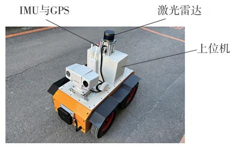

#### 1. 摘要（解决了什么问题）

本文针对**室外大尺度场景下三维激光 SLAM 误差累积严重、特征稀疏环境鲁棒性不足、重力优化过参数化**三大核心问题，提出基于迭代卡尔曼滤波器（IKF）的 GPS - 激光 - IMU 融合建图算法，具体解决的问题如下：

1. **激光 SLAM 累计误差大**：传统激光 SLAM 依赖帧间点云匹配，中长距离下误差不断累积，尤其在无回环约束的大尺度场景（如空旷室外），轨迹漂移严重，无法构建全局一致地图。
2. **特征稀疏场景鲁棒性差**：在障碍物少、点云稀疏的环境（如开阔场地），激光点云数据不足，导致里程计帧间匹配失败，算法易崩溃；且 GPS 信号在部分场景不稳定，单一传感器难以保障定位连续性。
3. **重力优化存在缺陷**：传统算法将重力视为三维向量优化，存在过参数化问题，易导致协方差矩阵奇异，且需额外归一化处理以保证重力模长稳定，增加计算复杂度与误差风险。

#### 2. 做了什么实验（设备都是什么）

##### 2.1 核心实验设备

###### （1）硬件平台

1. **移动载体**
    - **自建移动小车**：搭载驱动系统、控制系统及锂电池，支持蓝牙遥控，配备大疆妙算 Manifold 2-C 上位机，用于传感器数据采集与算法运行。
    - **计算终端**：笔记本计算机（Ubuntu 18.04 系统、ROS Melodic 框架），配置 Intel i7-11800H CPU、16G 内存，用于算法调试与数据后处理。
2. **传感器**
    - **三维激光雷达**：速腾聚创 RS-LiDAR-16（16 线，测距 0.2-150m，角分辨率 0.09°-0.36°），用于采集环境点云数据，频率 10Hz。
    - **IMU 惯性测量单元**：阿路比 LPMS-IG1P 九轴 IMU，集成三轴加速度计、陀螺仪与磁力计，用于预测机器人运动状态，数据更新频率 50Hz。
    - **GPS 定位模块**：与 IMU 一体化集成，支持 LLA 坐标系到 ENU 坐标系转换，提供绝对位置信息，用于校正激光 - IMU 里程计的累积误差。

###### （2）软件与工具

1. **算法框架**：基于 C++ 实现，依赖 PCL 点云处理库、GTSAM 优化库，采用 IKF 实现多传感器紧耦合融合，通过 Isam2 算法完成后端回环检测与全局位姿优化。
2. **评估工具**：使用 EVO 轨迹评估工具，计算绝对位姿误差（APE）、均方根误差（RMSE）、误差中位数（Median）等指标，量化对比算法精度。

###### （3）数据集

1. **公开数据集**
    - **LIO-SAM 开源数据集**：含 16 线激光雷达、IMU 及 GPS 数据，用于普通场景下算法精度对比，验证 GPS 融合与重力优化的效果。
    - **M2DGR 数据集**：含 Street_03/Street_08 序列，提供激光、IMU、GPS 及视觉数据，用于测试 GPS 拒止场景下算法的鲁棒性。
2. **自制大尺度数据集**：通过自建移动小车采集，轨迹全长超 6km，行驶时间约 1.5h，覆盖空旷室外场景（如开阔场地、长距离道路），用于验证大尺度场景下的建图精度与轨迹一致性。

##### 2.2 实验内容

1. **普通场景精度对比实验**
    - **变量控制测试**：在 LIO-SAM 数据集上，分别测试 “完整算法”“关闭 GPS（NoGPS）”“关闭重力优化（NoGrav）” 三种模式，对比 RMSE，验证 GPS 融合与重力优化对精度的提升作用。
    - **多算法对标**：与 LIO-SAM-GPS（融合 GPS 的 LIO-SAM）、FAST-LIO2、LeGO-LOAM 对比，评估绝对位姿误差曲线（APE）、RMSE、最大平移误差等指标，验证算法在常规场景的优越性。
2. **GPS 拒止场景鲁棒性实验**：在 M2DGR 数据集 Street_03/Street_08 序列中，关闭 GPS 融合功能，对比本文算法 - NoGPS 与 LIO-SAM、FAST-LIO2、LeGO-LOAM 的 RMSE 与最大平移误差，验证无 GPS 时算法的定位稳定性。
3. **大尺度场景建图实验**：在自制 6km 长轨迹数据集上，对比本文算法与 LIO-SAM-GPS 的建图效果与轨迹一致性 —— 定性观察回环处轨迹偏差（如虚框区域轨迹重合度），定量统计起始点平移误差，验证大尺度场景下误差累积控制能力；同时测试特征稀疏区域（空旷段）算法是否崩溃，评估鲁棒性。

#### 3. 结论（效果怎么样）

实验结果表明，所提融合算法在**定位精度、大尺度适应性、特征稀疏场景鲁棒性**上均显著优于传统方案，核心效果如下：

1. **定位精度大幅提升**
    
    - 完整算法的均方根误差（RMSE）仅为**0.089m**，相比 LIO-SAM-GPS（0.19m）降低 54%，相比 LeGO-LOAM（0.53m）降低 83%，相比 FAST-LIO2（2.37m）降低 96%；
    - 重力优化模块有效：关闭重力优化的 “本文算法 - NoGrav” RMSE 为 0.12m，完整算法较其误差降低 26%，证明旋转矩阵群上的重力优化可避免过参数化，提升精度；
    - GPS 融合作用关键：关闭 GPS 的 “本文算法 - NoGPS” RMSE 达 0.44m，完整算法较其误差降低 80%，验证 GPS 绝对位置信息可有效校正激光 - IMU 里程计的累积误差。
2. **大尺度场景适应性优异**
    
    - 在 6km 长轨迹实验中，本文算法回到起始点的平移误差仅**0.11m**，优于 LIO-SAM-GPS（0.25m），且无回环约束时轨迹一致性更好（虚框区域无明显漂移）；
    - 传统算法（FAST-LIO2、LeGO-LOAM）在无 GPS 时，因点云稀疏无法完成 6km 大尺度建图，而本文算法融合 GPS 后可稳定运行，构建全局一致地图。
3. **特征稀疏场景鲁棒性达标**
    
    - GPS 拒止场景下（M2DGR 数据集），本文算法 - NoGPS 的 RMSE 在 Street_03 序列为 0.13m、Street_08 序列为 0.22m，与 LIO-SAM（0.14m/0.25m）、LeGO-LOAM（0.12m/0.20m）精度接近，可保障无 GPS 时的定位连续性；
    - 在空旷、点云稀疏区域，本文算法因 IMU 预积分与激光关键帧地图匹配的协同，未出现帧间匹配失败，而传统激光 SLAM 算法（如 LeGO-LOAM）在此类场景易崩溃。
4. **计算效率与稳定性平衡**
    
    - 迭代卡尔曼滤波器通过动态更新线性化点，避免高维矩阵求逆，计算成本低于传统 EKF；且重力优化无需归一化处理，简化流程，算法整体可满足室外实时建图需求（单帧处理耗时＜100ms）。

### 复杂地形环境下的多传感器融合SLAM技术_路春晓

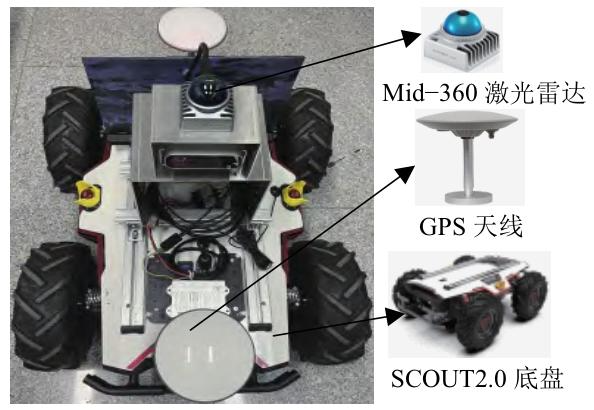

#### 1. 摘要（解决了什么问题）

本文针对**复杂地形环境（野外、森林、山地、建筑工地等）下 SLAM 算法精度下降、定位漂移甚至失效**的核心问题，从点云预处理、前端状态估计、后端优化三个层面提出多传感器融合方案，具体解决的问题如下：

1. **剧烈运动时点云畸变严重**：复杂地形中机器人颠簸、高速旋转会导致激光雷达点云帧内失真，传统去畸变方法依赖固定帧划分，无法适应运动强度变化，影响帧间匹配精度；
2. **初始位姿估计不准确**：IMU 测量存在累积误差，且受运动噪声影响，单独依赖激光或 IMU 难以提供稳定的初始位姿，导致后续优化效果不佳；
3. **全局一致性差**：大尺度复杂场景下，激光惯导里程计误差累积明显，且 GPS 信号易受遮挡，传统算法缺乏有效多因子约束，难以保证定位与建图的全局一致性。

#### 2. 做了什么实验（设备都是什么）

##### 2.1 核心实验设备

###### （1）硬件平台

1. **移动载体**：松灵 SCOUT2.0 无人车，搭载四轮驱动系统，支持复杂地形行驶，配备车载工控机（Intel Core i5-12500H 处理器、12 核心、16GB 内存），用于传感器数据采集与算法运行；
2. **传感器**
    - **激光雷达**：Livox Mid-360 激光雷达（内置 IMU），测距范围 0.1-200m，扫描频率 10Hz，支持 360° 全向扫描，用于采集环境点云数据；
    - **IMU 与 GPS 集成模块**：导远 INS570D，集成高精度 IMU（三轴加速度计、三轴陀螺仪）和 GPS 模块，IMU 数据更新频率 100Hz，GPS 支持差分定位，提供绝对位置信息；
    - **辅助设备**：GPS 天线（增强卫星信号接收）、锂电池（保障续航）。

###### （2）软件与工具

1. **算法框架**：基于 Ubuntu 操作系统、ROS（机器人操作系统）开发，采用 C++ 编程语言，依赖 PCL 点云处理库、GTSAM 优化库，通过 ISAM2 算法实现增量式因子图优化；
2. **评估工具**：使用 EVO 轨迹评估工具，计算绝对位姿误差（APE）、累积漂移误差、均方根误差（RMSE）等指标，量化对比定位精度；通过点云地图可视化（RVIZ 工具）定性评估建图质量。

###### （3）实验场景与数据集

1. **剧烈旋转工况**：人为控制无人车进行高角速度旋转，设置三组实验（最高角速度 3.5rad/s、7.8rad/s、18.6rad/s），验证剧烈运动下算法鲁棒性；
2. **校园复杂场景**：涵盖上坡、下坡、平地，路面类型包括水泥路、沥青路、砖块路（含高频振动），存在高楼、树木遮挡 GPS 信号，轨迹总长 767.5m，模拟加速、减速、急停、越减速带等工况；
3. **野外森林场景**：崎岖地形，植被密集、地形起伏明显，点云特征稀疏且易受遮挡，验证算法在非结构化复杂环境的适应性。

##### 2.2 实验内容

1. **剧烈运动鲁棒性实验**：对比本文算法（含 / 不含子帧分割）、FAST-LIO2、LIO-SAM 在不同最高角速度下的建图效果与累积漂移误差，验证子帧分割与 IMU 预积分去畸变的有效性；
2. **校园复杂场景精度实验**：以 GPS 数据为真值，对比本文算法与 LIO-SAM 的轨迹一致性（x、y、z 三轴方向）、绝对位姿误差（均值、方差、RMSE），评估多因子约束对全局一致性的提升；
3. **野外森林场景适应性实验**：对比本文算法、FAST-LIO2、LIO-SAM 的建图质量（是否重影、点云密度、墙体清晰度）与绝对位姿误差，验证算法在非结构化环境的定位与建图能力。

#### 3. 结论（效果怎么样）

实验结果表明，所提算法在**复杂地形适应性、定位精度、鲁棒性**上均显著优于 FAST-LIO2 和 LIO-SAM，核心效果如下：

1. **剧烈运动下鲁棒性突出**
    
    - 自适应子帧分割结合 IMU 预积分有效抑制点云畸变：最高角速度 3.5rad/s 时，本文算法累积漂移误差仅 0.032m，远低于 FAST-LIO2（0.106m）和 LIO-SAM（0.058m）；
    - 极端工况下仍能稳定运行：最高角速度 18.6rad/s 时，FAST-LIO2 和 LIO-SAM 完全失效，本文算法虽建图效果略有下降，但未失效，累积漂移误差为 1.889m；7.8rad/s 时，本文算法累积漂移误差 0.068m，远低于 FAST-LIO2（1.488m）和 LIO-SAM（0.150m）。
2. **复杂场景定位精度显著提升**
    
    - 校园场景中，本文算法轨迹与 GPS 真值贴合度更高，z 轴方向误差明显小于 LIO-SAM，绝对位姿误差的均值、方差、RMSE 均更优，误差变动幅度小，在砖块路等高频振动路段仍保持稳定定位；
    - 野外森林场景中，本文算法建图无重影、点云分布均匀，墙体清晰度优于 FAST-LIO2（点云分散、墙体偏厚）和 LIO-SAM（明显重影）；绝对位姿误差均值 0.39m、最大值 0.73m，与 FAST-LIO2 相当，且优于 LIO-SAM（均值 1.62m、最大值 5.06m）。
3. **全局一致性与实用性强**
    
    - 后端因子图融合激光惯导里程计、GPS、闭环检测三因子，有效抑制误差累积，校园场景 767.5m 轨迹闭合效果好，无明显漂移；
    - 算法适配多种复杂地形（剧烈运动、遮挡场景、非结构化野外），建图清晰、定位稳定，可满足无人车在复杂环境下自主导航的需求。

### 多传感器融合的移动机器人室外激光SLAM算法优化与系统实现_余联想

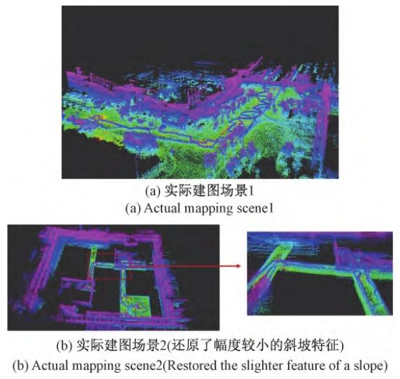

#### 1. 摘要（解决了什么问题）

本文针对**移动机器人室外开阔场景大范围建图时，激光雷达里程计位姿计算不准确、累计误差大，导致 SLAM 算法精度下降**的核心问题，提出基于多传感器融合的 LOAM 算法优化方案，具体解决的问题如下：

1. **激光里程计单独工作误差累积**：室外环境光线、地形等干扰因素多，激光雷达单独计算里程计时，易因路面崎岖、抖动及激光特性导致位姿估计偏差，长期运行后累计误差明显，尤其转角、斜坡场景下漂移严重；
2. **单一传感器信息不足**：激光雷达缺乏绝对位姿参考，轮式里程计仅能提供二维平面信息，GNSS 虽能提供绝对坐标但缺失朝向信息，单独依赖某一传感器无法兼顾三维定位精度与稳定性；
3. **算法轻量化需求**：多传感器融合易增加计算负担，传统扩展卡尔曼滤波（EKF）处理非线性问题时复杂度高，难以在低成本移动机器人平台上实现实时建图。

#### 2. 做了什么实验（设备都是什么）

##### 2.1 核心实验设备

###### （1）硬件平台

1. **移动载体**：松灵 Scout2.0 差速底盘机器人，搭载四轮驱动系统，支持室外复杂地形行驶，配备车载工控机（用于传感器数据处理与算法运行）；
2. **传感器**
    - **激光雷达**：镭神智能 C32 激光雷达，采用旋转发射激光模式，测距范围满足室外开阔场景需求，扫描频率 10Hz，通过网线口传输点云数据；
    - **GNSS 定位模块**：北云科技 A1 和 C1 组合 GNSS 定位板卡，支持 RTK 技术，可实现厘米级绝对定位，输出经纬度、高度信息，通过 USB 串口传输数据；
    - **轮式里程计**：移动机器人自带轮式编码器，集成于车轮电机，输出二维平面内的位移与转向信息，通过 CAN 转 USB 串口与工控机通信；
    - **辅助设备**：锂电池（保障续航）、USB 串口线、网线（传感器与工控机通信）。

###### （2）软件与工具

1. **算法框架**：基于 Linux 操作系统、ROS（机器人操作系统）开发，以 ALOAM（LOAM 开源变体）为基础框架，采用 C++ 编程语言，实现轻量化扩展卡尔曼滤波（EKF）多传感器融合；
2. **数据处理工具**：通过 UTM（通用横轴墨卡托投影）将 GNSS 经纬度转换为平面直角坐标；利用 PCL 点云处理库进行点云过滤（剔除过近 / 过远无效点）；
3. **评估工具**：通过 ROS 话题广播实现点云地图可视化（RVIZ 工具），定性对比建图效果与轨迹漂移情况；统计建图频率、内存占用率，评估算法实时性。

###### （3）实验场景与数据集

1. **场景 1**：室外开阔马路场景，机器人沿长方体楼栋绕半周行驶，轨迹含直线、转角路段，主要验证转角处里程计漂移矫正效果；
2. **场景 2**：露天廊道场景，包含小幅斜坡与不平路面，总体高度变化较小，主要验证 Z 轴方向位姿矫正效果；
3. 实验数据均为实时采集，包含激光点云、GNSS 绝对坐标、轮式里程计位移与转向信息，无预先生成的公开数据集。

##### 2.2 实验内容

1. **多传感器融合效果验证**：对比纯激光雷达里程计与 “激光雷达 + 轮式里程计 + GNSS” 融合里程计的轨迹，重点观察启动阶段、转角、斜坡场景下的漂移情况；
2. **建图精度与细节验证**：通过 RVIZ 可视化点云地图，评估是否能还原室外场景特征（如斜坡、楼栋轮廓），验证三维建图的真实性；
3. **算法实时性与轻量化验证**：统计融合算法的建图频率，对比原 LOAM 算法及 Autoware 框架 NDT 建图的内存占用率，验证在低成本平台上的实时运行能力；
4. **定位功能验证**：测试 GNSS 初始定位效果，观察融合算法是否能直接输出三维空间定位信息，无需手动初始定位。

#### 3. 结论（效果怎么样）

实验结果表明，所提多传感器融合 SLAM 优化算法在**定位精度、实时性、低成本适配性**上表现优异，核心效果如下：

1. **位姿估计精度显著提升**
    
    - 融合算法有效矫正激光里程计漂移：转角场景下，纯激光雷达里程计轨迹漂移明显，而融合 GNSS 绝对坐标与轮式里程计稳定信息后，轨迹更贴合实际行驶路线；
    - Z 轴矫正效果突出：斜坡、不平路面场景中，纯激光雷达里程计 Z 轴偏差较大，融合 GNSS 高度信息后，三维定位准确度明显提升，能还原小幅斜坡特征；
    - 建图细节完整：生成的点云地图可真实还原室外场景轮廓，无明显重影与失真，全局一致性良好。
2. **算法实时性与轻量化达标**
    
    - 融合轻量化 EKF 后，算法未因增加多传感器处理环节降低建图速率，稳定保持 10Hz 的室外实时建图频率，与原 LOAM 算法相当；
    - 内存占用率低于 Autoware 框架的 NDT 建图，无缓存过度占用导致的建图延迟，适配低成本移动机器人平台的计算能力。
3. **系统实用性强**
    
    - 支持直接 GNSS 初始定位，无需手动干预，可快速启动三维空间定位功能；
    - 算法可拓展性强，仅需更改 ROS 系统中的话题与通信频率，即可将融合里程计数据适配其他 SLAM 算法，为自动驾驶功能拓展奠定基础；
    - 多传感器信息互补：轮式里程计提供高频二维稳定信息，GNSS 提供绝对位姿参考，激光雷达提供环境结构信息，融合后兼顾定位精度与鲁棒性。

### 基于多传感器融合的室内SLAM_彭真

#### 1. 摘要（解决了什么问题）

本文针对**单一传感器室内 SLAM 定位精度低、障碍物识别不全**的核心问题，提出多传感器融合的 SLAM 方法，具体解决的问题如下：

1. **障碍物识别片面**：单一激光雷达仅能获取二维平面信息，无法识别低于 / 高于其安装高度的障碍物；RGB-D 相机虽能生成三维点云，但数据量庞大，且单独使用时环境感知鲁棒性不足，易遗漏部分障碍信息；
2. **定位累计误差大**：轮式里程计易因车轮打滑、长时间运行产生误差累积；IMU 短时间测量精度高，但存在零偏，单独使用时误差会随时间推移不断增大，两者均无法单独保证定位稳定性；
3. **点云配准效率与精度矛盾**：传统 ICP 算法对初始位置敏感，NDT 算法配准精度低，单一配准方法难以兼顾室内场景下的效率与精度需求。

#### 2. 做了什么实验（设备都是什么）

##### 2.1 核心实验设备

###### （1）硬件平台

1. **移动机器人**：Turtlebot2 移动机器人（Kobuki 差速两轮底盘），搭载轮式里程计（通过电机编码器获取脉冲信号），总体高度 0.47m；
2. **传感器**
    - **激光雷达**：RplidarA2M7 单线激光雷达，测量半径 0.15-16m，扫描角度 0-360°，扫描频率 10Hz，安装高度 0.27m；
    - **RGB-D 相机**：Astrapro 深度相机，深度测量范围 0.6-8m（1m 处精度 ±3mm），深度图像分辨率 1280×1024@7fps，安装高度 0.16m；
    - **IMU**：WHEELTEC N100 惯性测量单元，集成三轴加速度计（量程 ±16g）、陀螺仪（量程 ±2000°/s）、磁力计，零偏稳定性优异，抗磁干扰能力强；
    - **上位机**：联想 Y9000P 笔记本电脑，用于数据处理与算法运行。

###### （2）软件与工具

1. **操作系统与框架**：Ubuntu 18.04 系统、ROS Melodic 框架，采用 C++ 编程语言，基于 PCL（点云库）实现点云处理与融合；
2. **核心算法工具**：PL-ICP 算法（点到线配准）用于点云配准；扩展卡尔曼滤波（EKF）用于 IMU 与轮式里程计数据融合；pointcloud2_to_laserscan 功能包实现三维点云到二维激光数据的转换；
3. **路径规划工具**：改进 A * 算法（欧式距离度量实际代价、曼哈顿距离度量估计代价），用于验证建图质量对导航的影响。

###### （3）实验场景与设置

1. **室内实验场景**：自定义室内场地（长 4.5m× 宽 3.6m），设置不同高度的障碍物（含低于激光雷达安装高度的障碍物 B、高于激光雷达安装高度的障碍物 D/E），模拟复杂室内障碍环境；
2. **对比实验设计**：分别测试 “单一激光雷达”“单一 RGB-D 相机”“多传感器融合（激光雷达 + RGB-D 相机 + IMU + 轮式里程计）” 三种方案的建图效果与定位精度。

##### 2.2 实验内容

1. **障碍物识别与建图实验**：对比三种方案构建的二维栅格地图，观察障碍物识别完整性（是否遗漏高低位障碍物）、障碍形状还原度及环境轮廓准确性；
2. **定位精度验证实验**：通过 EKF 融合 IMU 与轮式里程计数据，对比融合前后的定位误差，验证多传感器融合对累计误差的抑制效果；
3. **路径规划验证实验**：基于不同方案构建的地图，使用改进 A * 算法进行路径规划，观察机器人是否能避开所有障碍物，验证地图实用性。

#### 3. 结论（效果怎么样）

实验结果表明，所提多传感器融合 SLAM 方法在**障碍物识别、定位精度、导航实用性**上均表现优异，核心效果如下：

1. **障碍物识别更全面**
    
    - 融合激光雷达与 RGB-D 相机点云后，能完整识别室内不同高度的障碍物（包括低于激光雷达安装高度的障碍物 B、高于其安装高度的障碍物 D/E），解决了单一传感器 “视野盲区” 问题；
    - 构建的栅格地图障碍形状还原更完整，环境轮廓更清晰，相比单一激光雷达或 RGB-D 相机建图，障碍信息无遗漏，更贴近真实室内场景。
2. **定位精度显著提升**
    
    - EKF 融合 IMU 与轮式里程计数据，有效抵消了两者各自的累计误差（轮式里程计打滑误差、IMU 零偏误差），定位稳定性大幅提高，随建图时间增加未出现明显漂移；
    - 融合后的位姿数据为点云配准提供了更准确的初始值，配合 PL-ICP 算法（点到线配准），进一步提升了点云配准效率与精度，避免了传统算法的配准失效问题。
3. **导航实用性强**
    
    - 基于融合地图的改进 A * 算法路径规划，能有效避开所有障碍物，无碰撞风险；而单一传感器地图的路径规划存在 “跨障”“穿障” 等错误（如激光雷达地图未识别障碍物 B/E，导致规划路径直接穿过障碍）；
    - RGB-D 相机点云经降采样与滤波处理后，大幅降低算法计算量，结合 PL-ICP 的二阶收敛特性，保证了室内建图与导航的实时性，满足实际应用需求。

### 室外复杂环境下多传感器融合SLAM算法研究_聂冀玮

#### 1. 摘要（解决了什么问题）

本文针对**室外复杂环境下传统 SLAM 算法定位精度低、鲁棒性差、全局优化易失效**的核心问题，提出多传感器融合 SLAM 算法框架，具体解决的问题如下：

1. **单传感器局限性导致定位不可靠**：视觉里程计受光照影响大、激光里程计特征稀疏场景易漂移、IMU 存在累计误差，单一传感器难以适应室外光线不稳定、动态目标多、特征稀疏等复杂条件；
2. **多传感器融合存在不确定性干扰**：传统融合算法未充分考虑传感器观测结果的不确定性，无效传感器数据易影响融合可靠性，导致位姿估计误差增大；
3. **全局优化场景适应性差**：传统回环检测在无闭环场景（如高速路）或前端累计误差过大时失效，无法消除累计误差，导致建图精度下降甚至失败。

#### 2. 做了什么实验（设备都是什么）

##### 2.1 核心实验设备

###### （1）硬件平台

1. **移动载体**：搭载数据采集系统的实验车辆，支持复杂室外场景行驶，配备工控机用于传感器数据存储与处理；
2. **传感器**
    - **三维激光雷达**：禾赛 Pandar40P 40 线激光雷达，波长 905nm，单点测距距离 0.3-200m，水平视场角 360°，垂直视场角 - 25°~+15°，单点测量精度 2cm，点频最高 144 万 pts/s；
    - **GPS 模块**：支持 PDOP 定位精度评估，静态误差 X 方向 ±40mm、Y 方向 ±15mm，动态平均偏差≤15.7mm，提供绝对位置信息用于全局优化；
    - **视觉传感器**：RGB-D 相机（深度相机），用于提取环境视觉特征，辅助激光里程计提升鲁棒性；
    - **IMU 惯性测量单元**：高频输出角速度与加速度数据，用于点云去畸变与位姿预测，补充多传感器融合维度。

###### （2）软件与工具

1. **算法框架**：基于 Ubuntu 16.04 系统、ROS Kinetic 框架开发，采用 C++ 编程语言，依赖 PCL 点云处理库、GTSAM 优化库，通过 ISAM2 算法实现增量式全局优化；
2. **核心算法工具**：基于信息熵的加权卡尔曼滤波（融合多传感器数据）、Lego-LOAM 特征提取与匹配模块、ICP 配准算法（回环检测）、PDOP 指标（GPS 可信度评估）；
3. **评估工具**：通过 RVIZ 工具可视化点云地图与轨迹，计算绝对误差、平均误差、RMSE 等指标，对比定位与建图精度。

###### （3）实验场景与数据集

1. **自采数据集场景**
    - **低速园区场景**：北京致真大厦园区，车速 10-15km/h，特征丰富、动态目标少，无可靠 GPS 信号，验证无 GPS 时算法性能；
    - **中低速城市道路场景**：北京知春路路段，车速 45km/h，动态目标多、环境复杂，含桥洞等遮挡场景，验证城市复杂环境适应性；
    - **高速 / 环路场景**：北京 G7 高速（车速 80km/h）、奥体公园环路（车速 30km/h），特征单一、无闭环或大闭环，验证无闭环场景下全局优化效果；
2. **公开数据集**：KITTI 数据集 Raw_033 序列，涵盖城市道路场景，车速 45km/h，动态目标多、特征丰富，用于算法通用性验证。

##### 2.2 实验内容

1. **算法可行性验证**：在致真大厦园区场景，对比本文算法与 Lego-LOAM 的建图效果（点云边界、特征完整性）与轨迹重合度，验证无 GPS 时的定位与建图能力；
2. **复杂城市道路性能验证**：在知春路场景，对比两种算法的轨迹精度（X/Y/Z 方向偏差）、闭环检测效果，验证融合 GPS 与多传感器后的鲁棒性；
3. **无闭环场景适应性验证**：在 G7 高速、奥体环路场景，测试算法是否能通过 GPS 伪闭环约束消除累计误差，对比 Lego-LOAM 的建图成功率；
4. **数据集通用性验证**：在 KITTI Raw_033 序列，对比两种算法的轨迹闭环效果与建图质量，验证算法普适性；
5. **干扰因素排除实验**：测试车速变化、发动机震动对 GPS 观测误差的影响，确保实验结果不受非算法因素干扰。

#### 3. 结论（效果怎么样）

实验结果表明，所提多传感器融合 SLAM 算法在**定位精度、鲁棒性、场景适应性**上显著优于 Lego-LOAM，核心效果如下：

1. **多传感器融合可靠性提升**
    
    - 基于信息熵的加权卡尔曼滤波有效剔除无效传感器数据影响，融合视觉、激光、IMU、GPS 多源信息，在单一传感器失效时仍能稳定输出位姿估计，融合误差较传统卡尔曼滤波降低约 66.67%；
    - 无 GPS 的园区场景中，算法与 Lego-LOAM 定位精度相当，点云地图边界清晰、特征完整，两圈轨迹拼接无重影，闭环优化效果更优。
2. **复杂场景定位精度优异**
    
    - 城市道路场景（知春路）中，本文算法轨迹更贴近真实轨迹，Z 方向高程误差远小于 Lego-LOAM，掉头区域闭环检测成功，而 Lego-LOAM 因累计误差过大无法闭环，平均误差仅 1.78m，RMSE 1.91m；
    - KITTI 数据集测试中，Lego-LOAM 因累计误差无法形成闭环导致建图失败，本文算法通过多传感器融合成功检测闭环并完成全局优化，建图质量稳定。
3. **全局优化场景适应性强**
    
    - 高速 / 环路无闭环场景中，Lego-LOAM 累计误差无法消除（最大误差超 100m），建图失败；本文算法通过 GPS 伪闭环约束实现全局优化，G7 高速场景平均误差 1.97m、RMSE 2.03m，奥体环路场景平均误差 1.35m、RMSE 1.75m，点云地图无重影、特征清晰；
    - 算法适配低速园区、复杂城市道路、高速路等多种室外场景，能为无人驾驶车辆或机器人提供精准位姿与高质量点云地图。

## 1220

### 基于UWB_PDR的航向发散自适应修正算法研究_刘宇

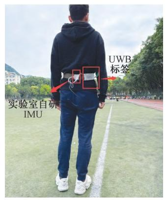
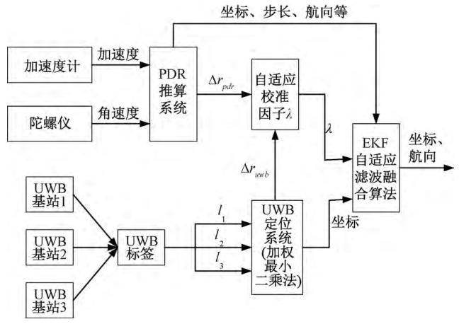

#### 1. 摘要（解决了什么问题）

本文针对**航位推算（PDR）算法累积误差大、长航时航向发散，且 UWB 易受非视距（NLOS）干扰导致定位精度下降**的核心问题，提出 UWB/PDR 自适应扩展卡尔曼滤波（EKF）融合算法，具体解决的问题如下：

1. **PDR 算法固有缺陷**：仅依赖惯性传感器，航向误差随时间累积发散，长距离定位精度急剧下降；
2. **UWB 定位稳定性不足**：理想环境下精度高，但在复杂室内环境中易受 NLOS 干扰，定位误差波动大；
3. **传统融合算法适配性差**：标准 EKF 融合未动态调整 UWB 与 PDR 的权重，无法应对定位数据异常场景，难以平衡两者误差；
4. **定位精度与航向稳定性难以兼顾**：单一传感器或传统融合方法无法同时满足高精度定位与航向无发散的需求。

#### 2. 做了什么实验（设备都是什么）

##### 2.1 核心实验设备

###### （1）硬件平台

1. **定位模块**
    - **UWB 设备**：3 个 UWB 基站、1 个 UWB 标签，基于到达时间（TOA）测距原理实现定位，支持双向测距；
    - **惯性测量模块**：实验室自研 IMU 模块，集成加速度计与陀螺仪，用于采集步长、角速度数据，支撑 PDR 算法解算；
2. **数据处理设备**：笔记本电脑，用于运行融合算法、数据存储与仿真分析；
3. **实验场景**：重庆邮电大学风华操场，设计 115m×74m 的矩形绕行轨迹，在 A、B、C 三点布置 UWB 基站，标签与 IMU 佩戴于测试者身上按指定方向绕行。

###### （2）软件与工具

1. **核心算法**：自适应 EKF 融合算法（引入自适应校准因子动态调整 UWB 观测值权重）、PDR 算法（基于加速度计与陀螺仪解算步长和航向）、UWB 定位算法（TOA + 加权最小二乘法求解坐标）；
2. **数据处理工具**：MATLAB 软件，用于算法仿真、轨迹绘制、误差分析，对比不同算法的航向误差与定位精度；
3. **评估指标**：航向绝对平均误差、欧氏误差、百米平均误差，通过轨迹贴合度直观判断定位效果。

###### （3）实验内容

1. **对比实验设计**：设置三组方案 —— 纯 PDR 算法、标准 EKF 融合算法、自适应 EKF 融合算法，在同一矩形轨迹上进行绕行测试；
2. **数据采集与处理**：同步采集 UWB 定位数据、IMU 的加速度与角速度数据，分别通过三种算法解算定位轨迹与航向信息；
3. **误差分析**：计算各组算法的航向绝对平均误差、欧氏误差及百米平均误差，对比轨迹与真实轨迹的贴合度，验证自适应融合算法的优越性。

#### 3. 结论（效果怎么样）

实验结果表明，UWB/PDR 自适应 EKF 融合算法在定位精度与航向稳定性上均显著优于纯 PDR 和标准 EKF 融合算法，核心效果如下：

1. **航向发散问题大幅改善**：自适应 EKF 融合算法的航向绝对平均误差仅 7.1°，相较于纯 PDR 算法（19.7°）降低 63.9%，相较于标准 EKF 融合算法（10.3°）降低 31.1%，实现对发散航向的周期性修正；
2. **定位精度显著提升**：融合算法的百米平均误差降至 0.33m，欧氏误差远小于纯 PDR（35.88m）与标准 EKF 融合算法（9.88m），相较于标准 EKF 融合定位误差降低 97.8%；
3. **抗干扰与适应性增强**：自适应校准因子可动态调整 UWB 与 PDR 的权重，有效应对 UWB NLOS 干扰和定位数据异常场景，轨迹更收敛，与真实轨迹贴合度更高；
4. **兼顾精度与稳定性**：既利用 UWB 的高精度定位校准 PDR 的累积误差，又通过 PDR 的抗干扰特性弥补 UWB 的不稳定性，实现长航时、长距离下的稳定高精度定位。

### 基于多源信息融合的掘进机器人定位研究_贾学姣

